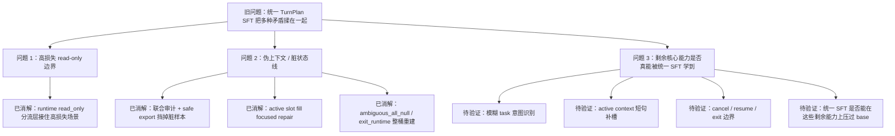

# reduced_round04 Context Map

## 旧问题 -> 已消解部分 -> 剩余待验证部分

```mermaid
flowchart TD
    A["旧问题：统一 TurnPlan SFT 把多种矛盾揉在一起"] --> B["问题 1：高损失 read-only 边界"]
    A --> C["问题 2：伪上下文 / 脏状态线"]
    A --> D["问题 3：剩余核心能力是否真能被统一 SFT 学到"]

    B --> B1["已消解：runtime read_only 分流层接住高损失场景"]
    C --> C1["已消解：联合审计 + safe export 挡掉脏样本"]
    C --> C2["已消解：active slot fill focused repair"]
    C --> C3["已消解：ambiguous_all_null / exit_runtime 整桶重建"]

    D --> D1["待验证：模糊 task 意图识别"]
    D --> D2["待验证：active context 短句补槽"]
    D --> D3["待验证：cancel / resume / exit 边界"]
    D --> D4["待验证：统一 SFT 是否能在这些剩余能力上压过 base"]
```

## 一句话解释

这次不是“把所有问题一次解决完”，而是先把最不适合硬靠 SFT 学的部分挪开，把脏样本挡掉，然后只拿剩余真正值得验证的核心能力去做下一轮 reduced SFT。
