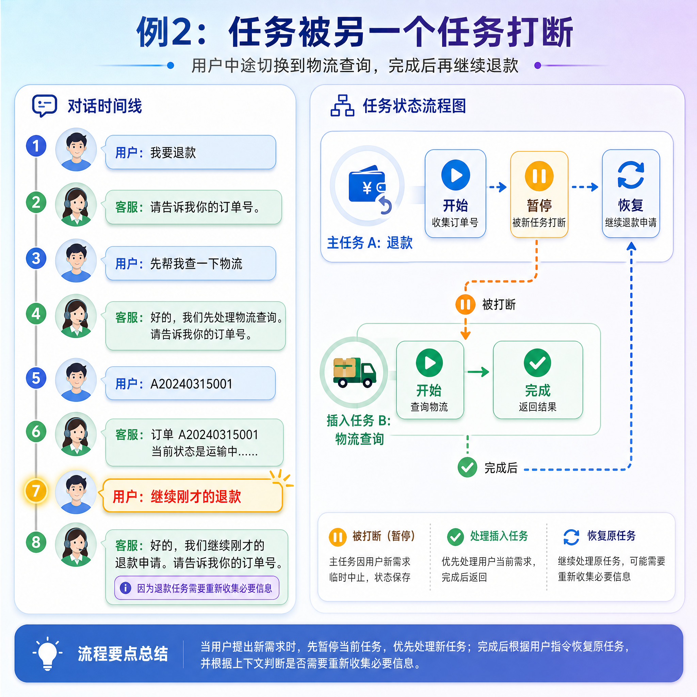
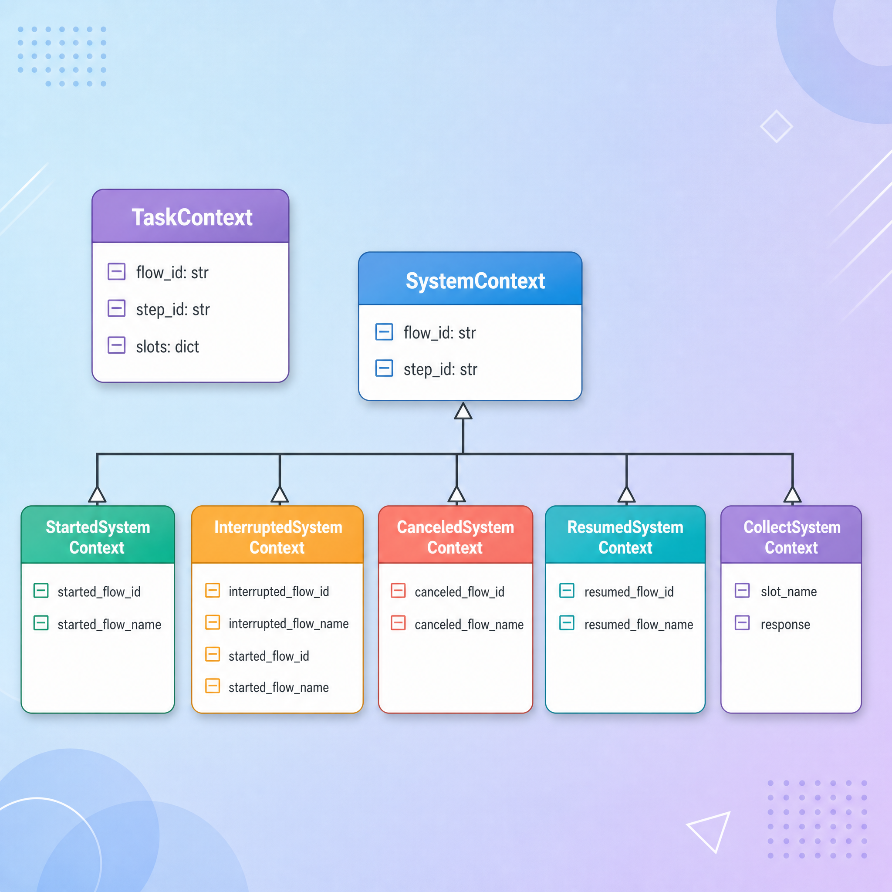
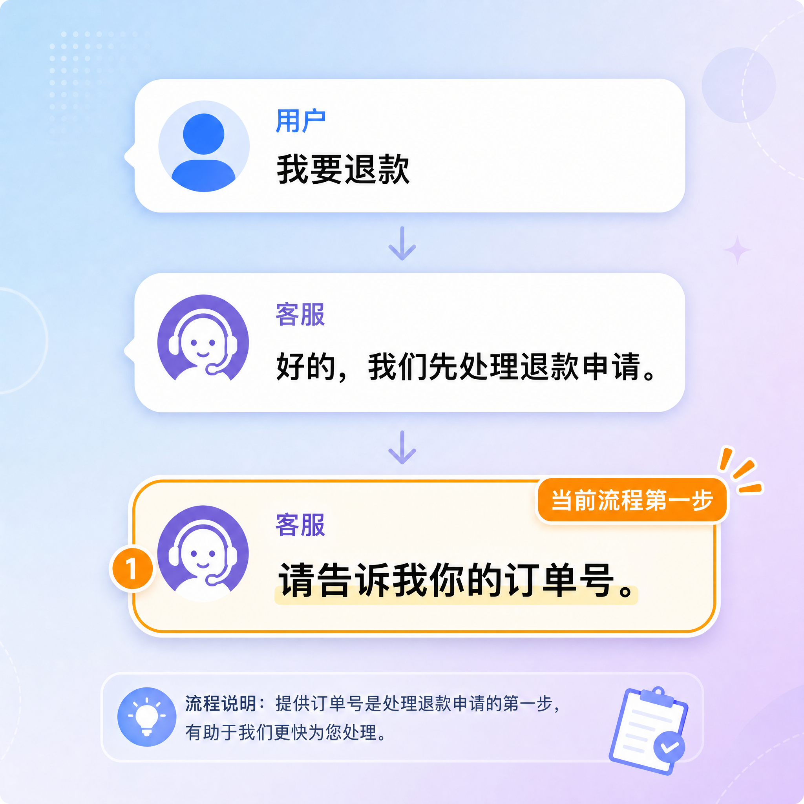
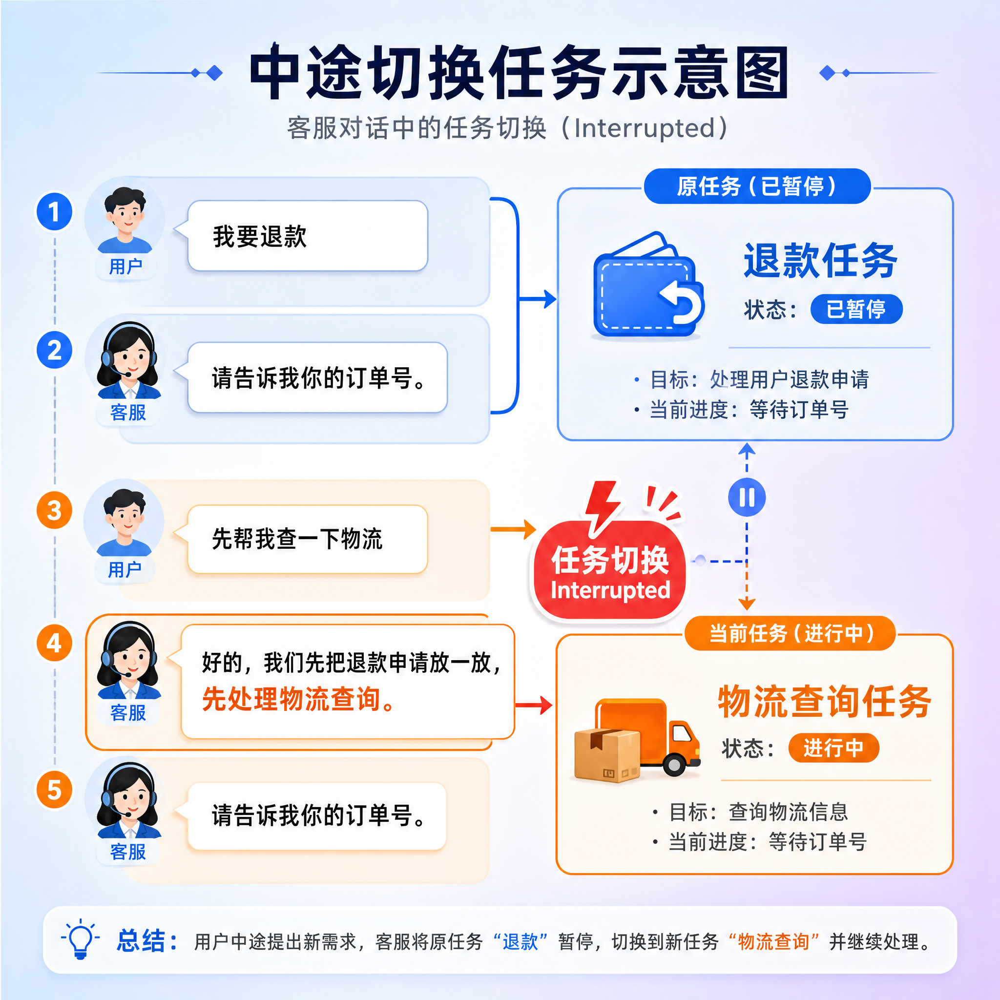
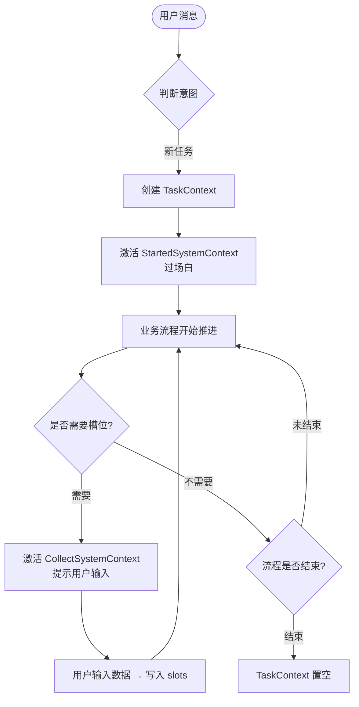
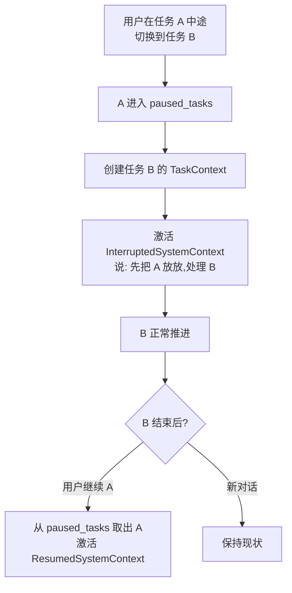

# 对话上下文模型 contexts

---

## 第1章 为什么需要"上下文"这个概念

在前一节项目概述中，我们已经知道客服系统有三类能力：任务流程、信息检索、闲聊。其中任务流程是最复杂的一类，因为它要分步骤推进，而且经常会被打断。

举几个真实的例子：

```text
例 1：单任务正常完成
用户：我要退款
客服：请告诉我你的订单号。
用户：A20240315001
客服：请简单说一下退款原因。
用户：尺码不合适
客服：好的，订单 A20240315001 的退款申请已提交……
```


```text
例 2：任务被另一个任务打断
用户：我要退款
客服：请告诉我你的订单号。
用户：先帮我查一下物流
客服：好的，我们先处理物流查询。请告诉我你的订单号。
用户：A20240315001
客服：订单 A20240315001 当前状态是运输中……
用户：继续刚才的退款
客服：好的，我们继续刚才的退款申请。请告诉我你的订单号。
```




从例 2 可以看到两件事：

- 同一时刻可能存在**多个未完成的任务**，需要区分谁是当前活跃的、谁是被搁置的
- 系统在切换任务时会插播一些"过场白"，例如"好的，我们先处理物流查询"

这两件事就分别对应了 `contexts.py` 中的两类对象：

| 概念 | 作用 |
| --- | --- |
| `TaskContext` | **业务任务**的执行快照（用户想做的事） |
| `SystemContext` | **系统流程**的执行快照（系统插播的过场） |

只有把"用户的任务"和"系统的过场"分开建模，多任务切换、打断恢复这些行为才说得清楚。

---

## 第2章 contexts.py 整体结构

`contexts.py` 文件位于 `atguigu/domain/contexts.py`，整体由两类对象、五个具体的系统流程子类组成：



下面我们逐个看。

---

## 第3章 TaskContext：业务任务的快照

### 3.1 类定义

```python
@dataclass
class TaskContext:
    flow_id: str
    step_id: str | None = None
    slots: dict = field(default_factory=dict)
```

### 3.2 字段说明

| 字段 | 类型 | 含义 |
| --- | --- | --- |
| `flow_id` | `str` | 当前任务对应的流程 ID，例如 `refund_request`、`order_status_query` |
| `step_id` | `str | None` | 当前任务执行到了流程中的哪一步，例如 `ask_order_number` |
| `slots` | `dict` | 任务执行过程中收集到的数据，例如 `{"order_number": "A001", "refund_reason": "尺码不合适"}` |

可以把 `TaskContext` 类比成一份正在填的表单：

- `flow_id` 表示这是哪一种表单（退款单 / 物流单）
- `step_id` 表示当前填到了哪一格
- `slots` 表示已经填写好的内容

### 3.3 具体例子

回到第 1 章退款流程的例子：

```text
用户：我要退款
客服：请告诉我你的订单号。
```

这一轮结束后，`TaskContext` 的状态是：

```python
TaskContext(
    flow_id="refund_request",
    step_id="ask_order_number",
    slots={}
)
```

```text
用户：A20240315001
客服：请简单说一下退款原因。
```

这一轮结束后变成：

```python
TaskContext(
    flow_id="refund_request",
    step_id="ask_refund_reason",
    slots={"order_number": "A20240315001"}
)
```

可以看到 `step_id` 在流程中不断推进，`slots` 在不断累积。`flow_id` 只在任务开始时确定，之后整个生命周期都不变。

### 3.4 序列化方法

```python
def to_dict(self) -> dict[str, Any]:
    return {"flow_id": self.flow_id, "step_id": self.step_id, "slots": self.slots}

@classmethod
def from_dict(cls, data: dict[str, Any]) -> "TaskContext":
    return cls(
        flow_id=data["flow_id"], step_id=data["step_id"], slots=data["slots"]
    )
```

整个 `DialogueState` 最终要存进数据库，所以每一个嵌套对象都需要支持：

- `to_dict()`：实例 → 字典 → JSON 字符串 → 写库
- `from_dict()`：读库 → JSON 字符串 → 字典 → 实例

这是后面所有模型都会出现的成对方法，遇到不再单独说明。

---

## 第4章 SystemContext：系统流程的快照

### 4.1 什么是"系统流程"

业务任务由用户发起（"我要退款"），系统流程则由**系统自己发起**，用来插播一些过场话。

举几个常见的例子：

| 场景 | 系统说的话 |
| --- | --- |
| 任务刚开始 | "好的，我们先处理退款申请。" |
| 任务被新任务打断 | "好的，我们先把退款放一放，先看物流。" |
| 任务被用户取消 | "好的，退款已为你取消。" |
| 之前的任务恢复 | "好的，我们继续刚才的退款。" |
| 需要补一个槽位 | "请告诉我你的订单号。" |

这些话不属于任何一个具体业务流程，它们是系统在"协调"业务流程时说的。所以我们专门为这类交互建一个上下文模型——`SystemContext`。

### 4.2 基类定义

```python
@dataclass
class SystemContext:
    flow_id: str
    step_id: str | None = None

    def to_dict(self) -> dict[str, Any]:
        return asdict(self)

    @classmethod
    def from_dict(cls, data: dict[str, Any]) -> "SystemContext":
        clz = FLOW_ID_TO_CONTEXT_CLASS[data["flow_id"]]
        return clz(**data)
```

| 字段 | 含义 |
| --- | --- |
| `flow_id` | 系统流程类型，例如 `system_task_started`、`system_collect_information` |
| `step_id` | 系统流程当前执行到第几步 |

### 4.3 from_dict 为什么要查表

注意 `from_dict` 不是直接 `cls(**data)`，而是先查 `FLOW_ID_TO_CONTEXT_CLASS`，再用查到的子类来实例化：

```python
FLOW_ID_TO_CONTEXT_CLASS = {
    "system_task_started": StartedSystemContext,
    "system_task_interrupted": InterruptedSystemContext,
    "system_task_canceled": CanceledSystemContext,
    "system_task_resumed": ResumedSystemContext,
    "system_collect_information": CollectSystemContext
}
```

原因是不同的子类带的字段不一样。从数据库读出来的只有一个 `flow_id` 字符串，必须通过这张表才能反序列化成正确的子类。

举例：如果数据库里存的是

```json
{"flow_id": "system_task_interrupted", "step_id": "acknowledge",
 "interrupted_flow_id": "refund_request", "interrupted_flow_name": "退款申请",
 "started_flow_id": "logistics_tracking", "started_flow_name": "物流查询"}
```

`from_dict` 查表得到 `InterruptedSystemContext`，然后把这些字段全部还原成对象。

### 4.4 五个子类汇总

| 子类                       | 触发时机                                    | 系统会说的话（举例）                         |
| -------------------------- | ------------------------------------------- | -------------------------------------------- |
| `StartedSystemContext`     | 用户刚发起一个新任务                        | "好的，我们先处理退款申请。"                 |
| `InterruptedSystemContext` | 用户在 A 任务过程中切到 B 任务              | "好的，我们先把退款放一放，先处理物流查询。" |
| `CanceledSystemContext`    | 用户主动取消当前任务                        | "好的，退款申请已为你取消。"                 |
| `ResumedSystemContext`     | 用户要求恢复之前挂起的任务                  | "好的，我们继续刚才的退款申请。"             |
| `CollectSystemContext`     | 业务流程跑到 `collect` 步骤，需要用户补数据 | "请告诉我你的订单号。"                       |

---

## 第5章 五个 SystemContext 子类展开

下面把五个具体的系统流程一个一个走一遍。每个子类都搭配一段交互示例，看看它出现在对话的哪个位置。

### 5.1 StartedSystemContext：任务刚开始

#### 5.1.1 类定义

```python
@dataclass
class StartedSystemContext(SystemContext):
    started_flow_id: str = ""
    started_flow_name: str = ""
```

#### 5.1.2 类字段

| 字段 | 含义 |
| --- | --- |
| `started_flow_id` | 新开始的业务流程 ID，例如 `refund_request` |
| `started_flow_name` | 新开始的业务流程显示名，例如 "退款申请" |

#### 5.1.3 场景模拟

```text
用户：我要退款                       ← 触发任务开始
客服：好的，我们先处理退款申请。       ← StartedSystemContext 起作用
客服：请告诉我你的订单号。             ← 这是业务流程的第一步
```



第一条机器人回复是系统流程产生的过场，第二条才是业务流程本身。

#### 5.1.4 状态对照

```python
active_task = TaskContext(flow_id="refund_request", step_id="ask_order_number", slots={})
active_system_task = StartedSystemContext(
    flow_id="system_task_started",
    step_id="acknowledge",
    started_flow_id="refund_request",
    started_flow_name="退款申请",
)
```

**注意**：业务任务和系统流程**同时**存在。这一轮里系统流程先说话，说完就退出，然后业务流程继续推进。

---

### 5.2 InterruptedSystemContext：任务被打断

#### 5.2.1 类定义

```python
@dataclass
class InterruptedSystemContext(SystemContext):
    interrupted_flow_id: str = ""
    interrupted_flow_name: str = ""
    started_flow_id: str = ""
    started_flow_name: str = ""
```

#### 5.2.2 类字段

| 字段 | 含义 |
| --- | --- |
| `interrupted_flow_id` | 被中断的旧任务 ID |
| `interrupted_flow_name` | 被中断的旧任务显示名 |
| `started_flow_id` | 新开始的任务 ID |
| `started_flow_name` | 新开始的任务显示名 |

为什么一个上下文里要装"老任务 + 新任务"两份信息？因为系统说话时要把两个名字都念出来。

#### 5.2.3 场景模拟

任务被中断 有两种典型场景,对应用户两种不同的说法

**场景一:打断一个任务(基础)**

```text
用户：我要退款
客服：请告诉我你的订单号。
用户：先帮我查一下物流                ← 用户中途切到另一个任务
客服：好的，我们先把退款申请放一放，先处理物流查询。   ← Interrupted
客服：请告诉我你的订单号。
```




这里系统要明确告诉用户两件事：

- 老的退款先放着（用 `interrupted_flow_name`）
- 现在开始处理物流（用 `started_flow_name`）


**场景二:打断两个任务(连环打断)**

```text
用户:帮我查一下订单状态
客服:好的,我们先处理订单状态查询。      
客服:请告诉我你的订单号。
用户:先帮我查一下物流                  ← 第一次中途切换
客服:好的,我们先把订单状态查询放一放,先处理物流查询。   ← 第一次 Interrupted
客服:请告诉我你的订单号。
用户:我想申请退款                       ← 第二次中途切换
客服:好的,我们先把物流查询放一放,先处理退款申请。      ← 第二次 Interrupted
客服:请告诉我你的订单号。
```


#### 5.2.4 状态对照

- **场景一状态**

```python
paused_tasks = [TaskContext(flow_id="refund_request", ...)]   ← 退款被挂起
active_task = TaskContext(flow_id="logistics_tracking", ...)   ← 物流变成活跃
active_system_task = InterruptedSystemContext(
    flow_id="system_task_interrupted",
    step_id="acknowledge",
    interrupted_flow_id="refund_request",
    interrupted_flow_name="退款申请",
    started_flow_id="logistics_tracking",
    started_flow_name="物流查询",
)
```

- **场景二状态**

```python
# ─── 起点:用户进入对话 ─────────────────────────────────
active_task   = None
paused_tasks  = []

# ─── 第 1 轮:"帮我查一下订单状态" ─────────────────────
active_task   = TaskContext(
    flow_id="order_status_query",
    step_id="ask_order_number",
    slots={},
)
paused_tasks  = []
active_system_task = StartedSystemContext(
    started_flow_id="order_status_query",
    started_flow_name="订单状态查询",
)

# ─── 第 2 轮:"先帮我查一下物流"(第一次打断)──────────
active_task   = TaskContext(
    flow_id="logistics_tracking",
    step_id="ask_order_number",
    slots={},
)
paused_tasks  = [
    TaskContext(flow_id="order_status_query", step_id="ask_order_number", slots={}),
]
active_system_task = InterruptedSystemContext(
    interrupted_flow_id="order_status_query",
    interrupted_flow_name="订单状态查询",
    started_flow_id="logistics_tracking",
    started_flow_name="物流查询",
)

# ─── 第 3 轮:"我想申请退款"(第二次打断)────────────
active_task   = TaskContext(
    flow_id="refund_request",
    step_id="ask_order_number",
    slots={},
)
paused_tasks  = [
    TaskContext(flow_id="order_status_query", step_id="ask_order_number", slots={}),
    TaskContext(flow_id="logistics_tracking", step_id="ask_order_number", slots={}),
]
active_system_task = InterruptedSystemContext(
    interrupted_flow_id="logistics_tracking",
    interrupted_flow_name="物流查询",
    started_flow_id="refund_request",
    started_flow_name="退款申请",
)
```

**关键观察**:

- `paused_tasks` 不是单个字段,而是一个**列表/栈**。它的本质就是要承接"连环打断"这种场景
- `InterruptedSystemContext` 里的 `interrupted_*` 字段只记录**最近这一次**被打断的任务,而不是全部历史。系统说话只关心"刚刚被你放下的那件事",不需要把所有挂起的任务都念一遍
- 订单状态查询的信息**完整保留**在 `paused_tasks[0]` 里——`step_id`、`slots` 都在。后续如果用户说"继续刚才的订单状态查询",系统能精准恢复到 `ask_order_number` 那一步


### 5.3 CanceledSystemContext：任务被取消

#### 5.3.1 类定义

```python
@dataclass
class CanceledSystemContext(SystemContext):
    canceled_flow_id: str = ""
    canceled_flow_name: str = ""
```

#### 5.3.2 类字段

| 字段 | 含义 |
| --- | --- |
| `canceled_flow_id` | 被取消的任务 ID |
| `canceled_flow_name` | 被取消的任务显示名 |

#### 5.3.3 场景模拟

任务取消有两种典型场景,对应用户两种不同的说法

**场景一:**取消当前活跃任务

```text
用户:我要退款
客服:请告诉我你的订单号。
用户:算了不退了                      ← 取消正在做的任务
客服:好的,退款申请已为你取消。
```


此时 `active_task` 被清空,不存在新任务。


**场景二**:取消挂起的任务

```text
用户:我要退款
客服:请告诉我你的订单号。
用户:先帮我查一下物流                ← 退款被打断,进入 paused_tasks
客服:好的,我们先把退款放一放,先处理物流查询。
客服:请告诉我你的订单号。
用户:A20240315001
客服:订单当前状态是运输中……
用户:刚才那个退款不退了              ← 在物流任务中,取消挂起栈里的退款
客服:好的,退款申请已为你取消。
```


此时 `active_task` 还是物流查询(不动),被丢弃的是 `paused_tasks` 里的退款。物流流程继续往下走。

#### 5.3.4 状态对照

**场景一:取消当前活跃任务**

```python
# ─── 起点:用户进入退款流程 ─────────────────────────
active_task   = TaskContext(
    flow_id="refund_request",
    step_id="ask_order_number",
    slots={},
)
paused_tasks  = []
active_system_task = StartedSystemContext(
    started_flow_id="refund_request",
    started_flow_name="退款申请",
)

# ─── "算了不退了" → 取消活跃任务 ──────────────────
active_task   = None                                ← 被丢弃,不进 paused_tasks
paused_tasks  = []
active_system_task = CanceledSystemContext(
    canceled_flow_id="refund_request",
    canceled_flow_name="退款申请",
)
```

注意:被取消的退款**不会**进入 `paused_tasks`,而是直接丢弃。这是和"打断"最根本的区别。

------

**场景二:取消挂起栈里的任务**

```python
# ─── 起点:退款被打断,物流查询正在跑 ───────────────
active_task   = TaskContext(
    flow_id="logistics_tracking",
    step_id="show_logistics",
    slots={"order_number": "A20240315001", ...},
)
paused_tasks  = [
    TaskContext(flow_id="refund_request", step_id="ask_order_number", slots={}),
]
active_system_task = None                            ← 物流流程的过场已经结束

# ─── "刚才那个退款不退了" → 取消挂起栈里的退款 ────
active_task   = TaskContext(                         ← 不动,物流流程继续
    flow_id="logistics_tracking",
    step_id="show_logistics",
    slots={"order_number": "A20240315001", ...},
)
paused_tasks  = []                                   ← 退款从栈中被清掉
active_system_task = CanceledSystemContext(
    canceled_flow_id="refund_request",
    canceled_flow_name="退款申请",
)
```

注意:`active_task` 全程没动,被改的只有 `paused_tasks`。

#### 5.3.5 取消 vs 打断的区别

|                  | 打断(Interrupted)                          | 取消(Canceled)                          |
| ---------------- | ------------------------------------------ | --------------------------------------- |
| 被处理的任务去向 | 进入 `paused_tasks`,后续可恢复             | 直接丢弃,不保留                         |
| 被处理的是谁     | 一定是**当前活跃任务**(因为有新任务要切入) | 可以是**活跃任务**,也可以是**挂起任务** |
| 是否伴随新任务   | 必然有(没有新任务就不会发生打断)           | 可有可无                                |
| 系统说的话       | "先把 A 放一放,处理 B"                     | "已为你取消 A"                          |


### 5.4 ResumedSystemContext：任务被恢复

#### 5.4.1 类定义

```python
@dataclass
class ResumedSystemContext(SystemContext):
    resumed_flow_id: str = ""
    resumed_flow_name: str = ""
```

#### 5.4.2 类字段

| 字段 | 含义 |
| --- | --- |
| `resumed_flow_id` | 被恢复的任务 ID |
| `resumed_flow_name` | 被恢复的任务显示名 |

#### 5.4.3 场景模拟

恢复任务有两种典型场景,对应用户两种不同的说法

接着 5.2.3 的连环打断场景往下:

**场景一**:LIFO 默认恢复(用户没指明恢复哪个)

```text
(此时栈里有两个挂起任务:订单状态查询、物流查询;
 active_task 是退款申请,正在收集退款原因)

客服:请简单说一下退款原因。
用户:尺码不合适
客服:好的,订单 A20240315001 的退款申请已提交,原因是:尺码不合适。后续会尽快为你处理。
                                       ← 退款流程结束,active_task 清空
用户:继续刚才的                          ← 用户没指明,默认恢复最近挂起的
客服:好的,我们继续刚才的物流查询。       ← Resumed(恢复栈顶)
客服:请告诉我你的订单号。                ← 从物流流程之前停下的位置继续

```


注意 `paused_tasks` 从栈顶弹出了物流查询,订单状态查询还留在栈里。这就是 LIFO 语义——**后进先出**。

 

**场景二:精确恢复(用户明确指名)**

同样从连环打断的状态出发:

```text
(此时栈里有两个挂起任务:订单状态查询、物流查询;
 active_task 是退款申请)

客服:请简单说一下退款原因。
用户:尺码不合适
客服:好的,订单 A20240315001 的退款申请已提交……
用户:继续刚才的订单状态查询              ← 用户明确指名,跳过栈顶
客服:好的,我们继续刚才的订单状态查询。   ← Resumed(精确匹配)
客服:请告诉我你的订单号。
```


注意这次被恢复的是**栈中间(底部)**的订单状态查询,物流查询还留在栈里没动。这种"跨过栈顶恢复"是 LIFO 默认行为做不到的,必须靠用户明确指名才能触发。

#### 5.4.4 状态对照

**场景一**：状态变化

```python
# ─── 退款结束后 ───────────────────────────────────
active_task   = None
paused_tasks  = [
    TaskContext(flow_id="order_status_query", step_id="ask_order_number", slots={}),
    TaskContext(flow_id="logistics_tracking", step_id="ask_order_number", slots={}),
]

# ─── "继续刚才的" → 恢复栈顶(物流查询)────────────
active_task   = TaskContext(
    flow_id="logistics_tracking",
    step_id="ask_order_number",
    slots={},
)
paused_tasks  = [
    TaskContext(flow_id="order_status_query", step_id="ask_order_number", slots={}),
]
active_system_task = ResumedSystemContext(
    resumed_flow_id="logistics_tracking",
    resumed_flow_name="物流查询",
)
```

---

**场景二**：状态变化

```python
# ─── 退款结束后 ───────────────────────────────────
active_task   = None
paused_tasks  = [
    TaskContext(flow_id="order_status_query", step_id="ask_order_number", slots={}),
    TaskContext(flow_id="logistics_tracking", step_id="ask_order_number", slots={}),
]

# ─── "继续刚才的订单状态查询" → 精确匹配 ─────────
active_task   = TaskContext(
    flow_id="order_status_query",
    step_id="ask_order_number",
    slots={},
)
paused_tasks  = [
    TaskContext(flow_id="logistics_tracking", step_id="ask_order_number", slots={}),
]
active_system_task = ResumedSystemContext(
    resumed_flow_id="order_status_query",
    resumed_flow_name="订单状态查询",
)
```


**恢复时的顺序**:

栈结构带来一个自然的语义——**后挂起的先恢复**(LIFO)。当退款申请结束后,用户如果只说"继续刚才的",通常指的是物流查询(刚被放下的那个),而不是更早的订单状态查询。这符合人类对话的直觉:你只记得"上一件被打断的事",不会有人在三层任务嵌套之后还能记得最早那件。

如果用户明确说"继续刚才的订单状态查询",`resume_task` 就按 `flow_id` 精确匹配,从栈中间挑出订单状态查询这一项恢复

### 5.5 CollectSystemContext：收集槽位

#### 5.5.1 类定义

```python
@dataclass
class CollectSystemContext(SystemContext):
    slot_name: str = ""
    response: dict[str, Any] = field(default_factory=dict)
```

#### 5.5.2 类字段

| 字段 | 含义 |
| --- | --- |
| `slot_name` | 当前正在收集的槽位名，例如 `order_number` |
| `response` | 需要展示给用户的提示内容，例如 `{"text": "请告诉我你的订单号。"}` |

#### 5.5.3 场景模拟

它出现在业务流程跑到 `collect` 步骤、但用户还没提供该信息时：

```text
客服：请告诉我你的订单号。   ← CollectSystemContext 在驱动这条消息
用户：A20240315001
客服：（订单号收集到了，回到业务流程，继续下一步）
```


#### 5.5.4 它和前面四个的不同

| | 前四个 | CollectSystemContext |
| --- | --- | --- |
| 触发原因 | 任务的生命周期事件（开始/打断/取消/恢复） | 业务流程主动声明"我需要这个槽位" |
| 出现频率 | 任务切换时偶尔出现 | 每次需要补槽都会出现 |
| 携带数据 | 业务流程名字 | 槽位名 + 提示文案 |

可以这么理解：前四个是"任务级别"的过场，CollectSystemContext 是"步骤级别"的代理人——它帮业务流程把"我需要这个数据"这句话说出来，然后等用户回答。

#### 5.5.5 状态对照

```python
active_task = TaskContext(
    flow_id="refund_request",
    step_id="ask_order_number",      ← 业务流程停在 collect 步骤
    slots={}
)
active_system_task = CollectSystemContext(
    flow_id="system_collect_information",
    step_id="ask",
    slot_name="order_number",
    response={"text": "请告诉我你的订单号。"},
)
```

---

## 第6章 TaskContext 与 SystemContext 的协作

最后用一张图把两类上下文的协作关系串起来。



再加一条任务切换的支路：



整个 `contexts.py` 的本质，就是用两类对象、五个子类，把"用户的事"和"系统的事"分开，再用 `flow_id` 标识每一种系统过场。后面的 `state.py` 会把这些上下文装进一个统一的 `DialogueState` 里管理。

---

## 第8章 小结

| 模块 | 关注点 |
| --- | --- |
| `TaskContext` | 用户想做什么、做到哪一步、收集了哪些数据 |
| `SystemContext` 基类 | 系统插播的过场，统一序列化入口 |
| `StartedSystemContext` | 任务开始的过场 |
| `InterruptedSystemContext` | 任务被新任务打断的过场 |
| `CanceledSystemContext` | 任务被取消的过场 |
| `ResumedSystemContext` | 任务被恢复的过场 |
| `CollectSystemContext` | 收集槽位时的过场 |
| `FLOW_ID_TO_CONTEXT_CLASS` | 反序列化时把 `flow_id` 字符串映射回具体子类 |

下一节我们会在此之上，看 `DialogueState` 如何把 `TaskContext`、`SystemContext`、会话历史、聚焦对象统一管起来。
