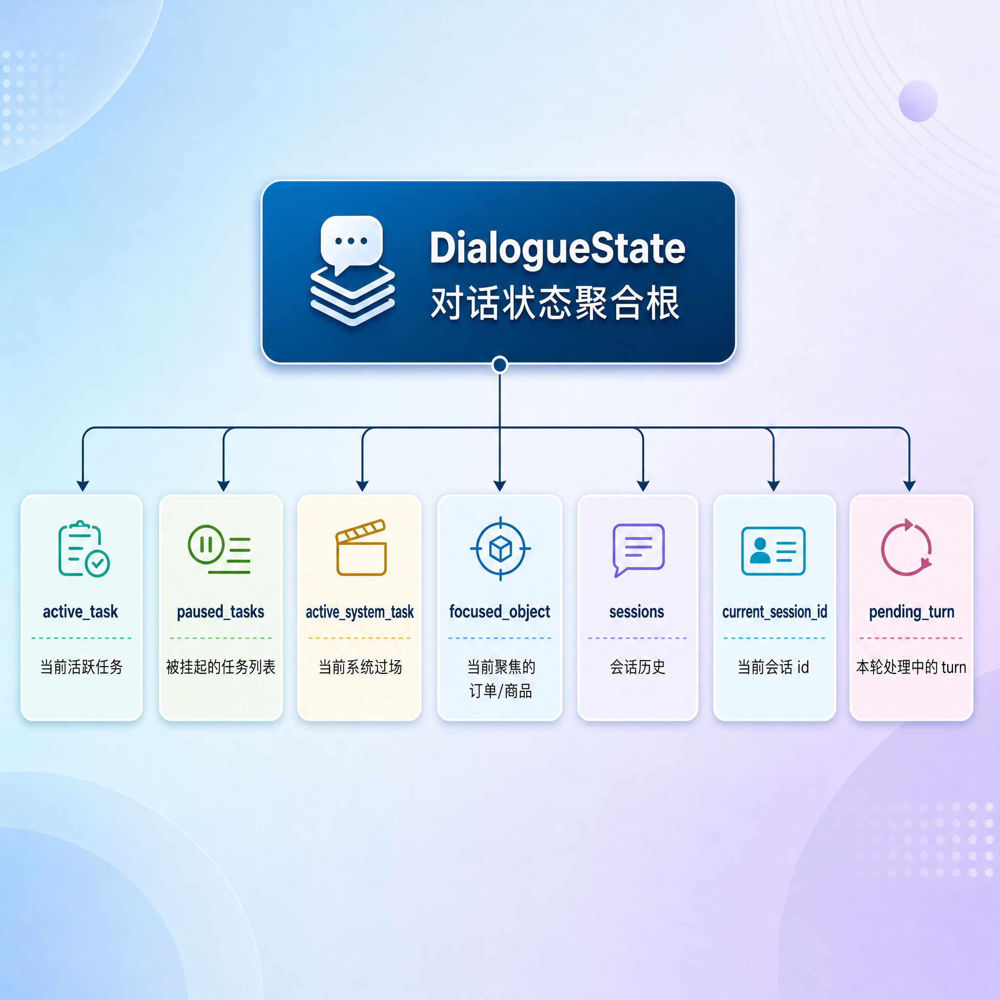
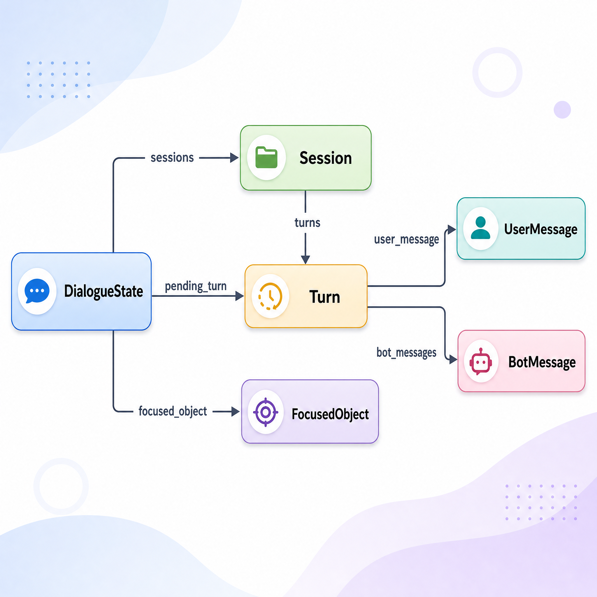
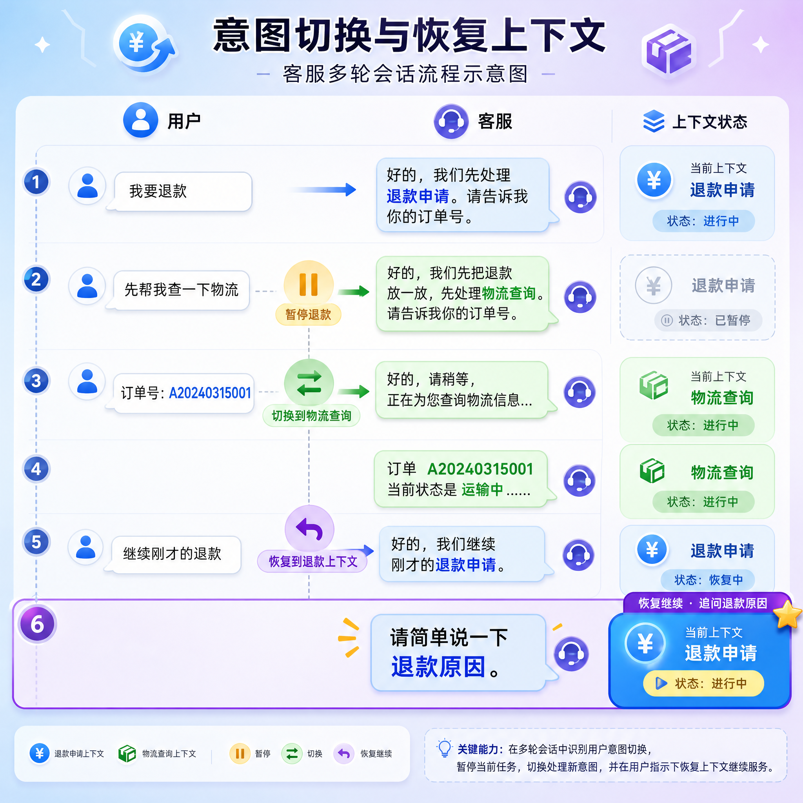
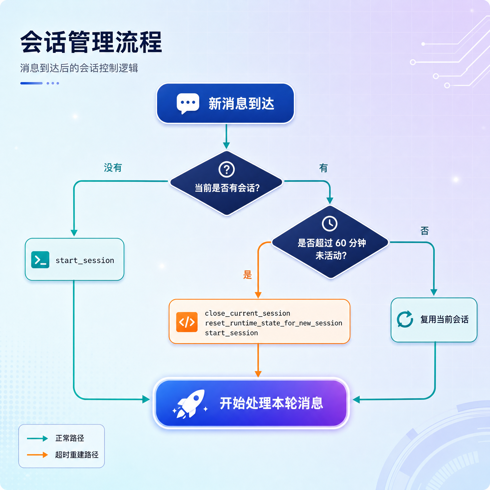
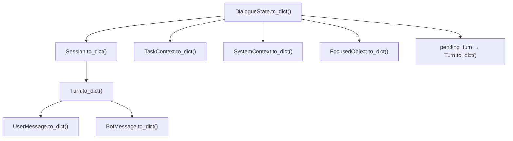

# 对话状态模型 state设计

---

## 第1章 为什么需要 DialogueState

在上一节我们用 `contexts.py` 解决了两件事：

- 用 `TaskContext` 记录"用户当前在做的业务任务"
- 用 `SystemContext` 记录"系统插播的过场"

但是只有这两个对象还不够。一次真实的对话，需要记的东西要多得多：

- 这个用户**正在做**哪个任务？
- 这个用户**搁置**了哪些任务？
- 当前是不是有**系统过场**在进行？
- 用户当前**聚焦**在哪个订单或者商品上？
- 这个用户**历史**上聊过哪些话？

更进一步，一次"我要退款"的处理通常会产生**多条回复**：系统先说"好的，我们先处理退款申请"，再说"请告诉我你的订单号"。这几条要陆续装进同一轮里；如果第二条还没生成就报错了，我们希望整轮回滚，而不是只留半截在历史里。**所以还需要一个"暂存格子"，专门放正在处理中的那一轮**。

如果把这些信息散落在各处，多轮对话和持久化就没法做。所以系统专门定义了一个聚合对象——`DialogueState`，作为整个对话状态的"中央仓库"。



这一节我们就把 `state.py` 里的每一个组成部分讲透。

---

## 第2章 state.py 整体结构

`state.py` 文件位于 `atguigu/domain/state.py`，定义了四个类：

| 类 | 作用 |
| --- | --- |
| `FocusedObject` | 用户当前聚焦的业务对象（订单 / 商品） |
| `Turn` | 一次对话轮次（一问 + 多答） |
| `Session` | 一段会话（多个 Turn 的集合） |
| `DialogueState` | 整个对话状态的聚合根 |

它们之间的包含关系是：



---

## 第3章 FocusedObject：聚焦的业务对象

### 3.1 业务场景

电商客服前端的右侧栏里会列出"我的订单"和"我的商品"。当用户点击某个订单时，前端会把这个订单作为一条**对象消息**发给后端：

```text
（用户在前端点了订单 A20240315001）
客服：你想了解这个订单的什么呢？
用户：什么时候发货
客服：商家正在备货，预计 24 小时内发出。
```

后续这一整段对话里，"那个订单"都是同一个。把它记下来，避免每一轮都重新指认。这个"用户当前关注的业务对象"就是 `FocusedObject`。当然会话超时重置后，`focused_object` 随运行时状态一并清空。

### 3.2 类定义

```python
@dataclass
class FocusedObject:
    type: str
    id: str
    title: str | None = None
    attributes: dict = field(default_factory=dict)
```

### 3.3 字段说明

| 字段 | 类型 | 含义 |
| --- | --- | --- |
| `type` | `str` | 对象类型，例如 `order`、`product` |
| `id` | `str` | 对象唯一标识 |
| `title` | `str \| None` | 对象的显示标题 |
| `attributes` | `dict` | 对象的扩展属性，由前端决定带什么 |

举例：

```python
FocusedObject(
    type="order",
    id="A20240315001",
    title="订单 A20240315001",
    attributes={"source": "order_list"}
)
```

### 3.4 序列化方法

```python
def to_dict(self) -> dict[str, Any]:
    return {
        "type": self.type,
        "id": self.id,
        "title": self.title,
        "attributes": self.attributes,
    }

@classmethod
def from_dict(cls, data: dict[str, Any]) -> "FocusedObject":
    return cls(
        type=data["type"],
        id=data["id"],
        title=data["title"],
        attributes=data["attributes"],
    )
```

---

## 第4章 Turn：一次对话轮次

### 4.1 概念

一个 `Turn` 表示一次**完整的问答交互**：用户说一句话，机器人给出回复（可能多条消息）。

```text
用户：我要退款           ← user_message
客服：好的，我们先处理退款申请。
客服：请告诉我你的订单号。  ← bot_messages（2 条）
```


上面这一整段就是一个 Turn。

### 4.2 类定义

```python
@dataclass
class Turn:
    turn_id: str
    user_message: UserMessage
    bot_messages: list[BotMessage]
```

### 4.3 字段说明

| 字段 | 类型 | 含义 |
| --- | --- | --- |
| `turn_id` | `str` | 轮次唯一标识，使用 UUID |
| `user_message` | `UserMessage` | 这一轮用户说的那一句话 |
| `bot_messages` | `list[BotMessage]` | 这一轮系统给出的所有回复 |

为什么 `bot_messages` 是列表？因为系统在一轮内经常会发多条消息：先说一句过场（"好的，我们先处理退款申请。"），再说一句业务问题（"请告诉我你的订单号。"）。

---

## 第5章 Session：一段会话

### 5.1 概念

如果 Turn 是"一问一答"，那 Session 就是"一整段聊天"。

举例：用户上午跟客服聊了一阵，又下午回来聊。这两段聊天我们就会划成两个 Session。怎么判断要不要切到新 Session？我们后面会看到一个简单的规则：超过 60 分钟没有活动，就关闭旧 Session，开新的。

### 5.2 类定义

```python
@dataclass
class Session:
    session_id: str
    started_at: float
    last_activity_at: float
    closed_at: float | None = None
    turns: list[Turn] = field(default_factory=list)
```

### 5.3 字段说明

| 字段 | 类型 | 含义 |
| --- | --- | --- |
| `session_id` | `str` | 会话唯一标识，使用 UUID |
| `started_at` | `float` | 会话开始的时间戳 |
| `last_activity_at` | `float` | 最后一次活动的时间戳，用来判断超时 |
| `closed_at` | `float | None` | 会话关闭时间，未关闭时为 `None` |
| `turns` | `list[Turn]` | 这个会话里的所有轮次 |

### 5.4 一个用户的会话历史举例

```python
state.sessions = [
    Session(
        session_id="abc-123",
        started_at=1700000000.0,
        last_activity_at=1700001800.0,
        closed_at=1700005400.0,         # 已关闭
        turns=[Turn(...), Turn(...), Turn(...)],
    ),
    Session(
        session_id="def-456",
        started_at=1700090000.0,
        last_activity_at=1700090600.0,
        closed_at=None,                  # 当前活跃
        turns=[Turn(...)],
    ),
]
```

---

## 第6章 DialogueState：对话状态聚合根

到这里，所有零件都准备好了，可以拼起来看 `DialogueState` 这个聚合根。

### 6.1 类定义

```python
@dataclass
class DialogueState:
    sender_id: str
    active_task: TaskContext | None = None
    paused_tasks: list[TaskContext] = field(default_factory=list)
    active_system_task: SystemContext | None = None
    focused_object: FocusedObject | None = None
    sessions: list[Session] = field(default_factory=list)
    current_session_id: str | None = None
    pending_turn: Turn | None = None
```

### 6.2 字段说明

| 字段 | 类型 | 含义 |
| --- | --- | --- |
| `sender_id` | `str` | 用户唯一标识 |
| `active_task` | `TaskContext \| None` | 当前活跃的业务任务 |
| `paused_tasks` | `list[TaskContext]` | 被挂起的任务列表 |
| `active_system_task` | `SystemContext \| None` | 当前活跃的系统过场 |
| `focused_object` | `FocusedObject \| None` | 用户当前聚焦的订单 / 商品 |
| `sessions` | `list[Session]` | 历史会话列表 |
| `current_session_id` | `str \| None` | 当前活跃会话 ID |
| `pending_turn` | `Turn \| None` | 正在处理中的轮次 |

下面我们把这些字段分四组，结合方法讲清楚。

---

## 第7章 任务相关

### 7.1 涉及字段

- `active_task`
- `paused_tasks`
- `active_system_task`

回顾上一节学过的关系：

| 字段 | 关注 |
| --- | --- |
| `active_task` | "用户当前在做什么" |
| `paused_tasks` | "用户挂起了哪些事" |
| `active_system_task` | "系统现在在插播什么" |

### 7.2 方法清单

#### 7.2.1 start_task

**启动业务任务**

```python
def start_task(self, task_context: TaskContext):
    self.active_task = task_context
```

把传进来的 `TaskContext` 设为活跃任务。

调用时机：当 `TurnPlanner` 判断用户发起了一个新业务任务时。

#### 7.2.2 end_active_task

**结束当前任务**

```python
def end_active_task(self):
    self.active_task = None
```

只把活跃任务清空。

调用时机：当业务流程跑到 `end` 步骤时。

#### 7.2.3 cancel_active_task

**取消当前任务**

```python
def cancel_active_task(self):
    self.active_task = None
    self.active_system_task = None
```

把活跃任务和当前系统过场都清空。

调用时机：用户主动说"算了不退了"这类取消意图时。

#### 7.2.4 interrupt_active_task

**中断当前任务**

```python
def interrupt_active_task(self):
    self.paused_tasks.append(self.active_task)
    self.active_task = None
```

把当前活跃任务**移到挂起列表**，再清空活跃任务。注意这是有去回的，因为后面可以恢复。

调用时机：用户在任务 A 中途切到任务 B 时。

#### 7.2.5 resume_task

**恢复挂起的任务**

```python
def resume_task(self, flow_id: str):
    for task in self.paused_tasks:
        if task.flow_id == flow_id:
            self.active_task = task
            self.paused_tasks.remove(task)
            break
```

按 `flow_id` 在挂起列表里找一个任务，恢复为活跃任务，并从挂起列表里移除。

调用时机：用户说"继续刚才的退款"时。

注意：任务被恢复时，`step_id` 和 `slots` 都还在，所以可以从挂起前的位置接着跑，不用从头来。

#### 7.2.6 start_system_task / end_system_task

**管理系统过场**

```python
def start_system_task(self, system_context: SystemContext):
    self.active_system_task = system_context

def end_system_task(self):
    self.active_system_task = None
```

激活和清除当前的系统过场。

调用时机：每当系统要插播过场白（任务开始、打断、取消、恢复、收集槽位）时。

### 7.3 一个完整的任务切换示例

下面把 7.2 各方法串起来，看一段典型对话：



每一步对应的状态变化：

| 用户输入 | 调用的方法 | 状态变化 |
| --- | --- | --- |
| 我要退款 | `start_task("refund_request")`<br/>`start_system_task(StartedSystemContext)` | `active_task = 退款` |
| 先帮我查物流 | `interrupt_active_task()`<br/>`start_task("logistics_tracking")`<br/>`start_system_task(InterruptedSystemContext)` | `active_task = 物流`<br/>`paused_tasks = [退款]` |
| 继续刚才的退款 | `cancel_active_task()` (物流)<br/>`resume_task("refund_request")`<br/>`start_system_task(ResumedSystemContext)` | `active_task = 退款`<br/>`paused_tasks = []` |

恢复后退款的 `step_id` 和 `slots` 都还在，所以接着问"请简单说一下退款原因"，不用重新要订单号。

### 7.4 当前上下文 current_task

```python
def current_task(self):
    return self.active_system_task or self.active_task
```

这个方法返回**当前真正要驱动对话的上下文**。规则是：

- 如果有系统过场，先走系统过场
- 否则走业务任务

为什么系统过场优先？因为系统过场往往是要插播一句过场白，必须先说完，然后才能让位给业务任务继续。

---

## 第8章 槽位相关

### 8.1 set_slots：批量写槽位

```python
def set_slots(self, slots: dict[str, Any]):
    self.active_task.slots.update(slots)
```

把传进来的 dict 合并到当前活跃任务的 `slots` 里。

举例：用户回答了订单号后，`TurnPlanner` 会生成一条 `set_slots` 命令，最终落到这里：

```python
state.set_slots({"order_number": "A20240315001"})
# 之后 state.active_task.slots == {"order_number": "A20240315001"}
```

### 8.2 remove_slot：删除槽位

```python
def remove_slot(self, slot_name: str):
    self.active_task.slots.pop(slot_name)
```

从当前活跃任务的 `slots` 里删一个键。比如用户输入有误，重新收集时会先清掉旧的。

---

## 第9章 会话与轮次相关

这是 state 里最容易混淆的一块，我们专门列出来。涉及字段：

- `sessions`
- `current_session_id`
- `pending_turn`

涉及方法（4 个会话方法 + 2 个轮次方法）。

### 9.1 会话方法

#### 9.1.1 start_session

**开启新会话**

```python
def start_session(self):
    now = time.time()
    session = Session(session_id=str(uuid.uuid4()),
                      started_at=now,
                      last_activity_at=now)
    self.sessions.append(session)
    self.current_session_id = session.session_id
```

创建一个新的 `Session`，加进 `sessions` 列表，并把它设为当前会话。

#### 9.1.2 current_session：

**获取当前会话对象**

```python
def current_session(self) -> Session | None:
    for session in self.sessions:
        if session.session_id == self.current_session_id:
            return session
    return None
```

按 `current_session_id` 在 `sessions` 里找出当前活跃的那个。

#### 9.1.3 close_current_session：

**关闭当前会话**

```python
def close_current_session(self):
    self.current_session().closed_at = time.time()
    self.current_session_id = None
```

给当前会话打上关闭时间戳，再把 `current_session_id` 置空。

#### 9.1.4 reset_runtime_state_for_new_session：

**重置运行时状态**

```python
def reset_runtime_state_for_new_session(self):
    self.active_task = None
    self.active_system_task = None
    self.focused_object = None
    self.paused_tasks = []
```

新会话开始前的"清理工作"。注意：

- 它**只清运行时字段**：当前任务、挂起任务、系统过场、聚焦对象
- 它**不清** `sessions`：历史会话需要保留

### 9.2 三个会话方法的协作

实际使用时，这三个方法经常按下面这个顺序连起来用：



这段逻辑会在后面 `DialogueEngine` 的 `_prepare_session` 方法里看到。这一节我们只要理解这三个方法各自负责什么就够了。

### 9.3 轮次方法

#### 9.3.1 begin_turn

**开启新轮次**

```python
def begin_turn(self, message: UserMessage):
    self.pending_turn = Turn(
        turn_id=str(uuid.uuid4()),
        user_message=message,
        bot_messages=[]
    )
```

收到用户消息后，把它装进一个新的 `Turn` 对象，**先放到 `pending_turn`**，而不是直接进 session。

#### 9.3.2 commit_pending_turn

**提交本轮**

```python
def commit_pending_turn(self):
    self.current_session().turns.append(self.pending_turn)
    self.pending_turn = None
```

本轮处理完成（机器人回复也填好了）后，把 `pending_turn` 追加到当前会话的 `turns` 里，再把 `pending_turn` 清空。

### 9.4 pending_turn 

为什么要有 **pending_turn** 这个中间字段，这是这一节最值得停下来想一想的地方。如果我们没有 `pending_turn`，处理一轮消息看起来好像也能做：

```text
× 假设没有 pending_turn 的写法
1. 创建一个 Turn，user_message = 用户消息
2. 直接放到 current_session.turns 里
3. 调用引擎处理，过程中往这个 Turn 的 bot_messages 里 append
4. 处理完返回
```

这种写法在两个场景下会出问题：

**场景一：处理过程中出错**

如果引擎处理到一半异常退出，`turns` 里就留下了一个"半成品" Turn——有用户消息但回复不完整。下次再读这份历史就乱了。

**场景二：处理结果未必要落盘**

有些请求可能在中途被判定为"非法消息"、"重复消息"，直接丢弃就好。如果已经塞进 `turns`，再删就麻烦了。

所以系统采用"两步提交"：

```text
✓ 用 pending_turn 的写法
1. begin_turn → pending_turn = Turn(用户消息, [])     ← 暂存区
2. 引擎处理，往 pending_turn.bot_messages 里 append   ← 填补回复
3. commit_pending_turn → 追加到 session.turns         ← 最终落盘
```

这样：

- 处理失败时只要丢掉 `pending_turn` 即可，`turns` 始终干净，
- 决定不入库时也只要不调用 commit，`pending_turn` 不参与持久化，它是纯粹的请求内瞬态。
- `turns` 里的每一条 Turn 都是"完整的"

完整流程图：


---

## 第10章 聚焦对象相关

```python
def set_focused_object(self, object: FocusedObject):
    self.focused_object = object
```

只有一个方法，把传进来的对象直接覆盖到 `focused_object`。

调用时机：用户发的不是文本而是一条对象消息时（例如前端点了订单卡片），需要把这个对象设为当前关注的对象。

---

## 第11章 序列化与持久化

### 11.1 完整的 to_dict / from_dict

```python
def to_dict(self) -> dict[str, Any]:
    return {
        "sender_id": self.sender_id,
        "active_task": self.active_task.to_dict() if self.active_task else None,
        "paused_tasks": [task.to_dict() for task in self.paused_tasks],
        "active_system_task": self.active_system_task.to_dict() if self.active_system_task else None,
        "focused_object": self.focused_object.to_dict() if self.focused_object else None,
        "sessions": [session.to_dict() for session in self.sessions],
        "current_session_id": self.current_session_id,
        "pending_turn": self.pending_turn.to_dict() if self.pending_turn else None,
    }
```

可以看到 `DialogueState.to_dict()` 实际上是把所有子对象的 `to_dict()` 递归拼起来。`from_dict` 同理。

### 11.2 整个聚合的序列化链路



### 11.3 入库形态

整个 `DialogueState` 不会拆成多张表，而是序列化为一个 JSON 字符串，存到 `dialogue_states` 表的 `state_json` 字段里：

| 字段 | 类型 | 说明 |
| --- | --- | --- |
| `sender_id` | `VARCHAR(255)` 主键 | 用户唯一标识 |
| `state_json` | `TEXT` | `DialogueState.to_dict()` 序列化后的 JSON 字符串 |

读取时反过来：从数据库读出 `state_json` → `json.loads` → `DialogueState.from_dict()`。

这种"整份 JSON"的设计在生产环境不一定最优，但在学习阶段能让你直接打开一行数据库记录就看到对话的所有状态，调试起来非常直观。

---

## 第12章 小结

### 12.1 字段速查表

| 分组 | 字段 |
| --- | --- |
| 任务 | `active_task` / `paused_tasks` / `active_system_task` |
| 槽位 | （在 `active_task.slots` 里） |
| 聚焦对象 | `focused_object` |
| 会话历史 | `sessions` / `current_session_id` |
| 本轮处理 | `pending_turn` |

### 12.2 方法速查表

| 分组 | 方法 |
| --- | --- |
| 任务 | `start_task` / `end_active_task` / `cancel_active_task` / `interrupt_active_task` / `resume_task` |
| 系统过场 | `start_system_task` / `end_system_task` |
| 当前上下文 | `current_task` |
| 槽位 | `set_slots` / `remove_slot` |
| 会话 | `start_session` / `current_session` / `close_current_session` / `reset_runtime_state_for_new_session` |
| 轮次 | `begin_turn` / `commit_pending_turn` |
| 聚焦对象 | `set_focused_object` |
| 序列化 | `to_dict` / `from_dict` |

### 12.3 一句话总结

`DialogueState` 是整个客服系统的"中央仓库"：它把任务、会话、轮次、聚焦对象统一管起来，所有处理一条消息会用到的状态都从这里读，处理完所有状态变化都写回这里，最后整份对象序列化进数据库。

到这里，"数据模型层"就铺完了。接下来我们就可以开始写 Web 层、Service 层、引擎层，并在需要新数据模型时（请求体、响应体、命令、计划等）按需补充。
