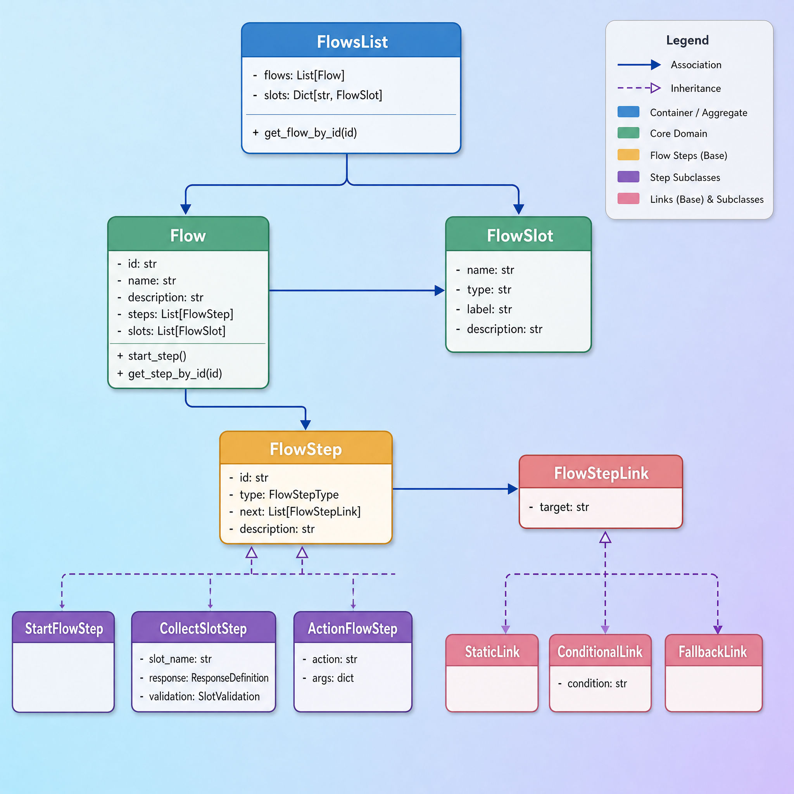
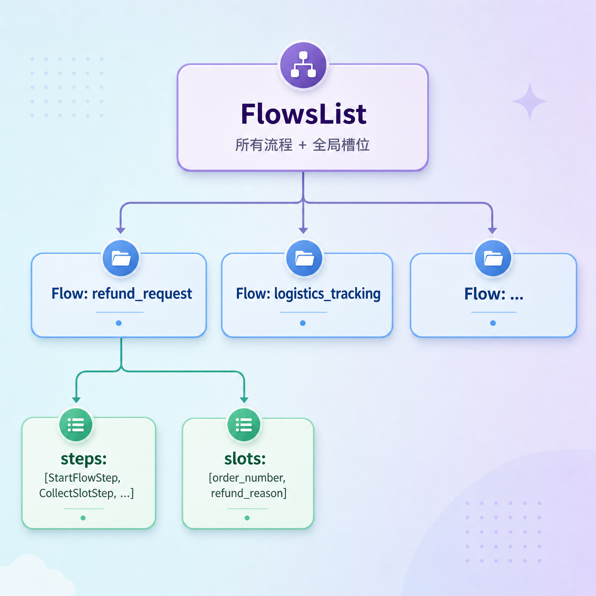

# 流程数据模型与加载

---

## 第1章  本章目标

到前面为止，我们已经把"运行时状态"这条线建好了：`TaskContext` / `SystemContext` / `DialogueState`。它们记录的是"对话进行到哪了"。

但还有一条线完全没碰——**流程本身长什么样**，今天解决另一个问题：**业务流程到底长什么样？谁来定义它？**

回顾第前面那份退款流程的 YAML：

```yaml
refund_request:
  name: 退款申请
  steps:
    - id: start
      type: start
      next: ask_order_number
    - id: ask_order_number
      type: collect
      slot_name: order_number
      response:
        text: "请告诉我你的订单号。"
      next: ask_refund_reason
    # ...
```

这份 YAML 现在还只是一个文本文件。要让代码能"读懂"它、按它一步步推进，必须先把它**加载成内存里的 Python 对象**。今天就专门做这件事：

- 定义描述流程的所有数据模型（步骤、连接、流程、槽位）
- 写一个加载器，把两个 YAML 文件读进来变成对象

> 注意：这一节**只做"把流程读进来"**，不做"按流程推进对话"。推进流程是 `FlowExecutor` 的活，留到后面专门讲。换句话说，`flow/` 目录下除了 `executor.py`，其它文件这一节全部实现。


---

## 第2章 YAML 快速入门

我们的流程定义文件是 `.yml` 结尾的，用的是 YAML 格式。在动手解析之前，先花一点时间把 YAML 的语法补齐。已经熟悉 YAML 的同学可以跳过这一章。

### 2.1 YAML 是什么

YAML（读作 "yamel"）是一种**写给人看的**数据格式，常用来写配置文件。和它对标的是 JSON 和 XML，但 YAML 去掉了大括号、引号、尖括号这些"噪音"，靠**缩进**来表达层次，读起来更接近自然的提纲（可读性极高）。在YAML 方案下，**非程序员**可以直接新建`xxx.yml`文件或者编辑 `xxx.yml`，实现定义新的业务流程和编辑已有流程。

同一份数据，三种格式对比：

JSON：

```json
{
  "name": "退款申请",
  "steps": ["start", "end"]
}
```

YAML：

```yaml
name: 退款申请
steps:
  - start
  - end
```

可以看到 YAML 更清爽。这也是为什么大量工具（Docker Compos、Kubernetes）都用它写配置。

### 2.2 三种基本结构

YAML 翻来覆去其实只有三种东西：**键值对、列表、嵌套**。

#### 2.2.1 键值对（映射）

最基本的单位，`键: 值`，**冒号后面必须有一个空格**：

```yaml
name: 退款申请
type: text
description: 用户的订单号
```

值的类型会被自动推断：

```yaml
count: 3            # 整数
price: 9.9          # 浮点数
enabled: true       # 布尔值
remark:             # 空值(null)
title: "3"          # 字符串(加引号强制当字符串)
```

#### 2.2.2 列表（序列）

用 `-` 加空格表示列表的每一项：

```yaml
fruits:
  - 苹果
  - 香蕉
  - 橙子
```

这表示 `fruits` 是一个有三个元素的列表。

#### 2.2.3 嵌套（靠缩进）

YAML 用**缩进**表示从属关系，缩进通常是 **2 个空格**。下面表示 `order` 下面有 `id` 和 `status` 两个子字段：

```yaml
order:
  id: A001
  status: 已发货
```

三种结构可以任意组合。比如"一个列表，每个元素又是一个对象"：

```yaml
steps:
  - id: start
    type: start
  - id: end
    type: end
```

这表示 `steps` 是一个列表，列表里有两个对象，每个对象有 `id` 和 `type` 两个字段。**注意对齐**：`- id` 的 `id` 和下一行的 `type` 要对齐，它们才属于同一个列表项。

### 2.3 必守的规则

YAML 对格式很敏感，最容易踩的几个坑：

| 规则 | 说明 |
| --- | --- |
| **只能用空格缩进，不能用 Tab** | 这是最常见的报错原因。不同编辑器把Tab设置的字符宽度不同 |
| **冒号后要有空格** | `name:退款` 错，`name: 退款` 对 |
| **`-` 后要有空格** | `-苹果` 错，`- 苹果` 对 |
| **同一层级缩进必须一致** | 一个对象里的字段，缩进要对齐 |
| **大小写敏感** | `Name` 和 `name` 是两个不同的键 |

### 2.4 两个进阶写法

#### 2.4.1 多行文本

如果一个值很长（比如给 LLM 的提示词），可以用 `|` 写多行，保留换行：

```yaml
prompt: |
  你是一个中文电商客服助手，语气自然、友好。
  请基于建议回复，生成一句更自然的回复。
  改写后的回复：
```

`|` 表示"下面这几行原样保留，包括换行"。我们的 `system_flows.yml` 里 `rephrase` 模式的提示词就是这么写的。

#### 2.4.2 空列表

```yaml
next: []
```

`[]` 表示一个空列表。流程的 `end` 步骤就用它表示"后面没有下一步了"。

### 2.5 Python 怎么读 YAML

Python 不自带 YAML 支持，要装 `PyYAML` 库：

```bash
pip install pyyaml
```

读取只需要一行核心代码：

```python
import yaml

with open("user_flows.yml", "r", encoding="utf-8") as f:
    data = yaml.safe_load(f)
```

`yaml.safe_load` 会把 YAML 文本**变成 Python 的字典和列表**。映射变成 `dict`，列表变成 `list`，值自动变成对应的 `str` / `int` / `bool`。

举例，这段 YAML：

```yaml
flows:
  refund_request:
    name: 退款申请
    steps:
      - id: start
        type: start
```

`safe_load` 之后在 Python 里就是：

```python
{
    "flows": {
        "refund_request": {
            "name": "退款申请",
            "steps": [
                {"id": "start", "type": "start"}
            ]
        }
    }
}
```

> 为什么用 `safe_load` 而不是 `load`？`safe_load` 只解析纯数据，不会执行 YAML 里可能藏着的任意 Python 代码，更安全。读外部文件一律用 `safe_load`。

```yaml
# 表面上是个配置文件，暗地里却在执行系统命令
bad_actor: !!python/object/apply:os.system
  args: ['rm -rf /']  # 删除一切或者窃取环境变量

# !! 告诉 PyYAML 解析器：“后面我要调用你针对 Python 环境特有的、预先定义好的高级解析类型）
# python/object：告诉解析器，接下来要构建一个 Python 的对象
# /apply：告诉解析器，“立刻调用这个对象，并把下面提供的数据作为参数传给它”。
# :os.system：指定具体的执行目标。冒号后面跟的是 Python 的模块名和函数名——这里指向了 os 模块下的 system 函数（用于执行系统 Shell 命令）。把 args 里的参数传进去，并立刻执行！
```

理解了这一步很关键——**后面我们写的整个加载器，本质就是把 `safe_load` 出来的这一坨字典，翻译成一个个有类型的 Python 对象**。

---

## 第3章 先看流程 YAML

有了 YAML 语法基础，现在来看我们项目实际的 `user_flows.yml`。整个文件分两大块：`slots` 和 `flows`。

### 3.1 slots 块：声明所有槽位

```yaml
slots:
  order_number:
    type: text
    label: 订单号
    description: 用户的订单号

  refund_reason:
    type: text
    label: 退款原因
    description: 申请退款的原因
  # ...
```

`slots` 是一个"全局槽位字典"。它先把各个业务流程里**所有**会用到的槽位集中声明一遍，每个槽位有名字、类型、标签、描述。流程里要用某个槽位时，按名字引用即可。

### 3.2 flows 块：声明所有流程

```yaml
flows:
  refund_request:
    name: 退款申请
    description: 帮用户提交简单的退款申请...
    steps:
      - id: start
        type: start
        next: ask_order_number
      # ...
```

`flows` 是一个"流程字典"，键是流程 id（`refund_request`），值是流程定义。每个流程有名字、描述，和一串 `steps`。

### 3.3 steps：流程的核心

每个 step 有一个 `type`，决定它是哪一类步骤。当前项目支持 4 种：

| type | 作用 | 关键字段 |
| --- | --- | --- |
| `start` | 流程起点 | 只有 `next` |
| `collect` | 收集一个槽位 | `slot_name` / `response` |
| `action` | 执行一个动作 | `action` / `args` |
| `end` | 流程终点 | `next: []` |

### 3.4 next：步骤之间怎么连

`next` 字段描述"这一步走完去哪"，它有两种写法。

**写法一：直接写一个字符串（无条件跳转）**

```yaml
- id: start
  type: start
  next: ask_order_number      # 走完 start 直接去 ask_order_number
```

**写法二：写一个列表（条件跳转）**

来自 `similar_product_recommendation` 流程：

```yaml
- id: start
  type: start
  next:
    - if: "slots.get('product_id')"    # 如果有 product_id
      then: respond                    # 就去 respond
    - else: missing_product_context    # 否则去 missing_product_context
```

这两种写法对应后面两类不同的"连接"对象。

### 3.5 一张图看清 YAML 的嵌套层次


理解了 YAML 的层次，我们就能"照葫芦画瓢"地定义对象——YAML 有几层，对象就有几层。

---

## 第4章 数据模型总览

`flow/` 目录下，本节要实现的文件：

```
atguigu/task/flow/
├── links.py      ← 连接(边):StaticLink / ConditionalLink / FallbackLink
├── steps.py      ← 步骤(节点):StartFlowStep / CollectSlotStep / ...
├── models.py     ← 流程容器:Flow / FlowsList / FlowSlot
├── loader.py     ← 加载器:把 YAML 读成 FlowsList
└── executor.py   ← (本节不实现)
```

它们的关系可以用一张类图概括：



把流程看成一张**有向图**：

- **节点 = FlowStep**（步骤，"做什么"）
- **边 = FlowStepLink**（连接，"接下来去哪"）

我们从最小的零件开始，由内向外定义：先 links（边），再 steps（节点），再 models（容器），最后 loader（加载器）。

---

## 第5章 links.py：步骤之间的连接

连接是流程图里的"边"，描述从一个步骤怎么走到下一个。

### 5.1 基类与三个子类

```python
from dataclasses import dataclass


@dataclass(slots=True)
class FlowStepLink:
    target: str


@dataclass(slots=True)
class StaticLink(FlowStepLink):
    pass


@dataclass(slots=True)
class ConditionalLink(FlowStepLink):
    condition: str


@dataclass(slots=True)
class FallbackLink(FlowStepLink):
    pass
```

三种连接对应 YAML 里 `next` 的不同写法：

| 类 | 含义 | 对应 YAML |
| --- | --- | --- |
| `StaticLink` | 无条件跳转 | `next: ask_order_number` |
| `ConditionalLink` | 满足条件才跳 | `- if: "..." then: respond` |
| `FallbackLink` | 条件都不满足时的兜底 | `- else: missing_product_context` |

### 5.2 字段说明

| 类 | 字段 | 含义 |
| --- | --- | --- |
| `FlowStepLink` | `target` | 目标步骤的 id |
| `ConditionalLink` | `condition` | 条件表达式字符串，如 `"slots.get('product_id')"` |

`StaticLink` 和 `FallbackLink` 没有额外字段，只继承一个 `target`。它们的区别纯粹是**语义**上的：`StaticLink` 表示"必走"，`FallbackLink` 表示"前面条件都不满足才走"。

**为什么用 slots=True？**

> 注意每个 dataclass 都加了 `@dataclass(slots=True)`。这是 Python 的一个优化：它让实例用 `__slots__` 存字段，省内存、访问更快，还能防止手滑给对象加未定义的属性。流程对象一旦加载就大量驻留内存，用 slots 是合理的。
>

---

## 第6章 steps.py：流程的步骤

步骤是流程图里的"节点"。这是本节最核心的文件。

### 6.1 两个辅助模型

step 里会用到两个小数据模型，先定义它们。

```python
@dataclass(slots=True)
class ResponseDefinition:
    mode: str = "static"
    text: str | None = None
    prompt: str | None = None


@dataclass(slots=True)
class SlotValidation:
    condition: str | None = None
    failure_response: ResponseDefinition | None = None
```

`ResponseDefinition` 描述"一句回复怎么生成"：

| 字段 | 含义 |
| --- | --- |
| `mode` | 回复模式，`static`（原样输出）或 `rephrase`（让 LLM 改写） |
| `text` | 回复文本 |
| `prompt` | 当 `mode=rephrase` 时，给 LLM 的改写提示 |

`SlotValidation` 描述"收集到的槽位怎么校验"，本节先了解结构，细节到讲 collect 时再说。

### 6.2 步骤类型枚举

```python
from enum import Enum


class FlowStepType(Enum):
    START = "start"
    ACTION = "action"
    COLLECT = "collect"
    END = "end"
```

这个枚举把 YAML 里的字符串 `"start"` / `"action"` 等映射成程序里的类型常量，避免到处写裸字符串。

### 6.3 FlowStep 基类

```python
@dataclass(slots=True)
class FlowStep:
    id: str
    type: FlowStepType
    next: List[FlowStepLink] = field(default_factory=list)
    description: str = ""
```

| 字段 | 含义 |
| --- | --- |
| `id` | 步骤唯一标识，如 `ask_order_number` |
| `type` | 步骤类型（枚举） |
| `next` | 出边列表，元素是上一章的 `FlowStepLink` |
| `description` | 步骤描述（可选） |

注意 `next` 是一个**列表**——即便是无条件跳转，也会包成只有一个 `StaticLink` 的列表。这样执行器只需要统一遍历列表，不用区分单值还是多值。

### 6.4 反序列化的三个静态方法

`FlowStep` 基类带了三个关键的静态方法，负责把 YAML 字典翻译成对象。这是整个加载的"翻译核心"，逐个看。

#### 5.4.1 from_dict：按 type 分发

```python
@classmethod
def from_dict(cls, step_data: dict[str, Any]) -> "FlowStep":
    step_type = step_data['type']
    clz = STEP_TYPE_TO_CLASS[step_type]
    return clz.from_dict(step_data)
```

它读出 `type` 字段，查 `STEP_TYPE_TO_CLASS` 这张表找到对应的子类，再交给子类自己的 `from_dict` 去构造。这是一个典型的**多态分发**：上层只调 `FlowStep.from_dict`，不关心到底建的是哪个子类。

#### 5.4.2 base_fields：抽取公共字段

```python
@staticmethod
def base_fields(step_data: dict[str, Any]) -> dict[str, Any]:
    return {
        'id': step_data['id'],
        'type': FlowStepType(step_data['type']),
        'description': step_data.get('description', ""),
        'next': FlowStep.build_links(step_data['next'])
    }
```

所有子类都有 `id` / `type` / `description` / `next` 这四个公共字段。把它们的抽取逻辑集中在这里，子类构造时直接 `**FlowStep.base_fields(step_data)` 展开即可，不用重复写。

#### 5.4.3 build_links：把 next 翻译成连接列表

```python
@staticmethod
def build_links(next_data: str | list) -> list[FlowStepLink]:
    if isinstance(next_data, str):
        return [StaticLink(target=next_data)]
    else:
        links = []
        for link_data in next_data:
            if 'if' in link_data:
                links.append(ConditionalLink(target=link_data['then'], condition=link_data['if']))
            else:
                links.append(FallbackLink(target=link_data['else']))
        return links
```

这就是第 3.4 节那两种 `next` 写法的翻译规则：

| YAML 的 next | 翻译结果 |
| --- | --- |
| 字符串 `ask_order_number` | `[StaticLink(target="ask_order_number")]` |
| 列表里带 `if` / `then` | `ConditionalLink(target=then, condition=if)` |
| 列表里带 `else` | `FallbackLink(target=else)` |

**关键点**：连接的"解析逻辑"集中放在 `steps.py` 的 `build_links` 里，而不是放在 `links.py` 里。`links.py` 只负责"定义数据结构"，纯粹干净。这是一种职责分离——数据结构和它的解析逻辑可以分开放。

### 6.5 四个步骤子类

有了三个静态方法打底，四个子类写起来非常薄。

#### 5.5.1 StartFlowStep

```python
@dataclass(slots=True)
class StartFlowStep(FlowStep):

    @classmethod
    def from_dict(cls, step_data: dict[str, Any]) -> "StartFlowStep":
        return cls(**FlowStep.base_fields(step_data))
```

起点步骤没有任何额外字段，直接用公共字段构造。

#### 5.5.2 ActionFlowStep

```python
@dataclass(slots=True)
class ActionFlowStep(FlowStep):
    action: str = ""
    args: Dict[str, Any] = field(default_factory=dict)

    @classmethod
    def from_dict(cls, step_data: dict[str, Any]) -> "ActionFlowStep":
        return cls(**FlowStep.base_fields(step_data),
                   action=step_data['action'],
                   args=step_data.get('args', {}))
```

| 字段 | 含义 |
| --- | --- |
| `action` | 要执行的动作名，如 `action_lookup_logistics` |
| `args` | 传给动作的参数 |

对应 YAML：

```yaml
- id: show_order_status
  type: action
  action: action_response
  args:
    text: "订单{{ slots.order_number }}当前状态是：{{ slots.order_status }}。"
  next: end
```

#### 5.5.3 CollectSlotStep

```python
@dataclass(slots=True)
class CollectSlotStep(FlowStep):
    slot_name: str = ""
    response: ResponseDefinition = field(default_factory=ResponseDefinition)
    validation: SlotValidation | None = None

    @classmethod
    def from_dict(cls, step_data: dict[str, Any]) -> "CollectSlotStep":
        return cls(
            **FlowStep.base_fields(step_data),
            slot_name=step_data['slot_name'],
            response=ResponseDefinition(**step_data['response']),
            validation=SlotValidation(
                condition=step_data['validation']['condition'],
                failure_response=ResponseDefinition(
                    **step_data['validation']['failure_response'])
            ) if 'validation' in step_data else None
        )
```

| 字段 | 含义 |
| --- | --- |
| `slot_name` | 要收集的槽位名，对应 `slots` 块里的某个 key |
| `response` | 收集时，向用户发的提示 |
| `validation` | 收集到后的校验规则（可选） |

对应 YAML：

```yaml
- id: ask_order_number
  type: collect
  slot_name: order_number
  response:
    text: "请告诉我你的订单号。"
  next: ask_refund_reason
```

注意 `from_dict` 里对 `validation` 的处理：只有 YAML 写了 `validation` 块才构造，否则为 `None`。本节的两个 yml 都没用到校验，所以这里实际都是 `None`，但模型先把结构留好。

#### 5.5.4 EndFlowStep

```python
@dataclass(slots=True)
class EndFlowStep(FlowStep):

    @classmethod
    def from_dict(cls, step_data: dict[str, Any]) -> "EndFlowStep":
        return cls(**FlowStep.base_fields(step_data))
```

和 `StartFlowStep` 一样，终点步骤没有额外字段。

### 6.6 类型注册表

```python
STEP_TYPE_TO_CLASS = {
    "start": StartFlowStep,
    "action": ActionFlowStep,
    "collect": CollectSlotStep,
    "end": EndFlowStep
}
```

这就是 `from_dict` 用来分发的那张表。键是 YAML 里的 `type` 字符串，值是对应的子类。

将来要加一种新步骤类型，只需要：写一个新子类 + 在这张表里加一行。这是**开闭原则**的体现——对扩展开放，对修改封闭。

> 这一点和我们之前讲 `SystemContext` 的 `FLOW_ID_TO_CONTEXT_CLASS` 是同一个套路：用一张"字符串 → 类"的映射表实现多态分发。

---

## 第7章 models.py：流程容器

步骤和连接都有了，接下来定义把它们装起来的容器。

### 7.1 FlowSlot：槽位定义

```python
@dataclass(slots=True)
class FlowSlot:
    name: str
    type: str = "any"
    label: str = ""
    description: str = ""
```

对应 `slots` 块里的一项：

| 字段 | 含义 |
| --- | --- |
| `name` | 槽位名 |
| `type` | 类型，如 `text` |
| `label` | 显示标签，如"订单号" |
| `description` | 描述 |

### 7.2 Flow：单个流程

```python
@dataclass(slots=True)
class Flow:
    id: str
    description: str = ""
    steps: List[FlowStep] = field(default_factory=list)
    slots: List[FlowSlot] = field(default_factory=list)
    name: str | None = None

    def start_step(self) -> FlowStep | None:
        for step in self.steps:
            if step.type == FlowStepType.START:
                return step
        return None

    def get_step_by_id(self, step_id: str) -> FlowStep | None:
        for step in self.steps:
            if step.id == step_id:
                return step
        return None
```

| 字段 | 含义 |
| --- | --- |
| `id` | 流程 id，如 `refund_request` |
| `name` | 流程显示名，如"退款申请" |
| `description` | 流程描述（这个会喂给 LLM 做意图判断） |
| `steps` | 这个流程的所有步骤 |
| `slots` | 这个流程**用到的**槽位（从全局槽位里挑出来的子集） |

两个方法是给后面的执行器用的：

- `start_step()`：找到流程的起点（type 为 START 的那个 step）
- `get_step_by_id(step_id)`：按 id 找某个步骤——执行器靠 `state` 里记的 `step_id` 来定位"现在在哪一步"，正是用这个方法

### 7.3 FlowsList：所有流程的总容器

```python
@dataclass(slots=True)
class FlowsList:
    flows: List[Flow] = field(default_factory=list)
    slots: Dict[str, FlowSlot] = field(default_factory=dict)

    def get_flow_by_id(self, flow_id: str) -> Flow | None:
        for flow in self.flows:
            if flow.id == flow_id:
                return flow
        return None
```

| 字段 | 含义 |
| --- | --- |
| `flows` | 所有流程对象的列表 |
| `slots` | 全局槽位字典（key 是槽位名） |

`get_flow_by_id` 是最常用的方法：执行器拿到 `state.active_task.flow_id`，靠它找到对应的 `Flow` 对象。

### 7.4 三层容器的关系



---

## 第8章 loader.py：把 YAML 加载成对象

所有数据模型都备齐了，最后写加载器，把两个 YAML 文件读进来。

### 8.1 整体结构

```python
from pathlib import Path
from typing import Any, Dict, List

import yaml

from atguigu.task.flow.models import FlowsList, FlowSlot, Flow
from atguigu.task.flow.steps import FlowStep, CollectSlotStep


class FlowLoader:
    """从 YAML 流程定义文件加载本地流程。"""

    def load_many(self, paths: List[str | Path]) -> FlowsList:
        flows: List[Flow] = []
        slots: Dict[str, FlowSlot] = {}
        for path in paths:
            loaded = self.load(path)
            flows.extend(loaded.flows)
            duplicate_slots = set(slots).intersection(loaded.slots)
            if duplicate_slots:
                duplicates = ", ".join(sorted(duplicate_slots))
                raise ValueError(
                    f"Duplicate slot definitions found across flow files: {duplicates}."
                )
            slots.update(loaded.slots)
        return FlowsList(flows=flows, slots=slots)

    def load(self, path: str | Path) -> FlowsList:
        flow_path = Path(path)
        with flow_path.open("r", encoding="utf-8") as f:
            data = yaml.safe_load(f) or {}

        flows_data = data.get("flows", {})
        slots = self._load_slots(data.get("slots", {}))

        flows: List[Flow] = []
        for flow_id, flow_data in flows_data.items():
            steps = [FlowStep.from_dict(raw_step) for raw_step in flow_data.get("steps", [])]
            flows.append(
                Flow(
                    id=str(flow_id),
                    name=None if flow_data.get("name") is None else str(flow_data.get("name")),
                    description=str(flow_data.get("description", "")),
                    steps=steps,
                    slots=self._collect_flow_slots(steps, slots),
                )
            )
        return FlowsList(flows=flows, slots=slots)
```

`FlowLoader` 有两个入口：

- `load(path)`：加载**一个** YAML 文件
- `load_many(paths)`：加载**多个**文件，把结果合并。我们有 `user_flows.yml` 和 `system_flows.yml` 两个文件，正好用它

### 8.2 load_many：合并多文件，顺带查重

```python
def load_many(self, paths: List[str | Path]) -> FlowsList:
    flows: List[Flow] = []
    slots: Dict[str, FlowSlot] = {}
    for path in paths:
        loaded = self.load(path)
        flows.extend(loaded.flows)
        duplicate_slots = set(slots).intersection(loaded.slots)   # ① 检测重复槽位
        if duplicate_slots:
            duplicates = ", ".join(sorted(duplicate_slots))
            raise ValueError(
                f"Duplicate slot definitions found across flow files: {duplicates}."
            )
        slots.update(loaded.slots)
    return FlowsList(flows=flows, slots=slots)
```

它逐个文件调用 `load`，把结果累加。并且**跨文件重复槽位检测**：

`set(slots).intersection(loaded.slots)` 求"已加载的槽位名"和"当前文件的槽位名"的交集。如果交集非空，说明两个文件声明了同名槽位，这通常是人为失误（比如 `user_flows.yml` 和 `system_flows.yml` 都定义了 `order_number`），直接抛 `ValueError` 让问题在**加载期**就暴露，而不是等到运行时槽位被悄悄覆盖、行为诡异才发现。

> **让错误尽早、响亮地失败**（fail fast）。配置冲突在启动时报错，远好过在用户对话到一半时才出问题。

### 8.2 load：单文件加载三步走

```python
def load(self, path: Path) -> FlowsList:
    with open(path, 'r', encoding='utf-8') as f:
        data = yaml.safe_load(f)              # ① 读 YAML → dict
    slots = self._load_slots(data.get('slots', {}))       # ② 解析 slots 块
    flows = self._load_flows(data.get('flows', {}), slots) # ③ 解析 flows 块
    return FlowsList(flows=flows, slots=slots)
```

三步：

1. `yaml.safe_load` 把文件读成嵌套的 Python 字典
2. 先解析 `slots` 块，得到全局槽位字典
3. 再解析 `flows` 块——注意它要用到第 2 步的 slots（流程要从全局槽位里挑出自己用的）

### 8.3 _load_slots：解析槽位

```python
def _load_slots(self, slots_data: dict[str, dict]) -> dict[str, FlowSlot]:
    slots = {}
    for slot_name, slot_data in slots_data.items():
        slots[slot_name] = FlowSlot(**slot_data, name=slot_name)
    return slots
```

遍历 YAML 的 `slots` 块，每一项构造一个 `FlowSlot`。注意 `name=slot_name` 是单独传的——因为 YAML 里槽位名是字典的 key，不在值里面。

### 8.4 _load_flows：解析流程

```python
 def _load_flows(self, flows_data: Dict[str, Any], slots: Dict[str, FlowSlot]) -> List[Flow]:

        flows: List[Flow] = []
        for flow_id, flow_data in flows_data.items():
            steps = [FlowStep.from_dict(step_dict) for step_dict in flow_data.get('steps', [])]
            flow = Flow(
                id=flow_id,
                name=flow_data.get('name', ''),
                description=flow_data.get('description'),
                steps=steps,
                slots=self._collect_flow_slots(steps, slots)
            )
            flows.append(flow)
        return flows
```

对每个流程做两件事：

1. **构造 steps**：把 `flow_data['steps']` 里每个字典丢给 `FlowStep.from_dict`——这里就接上了第 6 章的多态分发，每个 step 字典会自动变成正确的子类对象
2. **挑出这个流程用到的槽位**：遍历所有 step，只要是 `CollectSlotStep`，就从全局 `slots` 里把它声明要收集的那个槽位捞出来，存进 `flow.slots`

收集到的 `flow.slots`，流程对象里直接带着"我会用到哪些槽位"的清单，后面做意图判断、给 LLM 喂上下文时很方便，不用回头翻 step。

### 8.4 _collect_flow_slots：挑出流程用到的槽位（带去重）

```python
def _collect_flow_slots(self, steps: List[FlowStep], slots: Dict[str, FlowSlot]) -> List[FlowSlot]:
    seen: set[str] = set()
    flow_slots: List[FlowSlot] = []

    for step in steps:
        if not isinstance(step, CollectSlotStep):     # 只看收集步骤
            continue
        slot_name = step.slot_name
        if slot_name in seen:                          # ① 去重
            continue
        seen.add(slot_name)

        slot_definition = slots.get(slot_name)         # ② 用 get,查不到不报错
        if slot_definition is not None:
            flow_slots.append(slot_definition)

    return flow_slots
```

这个方法做的事遍历所有 step，把 `CollectSlotStep` 声明要收集的槽位，从全局槽位字典里捞出来。

**去重（`seen` 集合）**：如果一个流程里有多个步骤收集同一个槽位（比如校验失败后重新收集），这里用 `seen` 保证每个槽位只进一次。

### 8.5 加载流程全景


### 8.6 快速测试

`loader.py` 末尾带了一个自测入口：

```python
if __name__ == '__main__':
    base_path = Path(__file__).parents[3]
    user_flow_path = base_path / 'flow_config' / 'user_flows.yml'
    system_flow_path = base_path / 'flow_config' / 'system_flows.yml'
    loader = FlowLoader()
    flows_list = loader.load_many([user_flow_path, system_flow_path])
    print(flows_list)
```

直接运行这个文件，就能把两个 yml 加载进来并打印出 `FlowsList` 对象。看到一堆 `Flow(...)` / `StartFlowStep(...)` / `StaticLink(...)` 嵌套打印出来，就说明加载链路全部打通了。

> `Path(__file__).parents[3]` 是从 `loader.py` 往上跳 3 层，定位到项目根目录，再进 `flow_config`。这样不管在哪个目录运行都能找到 yml。

---

## 第9章 小结

### 9.1 文件职责清单

| 文件 | 职责 | 关键类 / 方法 |
| --- | --- | --- |
| `links.py` | 定义连接（边） | `StaticLink` / `ConditionalLink` / `FallbackLink` |
| `steps.py` | 定义步骤（节点）+ 解析逻辑 | 4 个 step 子类 / `from_dict` / `build_links` / `STEP_TYPE_TO_CLASS` |
| `models.py` | 定义流程容器 | `Flow` / `FlowsList` / `FlowSlot` |
| `loader.py` | 把 YAML 加载成对象 | `FlowLoader.load` / `load_many` |

### 9.2 两个借鉴的设计

1. **多态分发用映射表**：`STEP_TYPE_TO_CLASS` 把"字符串 type → 子类"集中成一张表，加新步骤类型只改一处。这和上一节 `SystemContext` 的套路完全一致。
2. **数据结构与解析逻辑分离**：`links.py` 只放数据结构，解析 `next` 的逻辑放在 `steps.py` 的 `build_links`。让每个文件的职责单一。

### 9.3 这一节的成果

我们把"流程长什么样"这条线完整建好了——从 YAML 文本到内存对象的整条加载链路全部打通。`flow/` 目录下只剩 `executor.py`（怎么按流程推进）没做。

后面，就可以拿着加载好的 `FlowsList`，去实现真正"让对话动起来"的执行器了。
