# DialogueEngine 教材

## 第1章 对话处理流程

`DialogueEngine` 是一轮消息处理的调度中心。

它接收用户消息和 `DialogueState`，判断本轮走哪条处理路径，并返回机器人回复。

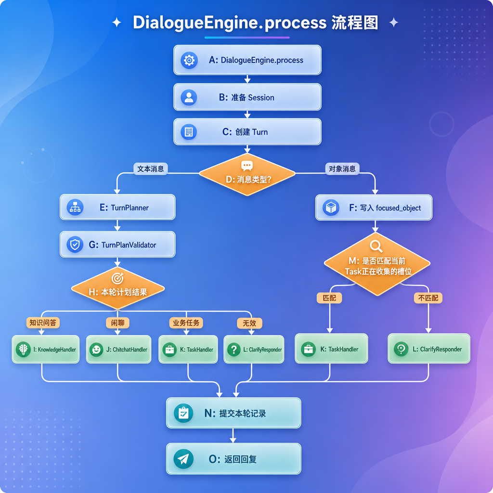


涉及组件如下：

| 组件 | 简要作用 |
| --- | --- |
| `DialogueState` | 保存会话、任务、聚焦对象和历史记录。 |
| `Turn` | 保存本轮用户输入和机器人输出。 |
| `TurnPlanner` | 根据文本消息和状态生成本轮计划。 |
| `TurnPlanValidator` | 检查本轮计划是否可靠、是否可执行。 |
| `ClarifyResponder` | 在计划不清晰时生成追问。 |
| `TaskHandler` | 处理业务任务。 |
| `KnowledgeHandler` | 处理知识问答。 |
| `ChitchatHandler` | 处理闲聊。 |

## 第2章 流程步骤细节

### 1. 准备会话

准备会话的核心问题只有一个：当前会话还能不能继续使用。

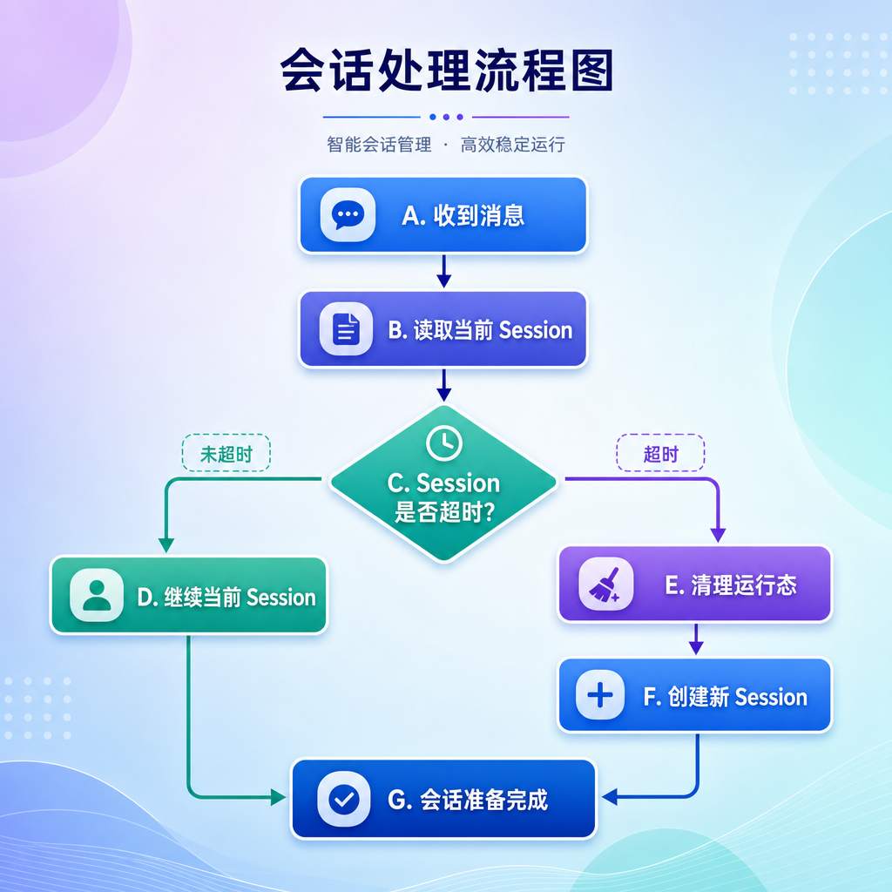

如果会话超时，引擎会清理如下状态：

| 属性 | 处理 |
| --- | --- |
| `active_task` | 清空当前业务任务。 |
| `paused_tasks` | 清空暂停任务。 |
| `active_system_task` | 清空系统流程。 |
| `focused_object` | 清空当前关注对象。 |
| `pendding_turn` | 清空缓存区 |
| `current_session_id` | 清空当前会话ID |

### 2. 创建本轮记录

一条用户消息对应一轮对话，也就是一个 `Turn`。

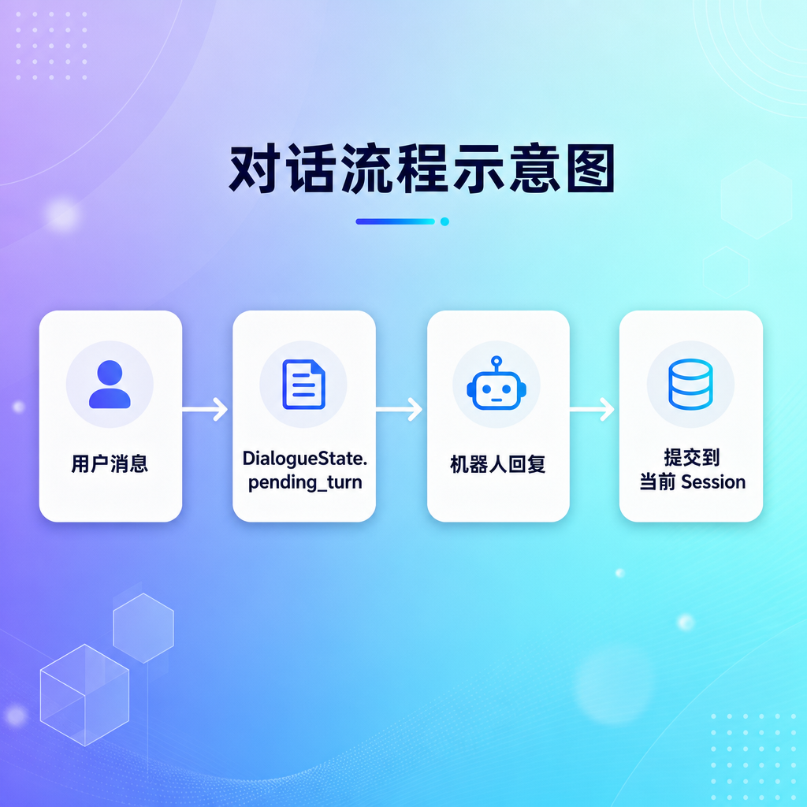

处理过程中，本轮记录暂存在 `DialogueState.pending_turn`。  
本轮结束后，再写入当前 `Session.turns`。

`Turn` 保存：

| 内容 | 说明 |
| --- | --- |
| 用户输入 | 本轮用户说了什么。 |
| 机器人输出 | 本轮系统回复了什么。 |

### 3. 判断消息类型

引擎先区分消息是文本，还是业务对象。

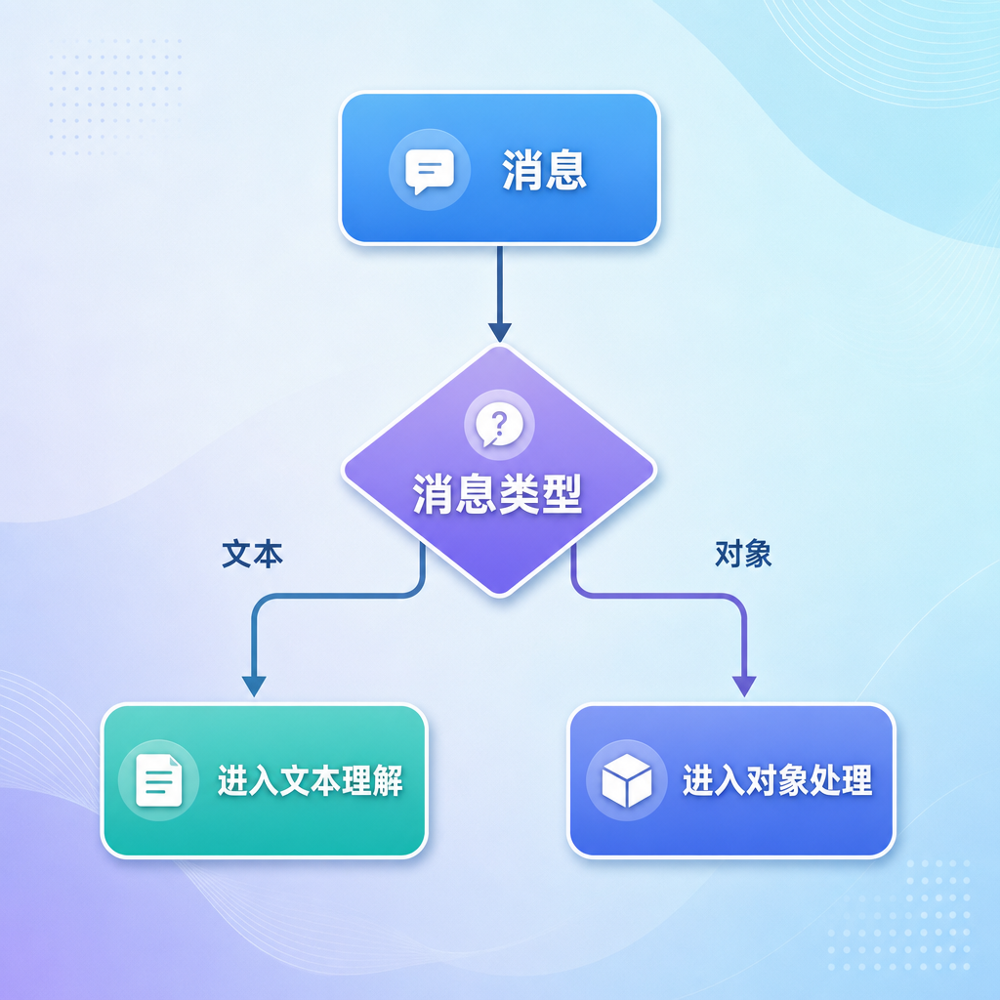

| 类型 | 例子 | 处理重点 |
| --- | --- | --- |
| 文本 | “帮我查一下物流” | 理解用户想做什么。 |
| 对象 | 用户点击了某个订单 | 记录用户当前关注的对象。 |

### 4. 处理文本消息

文本消息需要先交给 `TurnPlanner` 理解。

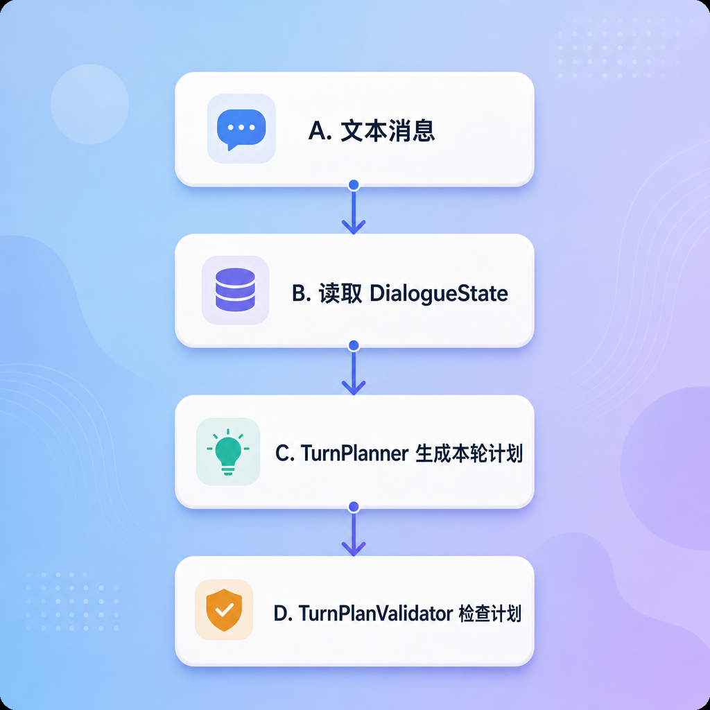

理解时会参考如下信息

| 信息 | 作用 |
| --- | --- |
| 当前对话 | 用户问题是什么 |
| 最近对话 | 避免只看一句话造成误判。 |
| `active_task` | 判断用户是否在继续上一件事。 |
| `paused_tasks` | 判断用户是否想回到之前的事。 |
| `focused_object` | 利用订单或商品上下文。 |
| `flows` | 系统支持哪些业务流程，例如查订单、查物流、推荐商品。 |
| `knowledge_intents` | 系统支持哪些知识问答意图，例如商品信息、规则政策、常见问题。 |

`TurnPlanner` 不是凭空理解用户，而是在 `flows` 和 `knowledge_intents` 的能力范围内选择最合适的处理方向。

本轮计划可以先理解成一张“处理决策单”：

| 计划方向 | 具体内容 |
| --- | --- |
| 业务任务 | 启动/恢复/取消  哪个工作流 、设置哪个槽位 |
| 知识问答 | 问哪类知识问题 |
| 闲聊 | 用户不是办业务，也不是问知识，只需要自然回复。 |

一轮计划只能选择一个主要方向。方向不明确时，就不能直接执行。

### 5. 处理对象消息

对象消息通常来自前端点击，例如订单卡片、商品卡片。

引擎会先把对象写入 `DialogueState.focused_object`。

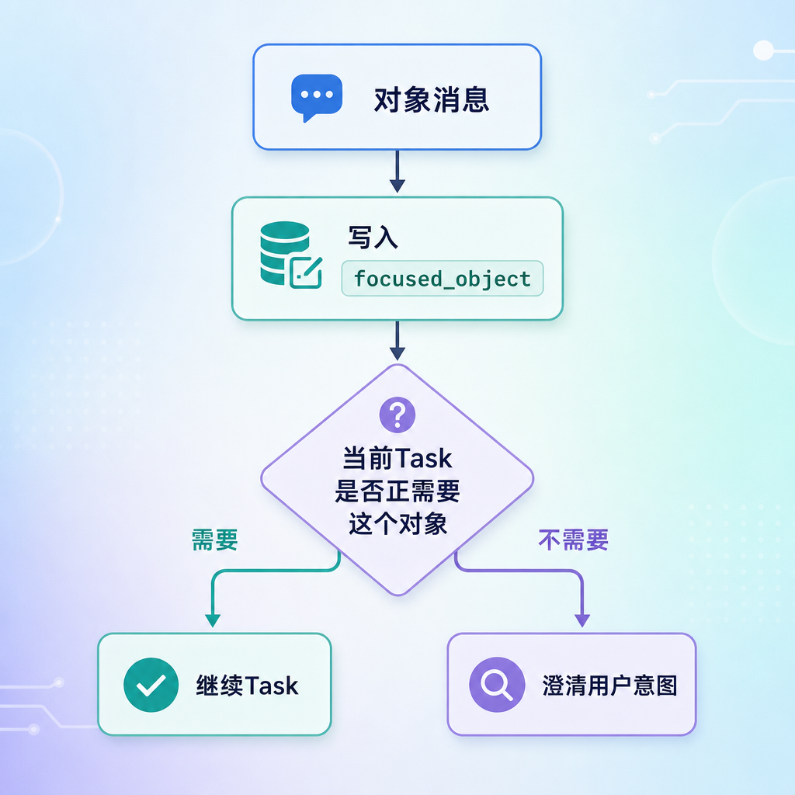

例子：

| 用户操作 | 可能含义                             |
| -------- | ------------------------------------ |
| 点击订单 | 可能想查订单状态、查物流、申请退款。 |
| 点击商品 | 可能想看商品信息、问发货、问售后。   |

如果对象刚好能补齐当前任务需要的信息，就继续业务任务。  
如果只能知道“用户点了对象”，但不知道“想做什么”，就追问。


### 6. 检查理解结果

`TurnPlanner` 的理解结果不能直接使用，需要由 `TurnPlanValidator` 检查。


常见需要澄清的情况：

| 类别         | 包含                                                 | 本质                      |
| ------------ | ---------------------------------------------------- | ------------------------- |
| 轨道层面     | `MISSING_TRACK` / `MULTIPLE_TRACKS`                  | 没选出轨道 / 选了太多轨道 |
| 轨道内容缺失 | `MISSING_TASK_COMMANDS` / `MISSING_KNOWLEDGE_INTENT` | 选对了轨道,但里面是空的   |
| 对象相关     | `MISSING_FOCUSED_OBJECT` / `OBJECT_REQUIRES_INTENT`  | 缺对象 / 只有对象没意图   |

### 7. 澄清处理

当系统无法确定用户目的时，会交给 `ClarifyResponder` 追问。

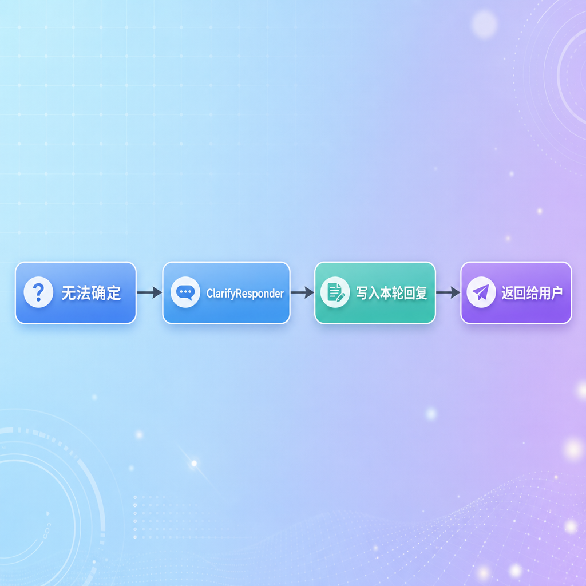

追问的目标是补齐关键信息。追问后，本轮不会继续执行业务处理。

### 8. 进入业务任务

当用户明确要办理业务时，引擎把本轮交给 `TaskHandler`。

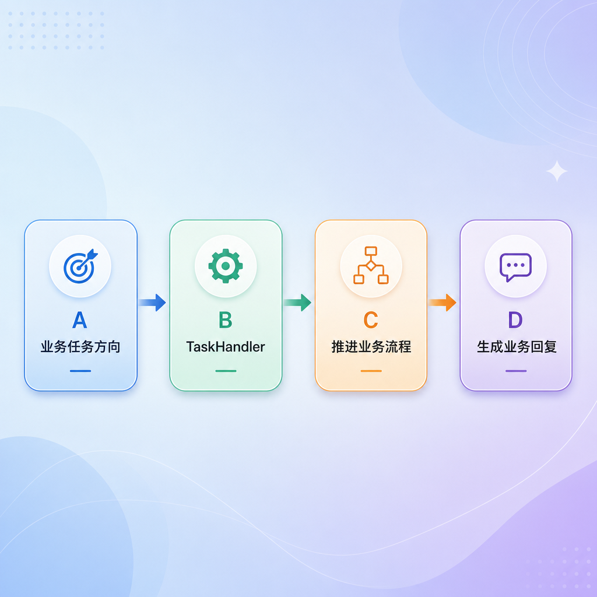

`TaskHandler` 会根据当前状态推进业务流程，并把回复写回本轮 `Turn`。  
例如查订单、查物流、推荐商品，都会走这条方向。

### 9. 进入知识问答

当用户是在问规则、政策、商品信息等问题时，引擎把本轮交给 `KnowledgeHandler`。

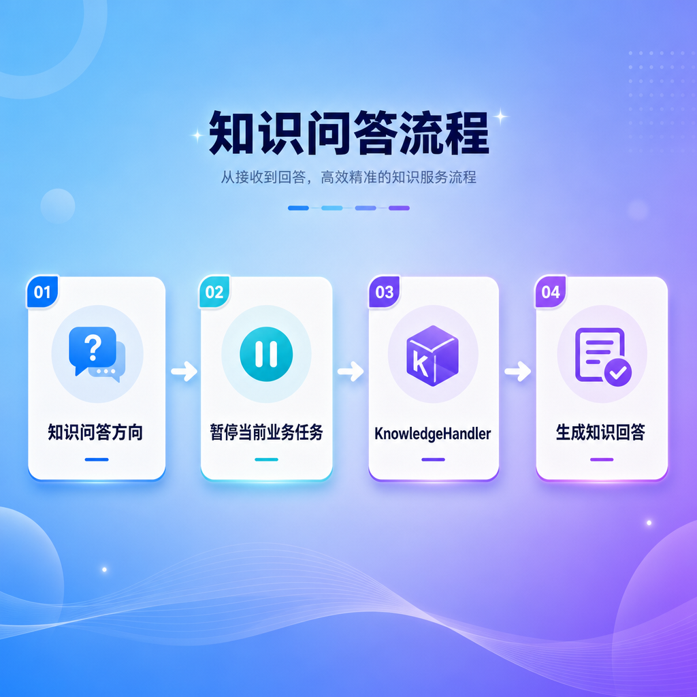

知识问答会先暂停 `active_task`，再进入 `KnowledgeHandler`。  
这样用户临时问一个问题，不会破坏原来的业务流程。

### 10. 进入闲聊

当用户只是问候或简单聊天时，引擎把本轮交给 `ChitchatHandler`。

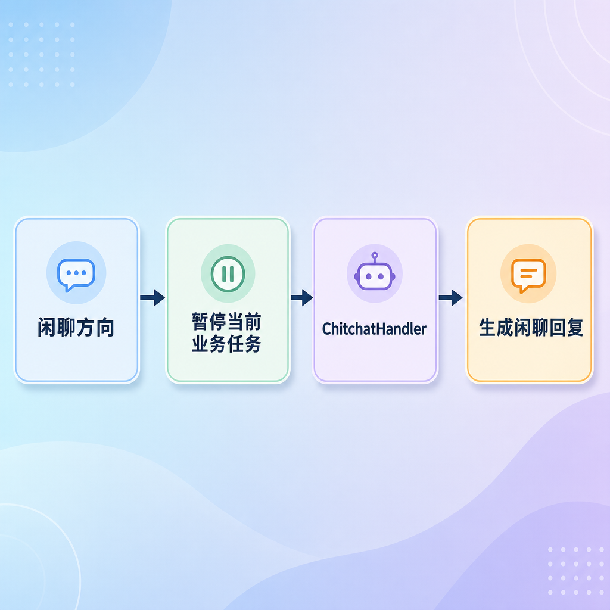

闲聊也会先暂停 `active_task`。它只生成闲聊回复，不推进业务流程。

### 11. 提交本轮记录

无论本轮是业务、知识、闲聊，还是追问，最后都要提交本轮记录。

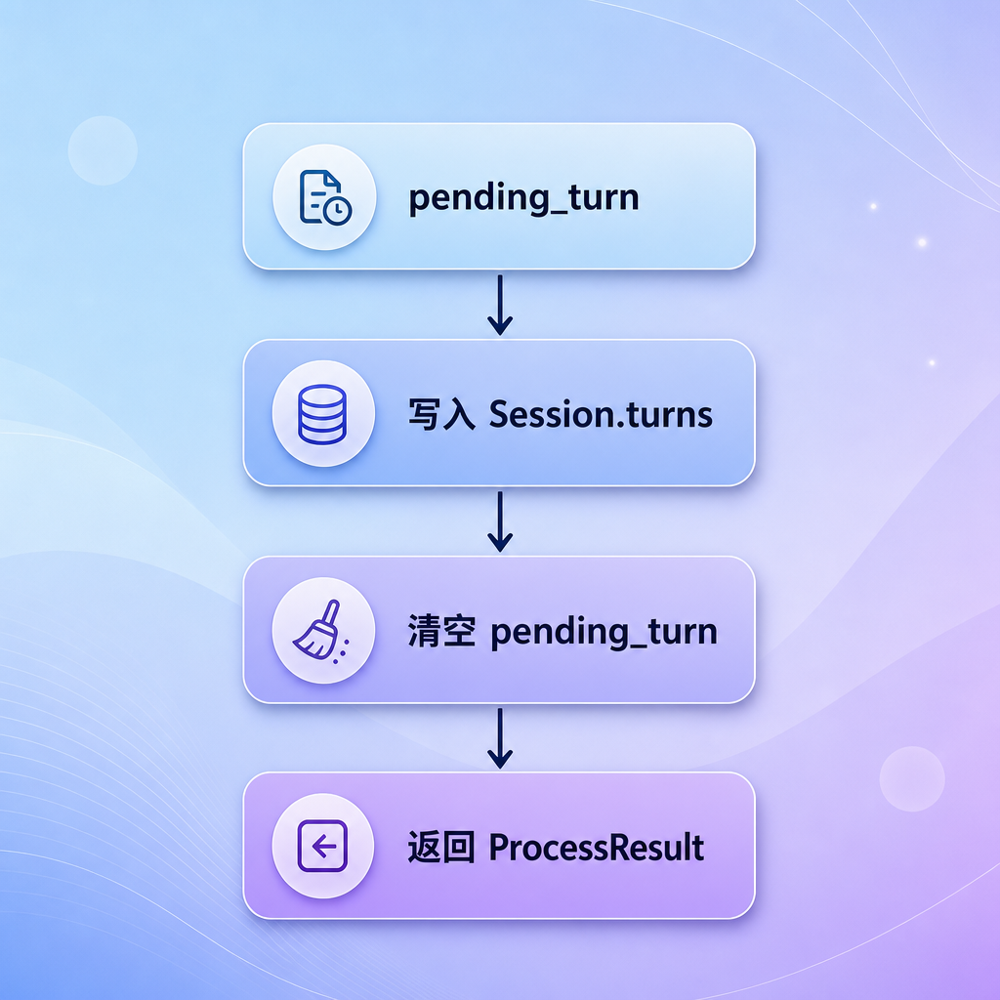

提交后，本轮就成为会话历史的一部分。返回结果包含：

| 内容 | 说明 |
| --- | --- |
| 用户 ID | 标识是谁的对话。 |
| 消息 ID | 标识是哪条消息的处理结果。 |
| 机器人回复 | 本轮要发给用户的消息。 |

## 第3章 引入 Command 后的对话处理流程

第 1 章的总览图里，我们用"业务任务"一笔带过了 `TaskHandler` 这条线——用户想办业务，就交给 `TaskHandler`。但这里其实藏了一个没说清的问题：

> `TurnPlanner` 理解完用户的话，到底**把什么**交给了 `TaskHandler`？

不可能是把用户的原话"我要退款"直接丢过去——那样 `TaskHandler` 还得自己再理解一遍。`TurnPlanner` 的价值，正是把这句自然语言**翻译成系统能直接执行的结构化指令**。这个指令，就是 `Command`。

### 3.1 Command 是什么

`TurnPlanner` 调用 LLM 后，产出的本轮计划 `TurnPlan` 里，业务任务方向装的不是一句话，而是一串 `Command`：

| 用户说法 | 翻译成的 Command |
| --- | --- |
| "我要退款" | "开启退款流程" |
| "订单号是 A001" | "把订单号填进槽位" |
| "算了不退了" | "取消当前流程" |
| "继续刚才的物流" | "恢复物流流程" |

一句话可能被拆成**多条** Command。比如"我要退款，订单号 A001"，就会被拆成两条：开启退款流程 + 填写订单号。

### 3.2 TurnPlan 的三个方向

把 `Command` 放回 `TurnPlan` 的全貌里看，本轮计划其实是三选一的"处理决策单"，每个方向携带的信息不同：

| 计划方向 | 携带内容 |
| --- | --- |
| 业务任务 `task` | 一串 `commands`（开启/恢复/取消流程、设置槽位） |
| 知识问答 `knowledge` | 一组 `intents`（问哪类知识） |
| 闲聊 `chitchat` | 无（只需自然回复） |

可以看到，业务任务方向是三者里最复杂的——它不是单一选项，而是要执行一连串动作，所以才需要 `Command` 这套指令体系来表达。

### 3.3 含 Command 的完整处理流程

把 `Command` 显式画进来，第 1 章那张总览图就能展开成下面这张更完整的流程图。重点看 `TurnPlanner` 产出 `TurnPlan` 之后，业务任务这条线是怎么靠 `Command` 串起来的：


和第 1 章的图比，这张图多说清了三件事：

1. **TurnPlanner 的产物是 `TurnPlan`**，里面分三个方向，业务任务方向装的是一串 `commands`（四种之一或组合）
2. **对象消息也会汇成 `Command`**——对象匹配到当前任务正缺的槽位时，会构造一个 `SetSlotsCommand`，和文本走的是同一个 `TaskHandler` 入口
3. **`TaskHandler` 内部由两步组成**：`CommandProcessor` 先按 commands 改状态，`FlowExecutor` 再推进流程。下一章详细讲第一步。

> 知识问答（`KnowledgeHandler`）、闲聊（`ChitchatHandler`）、校验（`TurnPlanValidator`）、对象消息处理这几条线，这一节先有个整体认识，具体实现留到后续章节。本节聚焦业务任务这条线上的 `Command`。

### 3.4 涉及组件补充

在第 1 章组件表的基础上，补充与 `Command` 相关的几项：

| 组件 | 简要作用 |
| --- | --- |
| `TurnPlan` | LLM 的产物，含 `task`(commands) / `knowledge`(intents) / `chitchat` 三方向 |
| `Command` | 业务任务的原子指令：开启/填槽/取消/恢复 |
| `CommandProcessor` | 逐条执行 `commands`，把意图翻译成 `DialogueState` 的变更 |
| `FlowExecutor` | 推进流程、执行 action、生成回复（后续章节展开） |

## 第4章 Command 步骤细节

`TurnPlanner` 把用户的业务意图翻译成一串 `Command`。这一章像第 2 章拆解流程步骤那样，把四种 `Command` 逐个拆开：每种用几句话说明它干什么，再配一张流程图看它执行后 `DialogueState` 怎么变。

### 4.1 四种 Command 一览

四种命令对应一个业务任务从开始到结束的所有用户操作：开启、填信息、取消、恢复。

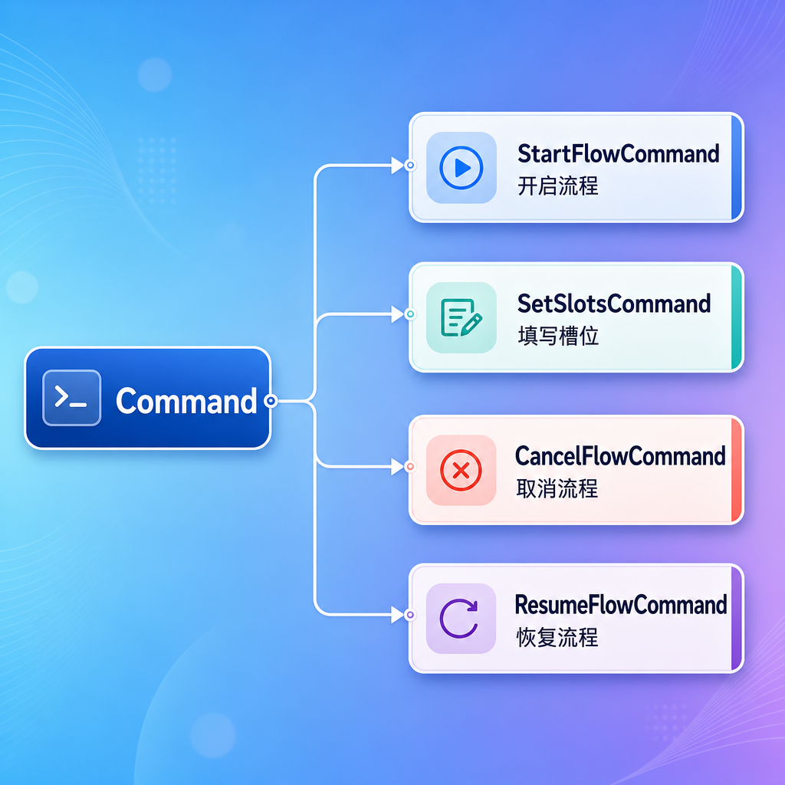

| 命令 | 对应动作 | 携带参数 |
| --- | --- | --- |
| `StartFlowCommand` | 开启一个新流程 | `flow` |
| `SetSlotsCommand` | 填写一个或多个槽位 | `slots` |
| `CancelFlowCommand` | 取消当前流程 | 无 |
| `ResumeFlowCommand` | 恢复挂起的流程 | `flow` |

四种命令统一通过 `Command.from_dict` 反序列化——读 `command` 字段、查 `COMMAND_NAME_TO_CLASS` 映射表、构造对应子类。这套"字符串 + 映射表"的多态分发，和前面 `SystemContext`、`FlowStep` 完全一致。

### 4.2 开启新流程

当用户表达"我要办某件事"时，LLM 产出这个命令，开启一个新业务流程。

携带 `flow` 字段，指明开哪个流程，如 `refund_request`。用户说"我要退款"，产出 `{"command": "start_flow", "flow": "refund_request"}`。

执行时要考虑"当前有没有正在办的任务"：如果有，先把旧任务挤进暂停栈（打断），再开新任务。


### 4.3 填写槽位

当用户提供了某项信息（订单号、退款原因等）时，LLM 产出这个命令，把信息填进当前任务。

携带 `slots` 字段，是要写入的键值对。用户说"订单号是 A001"，产出 `{"command": "set_slots", "slots": {"order_number": "A001"}}`。

执行时把这些键值合并进 `active_task.slots`。

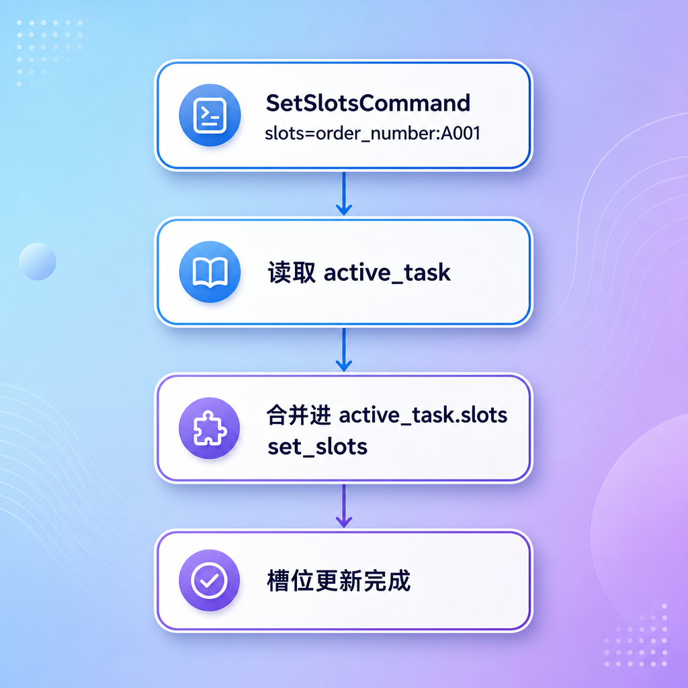

> 第 3 章提过：对象消息匹配到当前任务正缺的槽位时，引擎也会构造一个 `SetSlotsCommand`。所以文本和对象两条路，最终都通过这个命令把信息写进任务。

### 4.4 取消当前流程

当用户表达"不办了"时，LLM 产出这个命令，终止当前任务。

没有额外字段——取消的就是当前活跃任务。用户说"算了不退了"，产出 `{"command": "cancel_flow"}`。

执行时直接清空 `active_task`，**不进暂停栈**。这是和"打断"最根本的区别：取消不保留，打断可恢复。

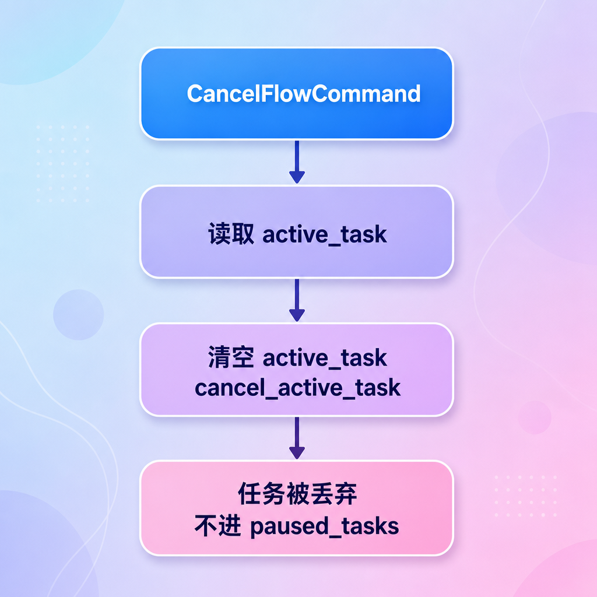

### 4.5 恢复挂起的流程

当用户表达"回到之前那件事"时，LLM 产出这个命令，把挂起的任务重新激活。

携带 `flow` 字段，指明恢复哪个挂起流程。用户说"继续刚才的退款"，产出 `{"command": "resume_flow", "flow": "refund_request"}`。

执行时从 `paused_tasks` 按 flow_id 找到对应任务，恢复为 `active_task`。因为挂起时完整保留了 `step_id` 和 `slots`，恢复后能从中断前的位置继续。

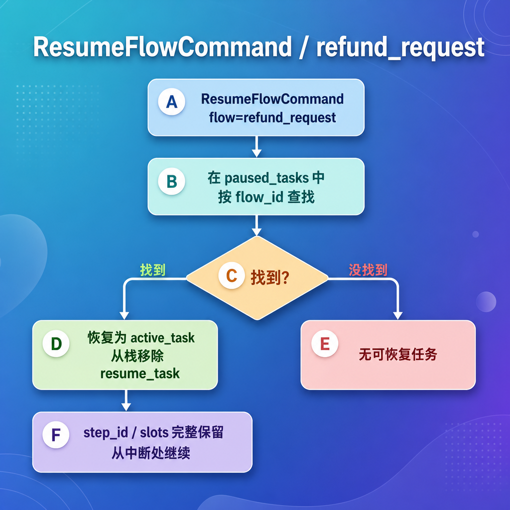

### 4.6 Command 数据模型

前面几节从"动作"角度讲清了四种命令，这里给出对应的数据模型定义：

```python
@dataclass
class Command:
    command: str

    @classmethod
    def from_dict(cls, data: dict[str, Any]) -> "Command":
        clz = COMMAND_NAME_TO_CLASS[data["command"]]
        return clz(**data)


@dataclass
class StartFlowCommand(Command):
    flow: str


@dataclass
class SetSlotsCommand(Command):
    slots: dict[str, Any]


@dataclass
class CancelFlowCommand(Command):
    pass


@dataclass
class ResumeFlowCommand(Command):
    flow: str


COMMAND_NAME_TO_CLASS = {
    "start_flow": StartFlowCommand,
    "set_slots": SetSlotsCommand,
    "cancel_flow": CancelFlowCommand,
    "resume_flow": ResumeFlowCommand,
}
```

每个子类携带的参数都对应动作的需要：开流程要说清开哪个，所以带 `flow`；填槽位要说清填什么，所以带 `slots`；取消就是取消当前的，不需要额外信息，所以是空的；恢复要说清恢复哪个挂起任务，所以带 `flow`。

### 4.7 Command 与 DialogueState 方法的对应

四种命令最终都落到 `DialogueState` 的方法上——`Command` 是 LLM 发出的**意图**，`DialogueState` 方法是**执行**：

| Command | 对应的 DialogueState 方法 |
| --- | --- |
| `StartFlowCommand` | `interrupt_active_task`（若有活跃任务）+ `start_task` |
| `SetSlotsCommand` | `set_slots` |
| `CancelFlowCommand` | `cancel_active_task` |
| `ResumeFlowCommand` | `resume_task` |

负责把一条条 `Command` 翻译成这些方法调用的，就是第 3 章图里 `TaskHandler` 内部的 **`CommandProcessor`**，它的详细实现留到讲 `TaskHandler` 那一章。
