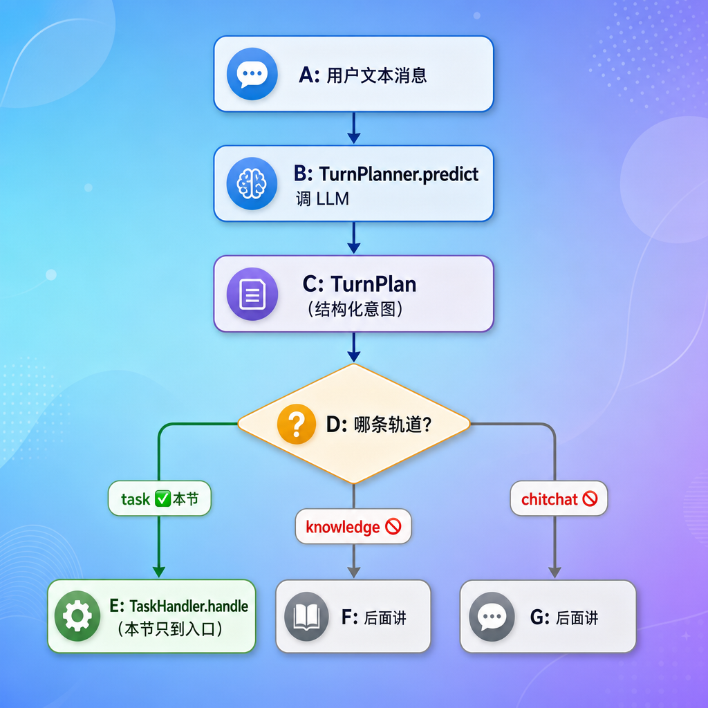
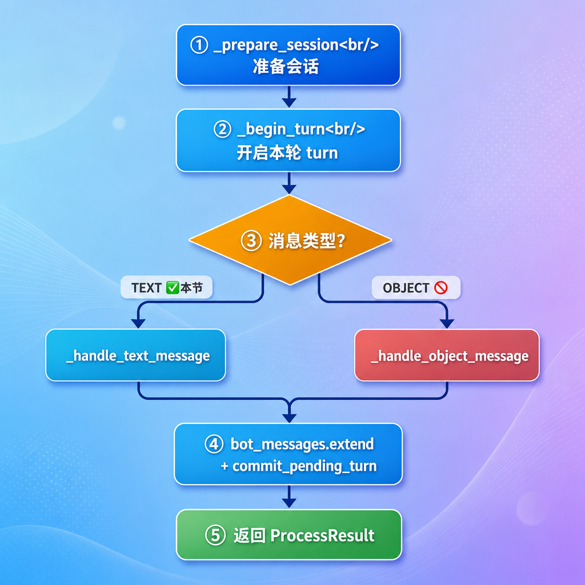
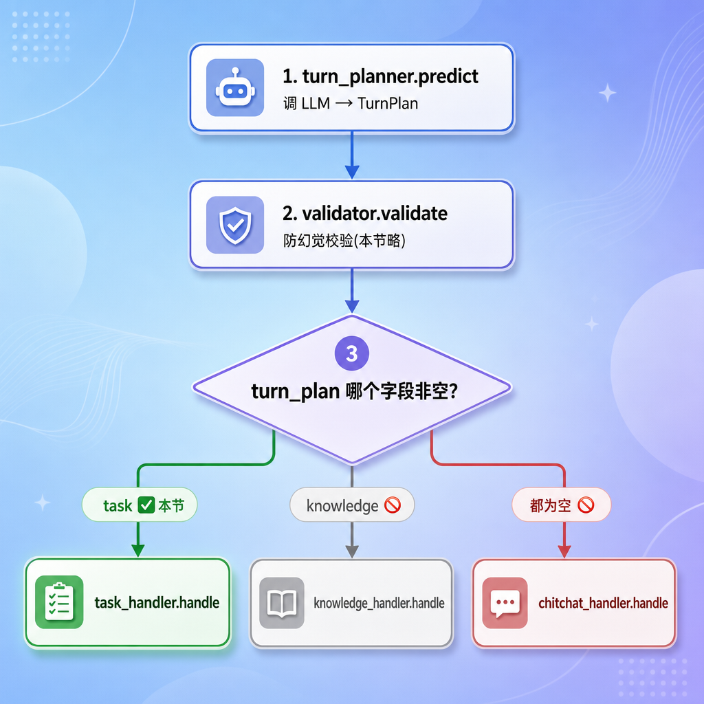
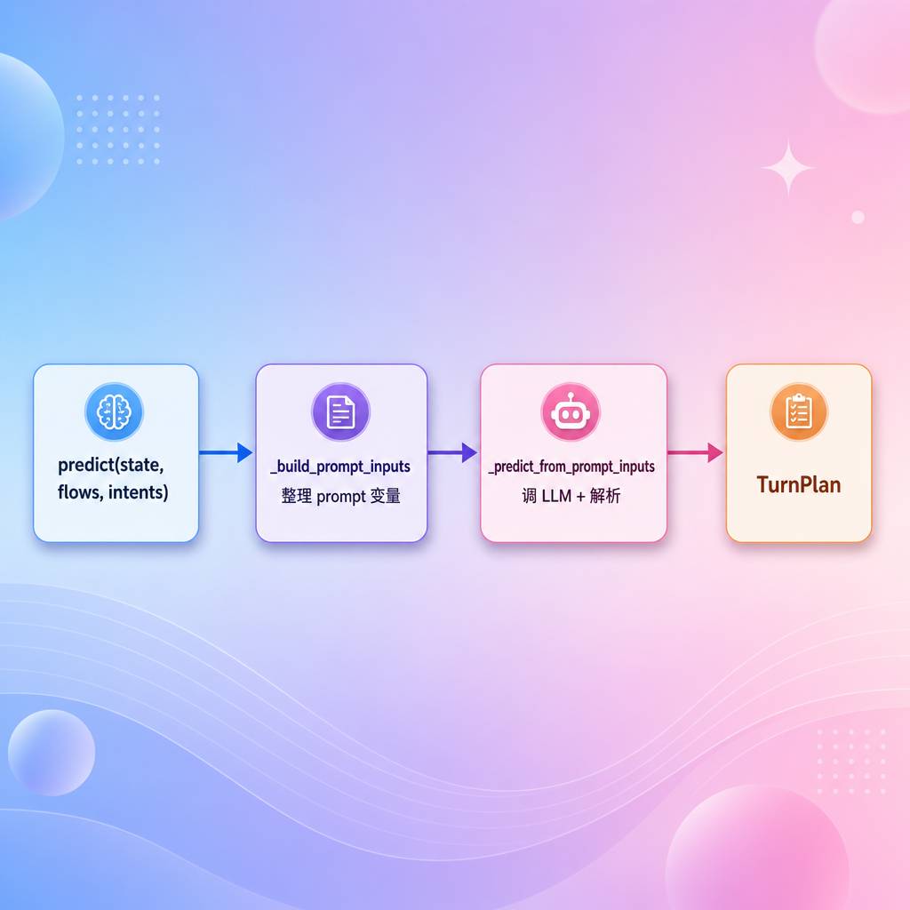
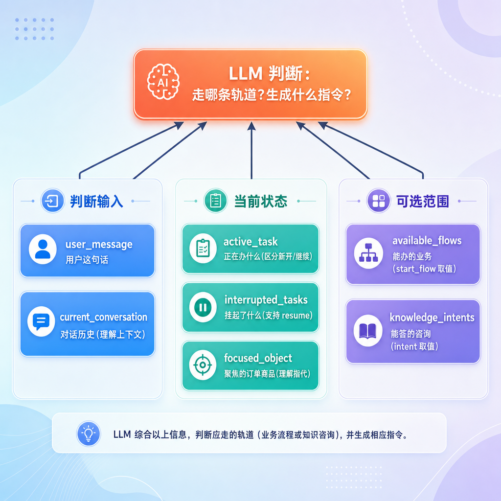
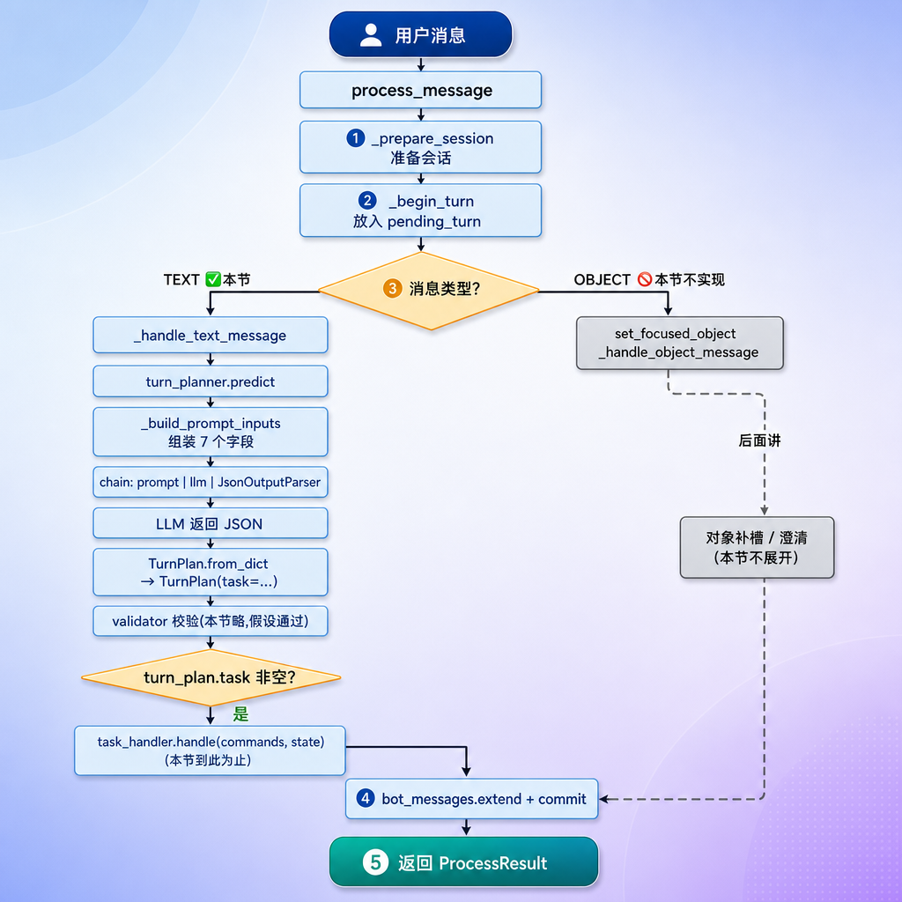

# DialogueEngine 框架与 TurnPlanner（task 轨道的 LLM 调用）

---

## 第1章 任务目标

上一节我们把 web/service/repository 三层搭好了，引擎用的是一个**占位实现**——不管用户说什么，都回一句"我已经收到你的消息了"。这一节就来把这个占位换成真正的引擎框架，并实现其中最核心的一段：**用 LLM 判断用户意图、为"办业务"这条轨道生成结构化指令**。

### 1.1 引擎要做的三件事

`DialogueEngine.process_message` 是整个对话系统的"大脑入口"。它要做三件事：

1. **理解**：用户这句话到底想干嘛？办业务（查订单、退款）、咨询信息（问政策、问商品），还是闲聊？
2. **决策**：根据理解的结果，决定走哪条处理轨道，并生成对应的"行动指令"
3. **执行**：把指令交给对应的处理器去执行，拿到回复

这一节聚焦前两件事里和**「办业务」轨道**相关的部分。

### 1.2 本节范围（重要）

这一节是引擎的"全局框架 + 一条轨道的入口"，**不是引擎的全部**。明确划一下边界：

| 内容 | 本节 |
| --- | --- |
| `process_message` 整体框架（会话准备、开 turn、收尾） | ✅ 实现 |
| 文本消息 → 调 LLM 生成 `TurnPlan` | ✅ 实现 |
| `TurnPlanner` 全局框架 + prompt 构建 | ✅ 详细实现 |
| `Command` / `TurnPlan` 数据模型设计 | ✅ 实现 |
| task 轨道：把 LLM 结果交给 `TaskHandler` | ✅ 实现**调用入口** |
| 对象消息（OBJECT）的处理 | ⛔ 后面讲 |
| 防幻觉校验（`TurnPlanValidator`） | ⛔ 后面讲 |
| knowledge / chitchat 两条轨道 | ⛔ 后面讲 |
| `TaskHandler` 内部（命令处理 + 流程推进） | ⛔ 后面讲 |

也就是说：我们这一节让"用户发一句『我要退款』→ LLM 输出 `start_flow` 指令 → 进入 task 轨道入口"这条链路通起来，但 task 轨道**内部**怎么推进流程，留到下一节。



---

## 第2章 消息处理 全局框架

先看引擎的入口方法 `process_message`，建立整体骨架，再逐段深入。

### 2.1 引擎的依赖

```python
class DialogueEngine:

    def __init__(
            self,
            turn_planner: TurnPlanner,
            task_handler: TaskHandler,
            knowledge_handler: KnowledgeHandler,
            chitchat_handler: ChitchatHandler,
            clarify_responder: ClarifyResponder,
            turn_plan_validator: TurnPlanValidator
    ) -> None:
        self.turn_planner = turn_planner
        self.task_handler = task_handler
        self.knowledge_handler = knowledge_handler
        self.chitchat_handler = chitchat_handler
        self.clarify_responder = clarify_responder
        self.turn_plan_validator = turn_plan_validator
```

引擎自己**不干活**，它持有一堆"专员"，自己只负责调度：

| 依赖 | 职责 | 本节是否展开 |
| --- | --- | --- |
| `turn_planner` | 调 LLM，把用户意图变成 `TurnPlan` | ✅ 本节重点 |
| `task_handler` | 执行 task 轨道（命令处理 + 流程推进） | 仅调用入口 |
| `knowledge_handler` | 执行 knowledge 轨道 | ⛔ |
| `chitchat_handler` | 执行 chitchat 轨道 | ⛔ |
| `clarify_responder` | 校验失败时生成澄清回复 | ⛔ |
| `turn_plan_validator` | 防幻觉校验 | ⛔ |

> 注意:流程列表归 task_handler 管，知识意图归 knowledge_handler 管，引擎只是借用。

### 2.2  消息处理 主流程

```python
async def process_message(self, state: DialogueState, user_message: UserMessage) -> ProcessResult:
    """处理一条消息，直接修改 state，返回本轮结果。"""
    # 1. 准备会话(超时检查/新建)
    self._prepare_session(state)
    # 2. 开启本轮 turn(写入 pending_turn)
    self._begin_turn(state, user_message)

    # 3. 按消息类型分流
    if user_message.type is MessageType.TEXT:
        messages = await self._handle_text_message(state=state)
    else:
        # 对象消息(本节不实现,后面讲)
        state.set_focused_object(FocusedObject.from_dict(user_message.object.to_dict()))
        messages = await self._handle_object_message(message=user_message, state=state)

    # 4. 把本轮回复写入 turn,并提交
    state.pending_turn.bot_messages.extend(messages)
    state.commit_pending_turn()

    # 5. 组装返回结果
    return ProcessResult(
        sender_id=user_message.sender_id,
        message_id=user_message.message_id,
        messages=messages,
    )
```

整个方法是五步：



回顾上一节的设计原则：引擎**直接修改传进来的 `state`**（往里写 turn、改 active_task），不做任何数据库 I/O。加载和保存都在 Service 层。这里 `process_message` 全程只读改 `state` 内存对象，正是这个原则的体现。

### 2.3 第一步 准备会话

```python
def _prepare_session(self, state: DialogueState) -> None:
    session = state.current_session()
    now = time.time()
    if session is None:
        state.start_session()
        return
    if now - session.last_activity_at > 60 * 60:
        state.close_current_session()
        state.reset_runtime_state_for_new_session()
        state.start_session()
    else:
        session.last_activity_at = now
```

这一步决定"这条消息属于哪一段会话"，三种情况：

| 情况 | 处理 |
| --- | --- |
| 当前没有会话（新用户/首次对话） | 直接开一个新会话 |
| 有会话，但距上次活动超过 60 分钟 | 关掉旧会话，重置运行时状态，开新会话 |
| 有会话，且没超时 | 复用，更新最后活动时间 |

第二种情况的"重置运行时状态"很关键：超过一小时没说话，再回来时不该还停在一小时前的半截退款流程里，所以把 active_task、paused_tasks、focused_object 都清掉，相当于"重新开始"。（这套方法在 state 那一节都讲过，这里是它们的使用现场。）

### 2.4 第二步：开启本轮对话

```python
@staticmethod
def _begin_turn(state: DialogueState, message: UserMessage) -> None:
    state.begin_turn(message)
```

调 `state.begin_turn`，把用户消息装进一个新的 `pending_turn`（暂存格子）。回顾 state 那一节讲的"两步提交"：现在先 `begin`，等本轮处理完、回复也填好了，第④步再 `commit`。中途出错就丢掉 pending_turn，不污染历史。

### 2.6 第三步分流：消息类别分流

**本节只看 TEXT**

```python
if user_message.type is MessageType.TEXT:
    messages = await self._handle_text_message(state=state)
else:
    # 对象消息分支:本节不实现
    ...
```

对象消息（用户点订单卡片那种）走 `_handle_object_message`，这一节先不碰。我们顺着 `_handle_text_message` 往下走——这才是本节的主线。

### 2.5 第四五两步：收尾

```python
state.pending_turn.bot_messages.extend(messages)   # 把本轮回复填进 turn
state.commit_pending_turn()                          # 提交:turn 进入 session 历史
return ProcessResult(
    sender_id=user_message.sender_id,
    message_id=user_message.message_id,
    messages=messages,
)
```

不管走的是文本还是对象、task 还是其它轨道，最后都汇到这里：把生成的回复填进 pending_turn，commit 落到会话历史，再包装成 `ProcessResult` 返回给 Service。

---

## 第3章 文本消息的处理

```python
async def _handle_text_message(self, state: DialogueState) -> list[BotMessage]:
    # 1. 调 LLM 生成本轮计划
    turn_plan = await self.turn_planner.predict(
        state,
        self.task_handler.flows,
        self.knowledge_handler.knowledge_intents,
    )

    # 2. 防幻觉校验(本节不实现,先理解为"假设都通过")
    validation = self.turn_plan_validator.validate(
        turn_plan, state=state,
        knowledge_intents=self.knowledge_handler.knowledge_intents,
    )
    if not validation.valid:
        return await self.clarify_responder.respond(state=state, reason=validation.reason)

    # 3. 按轨道分发
    if turn_plan.task is not None:
        return await self.task_handler.handle(
            commands=turn_plan.task.commands,
            state=state,
        )
    elif turn_plan.knowledge is not None:
        if state.active_task:
            state.interrupt_active_task()
        return await self.knowledge_handler.handle(
            state=state, intents=turn_plan.knowledge.intents,
        )

    # chitchat 兜底
    if state.active_task:
        state.interrupt_active_task()
    return await self.chitchat_handler.handle(state=state)
```

这段是引擎的"决策中枢"，三步：



本节我们把注意力放在**第 1 步（怎么调 LLM 生成 TurnPlan）**和**第 3 步的 task 分支（怎么把结果交给 TaskHandler）**。第 2 步校验、knowledge/chitchat 分支，都先当成"已经存在、暂不展开"。

### 3.1 "伪装校验已通过"

你可能会问：校验都没实现，第 3 步直接用 `turn_plan.task` 安全吗？

短期是安全的——只要 LLM 表现正常、输出合法的 task 计划，第 3 步就能正常走。校验（`TurnPlanValidator`）解决的是 LLM **出幻觉**时的兜底（比如编了一个不存在的 flow）。我们这一节先让"正常路径"通起来，把"异常路径"的防护留到讲校验那一节补。这也符合一贯的开发节奏：**先打通主干，再加固边界**。

---

## 第4章 设计数据模型

在看 `TurnPlanner` 怎么调 LLM 之前，必须先搞清楚它的**产出物**长什么样——也就是 `TurnPlan` 和 `Command` 这两组数据模型。LLM 的输出会被解析成它们。

### 4.1 TurnPlan概念

`TurnPlanner` 负责根据用户当前输入和对话状态，生成本轮对话计划 `TurnPlan`。

### 4.2 TurnPlan JSON

LLM 输出的 `TurnPlan` 是一个 JSON 对象(提示词中约束)，顶层固定包含三个字段：

```json
{
  "task": null,
  "knowledge": null,
  "chitchat": null
}
```

如果用户是在办理业务，填写 `task`：

```json
{
  "task": {
    "commands": [
      {"command": "start_flow", "flow": "refund_request"}
    ]
  },
  "knowledge": null,
  "chitchat": null
}
```

如果用户是在咨询知识，填写 `knowledge`：

```json
{
  "task": null,
  "knowledge": {
    "intents": ["refund_policy"]
  },
  "chitchat": null
}
```

如果用户是在闲聊，填写 `chitchat`：

```json
{
  "task": null,
  "knowledge": null,
  "chitchat": {}
}
```

如果用户一句话同时表达多个意图，LLM 也可以同时填写多个轨道：

```json
{
  "task": {
    "commands": [
      {"command": "start_flow", "flow": "refund_request"}
    ]
  },
  "knowledge": {
    "intents": ["refund_policy"]
  },
  "chitchat": null
}
```

> 注意：当然多意图 `TurnPlan` 最后会被 `TurnPlanValidator` 认定为当前引擎不能直接执行，然后引导**用户澄清**先处理哪一个。

### 4.3 TurnPlan数据模型

有了TurnPlan的JSON分析，因此我们就可以定义一个具体的数据模型与 JSON 对应。

```python
@dataclass(slots=True)
class TurnPlan:
    task: TaskTurnPlan | None = None
    knowledge: KnowledgeTurnPlan | None = None
    chitchat: ChitchatTurnPlan | None = None

    @classmethod
    def from_dict(cls, data: dict) -> "TurnPlan":
        return cls(
            task=TaskTurnPlan.from_dict(data["task"]) if data.get("task") is not None else None,
            knowledge=KnowledgeTurnPlan.from_dict(data["knowledge"]) if data.get("knowledge") is not None else None,
            chitchat=ChitchatTurnPlan() if data.get("chitchat") is not None else None,
        )
```

`TurnPlan` 就是 LLM 这一轮的"决策结果"，三个字段对应三条轨道，**每个要么是对应的计划对象、要么是 `None`**：

| 字段 | 非空表示 |
| --- | --- |
| `task` | 用户在办业务，里面装一串 `commands` |
| `knowledge` | 用户在咨询信息，里面装 `intents` |
| `chitchat` | 用户在闲聊 |

正常情况下只有一个字段非空。如果 LLM 觉得用户同时表达了多个意图，可能填多个——那就是校验那一节要处理的"多轨道"情况。

#### 4.3.1 三个具体轨道的TurnPlan

上面的 `TurnPlan` 只是个"外壳"——它用 `task` / `knowledge` / `chitchat` 三个字段告诉我们**走哪条轨道**,但每条轨道**具体要做什么**,还得各自展开。

回想前面的三个 JSON 就能看出来,三条轨道携带的信息量完全不同:

```json
"task":      { "commands": [...] }    // 办业务:要执行一串命令
"knowledge": { "intents": [...] }     // 咨询:要命中一个或多个知识意图
"chitchat":  {}                        // 闲聊:什么参数都不需要
```

- 办业务最复杂——用户可能"开流程"、可能"填槽位"、可能"取消",所以要装一串 `commands`
- 咨询次之——只需要知道用户问的是哪类信息,装一个 `intents` 列表
- 闲聊最简单——不需要任何参数,空对象即可

所以这三个字段不能用同一种类型,得各自定义一个数据模型来承载各自的信息:

```python
@dataclass
class TaskTurnPlan:
    commands: list[Command] = field(default_factory=list)

    @classmethod
    def from_dict(cls, data: dict) -> "TaskTurnPlan":
        return cls(commands=[Command.from_dict(command) for command in data["commands"]])


@dataclass
class KnowledgeTurnPlan:
    intents: list[str] = field(default_factory=list)

    @classmethod
    def from_dict(cls, data: dict) -> "KnowledgeTurnPlan":
        return cls(intents=data["intents"])


@dataclass
class ChitchatTurnPlan:
    pass
```

| 轨道模型            | 装什么                          | 对应 JSON             |
| ------------------- | ------------------------------- | --------------------- |
| `TaskTurnPlan`      | 一个 `Command` 列表（本节重点） | `{"commands": [...]}` |
| `KnowledgeTurnPlan` | 一个意图字符串列表              | `{"intents": [...]}`  |
| `ChitchatTurnPlan`  | 空（闲聊不需要参数）            | `{}`                  |

注意它们的 `from_dict` 也对应了复杂度差异:`TaskTurnPlan` 还要把每个 command 字典再 `Command.from_dict` 一层（因为 command 本身也是结构化的）;`KnowledgeTurnPlan` 直接取列表即可;`ChitchatTurnPlan` 连 `from_dict` 都不用写（空对象，`TurnPlan.from_dict` 里直接 `ChitchatTurnPlan()` 构造）。

这一节我们只深入 `TaskTurnPlan` 里的 `commands`——它是办业务轨道的核心，下面专门讲。


### 4.4 Command

`task` 轨道的核心是 `commands`。这是本节最重要的数据模型——它是 LLM 对"用户想办的业务任务"的**结构化**表达。

先想一个问题:**用户在办业务的过程中,到底会做哪些动作?**

把前面几节出现过的对话场景回顾一遍,会发现用户的动作其实就那么几类:

```
用户:我要退款                    ← 动作:开启一个新业务
用户:订单号是 A001               ← 动作:为当前业务提供一项信息
用户:算了不退了                  ← 动作:放弃当前业务
用户:继续刚才的物流查询          ← 动作:重新拾起之前搁置的业务
```

这四类动作,恰好覆盖了一个任务从"开始"到"结束"会经历的所有用户操作:发起、补充信息、中途放弃、回头继续。我们要做的,就是把用户这些**自然语言动作**,翻译成系统能执行的**结构化指令**——这就是 `Command`。

可以这样理解 `Command`:它是办理业务的"原子指令",一句用户的话,会被 LLM 拆解成一条或多条这样的指令。比如"我要退款,订单号 A001"这一句,就可能被拆成两条:开启退款流程 + 填写订单号。

#### 4.4.1 四种具体Command格式

启动任务：

```json
{"command": "start_flow", "flow": "refund_request"}
```

填写信息(写入槽位)：

```json
{"command": "set_slots", "slots": {"order_number": "10001"}}
```

取消任务：

```python
{"command": "cancel_flow"}
```

恢复任务：

```python
{"command": "resume_flow", "flow": "refund_request"}
```

#### 4.4.2 四种具体的Command模型

```python
@dataclass
class Command:
    command: str

    @classmethod
    def from_dict(cls, data: dict[str, Any]) -> "Command":
        clz = COMMAND_NAME_TO_CLASS[data["command"]]
        return clz(**data)


@dataclass
class StartFlowCommand(Command):
    flow: str


@dataclass
class SetSlotsCommand(Command):
    slots: dict[str, Any]


@dataclass
class CancelFlowCommand(Command):
    pass


@dataclass
class ResumeFlowCommand(Command):
    flow: str


COMMAND_NAME_TO_CLASS = {
    "start_flow": StartFlowCommand,
    "set_slots": SetSlotsCommand,
    "cancel_flow": CancelFlowCommand,
    "resume_flow": ResumeFlowCommand,
}
```

四种命令,正好对应刚才分析的四类用户动作:

| 命令 | 含义 | 用户说法举例 |
| --- | --- | --- |
| `StartFlowCommand` | 开启一个新流程 | "我要退款" |
| `SetSlotsCommand` | 填写一个或多个槽位 | "订单号是 A001" |
| `CancelFlowCommand` | 取消当前流程 | "算了不退了" |
| `ResumeFlowCommand` | 恢复之前挂起的流程 | "继续刚才的退款" |

注意每个子类**携带的参数**也对应着动作的需要:

- 开流程要说清"开哪个",所以 `StartFlowCommand` 带 `flow`
- 填槽位要说清"填什么",所以 `SetSlotsCommand` 带 `slots`
- 取消就是取消当前的,不需要额外信息,所以 `CancelFlowCommand` 是空的
- 恢复要说清"恢复哪个挂起的",所以 `ResumeFlowCommand` 带 `flow`

> 这四个命令是不是觉得眼熟?它们正好和 state 那一节 `DialogueState` 的几个方法对应:`start_task` / `set_slots` / `cancel_active_task` / `resume_task`。这不是巧合——`Command` 是 LLM 发出的"意图",而 `DialogueState` 的方法是"执行"。中间负责把命令翻译成状态变更的,就是后面要讲的 `CommandProcessor`。

#### 4.4 Command.from_dict 

注意 `Command.from_dict` 又是我们熟悉的那个套路——**用映射表做多态分发**：

```python
@classmethod
def from_dict(cls, data: dict[str, Any]) -> "Command":
    clz = COMMAND_NAME_TO_CLASS[data["command"]]   # 按 command 字段查表
    return clz(**data)                              # 用对应子类构造
```

LLM 输出 `{"command": "set_slots", "slots": {...}}`，`from_dict` 读出 `"set_slots"`，查表得到 `SetSlotsCommand`，再 `SetSlotsCommand(**data)` 构造。

> 这和前面 `SystemContext` 的 `FLOW_ID_TO_CONTEXT_CLASS`、`FlowStep` 的 `STEP_TYPE_TO_CLASS` 完全一脉相承。看到"一个字符串字段 + 一张映射表"，就该立刻反应过来这是多态反序列化。

### 4.5 从 LLM 输出到对象

假设用户说"我要退款"，LLM 应该输出：

```json
{
  "task": {
    "commands": [
      {"command": "start_flow", "flow": "refund_request"}
    ]
  },
  "knowledge": null,
  "chitchat": null
}
```

经过 `TurnPlan.from_dict`，变成：

```python
TurnPlan(
    task=TaskTurnPlan(commands=[StartFlowCommand(command="start_flow", flow="refund_request")]),
    knowledge=None,
    chitchat=None,
)
```

引擎拿到这个 `TurnPlan`，看到 `task` 非空，就把 `commands` 交给 `TaskHandler`。

再看一个用户在流程中途提供信息的例子。用户说"订单号是 A001"：

```json
{
  "task": {
    "commands": [
      {"command": "set_slots", "slots": {"order_number": "A001"}}
    ]
  },
  "knowledge": null,
  "chitchat": null
}
```

经过 `TurnPlan.from_dict`，变成：

```python
TurnPlan(
    task=TaskTurnPlan(commands=[
        SetSlotsCommand(command="set_slots", slots={"order_number": "A001"})
    ]),
)
```

理解了产出物长什么样，现在可以看 `TurnPlanner` 是怎么"生产"出它的了。

---

## 第5章 TurnPlanner 全局框架

`TurnPlanner` 的职责一句话：**把当前对话状态喂给 LLM，让 LLM 输出一个 `TurnPlan`**。

### 5.1 入口 

```python
class TurnPlanner:
    async def predict(
            self,
            state: DialogueState,
            flows: FlowsList,
            knowledge_intents: dict[str, KnowledgeIntent],
    ) -> TurnPlan:
        prompt_inputs = self._build_prompt_inputs(state, flows, knowledge_intents)
        return await self._predict_from_prompt_inputs(prompt_inputs)
```

`predict` 接收三样东西：

| 入参 | 是什么 |
| --- | --- |
| `state` | 当前对话状态（含历史、活跃任务、聚焦对象等） |
| `flows` | 系统支持的所有流程（告诉 LLM 有哪些业务可办） |
| `knowledge_intents` | 系统支持的所有知识意图（告诉 LLM 能回答哪类咨询） 暂不实现 |

它只做两件事：

1. `_build_prompt_inputs`：把这三样东西**整理成给 LLM 的提示词变量**（本章重点）
2. `_predict_from_prompt_inputs`：拿提示词变量**调 LLM**，把输出解析成 `TurnPlan`



### 5.2 调用 LLM

```python
async def _predict_from_prompt_inputs(self, prompt_inputs: dict[str, Any]) -> TurnPlan:
    prompt_text = load_prompt("turn_plan")
    prompt = PromptTemplate.from_template(prompt_text, template_format="jinja2")

    chain = prompt | llm | JsonOutputParser()
    llm_output = await chain.ainvoke(prompt_inputs)
    return TurnPlan.from_dict(llm_output)
```

这里用了 LangChain 的链式写法，三个环节串成一条流水线：

```text
prompt(模板) | llm(大模型) | JsonOutputParser(解析成字典)
```

| 环节 | 做什么 |
| --- | --- |
| `prompt` | 把 `prompt_inputs` 里的变量填进 jinja2 模板，渲染成最终提示词 |
| `llm` | 把渲染好的提示词发给大模型，拿到文本回复 |
| `JsonOutputParser` | 把模型返回的 JSON 文本解析成 Python 字典 |

最后 `TurnPlan.from_dict(llm_output)` 把字典变成 `TurnPlan` 对象。

- `load_prompt("turn_plan")`：从 prompt 目录读取 `turn_plan.jinja2` 模板文本
- `template_format="jinja2"`：告诉 LangChain 用 jinja2 语法渲染（模板里用 `{{ }}` 取变量）
- `await chain.ainvoke(...)`：异步调用，因为 LLM 请求是高延迟 I/O，必须 async

### 5.3 核心：构建提示词输入

`TurnPlanner` 最关键的一步，是把当前的对话状态整理成提示词，喂给 LLM。这里有一个绕不开的问题：

> **到底该把哪些信息塞进提示词？**

给少了，LLM 缺乏判断依据，容易答错；给多了，既浪费 token，又可能用无关信息干扰它。所以这一步的设计，本质是回答"LLM 要做这道判断题，最少需要哪些 **做题材料**"。

LLM 这道判断题是：**用户这句话该走哪条轨道、生成什么指令？** 下面我们一项一项分析它需要什么。分析完，自然就知道 `_build_prompt_inputs` 这个方法该返回哪些字段了——所以我们把完整代码留到本章最后，先逐个论证每个字段的必要性。


## 第6章 提示词分析

LLM 要做一道"判断题"：用户这句话该走哪条轨道、生成什么指令。要判断得准，它必须掌握足够的"案情"。下面这 7个字段，就是我们递给 LLM 的"案卷材料"。我们逐个分析，每个都结合具体场景说明**不传会出什么问题**；全部分析完，在用一个方法把它们打包收口。

### 6.0 HistoryBuilder

7 个字段里，有两个和"消息文本化"有关——`user_message`（用户这句话）和 `current_conversation`（对话历史）。它们都用到同一个工具类 `HistoryBuilder`，所以先单独认识它。

问题的起点是：`state` 里存的消息是 `UserMessage` / `BotMessage` **对象**，而塞进 prompt 的必须是**纯文本**。中间需要一层"把消息对象渲染成文本"的转换，这就是 `HistoryBuilder` 干的事。

它提供两个我们会用到的方法：

| 方法                        | 作用                               | 用在哪个字段                  |
| --------------------------- | ---------------------------------- | ----------------------------- |
| `_render_user_message(msg)` | 把**一条**用户消息渲染成文本       | `user_message`（6.1）         |
| `build(turns)`              | 把**一串** turn 渲染成整段对话记录 | `current_conversation`（6.2） |

渲染规则也很直观：

- 文本消息：直接取 `text`，比如 `"我要退款"`
- 对象消息：渲染成一段描述，比如 `[订单对象 id=A20240315001, title=小米手机]`——因为 LLM 看不懂 Python 对象，必须把对象的关键信息摊成它能读的文字

> `HistoryBuilder` 的完整实现（怎么遍历 turn、怎么拼接 USER/BOT 前缀）属于 prompt 工具的细节，这里只需知道"它负责把消息对象转成 LLM 能读的文本"。用到时我们直接调。

### 6.1 user_message

用户当前说的这句话——**这是判断的核心输入**,没有用户这句话，LLM 无从判断。`HistoryBuilder._render_user_message` 把消息渲染成文本（文本消息直接取 text，对象消息渲染成 `[订单对象 id=...]` 这种描述）。

```python
user_message = HistoryBuilder._render_user_message(state.pending_turn.user_message)
```

对应模板：

```
## 当前任务
请根据用户最后一句话生成 TurnPlan：
"""{{ user_message }}"""
```

> 注意它取的是 `state.pending_turn.user_message`——也就是 `begin_turn` 刚放进暂存格子的那条消息。

### 6.2 current_conversation

对话历史——很多用户的话**脱离上下文就没法理解**，看这个场景：

```
USER: 我要退款
BOT: 请告诉我你的订单号。
USER: A20240315001          ← 当前这句
```

如果只把"A20240315001"丢给 LLM，它根本不知道这串数字是什么——是订单号？快递单号？还是用户随口报的一个数？

但如果带上历史，LLM 一看：上一句机器人在问订单号，那用户这句"A20240315001"显然就是**在回答订单号**，应该生成 `set_slots` 命令把它填进 `order_number` 槽位

再看一个更明显的：

```
USER: 帮我查下物流
BOT: 请告诉我你的订单号。
USER: 算了              ← 当前这句
```

光看"算了"无法判断意图。带上历史，LLM 才知道用户是想**取消刚才的物流查询**（`cancel_flow`）。

**结论**：对话历史让 LLM 具备"上下文记忆"，能正确理解那些依赖前文的回单。这正是多轮对话的基础。

```
history = HistoryBuilder.build(state.current_session().turns)
```

对应模板：

```json
## 对话历史
{{ current_conversation }}
```

`HistoryBuilder.build` 把当前会话的已完成 turn 渲染成一段"对话记录"，形如：

```
USER: 我要退款
BOT: 请告诉我你的订单号。
```

### 6.3 available_flows_json

**有哪些业务可办**——LLM 要生成开启业务流程时 `start_flow` 命令时，必须要知道到底开启哪个业务流程，必须填一个 `flow` 字段，比如 `{"command": "start_flow", "flow": "refund_request"}`。这个 `"refund_request"` 从哪来？**只能从我们告诉它的可用流程列表里选**。

如果不传 available_flows，LLM 就只能**靠猜**编一个 flow id——可能编成 `"refund"`、`"tuikuan"`、`"refund_flow"`，全都和我们 YAML 里定义的 `refund_request` 对不上，下游一查表就 `KeyError`。

传了之后，LLM 就有了一份"业务菜单"，它会从菜单里挑一个**确实存在**的 flow id 填进去。同时，`description` 还帮助 LLM 判断**用户的话该匹配哪个流程**——用户说"我想退货退钱"，LLM 看 description 就知道该匹配 `refund_request` 而不是 `logistics_tracking`。

**结论**：available_flows 是 LLM 开启业务流程 的"合法取值范围"+"匹配依据"。不传它，LLM 只能瞎编 flow id。


```json
"available_flows_json": json.dumps(
    {
        "flows": [{k: v for k, v in asdict(flow).items() if k != "steps"} for flow in _flows]
    },
    ensure_ascii=False,
),
```

对应模板：

```
可用 flows：
{{ available_flows_json }}
```

它把所有流程序列化成 JSON 给 LLM。注意那个 `if k != "steps"`——**故意去掉了 steps 字段**。

**为什么去掉 steps**：LLM 在这一步只需要知道"有哪些业务、每个业务是干嘛的、需要哪些槽位"，**不需要知道每个流程内部的步骤怎么走**（那是 FlowExecutor 的事）。steps 内容又大又细，传给 LLM 既浪费 token，又可能干扰它的判断。所以只传 `id` / `name` / `description` / `slots` 这些"业务说明书"级别的信息。

去掉 steps 后，给 LLM 的大致长这样：

```json
{
  "flows": [
    {"id": "refund_request", "name": "退款申请", "description": "帮用户提交退款申请...", "slots": [...]},
    {"id": "logistics_tracking", "name": "物流查询", "description": "帮用户查询物流...", "slots": [...]},
    {"id": "order_status_query", "name": "订单状态查询", "description": "...", "slots": [...]}
  ]
}
```

### 6.4 active_task_json

**当前正在办的业务**——同一句话，在"有没有活跃任务"两种情况下，意图可能完全不同。看这个对比：

**情况 A：没有活跃任务**

```json
(active_task = null)
USER: A20240315001
```

用户没头没脑报了个订单号。LLM 看到没有活跃任务，会判断这句话意图不明（可能走澄清）。

**情况 B：有活跃任务，正停在收集订单号那一步**

```json
(active_task = {"flow_id": "refund_request", "step_id": "ask_order_number", "slots": {}})
USER: A20240315001
```

同样一句"A20240315001"，LLM 看到当前正在办退款、而且正停在"问订单号"这一步，立刻就明白：用户是在**回答订单号**，该生成 `set_slots` 把它填进去

再看一个场景，理解"是新开还是继续"：

```
(active_task = {"flow_id": "refund_request", "step_id": "ask_refund_reason", "slots": {"order_number": "A001"}})
USER: 因为尺码不合适
```

LLM 看到当前退款流程已经收集了订单号、正停在问退款原因，就知道"尺码不合适"是**退款原因**（`set_slots` refund_reason），而不是要开一个新流程。

**结论**：active_task 告诉 LLM "用户现在进行到哪了"。同一句话在不同任务状态下意图不同，这个字段让 LLM 能区分"用户在回答当前流程的问题"还是"要开启新业务"。

```json
"active_task_json": json.dumps(
    asdict(active_task) if active_task is not None else None,
    ensure_ascii=False,
),
```

对应模板：

```json
### Active Task
{{ active_task_json }}
```

它把当前活跃任务（`TaskContext`：flow_id + step_id + slots）序列化给 LLM。没有活跃任务就是 `null`。

### 6.5 interrupted_tasks_json

**被挂起的业务**——这个字段是 LLM 生成 `resume_flow` 命令的依据。

LLM 要知道"有哪些任务被挂起、后面恢复的时候才能知道去恢复哪个"，如果不传这个字段，LLM 根本不知道"有哪些任务被挂起、能恢复哪个"，就没法正确生成 `resume_flow`，或者会编一个根本不在挂起栈里的 flow。

```
(paused_tasks = [
   {"flow_id": "order_status_query", ...},
   {"flow_id": "logistics_tracking", ...}
 ])
(active_task = {"flow_id": "refund_request", ...})
USER: 先不退了,继续看物流吧
```

用户说"继续看物流"。LLM 要生成 `resume_flow` 命令时，得填 `{"command": "resume_flow", "flow": "?"}`——这个 flow 填什么？**只能从挂起列表里选**。

LLM 看到 interrupted_tasks 里有 `logistics_tracking`，就知道"看物流"对应的是这个挂起的任务，生成 `{"command": "resume_flow", "flow": "logistics_tracking"}`。

**结论**：interrupted_tasks 是 LLM 生成 `resume_flow` 的"可恢复范围"。它让 LLM 知道用户"刚才还有哪些事没办完、现在想接着办哪件"。

```json
"interrupted_tasks_json": json.dumps(
    [asdict(task) for task in state.paused_tasks],
    ensure_ascii=False,
),
```

对应模板：

```json
### Interrupted Tasks
{{ interrupted_tasks_json }}
```

它把暂停任务栈（`paused_tasks`）序列化给 LLM。

### 6.6 focused_object_json

**用户聚焦的订单/商品**——这个字段是让 LLM 理解用户话里的指代，并能利用已知的订单/商品信息减少不必要的追问。

用户在前端点了某个订单卡片，后端把它记成 focused_object。之后用户说话经常会**省略订单号**，默认指的就是刚点的那个。看这个场景：

```
(focused_object = {"type": "order", "id": "A20240315001", "title": "订单 A...", "attributes": {...}})
USER: 这个我要退款
```

用户说"这个"，没说订单号。LLM 看到 focused_object 是订单 A20240315001，就明白"这个"指的是它。这样 LLM 不仅能生成 `start_flow refund_request`，理想情况下还能顺带 `set_slots` 把订单号直接填进去——用户就不用再被问一遍"请告诉我订单号"了。

如果不传 focused_object，LLM 看到"这个我要退款"会一脸懵——"这个"是哪个？只能反问用户要订单号，体验就差了。

**结论**：focused_object 让 LLM 理解用户话里的指代（"这个""它"），并能利用已知的订单/商品信息减少不必要的追问。

```json
"focused_object_json": json.dumps(
    asdict(focused_object) if focused_object is not None else None,
    ensure_ascii=False,
),
```

对应模板：

```json
### Focused Object
{{ focused_object_json }}
```

它把当前聚焦对象（`FocusedObject`：用户点过的订单或商品）序列化给 LLM。


### 6.7 knowledge_intents_json

**能回答哪类咨询**——这和 available_flows 是对称的——available_flows 是"能办的业务清单"，knowledge_intents 是"能答的咨询清单"。

当 LLM 判断用户在咨询信息（走 knowledge 轨道）时，要生成 `{"intents": ["?"]}`，这个 intent 也只能从我们给的清单里选。比如用户问"退款多久到账"，LLM 从清单里看到有 `refund_policy`（退款政策咨询），就选它。

不传的话，LLM 又会瞎编 intent id，下游对不上。`description` 同样帮 LLM 判断用户的问题该归到哪一类。

**结论**：knowledge_intents 是 LLM 生成 knowledge 轨道意图的"合法取值范围"+"分类依据"。（本节不实现 knowledge 轨道，但这个字段在 prompt 里要一起传，因为 LLM 需要知道"咨询"也是一个选项，才能正确区分"办业务"和"问信息"。）

```json
"knowledge_intents_json": json.dumps(
    [
        {"id": intent.id, "description": intent.description}
        for intent in knowledge_intents.values()
    ],
    ensure_ascii=False,
),
```

对应模板：

```
允许的 intent（从下列选项中选择，可以选择一个或多个）：
{{ knowledge_intents_json }}
```

它把所有知识意图的 `id` 和 `description` 给 LLM。


### 6.8 七个字段总览

把这七个字段按"作用"归类，会更清晰：



| 字段                   | 类别     | 不传的后果                                 |
| ---------------------- | -------- | ------------------------------------------ |
| `user_message`         | 判断输入 | 无从判断                                   |
| `current_conversation` | 判断输入 | 看不懂依赖上下文的短句（"算了"、报个号码） |
| `active_task`          | 当前状态 | 分不清"回答当前流程"还是"开新业务"         |
| `interrupted_tasks`    | 当前状态 | 没法正确生成 `resume_flow`                 |
| `focused_object`       | 当前状态 | 理解不了"这个""它"等指代                   |
| `available_flows`      | 可选范围 | 瞎编 flow id                               |
| `knowledge_intents`    | 可选范围 | 瞎编 intent id                             |

一句话总结：**前两个让 LLM "看懂用户说什么"，中间三个让 LLM "知道现在是什么处境"，后两个给 LLM "划定能选什么"**。三组信息凑齐，LLM 才能做出又准又合法的判断。

## 第7章 提示词的实现

分析完这7个字段，`_build_prompt_inputs` 的实现就是顺理成章的"打包"动作了——把刚才逐个论证过的信息，从 `state` / `flows` / `knowledge_intents` 里取出来，序列化成提示词变量：

```python
def _build_prompt_inputs(
        self,
        state: DialogueState,
        flows: FlowsList,
        knowledge_intents: dict[str, KnowledgeIntent]
) -> dict[str, Any]:
    user_message = HistoryBuilder._render_user_message(state.pending_turn.user_message)
    history = HistoryBuilder.build(state.current_session().turns)
    active_task = state.active_task
    focused_object = state.focused_object
    _flows: list[Flow] = flows.flows
    return {
        "current_conversation": history,
        "user_message": user_message,
        "available_flows_json": json.dumps(
            {
                "flows": [{k: v for k, v in asdict(flow).items() if k != "steps"} for flow in _flows]
            },
            ensure_ascii=False,
        ),
        "active_task_json": json.dumps(
            asdict(active_task) if active_task is not None else None,
            ensure_ascii=False,
        ),
        "interrupted_tasks_json": json.dumps(
            [asdict(task) for task in state.paused_tasks],
            ensure_ascii=False,
        ),
        "focused_object_json": json.dumps(
            asdict(focused_object) if focused_object is not None else None,
            ensure_ascii=False,
        ),
        "knowledge_intents_json": json.dumps(
            [
                {"id": intent.id, "description": intent.description}
                for intent in knowledge_intents.values()
            ],
            ensure_ascii=False,
        ),
    }
```

它返回一个字典，一共 **7 个字段**，每个都会被填进 prompt 模板的某个 `{{ }}` 占位符。

对照前面的分析，每个返回字段的来源和处理就都有了着落：

| 返回字段                 | 取自                              | 处理方式                        | 对应小节 |
| ------------------------ | --------------------------------- | ------------------------------- | -------- |
| `user_message`           | `state.pending_turn.user_message` | `HistoryBuilder` 渲染成文本     | 6.1      |
| `current_conversation`   | `state.current_session().turns`   | `HistoryBuilder` 渲染成对话记录 | 6.2      |
| `available_flows_json`   | `flows.flows`                     | 序列化，**去掉 steps**          | 6.3      |
| `active_task_json`       | `state.active_task`               | 序列化，无则 `null`             | 6.4      |
| `interrupted_tasks_json` | `state.paused_tasks`              | 序列化成列表                    | 6.5      |
| `focused_object_json`    | `state.focused_object`            | 序列化，无则 `null`             | 6.6      |
| `knowledge_intents_json` | `knowledge_intents.values()`      | 只取 id + description           | 6.7      |

可以看到，这个方法**没有任何复杂逻辑**——它就是"按前面分析的结论，把 7 样信息从 state 里捞出来、转成 JSON"。真正有含量的是"为什么是这 7 样"，而那已经在前面讲透了。

这些字段返回后，会交给 5.2 讲过的 `_predict_from_prompt_inputs`：填进 jinja2 模板、调 LLM、解析成 `TurnPlan`。至此 `TurnPlanner` 的完整链路就闭合了。

---

## 第8章 task 轨道入口

回到第 3 章 `_handle_text_message` 的第 3 步。当 `turn_plan.task` 非空时：

```python
if turn_plan.task is not None:
    return await self.task_handler.handle(
        commands=turn_plan.task.commands,
        state=state,
    )
```

引擎把 `turn_plan.task.commands`（一串 `Command` 对象）交给 `TaskHandler.handle`，自己的活就干完了。

### 7.1 TaskHandler 接口

本节只看 `TaskHandler` 的**接口签名**，内部实现留到下一节：

```python
class TaskHandler:
    def __init__(self,
                 command_processor: CommandProcessor,
                 flows: FlowsList,
                 flow_executor: FlowExecutor,
                 action_runner: ActionRunner):
        ...

    async def handle(self, commands: list[Command], state: DialogueState) -> list[BotMessage]:
        self.command_processor.run(commands, state, self.flows)
        messages: list[BotMessage] = await self.flow_executor.run_task(state, self.flows, self.action_runner)
        return messages
```

它做两件事（下一节展开）：

1. `command_processor.run`：把 commands 应用到 state（创建任务、填槽位、取消、恢复）
2. `flow_executor.run_task`：推进流程，执行 action，生成回复

本节我们到"调用 `task_handler.handle(commands, state)` 这一行"为止。引擎的职责边界很清晰：**引擎负责"决定走 task 轨道、把 commands 递过去"，TaskHandler 负责"拿着 commands 真正把业务办了"**。

### 7.2 flows的说明

回看第 3 章 `predict` 的调用：

```python
turn_plan = await self.turn_planner.predict(
    state,
    self.task_handler.flows,                          # ← 从 task_handler 借 flows
    self.knowledge_handler.knowledge_intents,          # ← 从 knowledge_handler 借 intents
)
```

引擎自己不持有 flows，而是用 `self.task_handler.flows`。这是个有意的设计：流程列表本来就是 task 体系的资产，让 task_handler 作为它的"主人"，引擎需要时借用，避免同一份 flows 在多处各存一份、可能不一致。

---

## 第9章 本节完整流程

完整走一遍"用户说『我要退款』"的链路（文本 + task 轨道）：



这条链路现在打通了从"用户文本"到"task 轨道入口"的全过程：

- 用户说"我要退款"
- 引擎准备会话、开 turn
- TurnPlanner 把 7个字段组装成 prompt，调 LLM
- LLM 返回 `{"task": {"commands": [{"command": "start_flow", "flow": "refund_request"}]}}`
- 解析成 `TurnPlan`，看到 task 非空
- 把 commands 交给 `TaskHandler.handle`（内部留到下一节）

---

## 第10章 小结

### 9.1 这一节实现了什么

| 文件 | 内容 |
| --- | --- |
| `engine/dialogue_engine.py` | `process_message` 框架 + `_prepare_session` / `_begin_turn` / `_handle_text_message`（task 分支） |
| `plan/models.py` | `TurnPlan` / `TaskTurnPlan` / `KnowledgeTurnPlan` / `ChitchatTurnPlan` |
| `task/command/models.py` | `Command` 四子类 + `COMMAND_NAME_TO_CLASS` |
| `plan/turn_planner.py` | `TurnPlanner.predict` / `_build_prompt_inputs` / `_predict_from_prompt_inputs` |
| `prompts/jinja2/turn_plan.jinja2` | 提示词模板 |

### 9.2 几个值得学习的设计

1. **引擎只调度、不干活**：引擎持有一堆"专员"，自己只决定走哪条轨道、把活派给谁。
2. **多态反序列化的老套路**：`Command.from_dict` 用 `COMMAND_NAME_TO_CLASS` 映射表分发——和 `SystemContext`、`FlowStep` 一模一样。
3. **给 LLM 的 7个字段各有所司**：判断输入（user_message / history）+ 当前状态（active_task / interrupted_tasks / focused_object）+ 可选范围（available_flows / knowledge_intents）。给 LLM 看什么，直接决定它判断得准不准、合不合法。
4. **available_flows 去掉 steps**：LLM 只需"业务说明书"，不需要流程内部步骤，省 token 又防干扰。
5. **先打通主干，再加固边界**：本节先让正常路径跑通，校验（防幻觉）和对象消息留到后面。

### 9.3 本节没做、后面要做的

- **防幻觉校验** `TurnPlanValidator`：LLM 万一编了不存在的 flow / intent，怎么兜底
- **对象消息** `_handle_object_message`：用户点订单卡片怎么处理
- **knowledge / chitchat 两条轨道**的处理器
- **TaskHandler 内部**：`CommandProcessor` 怎么改 state、`FlowExecutor` 怎么推流程

下一节我们就处理防幻觉校验、对象消息以及钻进 `TaskHandler`，看 commands 是怎么被真正执行、流程是怎么一步步推进的。
