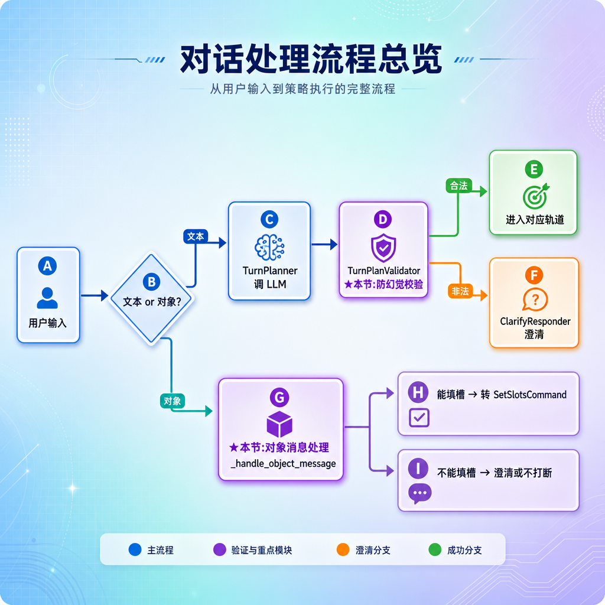
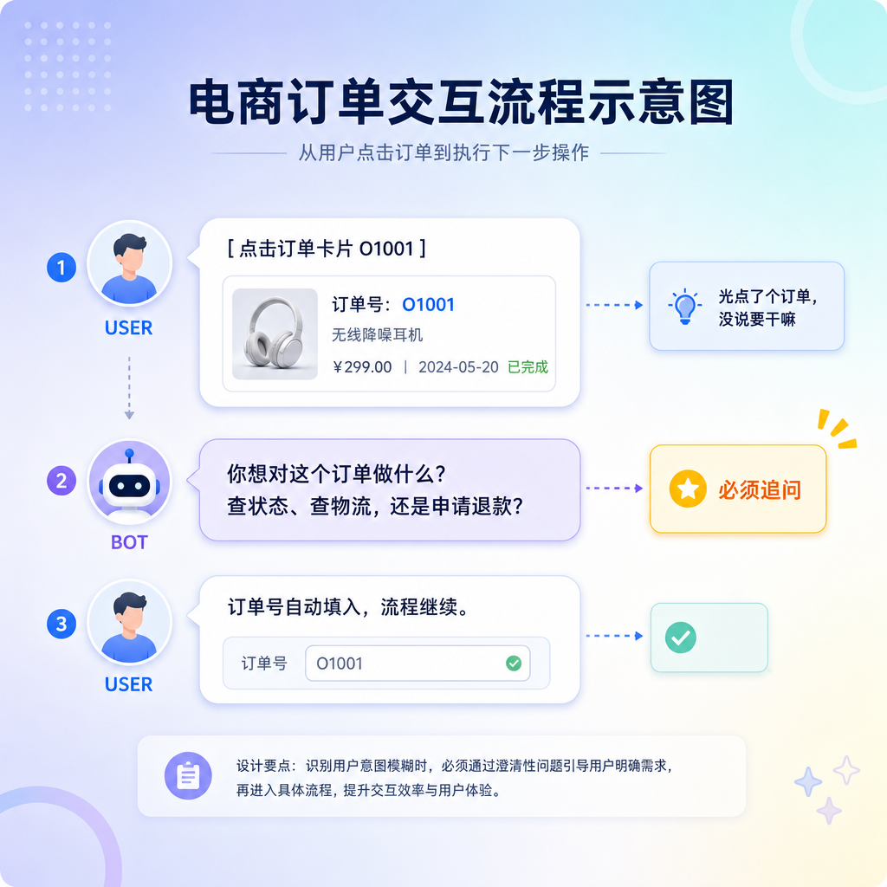
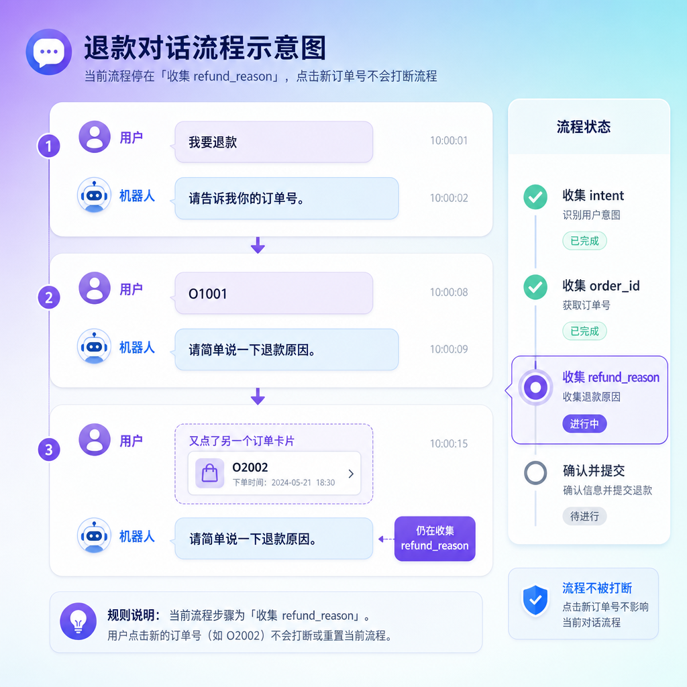
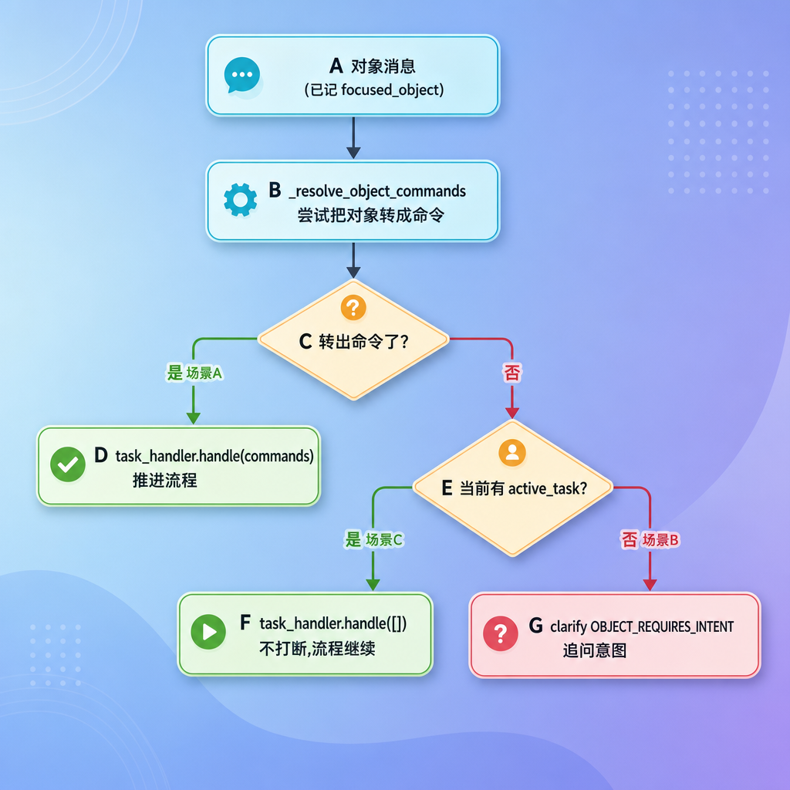
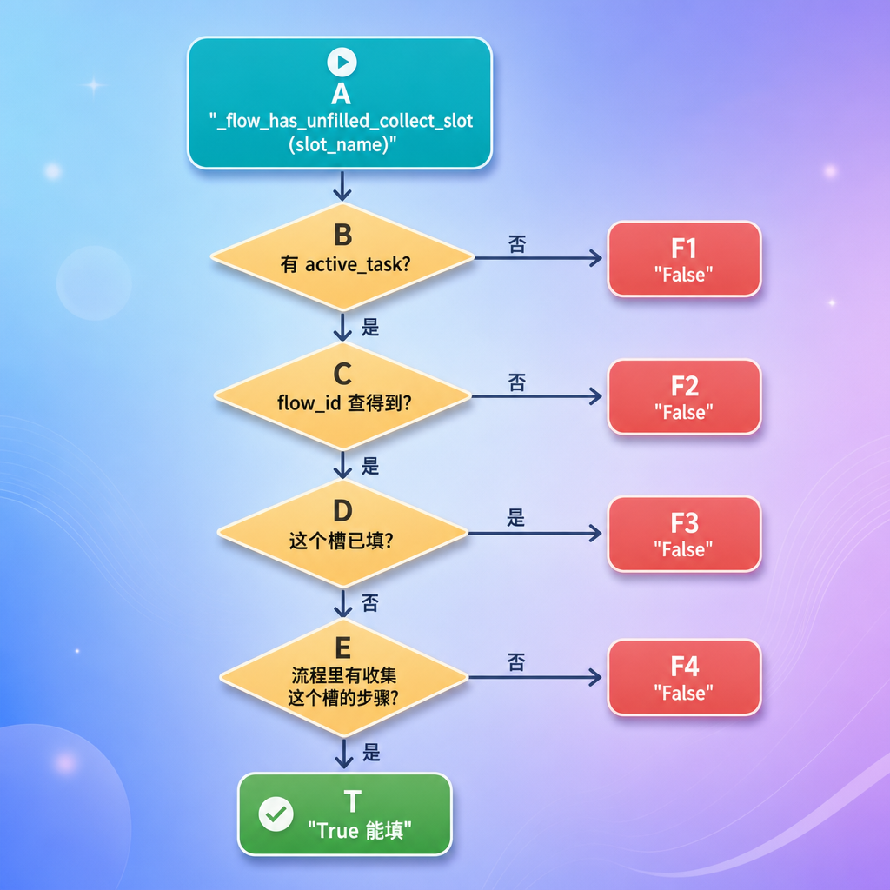
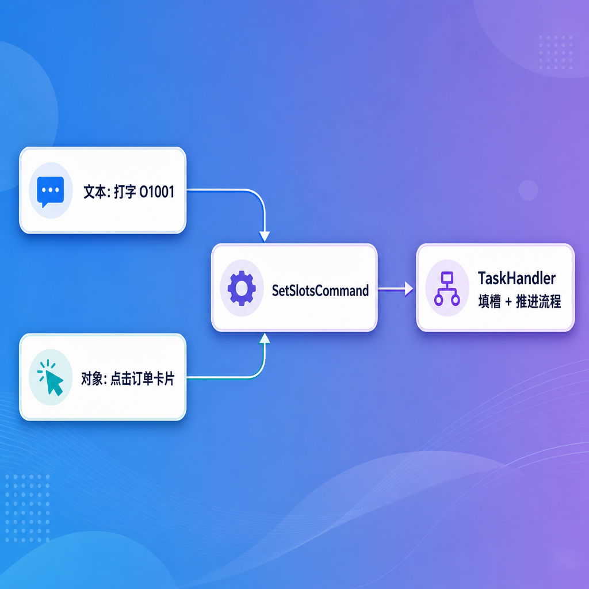
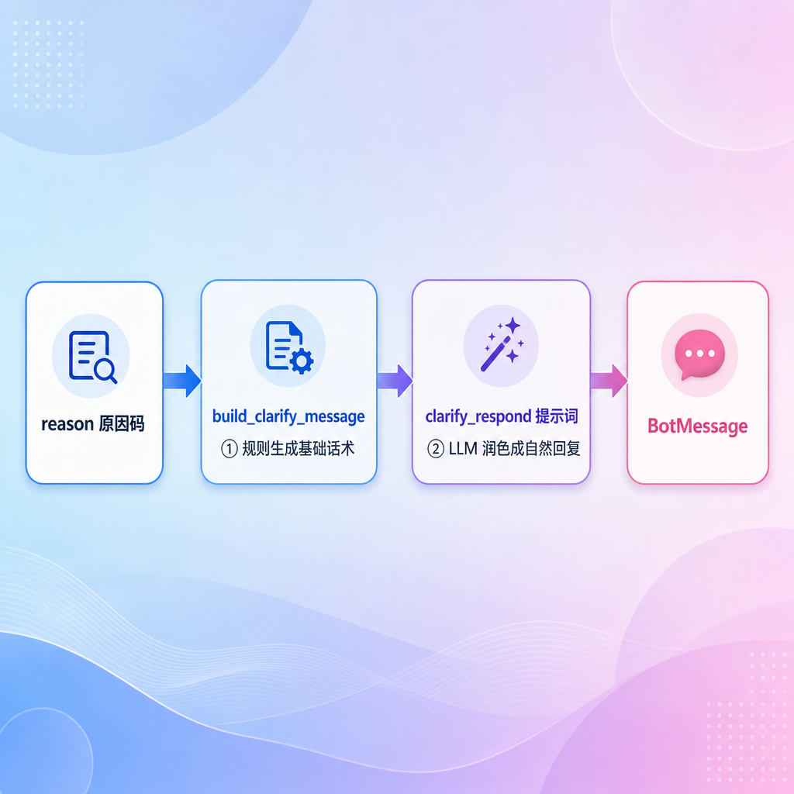
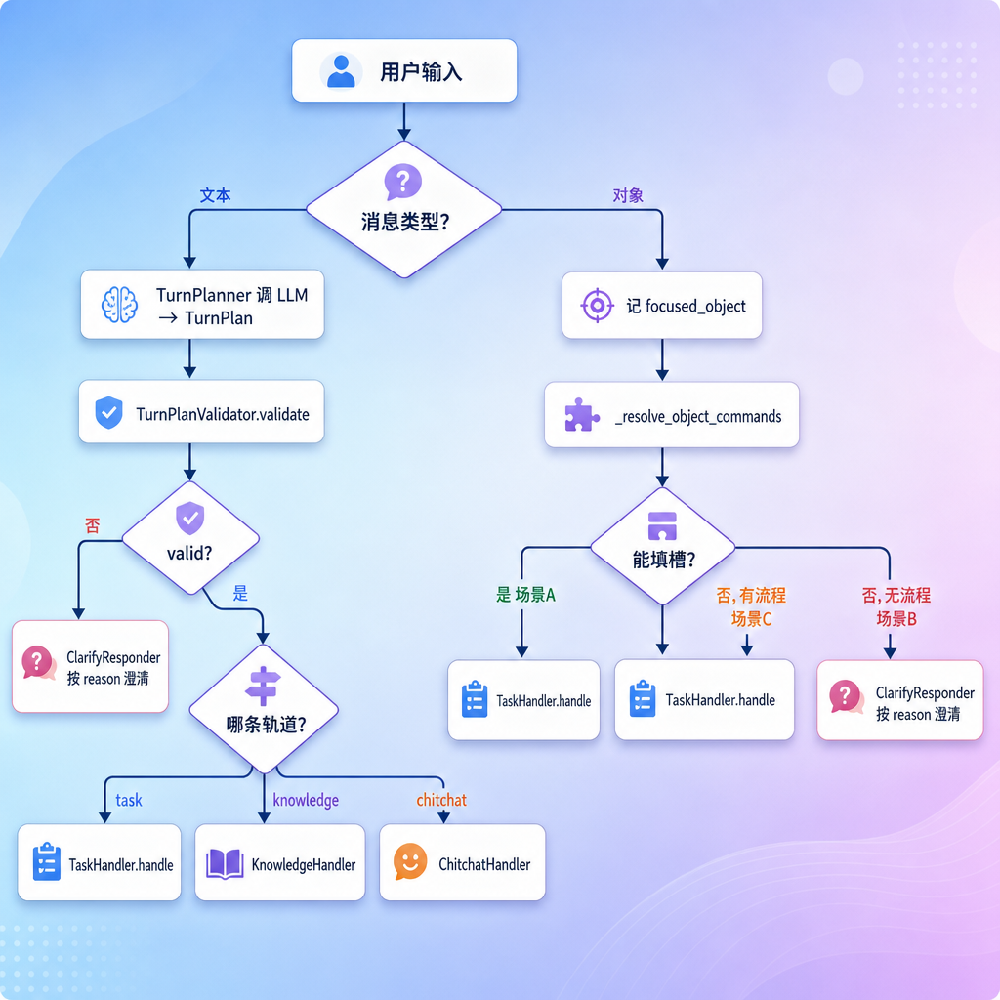

# 防幻觉校验与对象消息处理

---

## 第1章 任务目标

上一节我们让"文本消息 → LLM 生成 TurnPlan → 进入 task 轨道"这条主干跑通了，但刻意跳过了两块"防护"和"另一类输入"：

- **防幻觉校验**：LLM 是概率模型，它可能编出一个根本不存在的 flow、给出自相矛盾的指令。直接拿它的输出去执行是危险的。这一节补上 `TurnPlanValidator`。
- **对象消息**：用户不只会打字，还会**点卡片**——点一个订单、点一个商品。这类"对象消息"怎么处理，这一节补上 `_handle_object_message`。

### 1.1 本节范围

| 内容 | 本节 |
| --- | --- |
| `TurnPlanValidator` 防幻觉校验（9 种 ClarifyReason） | ✅ 详细实现 |
| 对象消息处理 `_handle_object_message` | ✅ 详细实现 |
| `_resolve_object_commands`（对象转命令） | ✅ 重点 |
| `_flow_has_unfilled_collect_slot`（能否填槽判断） | ✅ 重点 |
| 点击卡片的各种时机场景 | ✅ 详细展示 |
| `TaskHandler` 内部（命令执行、流程推进） | ⛔ 仍不实现，调用入口为止 |
| knowledge / chitchat 处理器内部 | ⛔ 不展开 |

### 1.2 校验以及对象消息流程

**引擎的"安全网"和"另一只手"**



---

## 第2章 为什么需要防幻觉校验

### 2.1 LLM 的输出不能直接信

回顾上一节，`TurnPlanner` 调 LLM 后，把返回的 JSON 解析成 `TurnPlan`。但 LLM 是概率生成模型，它的输出**不保证合法**。几种典型的"翻车"情况：

| LLM 可能的翻车 | 后果（如果不校验） |
| --- | --- |
| 三个轨道全填 `null`（没判断出意图） | 引擎不知道走哪条轨道 |
| 同时填了 task 和 knowledge | 引擎一次只能处理一条轨道，不知道先走哪个 |
| task 轨道但 commands 是空的 | 知道要办业务，却没有任何指令可执行 |
| 编了一个不存在的 flow，比如 `"tuikuan_flow"` | 下游查流程表 → 找不到 → 崩溃 |
| 一次塞了两个 `start_flow` | 同时开两个流程，状态混乱 |

这些就是所谓的"幻觉"——LLM 一本正经地输出了**结构对、但内容不合法**的东西。

### 2.2 校验的职责

`TurnPlanValidator` 的职责很纯粹：**检查 `TurnPlan` 能不能执行，不能执行就给出一个"原因码"**。它本身不生成任何回复话术——那是 `ClarifyResponder` 的事。一句话校验器**只判断，不回复**


这种"校验只判断、回复另交他人"的分工，让校验逻辑保持干净——它只关心"对不对"，不关心"怎么跟用户说"。

---

## 第3章 校验结果与原因码

### 3.1 校验结果数据模型

```python
class ClarifyReason(str, Enum):
    MISSING_TRACK = "missing_track"
    MULTIPLE_TRACKS = "multiple_tracks"
    MISSING_TASK_COMMANDS = "missing_task_commands"
    MISSING_KNOWLEDGE_INTENT = "missing_knowledge_intent"
    MISSING_FOCUSED_OBJECT = "missing_focused_object"
    OBJECT_REQUIRES_INTENT = "object_requires_intent"
    INVALID_TASK_COMMANDS = "invalid_task_commands"
    MULTIPLE_TASK_FLOWS = "multiple_task_flows"
    UNKNOWN_TASK_FLOW = "unknown_task_flow"


@dataclass
class TurnPlanValidationResult:
    valid: bool
    reason: ClarifyReason | None = None
```

- `valid`：这个 `TurnPlan` 能不能直接执行
- `reason`：不能执行时，是什么原因（一个固定枚举值）

用枚举而不是裸字符串，是为了避免代码里到处手写 `"missing_track"` 这种字面量、拼错了也不报错。

### 3.2 九种原因码

`ClarifyReason` 一共 9 种，按"在校验的哪个环节触发"可以分成三组：

**第一组：轨道层面（在所有校验最前面）**

| 原因码 | 触发条件 |
| --- | --- |
| `MISSING_TRACK` | task / knowledge / chitchat 三个都为 null，没判断出任何方向 |
| `MULTIPLE_TRACKS` | 同时命中多个轨道，但引擎一次只能执行一个 |

**第二组：task 轨道内部（命中 task 后细查）**

| 原因码 | 触发条件 |
| --- | --- |
| `MISSING_TASK_COMMANDS` | task 轨道，但 commands 为空 |
| `INVALID_TASK_COMMANDS` | commands 里有不认识的命令类型 |
| `MULTIPLE_TASK_FLOWS` | 一次出现多个 `start_flow`，同时想开好几个流程 |
| `UNKNOWN_TASK_FLOW` | `start_flow` 指定的 flow 在系统里不存在（典型幻觉） |

**第三组：knowledge / 对象相关**

| 原因码 | 触发条件 |
| --- | --- |
| `MISSING_KNOWLEDGE_INTENT` | knowledge 轨道，但 intents 为空 |
| `MISSING_FOCUSED_OBJECT` | 知识意图需要聚焦对象，但当前没有 |
| `OBJECT_REQUIRES_INTENT` | 用户只发了对象，没说要干嘛（第 6 章对象消息会用到） |

> 注意 `OBJECT_REQUIRES_INTENT` 不是 validator 产生的，而是对象消息处理时直接用的——放在同一个枚举里统一管理。

---

## 第4章 校验主流程

### 4.1 validate 入口

```python
class TurnPlanValidator:
    def validate(
            self,
            turn_plan: TurnPlan,
            state: DialogueState,
            knowledge_intents: dict[str, KnowledgeIntent],
            flows: FlowsList,
    ) -> TurnPlanValidationResult:
        active_tracks = self._active_tracks(turn_plan)
        if not active_tracks:
            return self._reject(ClarifyReason.MISSING_TRACK)
        if len(active_tracks) > 1:
            return self._reject(ClarifyReason.MULTIPLE_TRACKS)

        track = active_tracks[0]
        if track == "task":
            return self._validate_task(turn_plan, flows=flows)
        if track == "knowledge":
            return self._validate_knowledge(turn_plan, state=state, knowledge_intents=knowledge_intents)
        return TurnPlanValidationResult(valid=True)
```

校验是一个"层层收窄"的过程：先看轨道数量，再钻进具体轨道细查。


注意 chitchat 不需要任何细查——闲聊没有参数，命中即合法。

### 4.2 _active_tracks

**数命中了几个轨道**

```python
@staticmethod
def _active_tracks(turn_plan: TurnPlan) -> list[str]:
    tracks: list[str] = []
    if turn_plan.task is not None:
        tracks.append("task")
    if turn_plan.knowledge is not None:
        tracks.append("knowledge")
    if turn_plan.chitchat is not None:
        tracks.append("chitchat")
    return tracks
```

把三个字段里非 null 的轨道名收集成列表。这个列表的长度决定了前两道关卡：

- 长度 0 → `MISSING_TRACK`
- 长度 > 1 → `MULTIPLE_TRACKS`
- 长度 1 → 进入对应轨道细查

> 这条规则体现了系统的一个核心约束：**TurnPlanner 允许识别出多个意图，但 DialogueEngine 一次只执行一个轨道**。多意图时不强行选一个，而是触发澄清，让用户自己说先办哪个。

### 4.3 _reject

**构造失败结果**

```python
def _reject(self, reason: ClarifyReason) -> TurnPlanValidationResult:
    return TurnPlanValidationResult(valid=False, reason=reason)
```

很简单——包一个 `valid=False` 和原因码。不生成话术，把"怎么跟用户说"留给 `ClarifyResponder`。

---

## 第5章 task 轨道的四重校验

`_validate_task` 是防幻觉的核心，它对 task 轨道做了**四重检查**，任何一重不过就拒绝。

```python
def _validate_task(
        self,
        turn_plan: TurnPlan,
        *,
        flows: FlowsList,
) -> TurnPlanValidationResult:
    task_plan = turn_plan.task

    # 第一重:commands 不能为空
    if task_plan is None or not task_plan.commands:
        return self._reject(ClarifyReason.MISSING_TASK_COMMANDS)

    # 第二重:每个 command 都得是认识的类型
    allowed = (StartFlowCommand, ResumeFlowCommand, CancelFlowCommand, SetSlotsCommand)
    if not all(isinstance(cmd, allowed) for cmd in task_plan.commands):
        return self._reject(ClarifyReason.INVALID_TASK_COMMANDS)

    # 第三重:不能一次开多个流程
    start_commands = [cmd for cmd in task_plan.commands if isinstance(cmd, StartFlowCommand)]
    if len(start_commands) > 1:
        return self._reject(ClarifyReason.MULTIPLE_TASK_FLOWS)

    # 第四重:要开的流程必须真实存在
    if start_commands:
        flow = flows.get_flow_by_id(start_commands[0].flow)
        if flow is None:
            return self._reject(ClarifyReason.UNKNOWN_TASK_FLOW)

    return TurnPlanValidationResult(valid=True)
```

逐重来看，每一重防的是 LLM 的哪一种翻车：

### 5.1 第一重：commands 非空

```python
if task_plan is None or not task_plan.commands:
    return self._reject(ClarifyReason.MISSING_TASK_COMMANDS)
```

LLM 说"用户在办业务"（命中了 task 轨道），却没给出任何 command。这等于"我知道他要办事，但不知道办什么"——无法执行，拒绝。

### 5.2 第二重：命令类型合法

```python
allowed = (StartFlowCommand, ResumeFlowCommand, CancelFlowCommand, SetSlotsCommand)
if not all(isinstance(cmd, allowed) for cmd in task_plan.commands):
    return self._reject(ClarifyReason.INVALID_TASK_COMMANDS)
```

正常情况下 `Command.from_dict` 解析时遇到不认识的 command 名会直接报错，但这里再加一道防线，确保每条命令都是这四种已知类型之一。**这是典型的"防御性编程"——不假设上游一定干净**。

### 5.3 第三重：不能一次开多个流程

```python
start_commands = [cmd for cmd in task_plan.commands if isinstance(cmd, StartFlowCommand)]
if len(start_commands) > 1:
    return self._reject(ClarifyReason.MULTIPLE_TASK_FLOWS)
```

一条用户消息里出现两个 `start_flow`，意味着 LLM 想同时开两个流程——比如同时开"退款"和"查物流"。系统一次只能有一个活跃任务，所以拒绝，让用户先明确办哪个。

> 注意 `set_slots` 可以有多个（一次填多个槽位没问题），被限制的只有 `start_flow`。

### 5.4 第四重：流程必须真实存在

**（最关键的防幻觉）**

```python
if start_commands:
    flow = flows.get_flow_by_id(start_commands[0].flow)
    if flow is None:
        return self._reject(ClarifyReason.UNKNOWN_TASK_FLOW)
```

这是**最典型的防幻觉检查**。LLM 可能编出一个 YAML 里根本没定义的 flow id——比如把 `refund_request` 写成 `refund` 或 `tuikuan`。如果不查，下游 `FlowExecutor` 拿这个 id 去查流程表会直接崩。

这里用 `flows.get_flow_by_id` 去**真实的流程列表**里查证。查不到，说明是幻觉，拒绝。


### 5.5 KnowledgeIntent：知识意图注册表

在看 knowledge 校验之前，要先补一个一直在用、却没正式讲过的数据模型——`KnowledgeIntent`。前面 TurnPlanner 的 prompt 字段 `knowledge_intents_json`、这里的 `_validate_knowledge`，都依赖它。

先说清楚一件事：**什么是"知识意图"？** 所谓知识意图，就是**用户咨询类问题的一个分类**。用户问的问题五花八门——"这件衣服什么材质""退款多久到账""支持七天无理由吗"——但归一归类，无非就那么几种。每一类，就是一个 `KnowledgeIntent`。

下面这张表，把用户的原话映射到对应的意图，先建立直观印象：

| 用户可能这么问                     | 归类到哪个意图（id）              |
| ---------------------------------- | --------------------------------- |
| "这件衣服什么材质？""这个多少钱？" | `product_info`（商品信息咨询）    |
| "我那个订单啥状态了？"             | `order_info`（订单信息咨询）      |
| "退款多久到账？"                   | `refund_policy`（退款政策咨询）   |
| "支持七天无理由吗？"               | `return_policy`（退货政策咨询）   |
| "你们多久发货？"                   | `shipping_policy`（配送政策咨询） |

`KnowledgeIntent` 就是用来描述"这样一类问题"的数据模型，它定义在 `atguigu/knowledge/intents.py`：

```python
from dataclasses import dataclass, field
@dataclass
class KnowledgeIntent:
    id: str
    description: str
    provider_ids: list[str] = field(default_factory=list)
    requires_object: str | None = None
```

| 字段              | 含义                                                         |
| ----------------- | ------------------------------------------------------------ |
| `id`              | 意图唯一标识，如 `product_info`                              |
| `description`     | 意图的中文说明，喂给 LLM 帮它分类                            |
| `provider_ids`    | 这个意图要查哪些知识源（FAQ、RAG、订单 API 等）              |
| `requires_object` | 这个意图是否必须依附一个聚焦对象，值是对象类型（`product` / `order`），不需要则为 `None` |

系统支持的所有知识意图，集中注册在一张 `dict` 里（key 是意图 id）：

```python
KNOWLEDGE_INTENTS: dict[str, KnowledgeIntent] = {
    "product_info": KnowledgeIntent(
        id="product_info", description="商品信息咨询",
        provider_ids=["api.product"], requires_object="product",
    ),
    "order_info": KnowledgeIntent(
        id="order_info", description="订单信息咨询",
        provider_ids=["api.order"], requires_object="order",
    ),
    "refund_policy": KnowledgeIntent(
        id="refund_policy", description="退款政策咨询",
        provider_ids=["faq.default", "rag.default"],
    ),
    "return_policy": KnowledgeIntent(
        id="return_policy", description="退货政策咨询",
        provider_ids=["faq.default", "rag.default"],
    ),
    "shipping_policy": KnowledgeIntent(
        id="shipping_policy", description="配送政策咨询",
        provider_ids=["faq.default", "rag.default"],
    ),
    "platform_rule": KnowledgeIntent(
        id="platform_rule", description="平台规则咨询",
        provider_ids=["rag.default"],
    ),
    "general_ecommerce_info": KnowledgeIntent(
        id="general_ecommerce_info", description="电商通用信息咨询",
        provider_ids=["faq.default", "rag.default"],
    ),
}
```

这张注册表在系统里同时扮演**三个角色**，值得记住：

| 角色             | 怎么用                                                       | 在哪用                                       |
| ---------------- | ------------------------------------------------------------ | -------------------------------------------- |
| LLM 的"分类词表" | 把 `id` + `description` 喂给 LLM，约束它只能从这几类里选，防止瞎编意图 | TurnPlanner 的 `knowledge_intents_json` 字段 |
| 校验白名单       | LLM 返回的意图 id 必须能在这张表里查到                       | 本章 `_validate_knowledge`                   |
| 路由元数据       | 命中意图后，按 `provider_ids` 决定查哪些知识源、按 `requires_object` 决定要不要先有聚焦对象 | KnowledgeHandler（第 8 节展开）              |

重点看 `requires_object` 这个字段——它正是下面 knowledge 校验的依据：

- `product_info`（问商品信息）`requires_object="product"`：必须先有一个聚焦的商品
- `order_info`（问订单信息）`requires_object="order"`：必须先有一个聚焦的订单
- `refund_policy` / `shipping_policy` 这类**政策咨询**没有 `requires_object`：问"退款政策"不需要指定具体订单，谁问都一样

> 这一节只需理解 `KnowledgeIntent` 这个数据模型，以及它的 `requires_object` 字段。完整的知识检索流程——`provider_ids` 怎么映射到具体的 FAQ/RAG/API、怎么检索拼接知识、怎么生成回答——是 `KnowledgeHandler` 的内容，留到第 8 节展开。

### 5.6 knowledge 轨道校验

knowledge 轨道这一节不深入，但顺带看一眼它的校验逻辑，理解 `MISSING_FOCUSED_OBJECT` 怎么来的：

```python
def _validate_knowledge(self, turn_plan, state, knowledge_intents):
    knowledge_plan = turn_plan.knowledge
    if knowledge_plan is None or not knowledge_plan.intents:
        return self._reject(ClarifyReason.MISSING_KNOWLEDGE_INTENT)

    focused_object = state.focused_object
    for intent in knowledge_plan.intents:
        intent_meta = knowledge_intents[intent]
        required_object = intent_meta.requires_object
        if required_object is not None:
            if focused_object is None or focused_object.type != required_object:
                return self._reject(ClarifyReason.MISSING_FOCUSED_OBJECT)

    return TurnPlanValidationResult(valid=True)
```

两道检查：intents 不能为空；如果某个意图（比如"问商品价格"）**必须依附一个对象**，那当前就得有对应类型的 focused_object，否则没法回答"它多少钱"——"它"是谁都不知道。

---

## 第6章 对象消息处理

讲完校验（文本轨道的安全网），现在转向**另一类输入**：对象消息。

### 6.1 什么是对象消息

用户和客服交互，除了打字，还能**点击卡片**。前端会把订单列表、商品列表展示成卡片，用户点一下，前端就发来一条"对象消息"——类型是 `OBJECT`，带着这个订单/商品的 id。

```json
{
  "type": "order",
  "id": "O1001",
  "title": "订单 O1001"
}
```

对象消息和文本消息最大的区别：**它不经过 LLM**。点一个订单的语义很明确（用户关注这个订单），不需要 LLM 去"理解"。

### 6.2 对象消息的入口

回顾 `process_message` 的分流：

```python
if user_message.type is MessageType.TEXT:
    messages = await self._handle_text_message(state=state)
else:
    state.set_focused_object(FocusedObject.from_dict(user_message.object.to_dict()))
    messages = await self._handle_object_message(message=user_message, state=state)
```

对象消息分支做两件事：

1. **先把对象记成 `focused_object`**——不管接下来怎么处理，"用户现在关注这个订单"这个事实先记下来
2. 再进入 `_handle_object_message` 决定怎么回应

### 6.3 点击卡片的几种时机场景

这是理解对象消息处理的关键。同样是"点一个订单卡片"，**在对话的不同时机，含义完全不同**。把所有场景列出来：

**场景 A：流程正等着要订单号时，点了订单**


这是最理想的情况——点击的对象**正好是当前流程缺的那个槽位**。系统应该把它当成"填槽位"，直接推进流程，不要再傻乎乎问一遍"请告诉我订单号"。

**场景 B：没有任何流程时，点了订单**



用户只是点了个订单，没表达意图。系统知道"他关注 O1001"，但不知道"他想干嘛"——查状态？查物流？退款？只能追问。这就是 `OBJECT_REQUIRES_INTENT` 澄清。

**场景 C：流程进行中、但当前不缺这个对象时，点了订单**



流程正在收集 `refund_reason`，这时点订单卡片，对象对当前槽位**没用**。但用户毕竟在一个流程里，不该粗暴打断，于是"不填槽、也不澄清，让流程继续等它要的东西"。

**三种场景的处理对照**：

| 场景 | 当前状态 | 对象能否填当前槽 | 处理 |
| --- | --- | --- | --- |
| A | 流程正收集 order_number | 能 | 转成 SetSlotsCommand，推进流程 |
| B | 没有 active_task | 不能（没流程） | OBJECT_REQUIRES_INTENT 澄清 |
| C | 流程在收集 refund_reason | 不能（槽不匹配） | 不打断，让流程继续 |

### 6.4 _handle_object_message：三分支

上面三种场景，正好对应 `_handle_object_message` 的三条分支：

```python
async def _handle_object_message(
        self,
        message: UserMessage,
        state: DialogueState,
) -> list[BotMessage]:
    commands = self._resolve_object_commands(
        message=message,
        state=state,
        flows=self.task_handler.flows,
    )
    if commands:
        # 场景 A:对象能填当前槽 → 转成命令,推进流程
        return await self.task_handler.handle(commands=commands, state=state)

    # 没有匹配到 slot。如果用户正在一个流程中,不打断,让流程继续。
    if state.active_task is not None:
        # 场景 C:在流程里但槽不匹配 → 不打断,空命令让流程继续
        return await self.task_handler.handle(commands=[], state=state)

    # 场景 B:没有流程 → 澄清
    return await self.clarify_responder.respond(
        state=state,
        reason=ClarifyReason.OBJECT_REQUIRES_INTENT,
    )
```



关键就看 `_resolve_object_commands` 能不能把对象转成命令——能转（场景 A），就推进；不能转，再看在不在流程里（场景 C vs 场景 B）。

### 6.5 _resolve_object_commands：对象转命令

这是对象消息处理的核心。它判断：**当前点击的这个对象，能不能填进当前流程正缺的槽位？** 能就生成一个 `SetSlotsCommand`，不能就返回空列表。

```python
def _resolve_object_commands(
        self,
        message: UserMessage,
        state: DialogueState,
        flows: FlowsList,
) -> list[Command]:
    message_object = message.object
    if message_object is None:
        return []

    object_type = message_object.type.strip().lower()

    if object_type == "order":
        if self._flow_has_unfilled_collect_slot(state, flows, "order_number"):
            return [SetSlotsCommand(
                command="set_slots",
                slots={"order_number": message_object.id},
            )]
        return []

    if object_type == "product":
        if self._flow_has_unfilled_collect_slot(state, flows, "product_id"):
            return [SetSlotsCommand(
                command="set_slots",
                slots={"product_id": message_object.id},
            )]
        return []

    return []
```

逻辑很清楚，按对象类型分两路：

- **订单对象**（`order`）：当前流程如果正缺 `order_number`，就把订单 id 填进去
- **商品对象**（`product`）：当前流程如果正缺 `product_id`，就把商品 id 填进去
- 其它类型、或者当前不缺对应槽位：返回空列表（交回 6.4 去判断场景 B / C）

> 注意"能不能填"这个判断，全交给了 `_flow_has_unfilled_collect_slot`。
>

举例（场景 A）：当前退款流程正缺 `order_number`，用户点了订单 O1001：

```python
# message_object = {type: "order", id: "O1001"}
# _flow_has_unfilled_collect_slot(..., "order_number") → True
# 返回:
[SetSlotsCommand(command="set_slots", slots={"order_number": "O1001"})]
```

这条命令交给 `TaskHandler`，效果和用户**打字输入"O1001"**完全一样——殊途同归。

### 6.6 _flow_has_unfilled_collect_slot：能否填槽的判断

这个方法回答一个精确的问题：**当前流程，是不是定义了某个收集槽（如 order_number），而且这个槽还没填？**

```python
@staticmethod
def _flow_has_unfilled_collect_slot(
        state: DialogueState,
        flows: FlowsList,
        slot_name: str,
) -> bool:
    """检查当前流程是否定义了名为 slot_name 的收集槽且尚未填充。"""
    active_task = state.active_task
    if active_task is None:                       # ① 没有活跃流程
        return False
    flow = flows.get_flow_by_id(active_task.flow_id)
    if flow is None:                              # ② 流程 id 查不到(防御)
        return False
    if active_task.slots.get(slot_name):          # ③ 这个槽已经填了
        return False
    for step in flow.steps:                       # ④ 流程里有没有收集这个槽的步骤
        if isinstance(step, CollectSlotStep) and step.slot_name == slot_name:
            return True
    return False
```

四步判断，任何一步不满足就返回 `False`（不能填）：

| 步骤 | 判断 | False 表示 |
| --- | --- | --- |
| ① | 有没有 active_task | 没流程，谈不上填槽（→ 场景 B） |
| ② | flow_id 能不能查到流程 | 防御性兜底，理论上不该发生 |
| ③ | 这个槽是不是已经填了 | 已填，不用再填 |
| ④ | 流程里有没有收集这个槽的步骤 | 这个流程压根不需要这个槽（→ 场景 C） |

全部通过，才返回 `True`——当前流程确实需要这个槽、而且还空着，正好可以用点击的对象来填。

**逐个场景验证这个方法**：

- **场景 A**（退款流程在收集 order_number）：① 有 active_task ✓ ② flow 查得到 ✓ ③ order_number 还没填 ✓ ④ 退款流程有收集 order_number 的步骤 ✓ → 返回 `True`，能填
- **场景 B**（没有流程）：① active_task 是 None → 返回 `False`，不能填
- **场景 C**（流程在收集 refund_reason，用户点订单）：查的是 `order_number` 槽，但 ③ 退款流程其实已经填过 order_number 了（用户之前打字给过）→ 返回 `False`，不能填



### 6.7 为什么对象消息也要SetSlotsCommand

你可能注意到一个设计上的巧思：对象消息能填槽时，不是直接改 state，而是**构造一个 `SetSlotsCommand` 再交给 TaskHandler**。

为什么不直接 `state.set_slots(...)`？因为：

- **统一入口**：文本消息填槽走的是"LLM 产出 SetSlotsCommand → TaskHandler"，对象消息也走同一条路，下游 `TaskHandler` / `CommandProcessor` 不需要区分"这个槽是打字填的还是点卡片填的"
- **复用流程推进逻辑**：填完一个槽位后,流程不会自己停下——它还要接着判断下一步、生成下一句回复(继续问下一个槽,或执行 action)。这套"填槽后怎么往下走"的逻辑,已经在 `TaskHandler` 里为文本消息实现好了。对象消息只要也转成 `SetSlotsCommand` 交给同一个 `TaskHandler`,就能直接复用这套逻辑,而不必在对象处理这条路里把它重写一遍。



**两条输入殊途同归**——这是一个很优雅的设计，把"对象消息"归一化成了"和文本一样的命令"。

---

## 第7章 ClarifyResponder：生成澄清回复

不管是文本校验失败，还是对象消息要澄清，最终都汇到 `ClarifyResponder`。它的职责是：把一个冷冰冰的**原因码**，变成一句**自然的、说给用户听的追问**。

### 7.1 引擎怎么调用它

```python
# 文本校验失败
if not validation.valid:
    return await self.clarify_responder.respond(state=state, reason=validation.reason)

# 对象消息没意图
return await self.clarify_responder.respond(
    state=state, reason=ClarifyReason.OBJECT_REQUIRES_INTENT,
)
```

引擎只传两样东西：当前 `state` 和一个 `reason`（原因码）。剩下的全交给 `ClarifyResponder`。

### 7.2 两段式设计

**先模板话术，再 LLM 润色**

`ClarifyResponder` 生成回复分两步：



| 步骤       | 做什么                                    | 为什么                                          |
| ---------- | ----------------------------------------- | ----------------------------------------------- |
| ① 基础话术 | 按 `reason` 用 if-else 写死一句兜底话术   | 保证**永远有一句能用的话**，不依赖 LLM 一定成功 |
| ② LLM 润色 | 把基础话术 + 上下文喂给 LLM，改写得更自然 | 让追问贴合当前对话，不生硬                      |

这种"**规则保底 + LLM 润色**"的组合很值得学：基础话术保证下限（哪怕 LLM 抽风也有话说），LLM 润色提升体验（结合上下文说得更自然）。

### 7.3 build_clarify_message 生成基础话术

```python
def build_clarify_message(
        self,
        reason: ClarifyReason,
        state: DialogueState,
) -> str:
    if reason is ClarifyReason.MULTIPLE_TRACKS:
        return "你这次同时提到了多个方向。我们先处理一个，你想先办业务还是先咨询信息呢？"

    if reason is ClarifyReason.MISSING_FOCUSED_OBJECT:
        return "请先发送你想咨询的对象，我再继续帮你看。"

    if reason is ClarifyReason.MISSING_KNOWLEDGE_INTENT:
        return "你是想了解商品信息、订单信息，还是售后配送规则呢？"

    if reason is ClarifyReason.MISSING_TRACK:
        return "你是想先处理业务问题，还是先咨询信息呢？"

    if reason is ClarifyReason.MISSING_TASK_COMMANDS:
        return "你这次是想办理什么业务呢？比如查订单、查物流，或者申请退款。"

    if reason is ClarifyReason.OBJECT_REQUIRES_INTENT:
        focused_object = state.focused_object
        if focused_object is not None and focused_object.type == "order":
            return "我已经收到这个订单了。你想查订单状态、查物流，还是申请退款呢？"
        if focused_object is not None and focused_object.type == "product":
            return "我已经收到这个商品了。你想了解它的商品信息、发货情况，还是售后相关问题呢？"

    return "我还需要再确认一下你的意思，你可以换个更具体的说法告诉我。"
```

它就是一张"原因码 → 话术"的对照表，用 if-else 实现。几个要点：

- **每个 reason 一句专属话术**：追问要贴着原因来。缺意图就引导"你想办什么"，多意图就引导"先处理哪个"。
- **`OBJECT_REQUIRES_INTENT` 还会看对象类型**：点的是订单，就提示"查状态/查物流/退款"；点的是商品，就提示"商品信息/发货/售后"。引导的选项要对得上用户手里的东西。
- **最后有一句兜底**：所有 reason 都没匹配上时（比如 task 的几个细化原因 `INVALID_TASK_COMMANDS` 等），返回一句通用的"换个说法"。

> 注意 task 的四种原因里，只有 `MISSING_TASK_COMMANDS` 有专属话术，`INVALID_TASK_COMMANDS` / `MULTIPLE_TASK_FLOWS` / `UNKNOWN_TASK_FLOW` 走最后的兜底——因为对用户来说，这几种本质都是"我没搞懂你要办什么业务"，用一句通用引导就够了，不必为内部细分各写一句。

### 7.4 respond 调 LLM 润色

```python
async def respond(
        self,
        state: DialogueState,
        reason: ClarifyReason,
) -> list[BotMessage]:
    message = state.pending_turn.user_message
    clarify_message = self.build_clarify_message(reason=reason, state=state)   # ① 基础话术
    user_message = HistoryBuilder._render_user_message(message)
    history = HistoryBuilder.build(state.current_session().turns)
    focused_object = json.dumps(state.focused_object.to_dict())

    prompt_text = load_prompt("clarify_respond")
    prompt = PromptTemplate.from_template(prompt_text, template_format="jinja2")
    chain = prompt | llm | StrOutputParser()
    rewritten = await chain.ainvoke(                                            # ② LLM 润色
        {
            "reason": reason.value,
            "clarify_message": clarify_message,
            "focused_object": focused_object,
            "history": history,
            "user_message": user_message,
        }
    )
    return [BotMessage(text=rewritten)]
```

流程：

1. 先调 `build_clarify_message` 拿到基础话术（第一步的产物）
2. 准备润色需要的上下文：用户这句话、对话历史、聚焦对象
3. 用 `clarify_respond` 提示词，把"基础话术 + 上下文"喂给 LLM
4. LLM 输出润色后的自然回复，包成 `BotMessage`

注意它用的是 `StrOutputParser()`——和 TurnPlanner 用 `JsonOutputParser` 不同。因为澄清回复就是**一句给用户看的自然语言**，不需要解析成结构化对象，直接拿文本即可。

### 7.5 润色用的提示词

`clarify_respond.jinja2` 模板：

```jinja2
你是一个中文电商客服助手，语气自然、友好、简洁。
你的任务是把一条系统澄清提示改写成更自然的一句话，不要扩写，不要新增信息，不要改变澄清意图。

澄清原因：{{ reason }}
建议回复：{{ clarify_message }}

当前聚焦对象：{{ focused_object }}


对话历史：
{{ history }}

用户最后一句：{{ user_message }}

改写后的回复：
```

这个提示词的设计很克制，几个关键约束：

- **"不要扩写，不要新增信息，不要改变澄清意图"**——LLM 只能润色措辞，不能改变追问的核心内容。这防止 LLM 自由发挥跑偏，把"问订单号"改成别的。
- **基础话术作为 `建议回复` 传入**——LLM 是在一个已经正确的话术上润色，而不是从零生成。下限被基础话术兜住了。
- **带上 history 和 focused_object**——让润色后的话贴合上下文。比如用户刚说过什么、手里点的是哪个订单，LLM 可以自然地呼应。

各变量：

| 变量              | 含义                                    |
| ----------------- | --------------------------------------- |
| `reason`          | 原因码的字符串值，帮 LLM 理解在澄清什么 |
| `clarify_message` | 第一步生成的基础话术（润色的底稿）      |
| `focused_object`  | 当前聚焦对象描述，没有则模板里不出现    |
| `history`         | 当前会话历史                            |
| `user_message`    | 用户本轮这句话                          |

### 7.6 一个完整例子

用户在没有任何流程时，点了一个订单卡片（场景 B，触发 `OBJECT_REQUIRES_INTENT`）：

**第一步**，`build_clarify_message` 看到 reason 是 `OBJECT_REQUIRES_INTENT`、对象类型是 order，返回基础话术：

```text
我已经收到这个订单了。你想查订单状态、查物流，还是申请退款呢？
```

**第二步**，把这句话连同上下文喂给 LLM 润色。LLM 可能输出：

```text
好的，我看到你选的订单 O1001 了～ 你是想查这个订单的状态、看看物流到哪了，还是要申请退款呢？
```

可以看到：核心追问没变（还是引导查状态/查物流/退款），但语气更自然、还自然带上了订单号。这就是两段式的价值——**规则保证说对，LLM 保证说得好听**。

### 7.7 ClarifyResponder 全貌


> 至此，澄清这条线完整了：`TurnPlanValidator` 判断失败给出 `reason` → `ClarifyResponder` 按 reason 生成基础话术 → LLM 润色 → 回复用户。validator 管"对不对"，responder 管"怎么说"，分工清晰。

---

## 第8章 把这一节串起来

完整的 `_handle_text_message`（含校验）和对象消息处理，合起来看引擎现在的全貌：



至此，引擎的"理解 + 决策"层基本完整：

- 文本消息有了 LLM 理解 + 防幻觉校验的安全网
- 对象消息有了三场景的精细处理
- 所有"看不懂、不合法、缺信息"的情况，统一收口到 ClarifyResponder

剩下没做的，主要是各个 Handler 的内部实现（TaskHandler 怎么推流程、KnowledgeHandler 怎么检索、ChitchatHandler 怎么闲聊）

---

## 第9章 小结

### 9.1 这一节实现了什么

| 文件 | 内容 |
| --- | --- |
| `plan/models.py` | `ClarifyReason`（9 种）、`TurnPlanValidationResult` |
| `plan/validator.py` | `TurnPlanValidator`：轨道层校验 + task 四重校验 + knowledge 校验 |
| `engine/dialogue_engine.py` | `_handle_object_message` / `_resolve_object_commands` / `_flow_has_unfilled_collect_slot` |

### 9.2 几个值得记住的设计

1. **LLM 输出必须校验**：概率模型会产出结构对、内容错的"幻觉"。task 四重校验里，"flow 必须真实存在"是最关键的一道防线。
2. **校验只判断、不回复**：validator 只给原因码，话术交给 ClarifyResponder，职责单一。
3. **多意图不强选**：识别出多个轨道时触发 MULTIPLE_TRACKS 澄清，让用户决定，而不是替用户猜。
4. **对象消息三场景**：能填槽（推进）/ 无流程（澄清）/ 在流程但槽不匹配（不打断）。核心判断在 `_flow_has_unfilled_collect_slot`。
5. **对象归一化为命令**：点卡片填槽和打字填槽，都绕回 `SetSlotsCommand` 走同一条 TaskHandler 链路，复用流程推进逻辑。

### 9.3 下一节

钻进 `TaskHandler` 内部——`CommandProcessor` 怎么把命令应用到 state，`FlowExecutor` 怎么按 YAML 一步步推进流程、执行 action、生成回复。这一节绕回的 `SetSlotsCommand`，到时候就能看到它是怎么被真正执行的。
