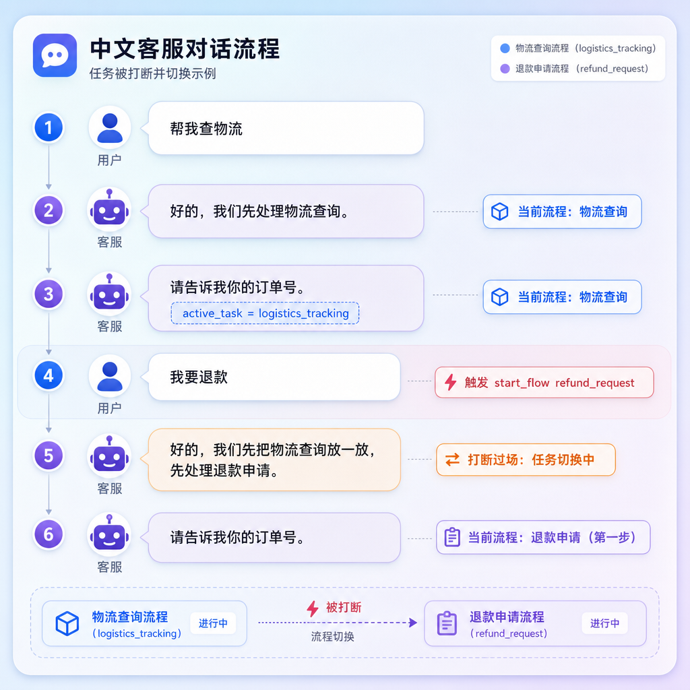
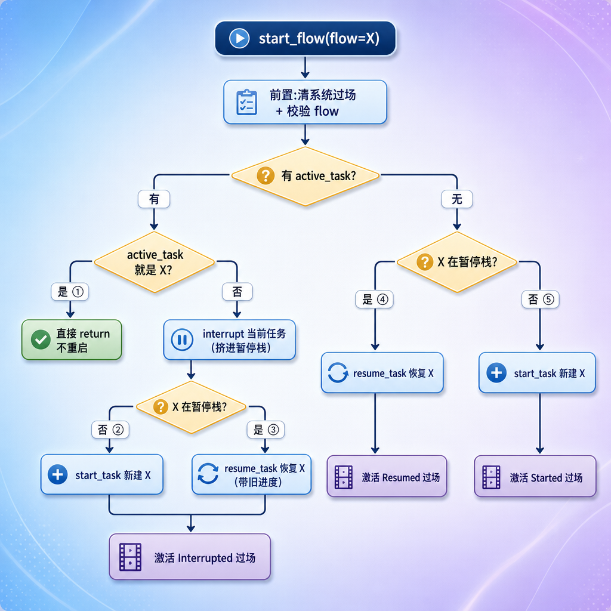
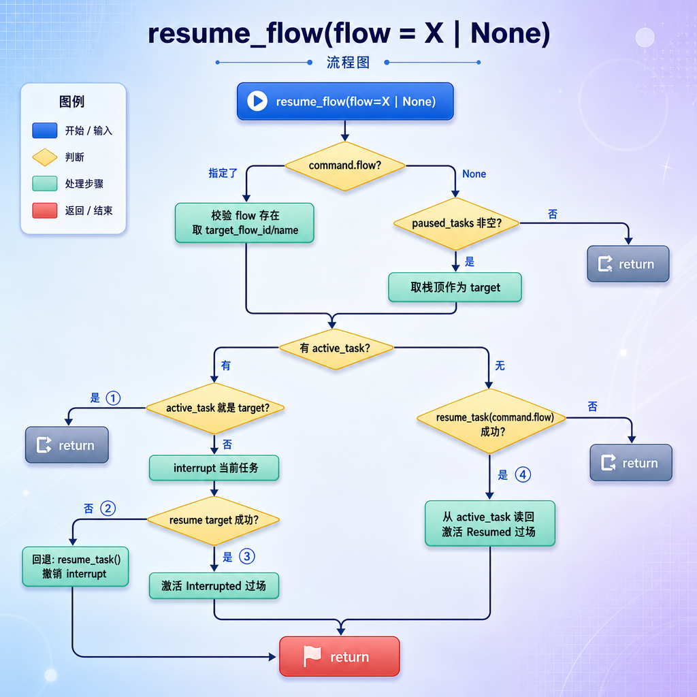

# 	TaskHandler 与 CommandProcessor（命令的执行）

---

## 第1章 任务目标

前面几节我们已经让引擎能：把用户的话交给 LLM 理解、产出一串 `Command`、校验合法、再把这串 `Command` 交给 `TaskHandler`。但 `TaskHandler` 内部一直是个黑盒——commands 进去，回复出来，中间发生了什么没讲。

这一节就打开这个黑盒的**前半部分**：`CommandProcessor`。它负责把一条条 `Command` **真正应用到 `DialogueState`** 上——创建任务、填槽位、取消、恢复、挂起，让对话状态按用户的意图发生变化。

### 1.1 TaskHandler 的两个阶段

`TaskHandler` 处理一轮 task 分两步：


| 阶段 | 职责 | 本节 |
| --- | --- | --- |
| ① CommandProcessor | 改状态：建任务、填槽、取消、恢复、挂起 | ✅ 详细实现 |
| ② FlowExecutor | 读状态、按 YAML 推进流程、执行 action、生成回复 | ⛔ 下一节 |

这一节专注阶段 ①。**理解 CommandProcessor 的关键，是理解每种命令在不同的对话处境下，会让 `DialogueState` 发生什么变化**——尤其是任务的"开始、打断、恢复、取消"这套生命周期。

### 1.2 两个前置知识

CommandProcessor 几乎所有操作都落在 `DialogueState` 的方法上，先把它们摆出来（state 那一节讲过）：

| state 方法 | 作用 |
| --- | --- |
| `start_task(ctx)` | 把某任务设为活跃任务 |
| `interrupt_active_task()` | 把当前活跃任务挤进暂停栈 `paused_tasks` |
| `resume_task(flow_id)` | 从暂停栈按 flow_id 取出任务恢复为活跃（取到返回任务，取不到返回 None） |
| `cancel_active_task()` | 清空活跃任务（直接丢弃） |
| `set_slots(slots)` | 往活跃任务的 slots 合并键值 |
| `start_system_task(ctx)` | 激活一个系统过场（Started/Interrupted/...） |
| `end_system_task()` | 清除当前系统过场 |

还有上一节讲的几种 `SystemContext`（系统过场）——`StartedSystemContext` / `InterruptedSystemContext` / `CanceledSystemContext` / `ResumedSystemContext`。CommandProcessor 在改任务状态的同时，会激活对应的系统过场，让系统说出"好的，先处理退款""先把 A 放一放，处理 B"这类话。

### 1.3 反复用到的 YAML 流程

这一节所有场景都基于 `user_flows.yml` 里的三个流程，先记住它们：

| flow_id | name | 第一步要收集 |
| --- | --- | --- |
| `order_status_query` | 订单状态查询 | 订单号 |
| `logistics_tracking` | 物流查询 | 订单号 |
| `refund_request` | 退款申请 | 订单号 → 退款原因 |

---

## 第2章 TaskHandler：两阶段的协调者

先看 `TaskHandler` 本身，它很薄，只是把两个阶段串起来。

```python
class TaskHandler:
    def __init__(self,
                 command_processor: CommandProcessor,
                 flows: FlowsList,
                 flow_executor: FlowExecutor,
                 action_runner: ActionRunner):
        self.command_processor = command_processor
        self.flows = flows
        self.flow_executor = flow_executor
        self.action_runner = action_runner

    async def handle(self, commands: list[Command], state: DialogueState) -> list[BotMessage]:
        # 阶段①:把命令应用到 state
        self.command_processor.run(commands, state, self.flows)
        # 阶段②:推进流程,生成回复(下一节)
        messages: list[BotMessage] = await self.flow_executor.run_task(
            state, self.flows, self.action_runner
        )
        return messages
```

`handle` 就两行：先让 `CommandProcessor` 改状态，再让 `FlowExecutor` 推进流程拿回复。这一节我们只看第一行 `command_processor.run(...)`。

> 注意 commands 可能是空列表（比如上一节对象消息"在流程中但槽不匹配"的场景 C，传的是 `[]`）。空列表时 CommandProcessor 什么都不做，直接进入阶段②推进流程——这正是"不打断、让流程继续"的实现方式。

---

## 第3章 CommandProcessor 的骨架

### 3.1 run 与 _apply

```python
class CommandProcessor:
    def run(
            self,
            commands: list[Command],
            state: DialogueState,
            flows: FlowsList,
    ) -> None:
        for command in commands:
            self._apply(command, state, flows)

    def _apply(
            self,
            command: Command,
            state: DialogueState,
            flows: FlowsList,
    ) -> None:
        if isinstance(command, StartFlowCommand):
            self._handle_start_flow(command, state, flows)
        elif isinstance(command, SetSlotsCommand):
            self._handle_set_slots(command, state)
        elif isinstance(command, CancelFlowCommand):
            self._handle_cancel_flow(state, flows)
        elif isinstance(command, ResumeFlowCommand):
            self._handle_resume_flow(command, state, flows)
```

骨架很简单：`run` 逐条遍历，`_apply` 按命令类型分发到四个 `_handle_*` 方法。


### 3.2 为什么是"逐条应用"

一轮里可能有多条命令。最常见的组合：用户说"我要退款，订单号 A001"，LLM 拆成两条：

```python
[
    StartFlowCommand(command="start_flow", flow="refund_request"),
    SetSlotsCommand(command="set_slots", slots={"order_number": "A001"}),
]
```

`run` 会**按顺序**应用：先 `start_flow` 创建退款任务，再 `set_slots` 把订单号填进去。顺序很重要——必须先有活跃任务，`set_slots` 才有地方填。下面四章逐个拆解这四个 `_handle_*`。

---

## 第4章 开启流程（最复杂）

这是四个处理方法里**最复杂**的一个，因为"开启一个流程"在不同处境下行为完全不同：有没有正在做的任务？要开的流程是不是已经在暂停栈里待着？每种组合处理都不一样。

### 4.1 完整代码

```python
def _handle_start_flow(self, command: StartFlowCommand, state: DialogueState, flows: FlowsList) -> None:
    # 清除当前系统流程(不再阻塞新任务启动)
    state.end_system_task()

    # 防御:不允许直接启动 system_ 开头的内部流程
    if command.flow.startswith("system_"):
        raise ValueError(f"Cannot start internal system flow '{command.flow}' directly.")

    # 校验:流程必须存在、且有起点
    target_flow = flows.get_flow_by_id(command.flow)
    if target_flow is None:
        raise ValueError(f"Unknown flow '{command.flow}'.")
    start_step = target_flow.start_step()
    if start_step is None:
        raise ValueError(f"Flow '{command.flow}' has no start step.")

    active_task = state.active_task

    # ===== 情况一:当前有活跃任务 =====
    if active_task is not None:
        if active_task.flow_id == command.flow:
            return                                   # ①同一个流程,不重复启动

        interrupted_flow_id = active_task.flow_id
        interrupted_flow_name = self._readable_flow_name(active_task.flow_id, flows)
        state.interrupt_active_task()                # 把当前任务挤进暂停栈

        resumed = state.resume_task(command.flow)    # 试着从暂停栈恢复要开的流程
        if not resumed:
            # ②要开的流程不在暂停栈 → 新建
            state.start_task(TaskContext(flow_id=command.flow, step_id=start_step.id))
            started_flow_id = command.flow
            started_flow_name = self._readable_flow_name(command.flow, flows)
        else:
            # ③要开的流程在暂停栈 → 已被 resume_task 恢复
            started_flow_id = command.flow
            started_flow_name = self._readable_flow_name(command.flow, flows)

        self._activate_interruption_system_flow(     # 激活"打断"过场
            state, flows,
            interrupted_flow_id=interrupted_flow_id,
            interrupted_flow_name=interrupted_flow_name,
            started_flow_id=started_flow_id,
            started_flow_name=started_flow_name,
        )
        return

    # ===== 情况二:当前没有活跃任务 =====
    resumed = state.resume_task(command.flow)        # 试着恢复同名任务
    if resumed:
        # ④没事做,要开的流程之前做过一半(在暂停栈) → 恢复
        self._activate_resumed_system_flow(
            state, flows,
            resumed_flow_id=command.flow,
            resumed_flow_name=self._readable_flow_name(command.flow, flows),
        )
        return

    # ⑤没事做,要开的流程从没做过 → 全新创建
    state.start_task(TaskContext(flow_id=command.flow, step_id=start_step.id))
    self._activate_started_system_flow(
        state, flows,
        started_flow_id=command.flow,
        started_flow_name=self._readable_flow_name(command.flow, flows),
    )
```

代码很长，但骨架是清晰的：**先做三道前置检查，再按"有没有活跃任务"分两大情况，每种情况内部再按"要开的流程在不在暂停栈"分支**。下面拆开讲。

### 4.2 三道前置检查

```python
state.end_system_task()

if command.flow.startswith("system_"):
    raise ValueError(...)
target_flow = flows.get_flow_by_id(command.flow)
if target_flow is None:
    raise ValueError(...)
start_step = target_flow.start_step()
if start_step is None:
    raise ValueError(...)
```

| 检查 | 为什么 |
| --- | --- |
| `end_system_task()` | 清掉上一轮残留的系统过场。上一轮可能停在某个系统过场上（如"先处理退款"的提示），新任务要开始了，先把它清掉，不让它挡路 |
| `system_` 前缀拦截 | `system_task_started` 这类是**系统内部**流程，由代码激活，绝不能让用户/LLM 直接 start。这是一道防御 |
| flow 存在 + 有 start_step | 虽然 validator 已经查过 flow 存在，这里再确认一次，并取出起点步骤 id（创建任务时要用） |

### 4.3 场景1 当前有活跃任务（打断）

用户正在办一件事，又要开另一件。先看一个具体场景。

**场景 4.3.A：正在查物流，突然要退款（全新的退款）**



用户**点击/输入**：在物流流程进行中说"我要退款"。
**触发**：`StartFlowCommand(flow="refund_request")`。

此时 `active_task` 是物流、`command.flow` 是退款（不同），代码走分支 ②：

1. 记下被打断的是 `logistics_tracking`
2. `interrupt_active_task()` → 物流进 `paused_tasks`
3. `resume_task("refund_request")` → 暂停栈里没有退款，返回 None
4. 分支 ②：`start_task` 新建退款任务
5. `_activate_interruption_system_flow` → 激活打断过场，系统说"先把物流放一放，处理退款"

状态变化：

```python
# 之前
active_task  = TaskContext(flow_id="logistics_tracking", step_id="ask_order_number")
paused_tasks = []
# 之后
active_task  = TaskContext(flow_id="refund_request", step_id="ask_order_number")
paused_tasks = [TaskContext(flow_id="logistics_tracking", ...)]   ← 物流被挂起
active_system_task = InterruptedSystemContext(
    interrupted_flow_name="物流查询", started_flow_name="退款申请")
```

**场景 4.3.B：A 任务中要切到 B，而 B 之前被挂起过**


走分支 ③：

1. `interrupt_active_task()` → 物流进暂停栈
2. `resume_task("refund_request")` → **暂停栈里有退款，恢复它**（返回非 None）
3. 分支 ③：退款已经被 `resume_task` 恢复成 active_task，**且保留了之前填的 order_number 和进度**
4. 同样激活打断过场

分支 ② 和 ③ 的关键区别：

| | 分支② 新建 | 分支③ 恢复 |
| --- | --- | --- |
| 要开的流程在暂停栈吗 | 不在 | 在 |
| 怎么得到 active_task | `start_task` 从头建（step_id=起点） | `resume_task` 恢复（保留旧进度和槽位） |
| 用户体验 | 从第一步重新问 | 接着上次断的地方继续 |

**场景 4.3.C：重复 start 同一个流程**

```text
(正在办退款)
active_task = refund_request
用户:我要退款                ← 又说一遍 start_flow refund_request
```

走分支 ①：`active_task.flow_id == command.flow`，**直接 return**，什么都不做。已经在办退款了，不必重启，避免把进行中的进度清空。

### 4.4 场景2 当前没有活跃任务

没有正在做的事，用户开一个流程，相对简单——只看要开的流程在不在暂停栈。

**场景 4.4.D：什么都没做，开一个全新流程**

```text
(active_task = None, paused_tasks = [])
用户:我要退款                ← start_flow refund_request
客服:好的,我们先处理退款申请。  ← Started 过场
客服:请告诉我你的订单号。
```

走分支 ⑤：

1. `resume_task("refund_request")` → 暂停栈空，返回 None
2. `start_task` 新建退款任务
3. `_activate_started_system_flow` → 激活"开始"过场，系统说"好的，先处理退款申请"

**场景 4.4.E：什么都没做，但要开的流程之前做过一半**

```text
(active_task = None, paused_tasks = [refund_request(已填order_number)])
用户:继续退款                ← start_flow refund_request
客服:好的,我们继续刚才的退款申请。  ← Resumed 过场(注意是"继续"不是"开始")
客服:请简单说一下退款原因。   ← 接着之前进度
```

走分支 ④：

1. `resume_task("refund_request")` → 暂停栈里有，恢复它（返回非 None）
2. `_activate_resumed_system_flow` → 激活"恢复"过场，系统说"我们继续刚才的退款申请"

注意分支 ④ 和 ⑤ 激活的系统过场不同：④ 是 **Resumed**（"继续"），⑤ 是 **Started**（"开始"）。措辞贴合用户的真实处境——之前做过的是"继续"，从没做过的是"开始"。

### 4.5 开启流程全景

把五个分支汇成一张图：



五个分支对应的"用户处境 → 系统反应"：

| 分支 | 用户处境 | 系统过场 | 系统大致会说 |
| --- | --- | --- | --- |
| ① | 重复开当前任务 | 无 | （不响应这条命令） |
| ② | 办 A 时要开全新的 B | Interrupted | 先把 A 放一放，处理 B |
| ③ | 办 A 时要回到挂起的 B | Interrupted | 先把 A 放一放，处理 B |
| ④ | 没事做，回到挂起的 X | Resumed | 我们继续刚才的 X |
| ⑤ | 没事做，开全新的 X | Started | 好的，先处理 X |

---

## 第5章 填写槽位（最简单）

### 5.1 代码

```python
def _handle_set_slots(self, command: SetSlotsCommand, state: DialogueState):
    if state.active_task:
        state.set_slots(command.slots)
```

四个处理方法里最简单的一个：**有活跃任务才填，否则什么都不做**。

### 5.2 为什么要判断 active_task

`set_slots` 是往"当前正在办的任务"里填信息。如果根本没有活跃任务，填槽位无处可填——所以先判断。

正常情况下不会出现"没任务却来填槽"：要么 `set_slots` 和 `start_flow` 一起来（先建任务再填），要么是在流程进行中填。这个 `if` 是一道保险。

### 5.3 场景：填订单号

**场景 5.3.A：流程问订单号，用户回答**

```text
用户:我要退款
客服:请告诉我你的订单号。        ← 退款流程停在收集 order_number
用户:A001                       ← set_slots {order_number: A001}
客服:请简单说一下退款原因。       ← 订单号填好,流程推进到下一步
```

`set_slots({"order_number": "A001"})` 执行后：

```python
# 之前
active_task.slots = {}
# 之后
active_task.slots = {"order_number": "A001"}
```

填完之后流程怎么知道"该问退款原因了"？那是阶段②`FlowExecutor` 的事——CommandProcessor 只负责把槽位填进去。

**场景 5.3.B：一次填多个槽**

如果用户说"订单 A001，因为尺码不对"，LLM 可能一次给多个槽：

```python
SetSlotsCommand(slots={"order_number": "A001", "refund_reason": "尺码不合适"})
```

`state.set_slots` 用 `dict.update`，多个键一次合并进去。退款需要的两个槽一次填齐，流程就能直接跑到提交。

**场景 5.3.C：点击订单卡片填槽（呼应上一节）**

上一节讲过，用户点订单卡片、且当前流程正缺 order_number 时，引擎会构造一个 `SetSlotsCommand` 绕回来。它最终就落到这个 `_handle_set_slots`——和打字填槽**走的是同一个方法**。这就是上一节说的"对象归一化为命令、复用同一条链路"。

---

## 第6章 取消流程

### 6.1 代码

```python
def _handle_cancel_flow(self, state: DialogueState, flows: FlowsList):
    # 获取当前正在执行的 flow
    active_task = state.active_task
    target_flow = flows.get_flow_by_id(active_task.flow_id)
    # 取消当前 task
    state.cancel_active_task()
    # 启动 system_task_canceled 过场
    state.start_system_task(
        CanceledSystemContext(
            flow_id="system_task_canceled",
            step_id=flows.get_flow_by_id("system_task_canceled").start_step().id,
            canceled_flow_id=target_flow.id,
            canceled_flow_name=target_flow.name,
        )
    )
```

三步：记下当前任务是哪个 → `cancel_active_task()` 清空它 → 激活"取消"过场，让系统说"好的，xx 已为你取消"。

### 6.2 场景：取消退款

**场景 6.2.A：办退款途中放弃**

```text
用户:我要退款
客服:请告诉我你的订单号。       ← active_task = refund_request
用户:算了不退了                ← cancel_flow
客服:好的,退款申请先帮你取消。   ← Canceled 过场
```

执行后：

```python
# 之前
active_task = TaskContext(flow_id="refund_request", ...)
# 之后
active_task = None                          ← 直接清空,不进暂停栈
active_system_task = CanceledSystemContext(canceled_flow_name="退款申请")
```

### 6.3 取消 vs 打断

| | 取消（cancel_flow） | 打断（start_flow 触发） |
| --- | --- | --- |
| 当前任务去向 | `cancel_active_task` 直接丢弃 | `interrupt_active_task` 进暂停栈 |
| 之后能恢复吗 | 不能，没了 | 能，在暂停栈里等 |
| 系统过场 | Canceled | Interrupted |

取消是"这事不办了"，打断是"这事先放放，等会儿回来"。一个丢弃，一个挂起。

> 注意  当前这个实现假设 `active_task` 不为 None（直接取了 `active_task.flow_id`）。它依赖一个前提：能走到 cancel_flow，说明确实有任务在进行——因为没有任务时用户不会说"不办了"，即便说了，validator/LLM 阶段也不会产出 cancel_flow。这一点可以作为一个健壮性改进的练习。

---

## 第7章 恢复挂起的流程

### 7.1 与 start_flow 的关键区别

`resume_flow` 和 `start_flow` 都能触发"打断 + 恢复"，但语义不同：

|              | start_flow                       | resume_flow                                      |
| ------------ | -------------------------------- | ------------------------------------------------ |
| 意图         | "我要办 X"——可能新建、也可能恢复 | "我要**继续**之前挂起的 X"——明确是恢复           |
| flow 参数    | 必填（指定要开哪个流程）         | **可选**：填了=恢复指定流程，不填=恢复最近挂起的 |
| LLM 何时产出 | 用户表达办事意图                 | 用户说"继续""回到刚才的"或确认要恢复             |

### 7.2 完整代码

```python
def _handle_resume_flow(self, command: ResumeFlowCommand, state: DialogueState, flows: FlowsList):
    # ===== 第一步:确定要恢复哪个流程 =====
    if command.flow is not None:
        # 指名恢复:用户明确说了恢复哪个
        target_flow = flows.get_flow_by_id(command.flow)
        if target_flow is None:
            raise ValueError(f"Unknown flow '{command.flow}'.")
        target_flow_id = target_flow.id
        target_flow_name = target_flow.name
    else:
        # 不指名恢复:用户只说"继续刚才的" → 取暂停栈栈顶(最近挂起的)
        if not state.paused_tasks:
            return
        top_paused = state.paused_tasks[-1]
        target_flow_id = top_paused.flow_id
        target_flow_name = self._readable_flow_name(target_flow_id, flows)

    # ===== 第二步:按"当前有没有活跃任务"恢复 =====
    active_task = state.active_task
    if active_task is not None:
        if active_task.flow_id == target_flow_id:
            return                                          # ①已经在办它,不重复
        interrupted_flow_id = active_task.flow_id
        interrupted_flow_name = self._readable_flow_name(active_task.flow_id, flows)
        state.interrupt_active_task()
        if not state.resume_task(target_flow_id):
            state.resume_task()                             # ②恢复失败,回退
            return
        self._activate_interruption_system_flow(            # ③打断当前+恢复目标
            state, flows,
            interrupted_flow_id=interrupted_flow_id,
            interrupted_flow_name=interrupted_flow_name,
            started_flow_id=target_flow_id,
            started_flow_name=target_flow_name,
        )
    else:
        if not state.resume_task(command.flow):             # ④没任务,直接恢复
            return
        resumed = state.active_task
        self._activate_resumed_system_flow(
            state, flows,
            resumed_flow_id=resumed.flow_id,
            resumed_flow_name=self._readable_flow_name(resumed.flow_id, flows),
        )
```

### 7.2 第一步：确定恢复目标（指名 vs 不指名）

这是这个方法最值得注意的地方——`command.flow` **可以为 None**，对应用户两种说法：

| 用户说法                | command.flow               | 恢复哪个                         |
| ----------------------- | -------------------------- | -------------------------------- |
| "继续刚才的退款"        | `"refund_request"`（指名） | 指定的那个流程                   |
| "继续刚才的" / "接着说" | `None`（不指名）           | 暂停栈**栈顶**（最近挂起的那个） |

```python
if command.flow is not None:
    # 指名:校验流程存在,取它的 id 和 name
    target_flow = flows.get_flow_by_id(command.flow)
    if target_flow is None:
        raise ValueError(f"Unknown flow '{command.flow}'.")
    target_flow_id = target_flow.id
    target_flow_name = target_flow.name
else:
    # 不指名:取暂停栈栈顶
    if not state.paused_tasks:
        return                              # 栈空,没有可恢复的,直接返回
    top_paused = state.paused_tasks[-1]     # [-1] 是栈顶 = 最近挂起的
    target_flow_id = top_paused.flow_id
    target_flow_name = self._readable_flow_name(target_flow_id, flows)
```

两条分支都是为了得到统一的 `target_flow_id` / `target_flow_name`，后面第二步就不用再关心"用户到底指没指名"了。

**为什么不指名时取栈顶（`paused_tasks[-1]`）？**

`paused_tasks` 是一个栈，后挂起的排在后面。用户说"继续刚才的"，凭直觉指的是**最近**放下的那件事，也就是栈顶。这符合人对话的习惯——你只记得"上一件被打断的事"，不会有人说"继续刚才的"却是指三层之前那个任务。

### 7.3 场景1：当前有活跃任务

确定了恢复目标后，如果当前正办着别的事，要先打断它，再恢复目标。

**场景 7.3.A：办 A 时，要回去办挂起的 B（指名）**

```text
(paused_tasks = [refund_request], active_task = logistics_tracking)
用户:先不查物流了,继续刚才的退款    ← resume_flow(flow="refund_request")
客服:好的,先把物流查询放一放,先处理退款申请。
客服:请简单说一下退款原因。        ← 退款带着旧进度回来
```

走分支 ③：

1. 第一步确定 target = 退款（指名）
2. 当前 active_task 是物流，和 target 不同
3. `interrupt_active_task()` → 物流进暂停栈
4. `resume_task("refund_request")` → 从暂停栈恢复退款（成功）
5. 激活打断过场，系统说"先把物流放一放，处理退款"

**场景 7.3.B：恢复失败的回退（防御）**

如果要恢复的流程不在暂停栈里（比如 LLM 判断错、或栈里根本没有它），分支 ②：

```python
state.interrupt_active_task()            # 已经把当前任务挤进了暂停栈
if not state.resume_task(target_flow_id):# 但目标不在暂停栈,恢复失败
    state.resume_task()                  # 回退:把刚挤进去的任务再恢复回来
    return
```

这里有个精妙的**回退**：前一步已经 `interrupt_active_task()` 把当前任务挤进了暂停栈，如果接着恢复目标失败，不能让当前任务就这么被挂起——所以调用无参的 `state.resume_task()`（恢复最近挂起的，也就是刚被挤进去的那个），把状态还原，当作什么都没发生。

> 这是"操作要么全做、要么回滚"的典型：先动了 state，发现做不下去，就把动过的撤回来。

### 7.4 场景2：当前没有活跃任务

没有正在办的事，直接恢复目标即可，不涉及打断。

**场景 7.4.A：没事做，回到挂起的退款（指名）**

```text
(active_task = None, paused_tasks = [refund_request])
用户:继续刚才的退款            ← resume_flow(flow="refund_request")
客服:好的,我们继续刚才的退款申请。  ← Resumed 过场
客服:请简单说一下退款原因。
```

**场景 7.4.B：没事做，"继续刚才的"（不指名）**

```text
(active_task = None, paused_tasks = [order_status_query, logistics_tracking])
用户:继续刚才的              ← resume_flow(flow=None)
客服:好的,我们继续刚才的物流查询。  ← 恢复栈顶 logistics_tracking
```

两种都走分支 ④：

```python
else:
    if not state.resume_task(command.flow):   # 注意:这里直接用 command.flow
        return
    resumed = state.active_task
    self._activate_resumed_system_flow(
        state, flows,
        resumed_flow_id=resumed.flow_id,
        resumed_flow_name=self._readable_flow_name(resumed.flow_id, flows),
    )
```

`state.resume_task(command.flow)` 利用了 `resume_task` 参数可选的特性：

- 指名时（`command.flow="refund_request"`）→ 按 flow_id 精确恢复
- 不指名时（`command.flow=None`）→ 恢复栈顶（LIFO）

恢复成功后，从 `state.active_task` 取出真正被恢复的那个任务（不指名时它就是栈顶那个），激活 Resumed 过场。恢复失败（栈空）就静默返回。

> 注意分支 ④ 用的是 `command.flow`（可能是 None），而分支 ③ 用的是第一步算好的 `target_flow_id`。情况二可以直接把 None 透传给 `resume_task` 让它走 LIFO；情况一因为要先 interrupt、还要拿 target_flow_name 去拼打断过场的话术，所以第一步就得先把目标确定下来。


### 7.5 恢复与挂起 全景



四个分支对应的"用户处境 → 系统反应"：

| 分支 | 用户处境                             | 系统过场                        |
| ---- | ------------------------------------ | ------------------------------- |
| ①    | 要恢复的就是当前正办的               | 无（不重复）                    |
| ②    | 要恢复的不在暂停栈                   | 无（回退，静默）                |
| ③    | 办 A 时要回到挂起的 B                | Interrupted（先放下 A，处理 B） |
| ④    | 没事做，回到挂起的任务（指名或栈顶） | Resumed（继续刚才的 X）         |

## 第8章 辅助方法

四个 `_handle_*` 用到的几个辅助方法，单独看一下。

### 8.1 _readable_flow_name：取流程显示名

```python
@staticmethod
def _readable_flow_name(flow_id: str, flows: FlowsList) -> str:
    flow = flows.get_flow_by_id(flow_id)
    return flow.name if flow else flow_id
```

把 flow_id（如 `refund_request`）转成可读的中文名（如"退款申请"）。系统过场要说"先把**退款申请**放一放"，用的就是这个名字。查不到就退而用 flow_id 本身，保证不崩。

### 8.2 三个激活系统过场

三个方法长得几乎一样，都是"创建一个 SystemContext，调 `start_system_task` 激活"。以 Started 为例：

```python
def _activate_started_system_flow(self, state, flows, started_flow_id, started_flow_name):
    flow = flows.get_flow_by_id("system_task_started")
    state.start_system_task(StartedSystemContext(
        flow_id="system_task_started",
        step_id=flow.start_step().id,
        started_flow_id=started_flow_id,
        started_flow_name=started_flow_name,
    ))
```

三者的区别只在于创建哪种 SystemContext、填哪些字段：

| 方法 | SystemContext | 携带字段 |
| --- | --- | --- |
| `_activate_started_system_flow` | StartedSystemContext | started_flow（开了什么） |
| `_activate_interruption_system_flow` | InterruptedSystemContext | interrupted_flow（放下什么）+ started_flow（转去什么） |
| `_activate_resumed_system_flow` | ResumedSystemContext | resumed_flow（继续什么） |

回顾上一节：这些 SystemContext 被激活后，会成为 `active_system_task`。阶段②`FlowExecutor` 会先处理它（让系统先说那句过场白），再继续业务流程。系统过场的文案，就来自 `system_flows.yml` 里对应流程的 action 步骤（带 `{{ context.started_flow_name }}` 这类模板变量）。

---

## 第9章 串起来：一个完整的多命令例子

把四种命令放到一个连续对话里，看 CommandProcessor 怎么一步步改 state。

```text
[1] 用户:我要查订单状态
[2] 用户:先帮我查物流
[3] 用户:A001
[4] 用户:算了,还是看订单状态吧
```

**[1] "我要查订单状态"** → `start_flow(order_status_query)`

- 无 active_task，暂停栈空 → 分支⑤ 新建 + Started 过场

```python
active_task  = order_status_query(step=ask_order_number)
paused_tasks = []
```

**[2] "先帮我查物流"** → `start_flow(logistics_tracking)`

- 有 active_task（订单状态），目标不同，物流不在暂停栈 → 分支② 打断+新建 + Interrupted 过场

```python
active_task  = logistics_tracking(step=ask_order_number)
paused_tasks = [order_status_query]
```

**[3] "A001"** → `set_slots({order_number: A001})`

- 有 active_task（物流）→ 填进去

```python
active_task  = logistics_tracking(slots={order_number: A001})
paused_tasks = [order_status_query]
```

**[4] "算了，还是看订单状态吧"** → 这里 LLM 可能产出 `resume_flow(order_status_query)`

- 有 active_task（物流），目标是订单状态（在暂停栈）→ 分支③ 打断物流+恢复订单状态 + Interrupted 过场

```python
active_task  = order_status_query   ← 从暂停栈恢复
paused_tasks = [logistics_tracking] ← 物流反过来被挂起
```

可以看到，四条命令一路改下来，`active_task` 和 `paused_tasks` 像一个栈一样此起彼伏。这正是这套设计要支撑的"多任务穿插"能力。

---

## 第10章 小结

### 10.1 这一节实现了什么

| 文件 | 内容 |
| --- | --- |
| `task/handler.py` | `TaskHandler`：两阶段协调（本节只实现阶段①调用） |
| `task/command/processor.py` | `CommandProcessor`：四种命令的处理 + 三个激活辅助 + `_readable_flow_name` |

### 10.2 四种命令处理对照

| 命令 | 核心动作 | 分支数 | 复杂度 |
| --- | --- | --- | --- |
| `_handle_start_flow` | 建/恢复任务 + 打断 | 5 | 最高 |
| `_handle_resume_flow` | 恢复挂起任务（含回退） | 4 | 高 |
| `_handle_cancel_flow` | 清空当前任务 | 1 | 低 |
| `_handle_set_slots` | 填槽位 | 1 | 最低 |

### 10.3 几个值得学习的设计

1. **命令逐条应用**：一轮可能多条命令（如 start+set_slots），按顺序改 state，顺序有意义。
2. **start_flow 的五种处境**：有无活跃任务 × 目标在不在暂停栈，决定新建/恢复/打断/不响应，并激活对应的系统过场。
3. **改状态 + 激活过场成对出现**：每次改任务状态，都顺手激活一个 SystemContext，让系统能说出贴合处境的过场白。
4. **操作可回退**：resume_flow 里"先 interrupt 再尝试 resume，失败就回退"，是"要么全做要么撤销"的典型。
5. **取消 vs 打断**：丢弃 vs 挂起，这是任务生命周期里最需要分清的一对。
6. **resume 支持指名与不指名**：`command.flow` 指名时精确恢复某个流程；为 None（"继续刚才的"）时取暂停栈栈顶（LIFO），贴合"接着最近那件事"的对话直觉。

### 10.4 下一节

进入 `TaskHandler` 的阶段②——`FlowExecutor`。CommandProcessor 把 state 改好了（任务建好、槽位填好、过场激活），但还没有任何回复产生。FlowExecutor 会读这个 state，按 YAML 流程一步步推进：遇到 collect 就问下一个槽，遇到 action 就执行（查订单、生成回复）。这一节填好的槽、激活的过场，到时候就能看到它们是怎么变成用户看到的回复的。
