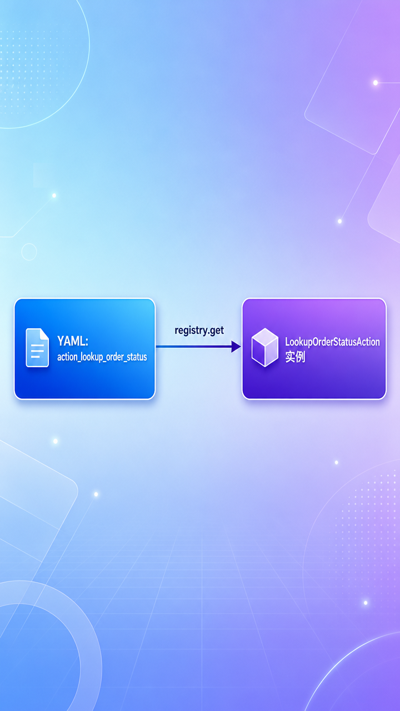
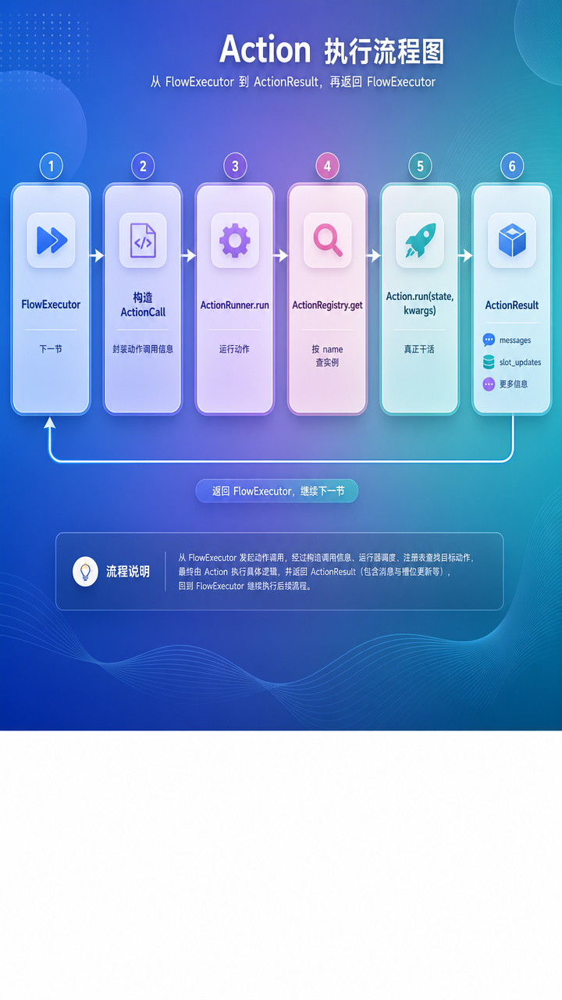
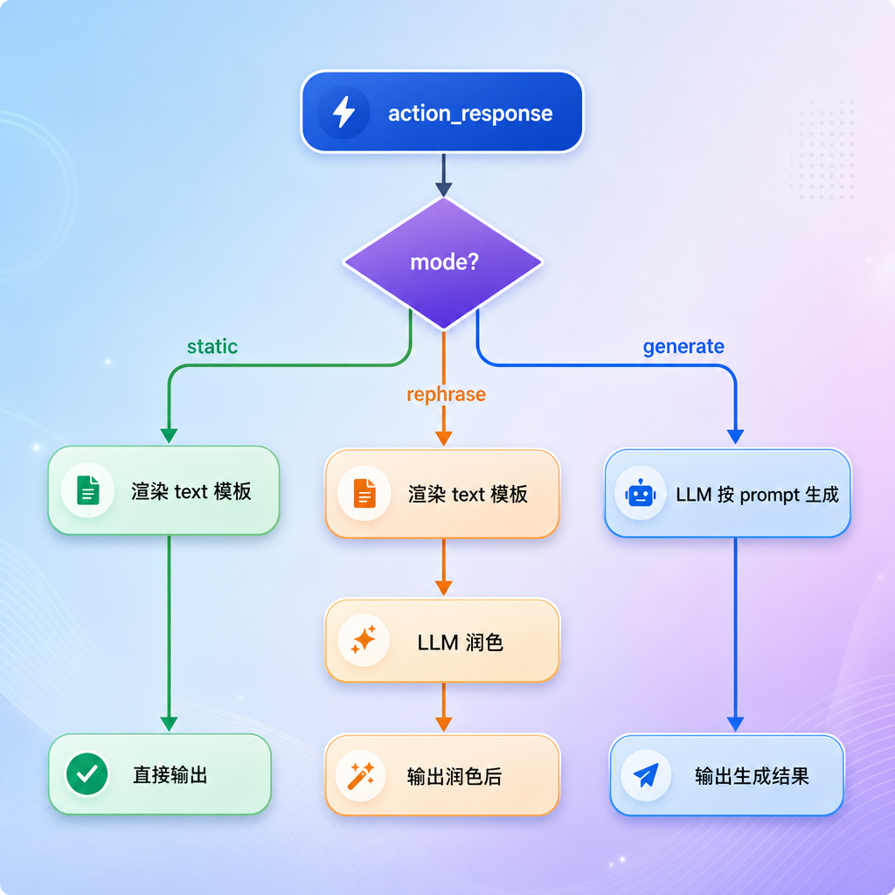
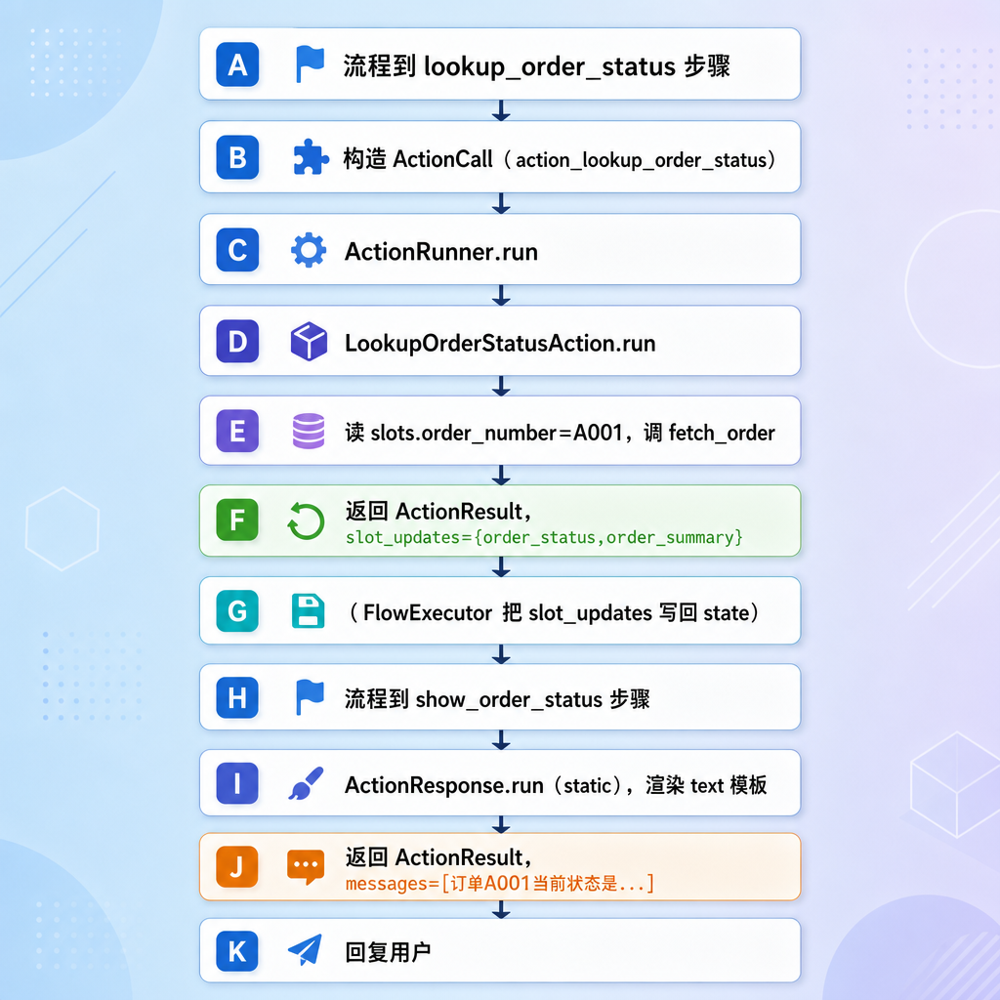

# Action 实现（所有动作）

---

## 第1章 任务目标

上一节 `CommandProcessor` 把对话状态改好了——任务建好、槽位填好、系统过场激活。但到目前为止，**还没有任何"干实事"的代码**：没有去查订单、没有调物流接口、没有生成回复文本。这些"实事"，就是这一节的主角——**Action**。

### 1.1 Action 在整个系统里的位置

回顾流程编排那一节，YAML 流程里有一种 `action` 步骤：

```yaml
- id: lookup_order_status
  type: action
  action: action_lookup_order_status   # ← 这里引用一个 action 名
  next: show_order_status
```

YAML 只负责"编排"——规定先做什么、后做什么。但"具体怎么查订单""怎么生成回复"这些**真正的业务实现**，YAML 写不了，得交给 Python 代码。这段 Python 代码，就是一个 `Action`。


一句话：**YAML 是骨架，Action 是血肉**。

### 1.2 本节范围

这一节把**所有 action 以及它们的支撑框架**一次性实现完，但**仍不实现 FlowExecutor**。

| 内容 | 本节 |
| --- | --- |
| Action 基类、ActionResult | ✅ |
| ActionRegistry 注册表、ActionRunner 执行器、ActionCall | ✅ |
| 内置 action：ActionResponse（三模式）、ActionListen | ✅ |
| 自定义 action：查订单、查物流、推荐商品 | ✅ |
| shared：调用电商接口的工具函数 | ✅ |
| action 的自动注册（builder） | ✅ |
| FlowExecutor（谁来调这些 action） | ⛔ 下一节 |

> 注意一个"鸡生蛋"的关系：action 是被 `FlowExecutor` 调用的，但 FlowExecutor 下一节才实现。本节先把 action 全部备好——就像先把所有工具打磨好放进工具箱，下一节再讲"工人（FlowExecutor）怎么按图纸取用这些工具"。

### 1.3 action 全景

这一节要实现的所有 action：

| 类别 | action 名 | 干什么 |
| --- | --- | --- |
| 内置 | `action_response` | 生成一条回复（三种模式） |
| 内置 | `action_listen` | 哨兵：表示"该等用户输入了" |
| 自定义 | `action_lookup_order_status` | 调订单接口查状态 |
| 自定义 | `action_lookup_logistics` | 调物流接口查进度 |
| 自定义 | `action_recommend_similar_products` | 推荐相似商品（占位） |

---

## 第2章 Action 框架：四个核心概念

在看具体 action 之前，先把支撑它们的四个框架概念理清楚：`Action`（基类）、`ActionResult`（返回值）、`ActionRegistry`（注册表）、`ActionRunner`（执行器）。

### 2.1 Action：所有动作的基类

```python
from abc import ABC, abstractmethod
from dataclasses import dataclass, field
from typing import Any

from atguigu.domain.messages import BotMessage
from atguigu.domain.state import DialogueState


class Action(ABC):
    name: str

    @abstractmethod
    async def run(
            self,
            state: DialogueState,
            action_kwargs: dict[str, Any],
    ) -> ActionResult:
        pass
```

每个 action 都是 `Action` 的子类，要做两件事：

- 定一个唯一的 `name`（和 YAML 里 `action: xxx` 对上）
- 实现 `run` 方法：拿到当前 `state` 和参数 `action_kwargs`，干活，返回 `ActionResult`

`run` 是 `async` 的——因为很多 action 要调外部接口（查订单/物流），是高延迟 I/O，必须异步。

### 2.2 ActionResult：动作的产物

```python
@dataclass
class ActionResult:
    messages: list[BotMessage] = field(default_factory=list)
    slot_updates: dict[str, Any] = field(default_factory=dict)
```

一个 action 干完活，会产出两类东西之一（或都不产出）：

| 字段 | 含义 | 哪种 action 用 |
| --- | --- | --- |
| `messages` | 要发给用户的回复 | 生成回复类（action_response、推荐商品） |
| `slot_updates` | 要写回 state 的槽位 | 查询类（查订单、查物流） |

这是一个关键的设计：**action 自己不直接改 state**。它只是把"我查到了这些数据，请写回这些槽位"打包进 `slot_updates` 返回。真正写回 state 的动作，由调用方（FlowExecutor）统一做。

为什么这么设计？因为这样 action 就是一个**纯函数式的"输入 state、输出结果"**的东西——给它 state，它返回该改什么，但不亲自动手。这让 action 容易测试、副作用集中可控。（这个"谁来写回"的细节，下一节 FlowExecutor 会看到。）

### 2.3 ActionRegistry：动作注册表

```python
class ActionRegistry:
    def __init__(self) -> None:
        self._actions: dict[str, Action] = {}

    def register(self, action: Action) -> None:
        self._actions[action.name] = action

    def get(self, name: str) -> Action:
        if name not in self._actions:
            raise KeyError(f"Unknown action '{name}'.")
        return self._actions[name]
```

注册表维护一张 `name -> Action 实例` 的表。它的意义是**解耦**：YAML 里写的是 action 的**名字**（字符串 `action_lookup_order_status`），而真正执行的是 Python **实例**。注册表负责把名字翻译成实例。



这又是课程里反复出现的"字符串 → 对象"映射套路，和 `STEP_TYPE_TO_CLASS`、`COMMAND_NAME_TO_CLASS` 同源。

### 2.4 ActionRunner 与 ActionCall：动作执行器

```python
@dataclass
class ActionCall:
    action_name: str
    action_kwargs: dict[str, Any] = field(default_factory=dict)


class ActionRunner:
    def __init__(self, registry: ActionRegistry) -> None:
        self.registry = registry

    async def run(self, action_call: ActionCall, state: DialogueState) -> ActionResult:
        action_name = action_call.action_name
        action = self.registry.get(action_name)
        return await action.run(state, action_call.action_kwargs)
```

- `ActionCall`：一次动作调用请求，装着"调哪个 action（`action_name`）+ 传什么参数（`action_kwargs`）"。它由下一节的 `FlowExecutor` 构造。
- `ActionRunner.run`：拿到 `ActionCall`，从注册表查出 action 实例，调它的 `run`，返回结果。

`ActionRunner` 自己不关心 action 内部干什么，它只做三件事：**查表 → 调用 → 返回**。

### 2.5 四个概念的协作



一句话串起来：FlowExecutor 想执行某个 action，就构造一个 `ActionCall` 交给 `ActionRunner`；`ActionRunner` 拿 name 去 `ActionRegistry` 查出 `Action` 实例，调它的 `run`，把 `ActionResult` 还回去。

---

## 第3章 内置 action 之一：

`action_response` 是**最重要**、也最复杂的 action——**几乎所有"对用户说话"都靠它**。它支持三种模式。

### 3.1 三种模式总览

```python
class ActionResponse(Action):
    name = "action_response"

    async def run(self, state: DialogueState, action_kwargs: dict[str, Any]) -> ActionResult:
        mode = action_kwargs.get("mode", "static")
        if mode == "static":
            text = action_kwargs['text']
            rendered_text = self._render_text(text, state)
            return ActionResult(messages=[BotMessage(text=rendered_text)])
        elif mode == "rephrase":
            text = action_kwargs['text']
            rendered_text = self._render_text(text, state)
            prompt_text = action_kwargs['prompt']
            message = await self._call_llm(prompt_text, state, rendered_text)
            return ActionResult(messages=[BotMessage(text=message)])
        else:  # generate
            prompt_text = action_kwargs['prompt']
            message = await self._call_llm(prompt_text, state)
            return ActionResult(messages=[BotMessage(text=message)])
```

三种模式的取舍——**要不要用 LLM、用 LLM 做什么**：

| mode | 怎么生成回复 | 用 LLM 吗 | 适用场景 |
| --- | --- | --- | --- |
| `static` | 只渲染 `text` 模板 | 否 | 文案已写死在 YAML，直接用 |
| `rephrase` | 渲染 `text` 后，让 LLM 润色 | 是 | 有底稿，但想说得更自然 |
| `generate` | 直接用 `prompt` 让 LLM 生成 | 是 | 没有预设文案，从零生成 |



### 3.2 static 模式

最常用的模式。YAML 里写好文案模板，直接渲染：

```yaml
- id: show_order_status
  type: action
  action: action_response
  args:
    text: "订单{{ slots.order_number }}当前状态是：{{ slots.order_status }}。{{ slots.order_summary }}"
  next: end
```

渲染方法：

```python
def _render_text(self, text: str, state: DialogueState) -> str:
    template = Template(text)
    result = template.render(
        slots=state.active_task.slots if state.active_task else {},
        context=state.active_system_task or state.active_task,
    )
    return result
```

用 Jinja2 把模板里的 `{{ slots.xxx }}` 替换成真实值。模板里能访问两个变量：

| 变量 | 是什么 | 例子 |
| --- | --- | --- |
| `slots` | 当前任务收集/查到的槽位 | `slots.order_number` → "A001" |
| `context` | 当前上下文（系统过场优先，否则业务任务） | `context.started_flow_name` → "退款申请" |

举例：查完订单状态后，`slots` 里已经有了 `order_number="A001"`、`order_status="已发货"`、`order_summary="订单金额 ¥99。"`，渲染上面那个模板得到：

```text
订单A001当前状态是：已发货。订单金额 ¥99。
```

> 注意 `context` 变量：业务流程里它是 active_task，**系统流程**里它是 active_system_task。这就是为什么 `system_flows.yml` 里能写 `{{ context.started_flow_name }}`——那时候 context 指向的是 `StartedSystemContext`，带着 `started_flow_name` 字段。

### 3.3 rephrase 模式

有时候 YAML 里写死的文案太生硬，想让它更自然。rephrase 模式：先渲染出底稿，再交给 LLM 润色。

`system_flows.yml` 的 `system_cannot_handle` 流程就用了它：

```yaml
- id: ask_rephrase
  type: action
  action: action_response
  args:
    mode: rephrase
    text: "抱歉，我这边没有完全听明白。你可以再具体说一下你想处理什么电商问题吗？"
    prompt: |
      你是一个中文电商客服助手，语气自然、友好、简洁。
      请基于下面的建议回复，生成一句更自然的中文回复，保持原意，不要扩写。
      对话上下文：
      {{ history }}
      用户最后一句：
      用户：{{ user_message }}
      建议回复：{{ current_response }}
      改写后的回复：
```

`text` 是底稿（建议回复），`prompt` 是给 LLM 的润色指令。注意 prompt 里的 `{{ current_response }}`——它就是渲染好的底稿，LLM 在它的基础上改写。

### 3.4 generate 模式

没有预设文案，完全靠 LLM 按 prompt从零 生成。`run` 里 generate 分支不读 `text`，只用 `prompt`：

```python
else:  # generate
    prompt_text = action_kwargs['prompt']
    message = await self._call_llm(prompt_text, state)   # 没传 rendered_text
    return ActionResult(messages=[BotMessage(text=message)])
```

### 3.5 _call_llm

**rephrase 和 generate 共用的 LLM 调用**

```python
async def _call_llm(self, prompt_text: str, state: DialogueState, rendered_text: str = "") -> str:
    prompt = PromptTemplate.from_template(prompt_text, template_format="jinja2")
    output_parser = StrOutputParser()
    chain = prompt | llm | output_parser

    bot_message = await chain.ainvoke({
        "history": HistoryBuilder.build(state.current_session().turns),
        "user_message": HistoryBuilder._render_user_message(state.pending_turn.user_message),
        "current_response": rendered_text,
    })
    return bot_message
```

rephrase 和 generate 都走这个方法，区别只在传不传 `rendered_text`：

- rephrase：传渲染好的底稿（`current_response` 有值），LLM 润色它
- generate：不传（`current_response=""`），LLM 从零生成

它给 LLM 喂三个变量：对话历史、用户这句话、当前底稿。用 `StrOutputParser`——因为回复就是一句自然语言文本，不需要解析成结构化对象。

### 3.6 三种模式怎么选

| 你的需求 | 选哪个 mode |
| --- | --- |
| 文案固定，只是填几个槽位值（如"订单 X 状态是 Y"） | static |
| 有固定文案，但想让语气更自然、更贴合上下文 | rephrase |
| 没有固定文案，需要 LLM 根据情况现编 | generate |

实际项目里 **static 用得最多**（绝大多数业务回复都是模板填空），rephrase 用在系统过场/澄清这类想要自然语气的地方，generate 用得最少。

---

## 第4章 内置 action 之二：

```python
class ActionListen(Action):
    name = "action_listen"

    async def run(self, state: DialogueState, action_kwargs: dict[str, Any]) -> ActionResult:
        return ActionResult()
```

这是最简单的 action——**什么都不做，返回一个空的 ActionResult**。

它为什么存在？它是一个**哨兵（信号）**，表示"流程跑到这里，该停下来等用户输入了"。

回顾 `system_collect_information` 流程：

```yaml
- id: ask
  type: action
  action: action_response      # 先问"请告诉我订单号"
  args: context.response
  next: listen
- id: listen
  type: action
  action: action_listen        # 然后停下来,等用户回答
  next: end
```

收集槽位时，系统先用 `action_response` 问一句，再用 `action_listen` 把流程"挂起"，等用户下一句输入。

`action_listen` 的真正作用要在下一节 `FlowExecutor` 里才看得清——FlowExecutor 的推进循环遇到 `action_listen` 就**跳出循环**，把控制权交还给用户。所以它是"流程推进"和"等待用户"之间的分界信号。

> 记住这个名字 `action_listen`，下一节 FlowExecutor 的循环退出条件就是 `action_call.action_name == "action_listen"`。

---

## 第5章 自定义 action

内置 action 是通用的（发消息、等输入），而**查订单、查物流**这类具体业务，放在 `custom/` 目录下，是自定义 action。它们的共性是：**调电商后端的 HTTP 接口，把结果写回槽位**。

### 5.1 shared.py：调接口的工具函数

自定义 action 都要调电商接口，这些调用逻辑抽到 `custom/shared.py` 共用：

```python
from urllib.parse import quote
from atguigu.conf.config import settings
from atguigu.infrastructure.http_client import http_client


def _base_url() -> str:
    return settings.commerce_api_base_url.rstrip("/")


def _extract_data(result: dict | None) -> dict | None:
    data = result.get("data") if isinstance(result, dict) else None
    return data if isinstance(data, dict) else None


async def fetch_order(order_id: str) -> dict | None:
    try:
        r = await http_client.get(f"{_base_url()}/orders/{quote(order_id)}")
        return _extract_data(r.json())
    except Exception:
        return None


async def fetch_logistics(order_id: str) -> dict | None:
    try:
        r = await http_client.get(f"{_base_url()}/orders/{quote(order_id)}/logistics")
        return _extract_data(r.json())
    except Exception:
        return None


async def fetch_product(product_id: str) -> dict | None:
    try:
        r = await http_client.get(f"{_base_url()}/products/{quote(product_id)}")
        return _extract_data(r.json())
    except Exception:
        return None
```

三个 fetch 函数分别调订单、物流、商品接口。几个共性设计：

| 设计 | 说明 |
| --- | --- |
| 共享 `http_client` | 模块级单例，复用连接池，不每次新建（高并发友好） |
| `quote(order_id)` | URL 编码，防止 id 里有特殊字符破坏 URL |
| `try/except` 返回 None | **优雅降级**：接口挂了不抛异常，返回 None，让上层 action 兜底 |
| `_extract_data` | 电商接口返回 `{"data": {...}}` 包了一层，统一剥出里面的 data |

`_build_order_summary` 是个辅助函数，把订单数据拼成一句摘要：

```python
def _build_order_summary(payload: dict[str, Any]) -> str:
    parts = []
    if payload.get("amount"):
        parts.append(f"订单金额 ¥{payload['amount']}")
    items = payload.get("items") or []
    if items:
        titles = [str(item.get("title_snapshot") or "").strip()
                  for item in items[:2] if item.get("title_snapshot")]
        if titles:
            parts.append("商品：" + "、".join(titles))
    return "。".join(parts) + "。" if parts else ""
```

### 5.2 查订单状态

**action_lookup_order_status**

```python
class LookupOrderStatusAction(Action):
    name = "action_lookup_order_status"

    async def run(self, state: DialogueState, action_kwargs: dict[str, Any]) -> ActionResult:
        order_number = state.active_task.slots.get("order_number")
        payload = await fetch_order(order_number)

        if payload is None:
            return ActionResult(slot_updates={
                "order_status": "查询失败",
                "order_summary": "暂时无法查到该订单信息，请稍后再试。",
            })

        return ActionResult(slot_updates={
            "order_status": payload.get("status_desc") or payload.get("status") or "未知",
            "order_summary": _build_order_summary(payload),
        })
```

它的逻辑很典型，是所有"查询类 action"的模板：

1. **从槽位读输入**：`state.active_task.slots.get("order_number")`——订单号是之前 collect 步骤收集来的
2. **调接口**：`fetch_order(order_number)`
3. **失败兜底**：接口返回 None，写一组"查询失败"的降级槽位，保证流程能继续（不会因为没数据而崩）
4. **成功写回**：把查到的状态、摘要打包进 `slot_updates` 返回

注意它返回的是 **slot_updates 而不是 messages**——它只负责"查到数据写回槽位"，至于把这些槽位拼成话发给用户，是后面 `action_response` 的事。

回顾 `order_status_query` 流程，正好印证这个分工：

```yaml
- id: lookup_order_status
  type: action
  action: action_lookup_order_status      # ① 查数据,写进 order_status/order_summary 槽
  next: show_order_status
- id: show_order_status
  type: action
  action: action_response                 # ② 把槽位拼成话发给用户
  args:
    text: "订单{{ slots.order_number }}当前状态是：{{ slots.order_status }}。{{ slots.order_summary }}"
  next: end
```

**查（写槽）和说（读槽生成回复）分成两步** ——这是这套设计的一个典型模式。

### 5.3 查物流

**action_lookup_logistics**

```python
class LookupLogisticsAction(Action):
    name = "action_lookup_logistics"

    async def run(self, state: DialogueState, action_kwargs: dict[str, Any]) -> ActionResult:
        order_number = state.active_task.slots.get("order_number")
        payload = await fetch_logistics(order_number)

        if payload is None:
            return ActionResult(slot_updates={
                "tracking_number": "未知",
                "logistics_company": "未知",
                "logistics_status": "暂时无法查到物流信息，请稍后再试。",
            })

        return ActionResult(slot_updates={
            "tracking_number": payload.get("tracking_number") or "未知",
            "logistics_company": payload.get("logistics_company") or "未知",
            "logistics_status": payload.get("status_desc") or payload.get("status") or "未知",
        })
```

和查订单几乎一样的结构，只是查的是物流、写的是物流相关的三个槽位（单号、公司、进度）。同样是"读 order_number → 调接口 → 写槽 / 失败兜底"。

它在 `logistics_tracking` 流程里也是"查 + 说"两步搭配 `action_response`。

### 5.4 推荐相似商品（占位）

**action_recommend_similar_products**

```python
class RecommendSimilarProductsAction(Action):
    name = "action_recommend_similar_products"

    async def run(self, state: DialogueState, action_kwargs: dict[str, Any]) -> ActionResult:
        product_id = state.active_task.slots.get("product_id")
        label = product_id or "这件商品"

        payload = await fetch_product(product_id)
        if payload:
            label = str(payload.get("title") or "").strip() or label

        text = (
            f"我已经收到你对\"{label}\"的相似商品推荐需求。"
            "不过当前版本还没有接入正式的推荐系统，稍后可以继续补上这部分能力。"
        )
        return ActionResult(messages=[BotMessage(text=text)])
```

这是一个**占位 action**——推荐功能还没真正实现，先返回一句"已收到需求，但功能待接入"。

注意它和前两个查询 action 的区别：它返回的是 **messages 而不是 slot_updates**——因为它直接生成回复给用户，不需要后面再接 `action_response`。它会查一下商品名（`fetch_product`）让回复更具体，查不到就用"这件商品"兜底。

### 5.5 三个自定义 action 对照

| action | 读什么槽 | 调什么接口 | 产出 | 后面接什么 |
| --- | --- | --- | --- | --- |
| `action_lookup_order_status` | order_number | 订单接口 | slot_updates（状态、摘要） | action_response 说出来 |
| `action_lookup_logistics` | order_number | 物流接口 | slot_updates（单号、公司、进度） | action_response 说出来 |
| `action_recommend_similar_products` | product_id | 商品接口 | messages（直接回复） | 无（自己就是回复） |

可以看到两种风格：**查询类**（写槽，留给 action_response 说）和**直接回复类**（自己产出 messages）。

---

## 第6章 action 的自动注册

action 写好了，得注册进 `ActionRegistry`，`ActionRunner` 才能按名字找到它们。注册逻辑在 `builder.py`。

### 6.1 内置 action：手动注册

```python
def register_builtin_actions(action_runner: ActionRunner):
    action_runner.registry.register(ActionResponse())
    action_runner.registry.register(ActionListen())
```

内置就两个，手动 register 即可。

### 6.2 自定义 action：自动发现

自定义 action 可能越来越多，一个个手动注册容易漏。所以用"自动发现"——扫描 `custom/` 目录，把里面所有 `Action` 子类自动注册：

```python
def register_custom_actions(action_runner: ActionRunner):
    package = importlib.import_module("atguigu.task.action.custom")

    for _, module_name, is_pkg in pkgutil.iter_modules(package.__path__, prefix=f"{package.__name__}."):
        if is_pkg:
            continue
        module = importlib.import_module(module_name)
        for _, obj in inspect.getmembers(module, inspect.isclass):
            if not issubclass(obj, Action) or obj is Action:
                continue
            if obj.__module__ != module.__name__:
                continue
            action_runner.registry.register(obj())
```

它做的事：遍历 `custom/` 包下每个模块 → 找出每个模块里定义的 `Action` 子类 → 实例化并注册。

几个判断条件的意义：

| 条件 | 作用 |
| --- | --- |
| `is_pkg` 跳过 | 只处理模块文件，不处理子包 |
| `issubclass(obj, Action) and obj is not Action` | 只要 Action 的**子类**，排除基类本身 |
| `obj.__module__ == module.__name__` | 只注册"在这个模块里定义的"类，排除 import 进来的（如 `Action` 基类被 import 时不重复注册） |

### 6.3 自动发现的好处

```python
def build_action_runner() -> ActionRunner:
    action_runner = ActionRunner(ActionRegistry())
    register_builtin_actions(action_runner)
    register_custom_actions(action_runner)
    return action_runner
```

有了自动发现，**新增一个自定义 action 时，完全不用改注册代码**——只要在 `custom/` 下新建一个文件、写个 `Action` 子类，启动时就会被自动扫到注册。这是开闭原则的又一次体现。

> 想新增"查询优惠券"功能？在 `custom/lookup_coupon.py` 写一个 `class LookupCouponAction(Action)`、设 `name = "action_lookup_coupon"`、实现 `run`，然后在 YAML 里 `action: action_lookup_coupon` 引用即可。注册代码一行都不用动。

---

## 第7章 本节流程

虽然 FlowExecutor 还没实现，但我们可以预演一下"查订单状态"这个流程里 action 是怎么协作的（假设 FlowExecutor 已经在按流程推进）：

```text
用户:查订单状态 A001
```

流程 `order_status_query` 推进到 action 步骤时：



可以看到两类 action 的配合：

1. `action_lookup_order_status` 负责**查**——调接口、把结果写进槽位（slot_updates）
2. `action_response` 负责**说**——读槽位、渲染成回复（messages）

中间"把 slot_updates 写回 state"这一步由 FlowExecutor 做（下一节）。

---

## 第8章 小结

### 8.1 这一节实现了什么

| 文件 | 内容 |
| --- | --- |
| `task/action/base.py` | `Action` 基类、`ActionResult`、`ActionRegistry` |
| `task/action/runner.py` | `ActionRunner`、`ActionCall` |
| `task/action/builtin/action_response.py` | `ActionResponse`（static/rephrase/generate 三模式） |
| `task/action/builtin/action_listen.py` | `ActionListen`（哨兵） |
| `task/action/custom/shared.py` | `fetch_order` / `fetch_logistics` / `fetch_product` / `_build_order_summary` |
| `task/action/custom/lookup_order_status.py` | `LookupOrderStatusAction` |
| `task/action/custom/lookup_logistics.py` | `LookupLogisticsAction` |
| `task/action/custom/recommend_similar_products.py` | `RecommendSimilarProductsAction` |
| `task/action/builder.py` | 内置手动注册 + 自定义自动发现 |

### 8.2 几个值得学习的设计

1. **YAML 是骨架，Action 是血肉**：YAML 编排流程，Action 实现"查 API、发消息、等输入"这些实事。
2. **Action 不直接改 state**：只返回 `ActionResult`（messages / slot_updates），由调用方统一写回。副作用集中可控、易测试。
3. **查与说分离**：查询类 action 写槽（slot_updates），回复类 action（action_response）读槽生成回复。两步搭配。
4. **ActionResponse 三模式**：static（模板）/ rephrase（润色）/ generate（生成），按"要不要 LLM、用 LLM 做什么"区分。static 最常用。
5. **优雅降级**：接口调用 try/except 返回 None，action 写降级槽位，保证流程不崩。
6. **自动发现**：custom 目录下的 action 自动扫描注册，新增 action 不用改注册代码。
7. **action_listen 是哨兵**：本身不干活，作为"该等用户输入了"的信号，下一节 FlowExecutor 靠它退出推进循环。

### 8.3 下一节

终于轮到 `FlowExecutor`——把前面所有积木拼起来的那个"工人"。它会读 `DialogueState`，按 YAML 流程一步步走：遇到 collect 就准备收集、遇到 action 就构造 `ActionCall` 交给 `ActionRunner` 执行、把 action 返回的 slot_updates 写回 state、收集 messages、遇到 action_listen 就停下来等用户。这一节准备好的所有 action，到时候就能看到它们是怎么被一个个调用、串成一次完整对话回复的。
