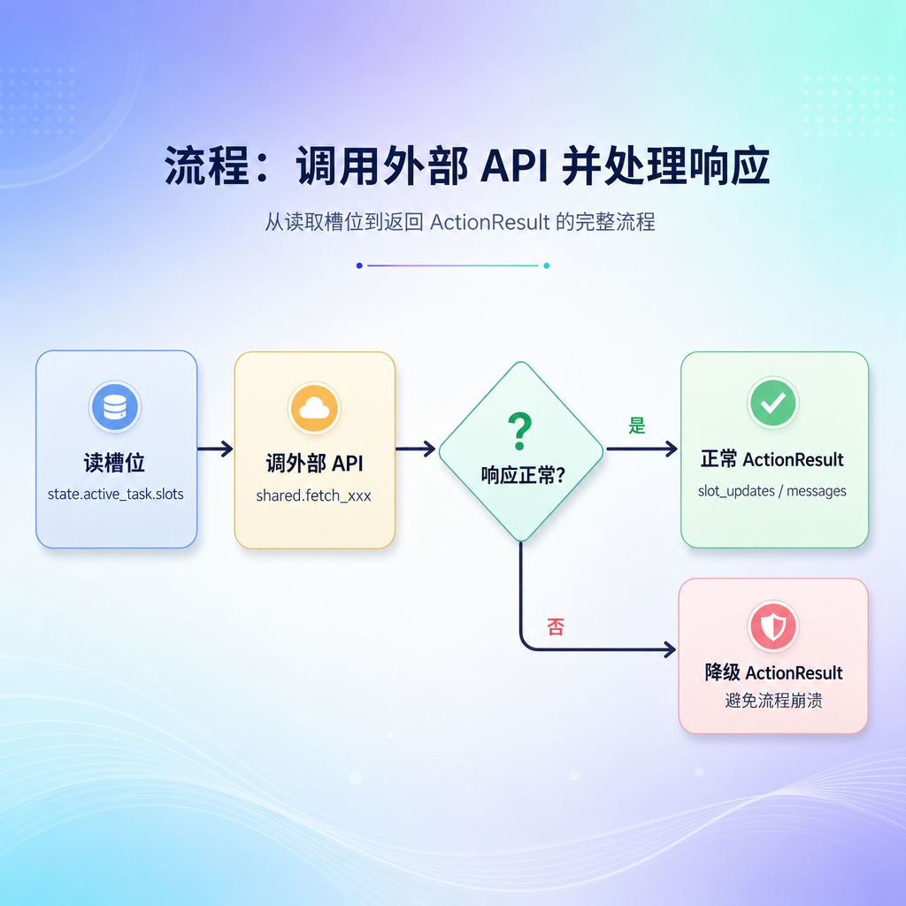
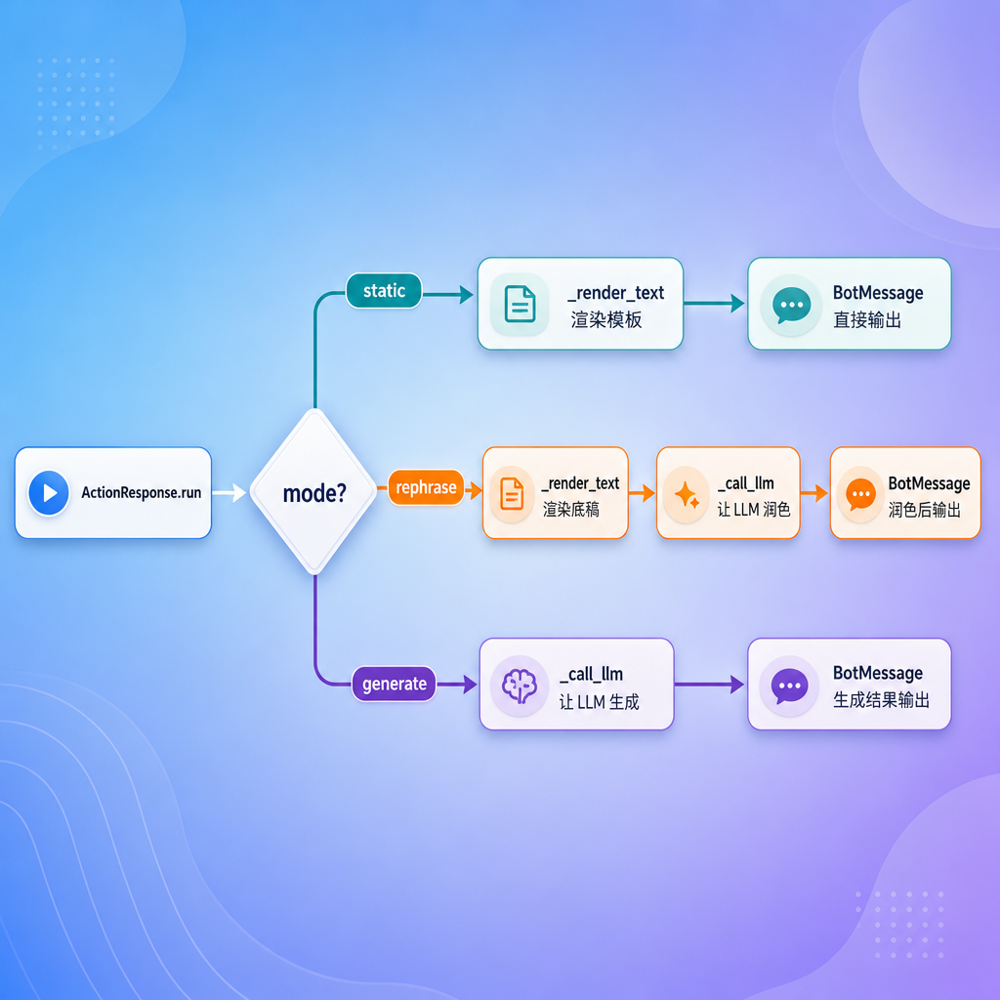
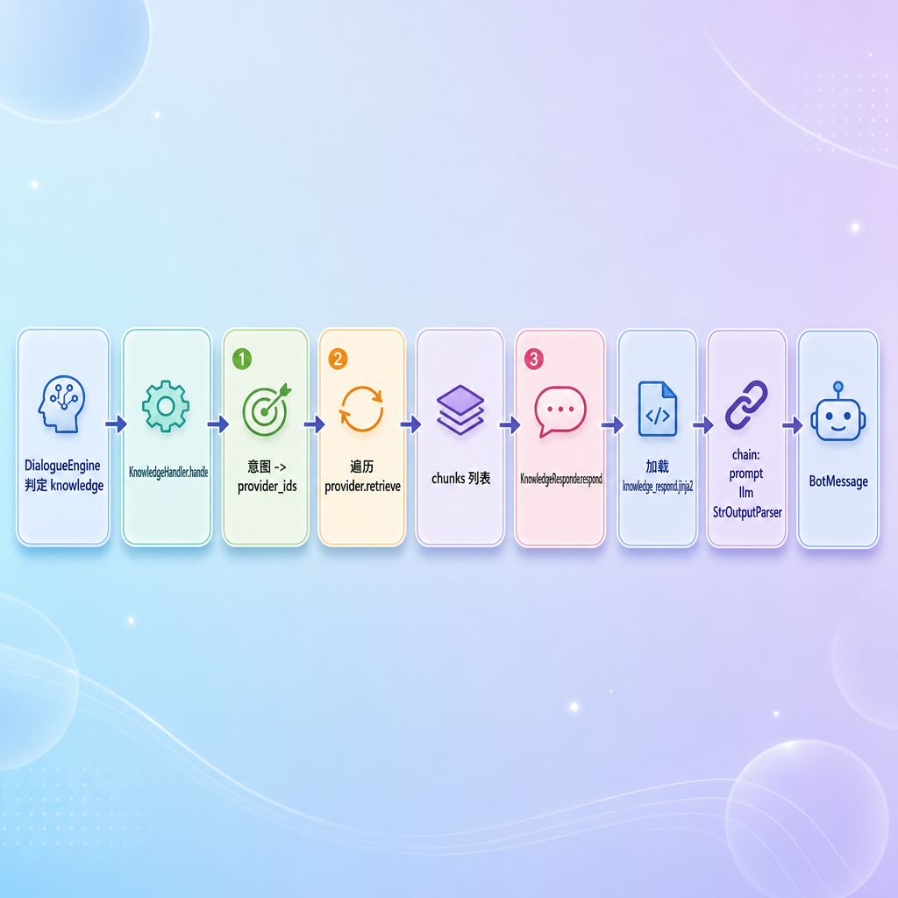

# Action 与 Handler 实现

---

## 第 1 章 这一节做什么

09 课件里，我们把 action 框架的"骨架"搭好了：基类 `Action`、`ActionResult`、注册表、`ActionRunner`、自动发现。每个 action 的 `name` 和签名都摆在那里，但**真正干活的 `run` 方法**还没有展开讲。

而 07 课件里，我们讲完了 task 轨道的防幻觉校验和对象消息处理，最后留了一个尾巴——**knowledge 轨道**和 **chitchat 轨道**当时没有实现，引擎里它们也只是占位。

这一节，把这两件事一次性补齐：

- 把 **5 个 action 的 `run` 方法**完整实现（`ActionResponse`、`ActionListen`、`LookupOrderStatusAction`、`LookupLogisticsAction`、`RecommendSimilarProductsAction`）
- 把 **`ChitchatHandler` 和 `KnowledgeHandler`** 这两条轨道也实现完

做完这一节，整个 customer-service 项目除了最后的 `FlowExecutor`（下一节再讲），其余几乎所有业务实现都齐了。

---

## 第 2 章 实现路线

为了让学员看的时候有节奏感，先把这一节要走的路径列清楚。

5 个 action 按"复杂度由低到高"排：

| 顺序 | action | 复杂度 |
| --- | --- | --- |
| 第 3 章 | `ActionListen` | 极简 |
| 第 4 章 | 三个查询类 action | 中（HTTP 调用 + 降级） |
| 第 5 章 | `ActionResponse` | 高（三种模式 + LLM） |

讲完 action 后，再讲两个 handler：

| 顺序 | handler | 说明 |
| --- | --- | --- |
| 第 6 章 | `ChitchatHandler` | 闲聊轨道（轻） |
| 第 7 章 | `KnowledgeHandler` | 知识轨道（重，涉及 provider 检索） |

之所以这么排，是因为后讲的内容会用到前面铺好的概念。比如 `ActionResponse` 用到的 LLM 调用模式，正好为 handler 章节铺路。

---

## 第 3 章 ActionListen

我们从最简单的开始。`ActionListen` 是一个"哨兵"——它不干任何活，只起一个**信号标记**作用。

```python
class ActionListen(Action):
    name = "action_listen"

    async def run(self, state: DialogueState, action_kwargs: dict[str, Any]) -> ActionResult:
        return ActionResult()
```

它的 `run` 方法只有一行：返回一个空的 `ActionResult`。空到没有 messages、也没有 slot_updates。

那它为什么存在？因为它的 **`name` 本身**就是一个约定信号。下一节 `FlowExecutor` 的外层循环里会有这样一行判断：

```python
if action_call.action_name == "action_listen":
    break
```

也就是说，`action_listen` 是"该等用户输入了"的退出信号。流程跑到这一步，意味着系统已经把该说的都说完了，下面该让用户开口了。

> 这也是为什么它的 `run` 必须返回一个空 `ActionResult`——它根本不需要产生任何 side effect。

`ActionListen` 是最简单的一个，所以先讲。下面进入比它复杂一点的查询类 action。

---

## 第 4 章 三个查询类 action

查询类 action 共有三个：`LookupOrderStatusAction`（查订单）、`LookupLogisticsAction`（查物流）、`RecommendSimilarProductsAction`（推荐相似商品）。

它们的工作模式高度相似，所以我们先抽出一个"通用结构"。

### 4.1 共同模式

每个查询类 action 的 `run` 都按四步走：



| 步骤 | 做什么 |
| --- | --- |
| 1. 读槽位 | 从 `state.active_task.slots` 取 action 需要的输入（如订单号、商品 id） |
| 2. 调接口 | 调用 `shared.py` 里的工具函数（`fetch_order` / `fetch_logistics` / `fetch_product`） |
| 3. 判失败 | API 不通时返回 None，必须用降级数据兜底 |
| 4. 返回结果 | 把结果包成 `ActionResult` 返回给 FlowExecutor |

理解了这个模式，三个 action 的实现就像填空。

### 4.2 共享工具模块 

三个自定义 action 都依赖同一个共享模块 `shared.py`，它把 HTTP 调用、数据提取、订单摘要等公共逻辑抽出来，避免每个 action 里重复写。**完整代码如下：**

```python
from typing import Any
from urllib.parse import quote

from atguigu.conf.config import settings
from atguigu.infrastructure.http_client import http_client


def _base_url() -> str:
    return settings.commerce_api_base_url.rstrip("/")


def _extract_data(result: dict | None) -> dict | None:
    data = result.get("data") if isinstance(result, dict) else None
    return data if isinstance(data, dict) else None


async def fetch_order(order_id: str) -> dict | None:
    try:
        r = await http_client.get(f"{_base_url()}/orders/{quote(order_id)}")
        return _extract_data(r.json())
    except Exception:
        return None


async def fetch_logistics(order_id: str) -> dict | None:
    try:
        r = await http_client.get(f"{_base_url()}/orders/{quote(order_id)}/logistics")
        return _extract_data(r.json())
    except Exception:
        return None


async def fetch_product(product_id: str) -> dict | None:
    try:
        r = await http_client.get(f"{_base_url()}/products/{quote(product_id)}")
        return _extract_data(r.json())
    except Exception:
        return None


def _build_order_summary(payload: dict[str, Any]) -> str:
    parts = []
    if payload.get("amount"):
        parts.append(f"订单金额 ¥{payload['amount']}")
    items = payload.get("items") or []
    if items:
        titles = [str(item.get("title_snapshot") or "").strip() for item in items[:2] if item.get("title_snapshot")]
        if titles:
            parts.append("商品：" + "、".join(titles))
    return "。".join(parts) + "。" if parts else ""
```

这个模块提供了 **5 个函数**，按职责分两组：

**基础工具（模块内部使用）：**

| 函数 | 作用 |
| --- | --- |
| `_base_url()` | 从 settings 读取电商 API 基础地址，去掉末尾斜杠 |
| `_extract_data(result)` | 从 JSON 响应中提取嵌套的 `"data"` 字段，类型不对或为 None 时返回 None |

**对外接口（三个 action 直接调用）：**

| 函数 | 对应的 action | 说明 |
| --- | --- | --- |
| `fetch_order(order_id)` | `LookupOrderStatusAction` | GET `/orders/{id}` → 提取 data |
| `fetch_logistics(order_id)` | `LookupLogisticsAction` | GET `/orders/{id}/logistics` → 提取 data |
| `fetch_product(product_id)` | `RecommendSimilarProductsAction` | GET `/products/{id}` → 提取 data |
| `_build_order_summary(payload)` | `LookupOrderStatusAction` | 把原始订单 JSON 拼成"订单金额 ¥99。商品：A、B。"的人类可读摘要 |

**设计要点：**

1. **统一异常处理**：三个 `fetch_*` 函数都用 `try/except Exception: return None` 兜底。这是"优雅降级"的关键——HTTP 超时、DNS 解析失败、服务端 500 都不会让整个对话流程崩溃，action 收到 `None` 后填入降级文案即可。

2. **URL 编码**：`urllib.parse.quote(order_id)` 确保订单号里的特殊字符（如空格、中文）被安全编码。

3. **`_build_order_summary` 的容错**：对 `amount`、`items`、`title_snapshot` 全部用 `.get()` 安全取值，避免 KeyError；商品标题取前 2 个展示，防止列表过长。

下面逐个看三个 action 如何使用这些共享函数。

### 4.3 查订单状态

`LookupOrderStatusAction` 用于查询订单状态。它的输入是订单号，输出是订单状态和摘要。

```python
from typing import Any

from atguigu.task.action.base import Action, ActionResult
from atguigu.task.action.custom.shared import _build_order_summary, fetch_order
from atguigu.domain.state import DialogueState


class LookupOrderStatusAction(Action):
    """Fetches order status and summary from the e-commerce service."""

    name = "action_lookup_order_status"

    async def run(
        self,
        state: DialogueState,
        action_kwargs: dict[str, Any],
    ) -> ActionResult:
        order_number = state.active_task.slots.get("order_number")
        payload = await fetch_order(order_number)

        if payload is None:
            return ActionResult(slot_updates={
                "order_status": "查询失败",
                "order_summary": "暂时无法查到该订单信息，请稍后再试。",
            })

        return ActionResult(slot_updates={
            "order_status": payload.get("status_desc") or payload.get("status") or "未知",
            "order_summary": _build_order_summary(payload),
        })
```

注意这里返回的是 **`slot_updates`**，而不是 `messages`——也就是说，它不直接回话，只是把查到的数据写回到任务的槽位里。

那"说话"由谁来做？答案在 YAML 流程里：查询类 action 后面会紧跟一个 `action_response`，由后者读出这些槽位并拼成回复给用户。

回顾 `user_flows.yml` 里 `order_status_query` 流程的核心两步：

```yaml
- id: lookup_order_status
  type: action
  action: action_lookup_order_status      # 查 → 写槽位
  next: show_order_status

- id: show_order_status
  type: action
  action: action_response                 # 读槽位 → 说出来
  args:
    text: "订单{{ slots.order_number }}当前状态是：{{ slots.order_status }}。{{ slots.order_summary }}"
  next: end
```

**查询和回复分开两步**，这是一个非常清晰的分工。查询的产物（slot_updates）会被 FlowExecutor 自动写回 state，下一步的 `action_response` 自然读得到。

### 4.4 查物流

`LookupLogisticsAction` 几乎是上一个的复刻，只是它调的是物流接口，写回的是物流相关的几个槽位：

```python
from typing import Any

from atguigu.task.action.base import Action, ActionResult
from atguigu.task.action.custom.shared import fetch_logistics
from atguigu.domain.state import DialogueState


class LookupLogisticsAction(Action):
    """Fetches logistics tracking information from the e-commerce service."""

    name = "action_lookup_logistics"

    async def run(
        self,
        state: DialogueState,
        action_kwargs: dict[str, Any],
    ) -> ActionResult:
        order_number = state.active_task.slots.get("order_number")
        payload = await fetch_logistics(order_number)

        if payload is None:
            return ActionResult(slot_updates={
                "tracking_number": "未知",
                "logistics_company": "未知",
                "logistics_status": "暂时无法查到物流信息，请稍后再试。",
            })

        return ActionResult(slot_updates={
            "tracking_number": payload.get("tracking_number") or "未知",
            "logistics_company": payload.get("logistics_company") or "未知",
            "logistics_status": payload.get("status_desc") or payload.get("status") or "未知",
        })
```

跟查订单的结构完全一致，只是字段不一样。这种"模板化"的写法正是 4.1 节抽出共同模式的意义——新增一个查询类 action 时，直接照着填字段即可。

### 4.5 推荐相似商品

第三个查询类 action 走的是另一条路：它**直接返回 messages**，不返回 slot_updates。

```python
from typing import Any

from atguigu.domain.messages import BotMessage
from atguigu.task.action.base import Action, ActionResult
from atguigu.task.action.custom.shared import fetch_product
from atguigu.domain.state import DialogueState


class RecommendSimilarProductsAction(Action):
    """Placeholder for similar product recommendation (Phase 2)."""

    name = "action_recommend_similar_products"

    async def run(
            self,
            state: DialogueState,
            action_kwargs: dict[str, Any]
    ) -> ActionResult:
        product_id = state.active_task.slots.get("product_id")
        label = product_id or "这件商品"

        payload = await fetch_product(product_id)
        if payload:
            label = str(payload.get("title") or "").strip() or label

        text = (
            f"我已经收到你对\"{label}\"的相似商品推荐需求。"
            "不过当前版本还没有接入正式的推荐系统，稍后可以继续补上这部分能力。"
        )
        return ActionResult(messages=[BotMessage(text=text)])
```

这是一个**占位实现**——真正的推荐系统还没接入，所以先返回一句友好的提示。它自己生成回复文本（用商品 title 让回复更具体），所以不需要后面再接 `action_response`。

### 4.6 两种风格对照

讲完这三个，刚好可以把查询类 action 的两种风格对照一下：

| Action | 输入槽位 | 输出 | 后续是否需要 action_response |
| --- | --- | --- | --- |
| `action_lookup_order_status` | order_number | `slot_updates` | 需要（拼成订单状态回复） |
| `action_lookup_logistics` | order_number | `slot_updates` | 需要（拼成物流回复） |
| `action_recommend_similar_products` | product_id | `messages` | 不需要（自己已是回复） |

理解了这个对照，就清楚什么时候用哪种风格——**"查完留给别人说"用 slot_updates、"我自己说"用 messages**。

---

## 第 5 章 ActionResponse

到这里 action 框架里最简单和中等复杂度的都讲完了。剩下最重要、最复杂的就是 `ActionResponse`——所有"对用户说话"的事，几乎都靠它。

### 5.1 三种模式回顾

`ActionResponse` 支持三种模式：

| mode | 用 LLM 吗 | 适用 |
| --- | --- | --- |
| `static` | 否 | 模板已写死的文案 |
| `rephrase` | 是 | 有模板底稿，让 LLM 润色 |
| `generate` | 是 | 没有底稿，从零生成 |

`run` 方法按 `mode` 分发：

```python
class ActionResponse(Action):
    name = "action_response"

    async def run(self, state: DialogueState, action_kwargs: dict[str, Any]) -> ActionResult:
        mode = action_kwargs.get("mode", "static")
        if mode == "static":
            text = action_kwargs['text']
            rendered_text = self._render_text(text, state)
            return ActionResult(messages=[BotMessage(text=rendered_text)])
        elif mode == "rephrase":
            text = action_kwargs['text']
            rendered_text = self._render_text(text, state)
            prompt_text = action_kwargs['prompt']
            message = await self._call_llm(prompt_text, state, rendered_text)
            return ActionResult(messages=[BotMessage(text=message)])
        else:
            prompt_text = action_kwargs['prompt']
            message = await self._call_llm(prompt_text, state)
            return ActionResult(messages=[BotMessage(text=message)])
```

整个 `run` 没什么复杂逻辑，它就是按 mode 路由到两个辅助方法：`_render_text`（渲染模板）和 `_call_llm`（调 LLM）。下面分别看这两个辅助方法。

### 5.2 模板渲染：_render_text

`static` 模式完全靠它，`rephrase` 模式也要先用它生成底稿。

```python
def _render_text(self, text: str, state: DialogueState) -> str:
    template = Template(text)
    result = template.render(
        slots=state.active_task.slots if state.active_task else {},
        context=state.active_system_task or state.active_task,
    )
    return result
```

它给模板暴露**两个变量**：

| 变量 | 取自 | 模板里怎么用 |
| --- | --- | --- |
| `slots` | 当前任务的槽位 | `{{ slots.order_number }}` |
| `context` | 当前活跃上下文（系统任务优先） | `{{ context.started_flow_name }}` |

`context` 这里有个细节：**系统任务优先**。这正是 system flow 能用 `{{ context.started_flow_name }}` 这种写法的原因——激活系统流时，`active_system_task` 是非空的 `StartedSystemContext`，所以 `context` 指向它。

### 5.3 调 LLM：_call_llm

`rephrase` 和 `generate` 共用这个方法。它的核心是用 LangChain 串起一条链。

```python
async def _call_llm(self, prompt_text: str, state: DialogueState, rendered_text: str = "") -> str:
    prompt = PromptTemplate.from_template(prompt_text, template_format="jinja2")
    output_parser = StrOutputParser()
    chain = prompt | llm | output_parser

    bot_message = await chain.ainvoke({
        "history": HistoryBuilder.build(state.current_session().turns),
        "user_message": HistoryBuilder._render_user_message(state.pending_turn.user_message),
        "current_response": rendered_text,
    })
    return bot_message
```

它做三件事：

1. 把 `prompt_text`（来自 YAML 里写的 `prompt` 字段）当成 jinja2 模板
2. 用 `prompt | llm | StrOutputParser()` 组成 LangChain 链
3. 把当前会话历史、用户最新消息、`rendered_text` 灌进去，等 LLM 输出

注意 `rendered_text` 的两种取值：

| 调用场景 | rendered_text |
| --- | --- |
| rephrase 模式 | 第一步 `_render_text` 渲染出来的底稿 |
| generate 模式 | 空字符串 |

LLM 在 prompt 模板里用 `{{ current_response }}` 取它。**rephrase 模式下它是底稿，generate 模式下它就是空**。

### 5.4 一张图理清三种模式

把 `run` 的三条分支用流程图表达：



至此 5 个 action 的 `run` 都讲完了。下面进入 handler。

---

## 第 6 章 ChitchatHandler

闲聊是三条轨道里最轻的一条——没有流程推进、没有知识检索、没有命令处理，就是单纯把用户的话和对话历史交给 LLM，让它自然回一句。

### 6.1 handler 实现

```python
class ChitchatHandler:
    def __init__(self, responder: ChitchatResponder) -> None:
        self.responder = responder

    async def handle(self, state: DialogueState) -> list[BotMessage]:
        pending_turn = state.pending_turn
        user_message = pending_turn.user_message
        recent_turns = state.current_session().turns
        return await self.responder.respond(
            user_message=user_message,
            recent_turns=recent_turns,
        )
```

handler 自己不干活，它只是把 state 里的两份原料拿出来——**当前用户消息**和**最近对话历史**——交给 `ChitchatResponder` 处理。

### 6.2 responder 实现

真正调 LLM 的是 responder。

```python
class ChitchatResponder:
    async def respond(
            self,
            user_message: UserMessage,
            recent_turns: list[Turn],
    ) -> list[BotMessage]:
        user_message = HistoryBuilder._render_user_message(user_message)
        history = HistoryBuilder.build(recent_turns)

        prompt_text = load_prompt("chitchat_respond")
        prompt = PromptTemplate.from_template(prompt_text, template_format="jinja2")
        chain = prompt | llm | StrOutputParser()
        response = await chain.ainvoke({
            "user_message": user_message,
            "history": history,
        })
        return [BotMessage(text=response)]
```

整个 respond 的逻辑很短：

1. 把用户消息渲染成文本（`_render_user_message` 处理对象消息时也能转成 `[订单对象 ...]` 这种描述）
2. 把会话历史拼成对话记录
3. 加载 `chitchat_respond` 提示词，组成链
4. 调 LLM，输出文本包成 `BotMessage`

### 6.3 闲聊轨道全貌

合起来看一次闲聊请求的完整链路：


闲聊轨道讲完了。下面看更复杂一些的 knowledge 轨道。

---

## 第 7 章 KnowledgeHandler

知识问答比闲聊复杂——它要先**根据意图找到知识来源**，再**从这些来源检索知识**，最后才**结合知识生成回复**。

整个 knowledge 模块由 6 个文件组成，下面逐个展示完整代码。

### 7.1 模块总览

```
atguigu/knowledge/
├── __init__.py          # 空文件，标记为 Python 包
├── intents.py           # 意图定义 → 映射到 provider
├── providers.py         # 知识提供者（API / FAQ / RAG）
├── registry.py          # provider 注册表
├── responder.py         # 用知识 + LLM 生成回复
└── handler.py           # 对外入口，编排整个 knowledge 流程
```

依赖关系：`handler` → `intents` + `registry` + `responder` → `providers`

### 7.2 编排入口

**KnowledgeHandler（handler.py）**

```python
from atguigu.domain.messages import BotMessage
from atguigu.domain.state import DialogueState
from atguigu.knowledge.intents import KnowledgeIntent
from atguigu.knowledge.providers import KnowledgeChunk
from atguigu.knowledge.registry import KnowledgeProviderRegistry
from atguigu.knowledge.responder import KnowledgeResponder


class KnowledgeHandler:
    def __init__(self, knowledge_intents: dict[str, KnowledgeIntent],
                 provider_registry: KnowledgeProviderRegistry,
                 knowledge_responder: KnowledgeResponder):
        self.knowledge_intents = knowledge_intents
        self.provider_registry = provider_registry
        self.knowledge_responder = knowledge_responder

    async def handle(self, intents: list[str], state: DialogueState) -> list[BotMessage]:
        # ① 根据意图寻找知识来源
        provider_ids: list[str] = self._get_provider_ids_by_intents(intents)

        # ② 从每个 provider 检索知识片段
        chunks: list[KnowledgeChunk] = []
        for provider_id in provider_ids:
            provider = self.provider_registry.get(provider_id)
            current_chunks = await provider.retrieve(state)
            chunks.extend(current_chunks)

        # ③ 用知识生成回复
        return await self.knowledge_responder.respond(
            user_message=state.pending_turn.user_message,
            recent_turns=state.current_session().turns,
            chunks=chunks
        )

    def _get_provider_ids_by_intents(self, intents: list[str]) -> list[str]:
        provider_ids: list[str] = []
        for intent in intents:
            provider_ids.extend(self.knowledge_intents[intent].provider_ids)
        return list(set(provider_ids))
```

`handle` 方法三件事，按顺序推进：

| 步骤 | 方法 | 输入 | 输出 |
| --- | --- | --- | --- |
| ① 意图→来源 | `_get_provider_ids_by_intents` | `list[str]`（如 `["order_info"]`） | `list[str]`（如 `["api.order"]`） |
| ② 检索知识 | 遍历 `provider.retrieve(state)` | provider_id 列表 | `list[KnowledgeChunk]` |
| ③ 生成回复 | `knowledge_responder.respond(...)` | chunks + 对话上下文 | `list[BotMessage]` |

`_get_provider_ids_by_intents` 里用 `list(set(...))` 去重——LLM 可能一次给多个 intents（比如同时问"退款政策"和"退货政策"），它们可能指向同一个 provider。

### 7.3 意图定义

intents.py**意图到 provider 的映射**

```python
from dataclasses import dataclass, field


@dataclass
class KnowledgeIntent:
    id: str
    description: str
    provider_ids: list[str] = field(default_factory=list)
    requires_object: str | None = None


KNOWLEDGE_INTENTS: dict[str, KnowledgeIntent] = {
    "product_info": KnowledgeIntent(
        id="product_info",
        description="商品信息咨询",
        provider_ids=["api.product"],
        requires_object="product",
    ),
    "order_info": KnowledgeIntent(
        id="order_info",
        description="订单信息咨询",
        provider_ids=["api.order"],
        requires_object="order",
    ),
    "refund_policy": KnowledgeIntent(
        id="refund_policy",
        description="退款政策咨询",
        provider_ids=["faq.default", "rag.default"],
    ),
    "return_policy": KnowledgeIntent(
        id="return_policy",
        description="退货政策咨询",
        provider_ids=["faq.default", "rag.default"],
    ),
    "shipping_policy": KnowledgeIntent(
        id="shipping_policy",
        description="配送政策咨询",
        provider_ids=["faq.default", "rag.default"],
    ),
    "platform_rule": KnowledgeIntent(
        id="platform_rule",
        description="平台规则咨询",
        provider_ids=["rag.default", "rag.default"],
    ),
    "general_ecommerce_info": KnowledgeIntent(
        id="general_ecommerce_info",
        description="电商通用信息咨询",
        provider_ids=["faq.default", "rag.default"],
    ),
}
```

`KnowledgeIntent` 的四个字段含义：

| 字段 | 类型 | 说明 |
| --- | --- | --- |
| `id` | `str` | 意图唯一标识，LLM 的 turn plan 里返回的就是这个 |
| `description` | `str` | 中文描述，写入 LLM prompt 帮助判断意图 |
| `provider_ids` | `list[str]` | 该意图对应的知识来源 ID 列表（一个意图可以对应多个 provider） |
| `requires_object` | `str \| None` | 需要聚焦到哪个类型的对象（如 `"product"` / `"order"`），None 表示不需要 |

从映射关系可以看出设计意图：

- **有聚焦对象的意图**（`product_info`、`order_info`）→ 走 API provider，查实时业务数据
- **无聚焦对象的意图**（退款/退货/配送政策、平台规则）→ 走 FAQ + RAG 双路检索

### 7.4 知识提供者

**providers.py**

```python
import asyncio
import json
from abc import ABC, abstractmethod
from dataclasses import dataclass
from typing import Any

from atguigu.conf.config import settings
from atguigu.domain.state import DialogueState, FocusedObject
from atguigu.infrastructure import http_client


@dataclass
class KnowledgeChunk:
    content: str


class KnowledgeProvider(ABC):
    provider_id = ""

    @abstractmethod
    async def retrieve(
            self,
            state: DialogueState,
    ) -> list[KnowledgeChunk]:
        pass


class ProductAPIProvider(KnowledgeProvider):
    provider_id = 'api.product'

    async def retrieve(self, state: DialogueState) -> list[KnowledgeChunk]:
        product_id = state.focused_object.id
        data: dict[str, Any] = await self._get_product_info_by_id(product_id)
        text = json.dumps(data, ensure_ascii=False, indent=2)
        return [KnowledgeChunk(content=f"商品信息:\n{text}")]

    async def _get_product_info_by_id(self, product_id: str) -> dict[str, Any]:
        url = f"{settings.commerce_api_base_url}/products/{product_id}"
        response = await http_client.http_client.get(url)
        return response.json()["data"]


class OrderAPIProvider(KnowledgeProvider):
    provider_id = 'api.order'

    async def retrieve(self, state: DialogueState) -> list[KnowledgeChunk]:
        focused_object = state.focused_object
        order_number = focused_object.id

        order_payload, logistics_payload = await asyncio.gather(
            self._fetch_order(order_number),
            self._fetch_logistics(order_number),
        )

        return [
            KnowledgeChunk(
                content="订单与物流信息：\n"
                        + json.dumps(
                    {
                        "order_number": order_number,
                        "order": order_payload,
                        "logistics": logistics_payload,
                    },
                    ensure_ascii=False,
                    indent=2,
                )
            )
        ]

    async def _fetch_order(self, order_number) -> dict[str, Any]:
        url = f"{settings.commerce_api_base_url}/orders/{order_number}"
        response = await http_client.http_client.get(url)
        return response.json()["data"]

    async def _fetch_logistics(self, order_number) -> dict[str, Any]:
        url = f"{settings.commerce_api_base_url}/orders/{order_number}/logistics"
        response = await http_client.http_client.get(url)
        return response.json().get("data", {})


class FAQProvider(KnowledgeProvider):
    provider_id = 'faq.default'

    async def retrieve(self, state: DialogueState) -> list[KnowledgeChunk]:
        return [KnowledgeChunk(content="未检索到相关问题")]


class RAGProvider(KnowledgeProvider):
    provider_id = 'rag.default'

    async def retrieve(self, state: DialogueState) -> list[KnowledgeChunk]:
        return [KnowledgeChunk(content="未检索到相关信息")]
```

四种 provider 按类型分两组：

**API 类 —— 查实时业务数据：**

| Provider | provider_id | 数据来源 | 特点 |
| --- | --- | --- | --- |
| `ProductAPIProvider` | `api.product` | `GET /products/{id}` | 从 `state.focused_object.id` 取商品 ID |
| `OrderAPIProvider` | `api.order` | `GET /orders/{id}` + `GET /orders/{id}/logistics` | 用 `asyncio.gather` **并发**查订单和物流，省一半等待时间 |

**FAQ / RAG 类 —— 占位实现，将来接入真实库：**

| Provider | provider_id | 当前行为 | 将来替换方向 |
| --- | --- | --- | --- |
| `FAQProvider` | `faq.default` | 返回"未检索到相关问题" | 接入 ElasticSearch  FAQ 库 |
| `RAGProvider` | `rag.default` | 返回"未检索到相关信息" | 接入向量数据库（如 Milvus / Pinecone） |

这里"占位"的意义是——**接口契约先定下来**，将来接 ElasticSearch、向量数据库都只是替换 `retrieve` 的实现，整个 KnowledgeHandler 不动。

### 7.5 Provider 注册表

**registry.py**

```python
from atguigu.knowledge.providers import KnowledgeProvider, ProductAPIProvider, OrderAPIProvider, RAGProvider, \
    FAQProvider


class KnowledgeProviderRegistry:
    def __init__(self, providers: list[KnowledgeProvider]) -> None:
        self._providers_by_id = {p.provider_id: p for p in providers}

    def get(self, provider_id: str) -> KnowledgeProvider:
        return self._providers_by_id[provider_id]
```

注册表就是一个 `{provider_id → provider 实例}` 的字典包装。构造时传入所有 provider 实例，运行时按 ID 快速查找。`get` 找不到时直接抛 `KeyError`——这是设计选择，因为 provider_id 是代码里写死的常量，不应该出现找不到的情况。

### 7.6 知识回复生成器

**responder.py**

```python
from langchain_core.output_parsers import StrOutputParser
from langchain_core.prompts import PromptTemplate

from atguigu.domain.messages import BotMessage, UserMessage
from atguigu.domain.state import Turn
from atguigu.infrastructure.llm import llm
from atguigu.knowledge.providers import KnowledgeChunk
from atguigu.prompts.history_builder import HistoryBuilder
from atguigu.prompts.prompt_loader import load_prompt


class KnowledgeResponder:
    async def respond(
            self,
            user_message: UserMessage,
            recent_turns: list[Turn],
            chunks: list[KnowledgeChunk],
    ) -> list[BotMessage]:
        # 准备提示词上下文
        user_message = HistoryBuilder._render_user_message(user_message)
        history = HistoryBuilder.build(recent_turns)
        knowledge_content = "\n\n".join([chunk.content for chunk in chunks])

        # 构造chain
        prompt_text = load_prompt("knowledge_respond")
        prompt = PromptTemplate.from_template(
            prompt_text,
            template_format="jinja2"
        )
        chain = prompt | llm | StrOutputParser()

        # 运行chain
        response = await chain.ainvoke({
            "user_message": user_message,
            "history": history,
            "knowledge_content": knowledge_content,
        })

        return [BotMessage(text=response)]
```

它和 `ChitchatResponder` 的结构很像，多的就是 **`knowledge_content`** 这一个变量——把所有 chunks 的 content 用空行拼起来，塞进 prompt 给 LLM。

`"\n\n".join([chunk.content for chunk in chunks])` 这一行：当多个 provider 都返回了结果时（比如 FAQ + RAG 双路检索），它们的知识内容会被拼成一段完整的上下文。

### 7.7 提示词模板

**knowledge_respond.jinja2**

```jinja2
你是一个中文电商客服助手，语气自然、友好、简洁。

以下是与用户问题相关的商品或业务信息，请优先基于这些内容作答：
{{ knowledge_content }}

要求：
- 只根据已知信息作答，不要编造不存在的内容。
- 如果信息不足，坦诚告知并引导用户提供更多细节。
- 语气自然，不要机械复述资料原文。

对话历史：
{{ history }}

用户当前问题：{{ user_message %}

助手回复：
```

模板的关键设计：

1. **``**：只有当确实检索到知识内容时才渲染"以下是与用户问题相关的..."段落——FAQ/RAG 占位时 knowledge_content 是 `"未检索到相关信息"`，仍然会渲染，提醒 LLM 知道信息不足。
2. **三条约束**："不编造"、"信息不足时坦诚告知"、"语气自然不机械复述"——这三条是知识问答质量的底线。
3. **``**：只有当有历史对话时才渲染历史段落，首轮对话不会多出空段落。

### 7.8 组装

最后看一下引擎构建器里知识轨道的装配代码：

```python
from atguigu.knowledge.handler import KnowledgeHandler
from atguigu.knowledge.intents import KNOWLEDGE_INTENTS
from atguigu.knowledge.providers import ProductAPIProvider, OrderAPIProvider, FAQProvider, RAGProvider
from atguigu.knowledge.registry import KnowledgeProviderRegistry
from atguigu.knowledge.responder import KnowledgeResponder


def build_dialogue_engine() -> DialogueEngine:
    # ... 其他组件 ...

    return DialogueEngine(
        # ...
        knowledge_handler=KnowledgeHandler(
            knowledge_intents=KNOWLEDGE_INTENTS,
            knowledge_responder=KnowledgeResponder(),
            provider_registry=KnowledgeProviderRegistry(
                [
                    ProductAPIProvider(),
                    OrderAPIProvider(),
                    FAQProvider(),
                    RAGProvider(),
                ]
            ),
        ),
        # ...
    )
```

装配顺序：创建 4 个 provider 实例 → 装入 `KnowledgeProviderRegistry` → 连同 `KNOWLEDGE_INTENTS` 和 `KnowledgeResponder` 一起注入 `KnowledgeHandler` → 注入 `DialogueEngine`。

### 7.9 知识轨道全貌

把整个 knowledge 轨道串成一条链：



### 7.10 knowledge 模块各文件职责速查

| 文件 | 核心类/变量 | 职责 |
| --- | --- | --- |
| `handler.py` | `KnowledgeHandler` | 编排入口：意图→来源→检索→回复 |
| `intents.py` | `KnowledgeIntent`, `KNOWLEDGE_INTENTS` | 定义 7 种意图及各自对应的 provider |
| `providers.py` | `KnowledgeChunk`, `KnowledgeProvider`, 4 个具体 Provider | 知识检索的抽象 + 4 种实现 |
| `registry.py` | `KnowledgeProviderRegistry` | provider_id → 实例的查找表 |
| `responder.py` | `KnowledgeResponder` | 知识 + 对话历史 → LLM → BotMessage |
| `knowledge_respond.jinja2` | — | LLM 提示词模板 |

---

## 第 8 章 小结

到这一节为止，整个 customer-service 项目里：

- 所有 action 的 `run` 方法都实现完了
- 三条轨道（task / knowledge / chitchat）的 handler 都实现完了
- 还剩下最后一个核心组件——**FlowExecutor**，负责把 YAML 流程真正"跑"起来

### 8.1 这一节实现了什么

| 文件 | 内容 |
| --- | --- |
| `task/action/base.py` | `Action` 抽象基类 + `ActionResult` 数据类 |
| `task/action/builtin/action_listen.py` | `ActionListen.run` |
| `task/action/builtin/action_response.py` | `ActionResponse.run`（三模式）+ `_render_text` + `_call_llm` |
| `task/action/custom/shared.py` | 三个自定义 action 的共享工具（`fetch_order` / `fetch_logistics` / `fetch_product` / `_build_order_summary`） |
| `task/action/custom/lookup_order_status.py` | `LookupOrderStatusAction.run` |
| `task/action/custom/lookup_logistics.py` | `LookupLogisticsAction.run` |
| `task/action/custom/recommend_similar_products.py` | `RecommendSimilarProductsAction.run` |
| `task/action/registry.py` | `ActionRegistry` 注册表 |
| `task/action/runner.py` | `ActionRunner` + `ActionCall` |
| `task/action/builder.py` | `build_action_runner()` 工厂函数（自动发现 + 注册） |
| `chitchat/handler.py` + `chitchat/responder.py` | 闲聊轨道完整实现 |
| `knowledge/handler.py` | 知识轨道编排入口 |
| `knowledge/intents.py` | 7 种知识意图定义 |
| `knowledge/providers.py` | 4 种知识提供者（API×2 + FAQ + RAG） |
| `knowledge/registry.py` | Provider 注册表 |
| `knowledge/responder.py` | 知识响应生成器 |
| `prompts/jinja2/knowledge_respond.jinja2` | 知识回复提示词模板 |

### 8.2 几个值得记住的设计

1. **action_listen 是哨兵**：本身不干活，作为 FlowExecutor 退出循环的信号。
2. **查询和回复分两步**：lookup 类 action 写槽位，由后面的 action_response 读出来说。两种风格各有道理。
3. **shared.py 抽离公共逻辑**：三个自定义 action 共享的 HTTP 调用、数据提取、摘要构建全部集中在一个模块，避免重复代码。
4. **优雅降级**：HTTP 调用 try/except 返回 None，降级数据保证流程能继续。
5. **ActionResponse 三模式**：static（模板）/ rephrase（润色）/ generate（生成），覆盖所有"对用户说话"的需求。
6. **handler 不干活**：两个 handler 都把真正工作交给对应的 responder，自己只负责调度。
7. **provider 抽象**：API / FAQ / RAG 不同知识来源用同一个 `retrieve(state) → chunks` 接口，FAQ / RAG 当前是占位，将来接入真实库不影响上层。
8. **OrderAPIProvider 的并发设计**：用 `asyncio.gather` 同时查订单和物流，减少 latency。


