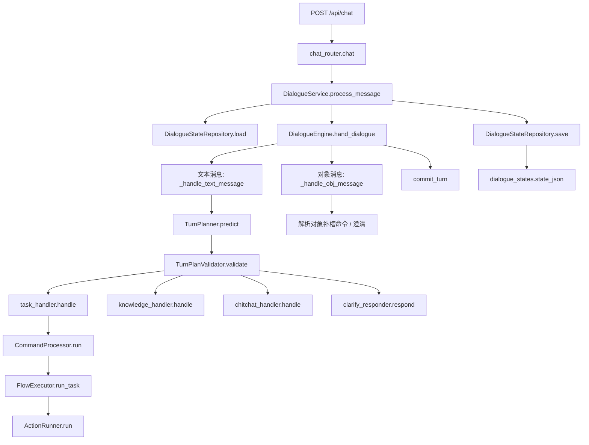

# 12-物业智能管家-函数调用与状态流转梳理

## 1. 这份文档解决什么问题

这份文档只回答四件事：

1. 一条 `/api/chat` 请求从哪里进、经过哪些函数、最后落到哪里。
2. `DialogueState` 里几个关键字段分别在什么情况下被读、被写、被清空。
3. 不同输入场景下，系统为什么会走到 `task / knowledge / chitchat / clarify`。
4. 如果后面要换 7B、小改提示词、补微调，哪些边界不能随便动。

这里的口径以当前物业版项目代码为准，不按老师电商版推演。

---

## 2. 主链路总览

你可以把这条链理解成：

- `router` 负责接口翻译
- `service` 负责 load -> engine -> save
- `engine` 负责“这一轮到底走哪条轨”
- `task` 轨负责跑 YAML 流程
- `knowledge / chitchat / clarify` 负责生成回复
- `repository` 负责把完整状态写回数据库

---

## 3. 第一层：接口与服务层

### 3.1 `chat_router.chat`

入口文件：`customer-service-backend/atguigu/api/router/chat_router.py`

职责只有三件事：

1. 把 `ChatRequest` 转成领域对象 `UserMessage`
2. 调 `DialogueService.process_message(...)`
3. 把 `ProcessResult` 转回 `ChatResponse`

这里不做意图判断，也不改业务状态。

### 3.2 `DialogueService.process_message`

入口文件：`customer-service-backend/atguigu/service/dialogue_service.py`

固定顺序：

1. `dialogue_state_repository.load(resident_id)`
2. `dialogue_engine.hand_dialogue(dialogue_state, user_message)`
3. `dialogue_state_repository.save(dialogue_state)`

所以你后面排查任何问题，都可以先判断它属于哪一层：

- `load` 前就不对：请求建模问题
- `engine` 中间不对：路由、状态、流程执行问题
- `save` 后不对：持久化或状态污染问题

---

## 4. 第二层：`DialogueState` 是整个系统的中轴

核心文件：`customer-service-backend/atguigu/domain/state.py`

### 4.1 关键字段含义

| 字段 | 含义 | 是否持久化 | 典型来源 |
| --- | --- | --- | --- |
| `resident_id` | 当前住户 ID | 是 | 请求入口 |
| `active_task` | 当前正在执行的业务流程 | 是 | `CommandProcessor` |
| `paused_tasks` | 被中断后压栈的业务流程 | 是 | `interrupt_active_task()` |
| `active_system_task` | 当前正在执行的系统流程 | 是 | `CommandProcessor` / `FlowExecutor` |
| `focused_object` | 当前聚焦对象，通常是工单或服务项目 | 是 | 对象消息 |
| `sessions` | 全部会话历史 | 是 | `commit_turn()` |
| `current_session_id` | 当前活跃会话 ID | 是 | `start_session()` |
| `pending_turn` | 本轮暂存区，尚未提交 | 否 | `begin_turn()` |

### 4.2 最容易混淆的点

#### `pending_turn`

- 它只存在于内存中的当前轮次
- `commit_turn()` 之后被清空
- `to_dict()` 没有把它写进数据库

所以：

- 本轮处理中可以用它拿当前用户消息
- 一旦保存完状态，数据库里是看不到 `pending_turn` 的

#### `active_task` vs `active_system_task`

- `active_task` 是真实业务任务，如：
  - 工单状态查询
  - 工单进度查询
  - 催办
  - 投诉
- `active_system_task` 是“系统辅助流程”，如：
  - 新任务开场白
  - 中断提示
  - 恢复提示
  - 收集槽位时的提问

`current_active_task()` 的返回规则是：

1. 有 `active_system_task` 时优先返回它
2. 否则返回 `active_task`

这意味着流程执行器很多时候先跑的是系统流程，不是业务流程本体。

---

## 5. 第三层：文本消息如何走

入口：`DialogueEngine.hand_dialogue(...)`

### 5.1 本轮开始前会做什么

#### Step 1. `_prepare_session(dialogue_state)`

作用：

- 如果当前没有 session：新建 session
- 如果当前 session 超过 1 小时没活动：
  - 关闭旧 session
  - `reset_running_state_for_new_session()`
  - 新开 session
- 否则仅更新时间戳

这里会影响这些字段：

| 字段 | 变化 |
| --- | --- |
| `sessions` | 可能新增一个 `Session` |
| `current_session_id` | 可能切到新 session |
| `active_task` | 超时换会话时清空 |
| `active_system_task` | 超时换会话时清空 |
| `paused_tasks` | 超时换会话时清空 |
| `focused_object` | 超时换会话时清空 |
| `pending_turn` | 超时换会话时清空 |

#### Step 2. `_begin_turn(dialogue_state, user_message)`

调用 `begin_turn()`，把当前请求放进 `pending_turn`

影响字段：

| 字段 | 变化 |
| --- | --- |
| `pending_turn` | 变成当前这轮的 `Turn(turn_id, user_message, [])` |

### 5.2 文本消息主流程

#### Step 3. `TurnPlanner.predict(...)`

核心文件：`plan/planner.py`

它会把这 7 份材料喂给 LLM：

1. `user_message`
2. `current_conversation`
3. `active_task_json`
4. `interrupted_tasks_json`
5. `focused_object_json`
6. `available_flows_json`
7. `knowledge_intents_json`

也就是说，文本消息的判断并不是只看“这一句话”，而是会一起看：

- 当前有没有任务在跑
- 之前有没有暂停任务
- 右侧有没有点过对象
- 能开的 flow 清单是什么
- 能走的 knowledge intent 清单是什么

#### Step 4. `TurnPlanValidator.validate(...)`

校验顺序很固定：

1. 至少得有一个轨道
2. 不能同时命中多个轨道
3. 如果是 `task`
   - commands 不能为空
   - command 类型必须合法
   - 一次不能 start 多个 flow
   - 不能 start `system_*`
   - flow 必须真实存在
4. 如果是 `knowledge`
   - intents 不能为空
   - 如果 intent 要求对象，`focused_object` 必须存在且类型匹配

#### Step 5. 轨道分发

校验后只会走四个方向之一：

| 条件 | 去向 |
| --- | --- |
| `validated.valid == False` | `clarify_responder.respond(...)` |
| `turn_plan.task is not None` | `task_handler.handle(...)` |
| `turn_plan.knowledge is not None` | `knowledge_handler.handle(...)` |
| 其余 | `chitchat_handler.handle(...)` |

### 5.3 文本消息最后怎样提交

不管走哪条轨，返回的 `messages` 都会：

1. `dialogue_state.pending_turn.bot_messages.extend(messages)`
2. `dialogue_state.commit_turn()`

影响字段：

| 字段 | 变化 |
| --- | --- |
| `sessions[-1].turns` | 新增本轮 turn |
| `pending_turn` | 提交后清空 |

---

## 6. 第四层：对象消息如何走

入口仍然是 `DialogueEngine.hand_dialogue(...)`

区别是对象消息不会先走 `TurnPlanner`，而是先直接改状态：

### 6.1 Step 1. `set_focused_object(user_message.object)`

影响字段：

| 字段 | 变化 |
| --- | --- |
| `focused_object` | 直接替换为当前对象 |

### 6.2 Step 2. `_resolve_object_commands(...)`

它只看两件事：

1. 当前对象类型
2. 当前业务流程里是否有一个未填的 collect 槽位

当前支持：

| 对象类型 | 可能生成的命令 |
| --- | --- |
| `work_order` | `SetSlotsCommand({"work_order_id": object.id})` |
| `service_item` | `SetSlotsCommand({"service_item_id": object.id})` |

前提是：

- 当前 `active_task` 不为空
- 当前 flow 里确实存在对应 collect step
- 槽位当前还没填

### 6.3 对象消息三种结果

#### 情况 A：解析出了补槽命令

直接走：

- `task_handler.handle(state, commands=[SetSlotsCommand(...)])`

这是“对象驱动补槽”的主链路。

#### 情况 B：没解析出命令，但当前有 `active_task`

也会继续走：

- `task_handler.handle(state, commands=[])`

意思是：虽然这次对象点击没补到槽位，但当前任务还在，就继续推进流程。

#### 情况 C：没命令，当前也没业务任务

走：

- `clarify_responder.respond(..., reason=OBJECT_REQUIRES_INTENT)`

这就是“我已经收到这条工单，你想查状态、进度、催办还是投诉？”这一类回复的来源。

---

## 7. 第五层：Task 轨内部怎么改状态

Task 轨固定分两段：

1. `CommandProcessor.run(...)`
2. `FlowExecutor.run_task(...)`

### 7.1 `CommandProcessor` 负责“先改状态”

它不直接回复用户，它先把 `DialogueState` 改成“接下来该怎么跑”。

#### `StartFlowCommand`

可能带来这些状态变化：

| 条件 | 状态变化 |
| --- | --- |
| 当前没有任务，且栈里也没有这个 flow | `active_task = TaskContext(flow_id, start_step)` |
| 当前没有任务，但栈里有这个 flow | 从 `paused_tasks` 恢复到 `active_task` |
| 当前已有别的任务 | 旧任务进 `paused_tasks`，新任务变成 `active_task` |
| 当前已有同一个任务 | 什么都不做 |

同时通常还会设置一个系统任务：

- `system_task_started`
- 或 `system_task_interrupted`
- 或 `system_task_resumed`

也就是说，**start flow 往往会同时改两层状态**：

1. 业务任务层：`active_task / paused_tasks`
2. 系统提示层：`active_system_task`

#### `SetSlotsCommand`

只改：

- `active_task.slots.update(...)`

#### `ResumeFlowCommand`

可能：

- 从 `paused_tasks` 恢复一个任务到 `active_task`
- 如果当前还有别的任务，则先中断当前任务再恢复目标任务
- 同时设置 `system_task_resumed`

#### `CancelFlowCommand`

会：

1. 基于当前 `active_task` 生成 `system_task_canceled`
2. `end_active_task()`

所以取消不是“直接没了”，而是先通过系统流程说一句“好的，这个任务先取消”，然后再结束。

### 7.2 `FlowExecutor` 负责“推进 YAML”

核心思想是：

- 先不断推进 step
- 直到遇到真正需要执行的 action
- action 执行后，slot 更新写回 state
- 再继续推进
- 碰到 `action_listen` 就停下来，等下一轮用户输入

### 7.3 Collect step 的状态变化最关键

`_run_collect_slots_step(...)` 会按这个顺序处理：

1. 先尝试 `_try_fill_slot_from_focused_object(...)`
2. 如果槽位已经有值：
   - 有校验就先校验
   - 校验过了就推进下一步
   - 校验失败就清空该 slot，并返回失败提示
3. 如果槽位没值：
   - 启动 `system_collect_information`
   - 把 `slot_name + response` 写进 `CollectedSystemContext`

#### `_try_fill_slot_from_focused_object(...)`

这一步是当前对象驱动体验的关键。

例如当 `focused_object.type == "work_order"` 时，它会尝试自动填：

- `work_order_id`
- `work_order_status_hint`
- `work_order_summary_hint`
- `appointment_time_hint`
- `work_order_amount_hint`

当 `focused_object.type == "service_item"` 时，它会尝试自动填：

- `service_item_id`
- `service_item_status_hint`
- `service_item_description_hint`
- `service_item_price_hint`

所以对象消息的价值不只是“记住你点了哪条工单”，还会顺手给后续 flow 填一部分提示性槽位。

---

## 8. 第六层：Knowledge / Chitchat / Clarify 现在分别依赖什么

### 8.1 `ClarifyResponder`

它依赖：

- `state.pending_turn.user_message`
- `state.current_session().turns[-10:]`
- `state.focused_object`
- `validated.reason`

所以泛澄清、对象澄清、缺 intent 澄清，本质上都来自：

- 校验器给的 `ClarifyReason`
- 当前状态里是否已有对象、历史、消息

### 8.2 `KnowledgeHandler`

它现在的输入已经接到了：

- `state`
- `turn_plan.knowledge`

它会做：

1. 读取当前用户消息和历史
2. 解析 intents
3. 检查是否缺必需对象
4. 调 provider 取 chunk
5. 最后交给 responder

这里的关键依赖字段是：

- `focused_object`
- `pending_turn`
- `sessions`

### 8.3 `ChitchatHandler`

它现在也从 `state` 里取：

- `pending_turn.user_message`
- `current_session().turns[-10:]`

所以闲聊轨已经不再是死回复，而是一个“能看当前输入和最近历史”的轻量回复轨。

---

## 9. 典型场景下字段怎么变

## 9.1 场景 A：首次发纯文本，问“你好”

### 调用链

`router -> service -> repository.load -> engine.prepare_session -> begin_turn -> planner -> validator -> chitchat/clarify -> commit_turn -> repository.save`

### 关键状态变化

| 字段 | 变化 |
| --- | --- |
| `sessions` | 新增一个 session |
| `current_session_id` | 指向新 session |
| `pending_turn` | 创建后又提交清空 |
| `active_task` | 通常不变 |
| `focused_object` | 不变 |

### 容易出的问题

- 如果 planner 没识别出 chitchat，可能会掉到泛 clarify

## 9.2 场景 B：点击工单卡片，但当前没有业务任务

### 调用链

`router -> service -> load -> engine.set_focused_object -> _resolve_object_commands -> clarify(OBJECT_REQUIRES_INTENT) -> commit_turn -> save`

### 关键状态变化

| 字段 | 变化 |
| --- | --- |
| `focused_object` | 变成当前工单 |
| `active_task` | 不变 |
| `active_system_task` | 不变 |
| `pending_turn` | 提交后清空 |

### 用户看到的现象

通常会收到：

- “已收到这条工单，你想查状态、进度、催办还是投诉？”

## 9.3 场景 C：已经在工单流程里，再点击工单对象

### 调用链

`set_focused_object -> _resolve_object_commands -> SetSlotsCommand -> TaskHandler -> FlowExecutor`

### 关键状态变化

| 字段 | 变化 |
| --- | --- |
| `focused_object` | 替换 |
| `active_task.slots.work_order_id` | 可能被自动写入 |
| `active_system_task` | 可能切到 collect/start/resume 等系统流程 |

### 用户看到的现象

- 如果正好缺 `work_order_id`，对象点击会比手输更顺

## 9.4 场景 D：文本触发新业务 flow

例如：“帮我查工单进度”

### 关键状态变化

| 字段 | 变化 |
| --- | --- |
| `active_task` | 变成目标 flow 的 `TaskContext` |
| `active_system_task` | 通常先变成 `system_task_started` |
| `paused_tasks` | 通常不变 |

### 用户看到的现象

第一句回复往往不是业务结果，而是系统开场白，如：

- “好的，我们先处理工单进度查询。”

## 9.5 场景 E：一个任务没做完，又开另一个任务

例如：

1. 先在投诉流程里
2. 又说“帮我查另一个工单状态”

### 关键状态变化

| 字段 | 变化 |
| --- | --- |
| `paused_tasks` | 原任务入栈 |
| `active_task` | 切到新任务 |
| `active_system_task` | 切到 `system_task_interrupted` |

### 用户看到的现象

- 先收到“先把原任务放一放，先处理新任务”的系统提示

## 9.6 场景 F：Collect 时缺槽位

例如催办流程缺 `urge_reason`

### 关键状态变化

| 字段 | 变化 |
| --- | --- |
| `active_task` | 继续保留 |
| `active_system_task` | 切到 `system_collect_information` |
| `active_system_task.response` | 写入“请告诉我催办原因”这类提示 |

### 用户看到的现象

- 回复一条 collect 提问
- 然后流程停在 `action_listen`

---

## 10. 当前最值得警惕的状态问题

## 10.1 `focused_object` 会长期留在 state 里

它只会在：

- 新对象消息到来时被替换
- session 超时重置时被清空

所以如果你一直用同一个 `resident_id` 做测试，很容易出现：

- 当前文本其实没提工单
- 但 planner 还看得到旧的 `focused_object`

这会影响轨道判断。

## 10.2 `sessions` 会持续累积

`TurnPlanner` 只取最近 10 轮，但如果这 10 轮已经很脏，依然会干扰判断。

所以测“模型够不够智能”之前，最好：

- 换新 `resident_id`
- 或清掉这条 `dialogue_state`

## 10.3 `/api/chat/history` 还没实现

前端会打这个接口，但后端当前没有正式返回历史。

这不会直接破坏 `/api/chat` 主链路，但会导致：

- 前端展示历史不闭环
- 联调时容易误判“是不是状态没保存”

## 10.4 `pending_turn` 不持久化

这是正确设计，但也意味着：

- 你看数据库时只能看到“提交后的 turn”
- 看不到“处理中尚未提交的当前轮”

排查时不要误以为“数据库里没有 pending_turn = 本轮没进来”

---

## 11. 后面换小模型时，哪些接口契约不要乱动

如果后面要把当前 LLM 换成 7B，本项目最需要守住的是这些契约：

### 11.1 `TurnPlan` 输出结构

模型输出必须仍然能映射成：

- `task.commands`
- `knowledge.intents`
- `chitchat`

否则上层 validator 和 handler 都得一起重写。

### 11.2 command 白名单

当前只接受：

- `start_flow`
- `set_slots`
- `resume_flow`
- `cancel_flow`

如果模型开始乱造命令名，校验器会直接 reject。

### 11.3 flow_id / slot_name 必须和 YAML 对齐

模型不是自由发挥，它其实在“给 YAML 编排层发指令”。

所以这些名字一旦不对齐：

- flow 开不起来
- slot 填不进去
- action_response 模板也会渲染失败或变空

### 11.4 `focused_object` 仍然应该保留

即使以后模型更强，这个字段也不该删。

原因很简单：它是“前端对象交互”和“文本多轮对话”之间最稳定的桥。

---

## 12. 今天这份梳理怎么用

如果你接下来要做的是：

### 12.1 看日志排 bug

优先看这几个字段：

1. `focused_object`
2. `active_task`
3. `paused_tasks`
4. `active_system_task`
5. 最近几轮 `turns`

### 12.2 判断“为什么回答不够智能”

按这个顺序排：

1. 这轮有没有走对轨道
2. `focused_object` 有没有脏
3. 最近 10 轮 history 有没有污染
4. `turn_plan` 结构是否稳定
5. flow / slot / command 是否对齐

### 12.3 换 7B 做最小部署

先不要改这套状态骨架，优先替换：

1. `TurnPlanner`
2. `KnowledgeResponder`
3. `ChitchatResponder`
4. 必要时补一层更稳的 validator / fallback

也就是：

- 先换“脑子”
- 不先拆“身体”

---

## 13. 一句话结论

当前项目的真正主轴不是某个 prompt，也不是某个 action，而是：

**`DialogueState` 作为统一状态容器，驱动 `planner -> validator -> handler -> flow executor -> repository` 整条链闭环。**

只要这条主轴你讲顺了，后面不管是面试表达、日志排查，还是换 7B、小规模微调，心里都会稳很多。
