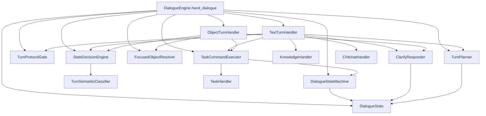
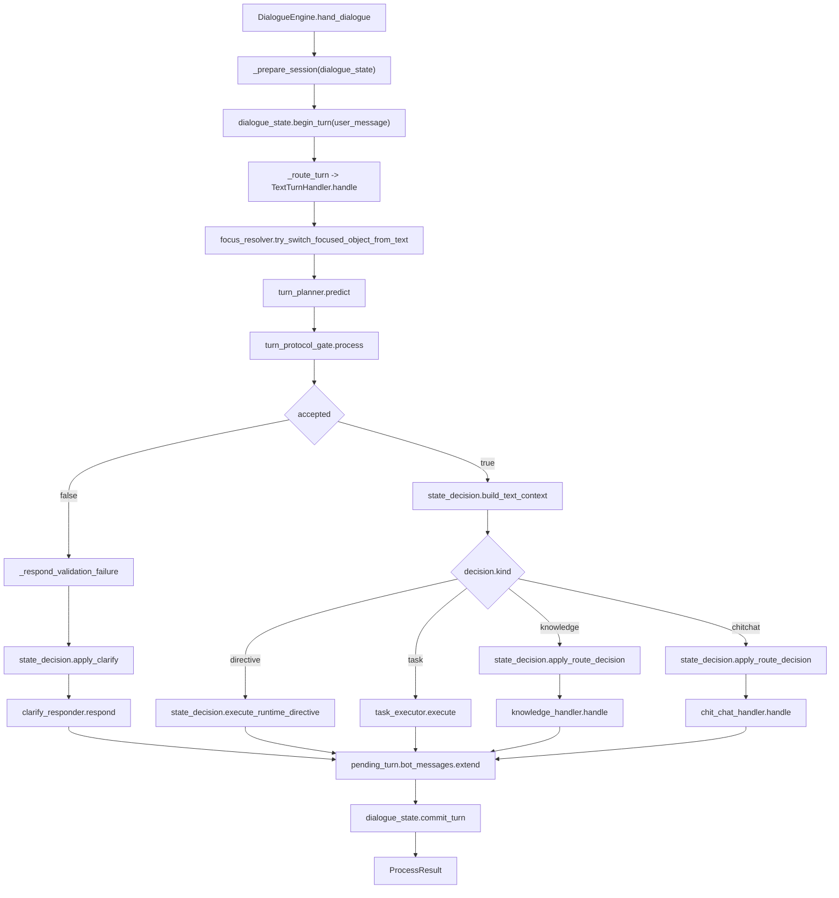
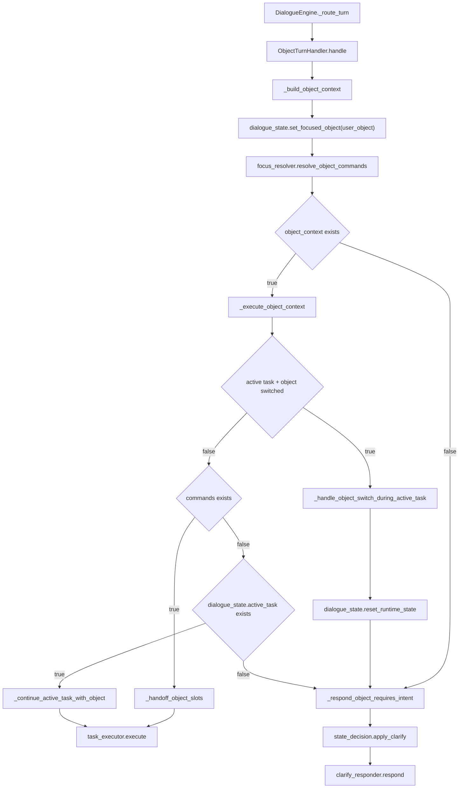
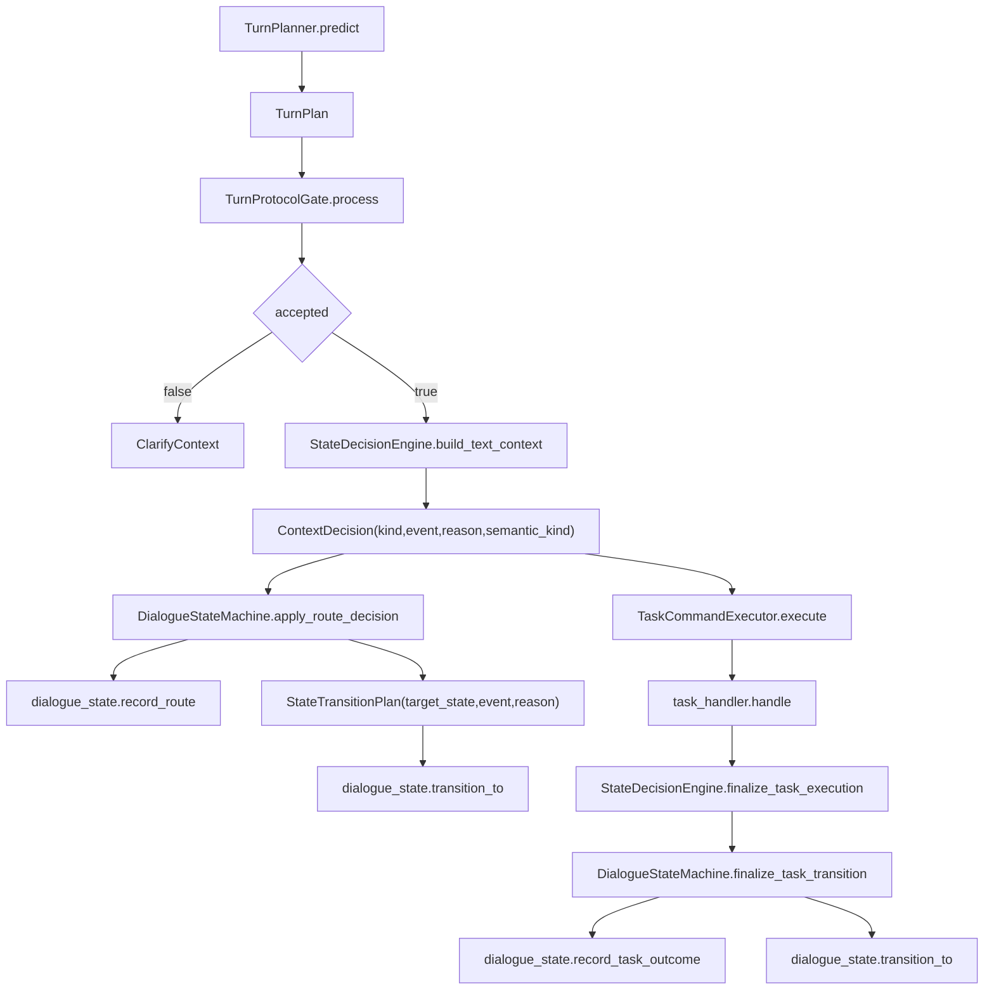

# 01-P0状态机收敛架构图

- 最后修改时间: 2026-06-02 16:30
- 文档定位: 第三阶段 P0 收敛版真实主链说明
- 上级入口: `D:\Desktop\SGG_Project\Ecommerce_Customer_Service\Docs\第三阶段架构图\00-图集索引.md`
- 下级入口: 暂无

## 这册看什么

这册只看当前代码已经落地的收敛结构，不讨论理想方案。

它回答 5 个问题:

1. `DialogueEngine` 现在到底在编排哪些组件
2. 文本消息和对象消息分别走哪条函数链
3. `TurnPlan` 怎么被归一化、校验、转换成显式决策
4. 状态机现在接管了哪些字段，哪些变化会留下观测痕迹
5. `DialogueState` 这个聚合根现在到底装了哪些运行时信息

## 图 1: 当前收敛版组件关系

## 图 2: 文本消息处理主链

## 图 3: 对象消息处理主链

## 图 4: TurnPlan 到显式状态迁移的协议链

## 图 5: `DialogueState` 聚合根与关键字段

```mermaid
graph TB
    DS["DialogueState"] --> AT["active_task: TaskContext | None"]
    DS --> PT["paused_tasks: list[TaskContext]"]
    DS --> AST["active_system_task: SystemContext | None"]
    DS --> FO["focused_object: FocusedObject | None"]
    DS --> CS["conversation_state: str"]
    DS --> LT["last_transition: ConversationTransition | None"]
    DS --> LR["last_route: TurnRoute | None"]
    DS --> LTO["last_task_outcome: TaskOutcome | None"]
    DS --> SS["sessions: list[Session]"]
    DS --> SID["current_session_id: str | None"]
    DS --> PTN["pending_turn: Turn | None"]

    LT --> LT1["from_state"]
    LT --> LT2["to_state"]
    LT --> LT3["event"]
    LT --> LT4["reason"]

    LR --> LR1["kind"]
    LR --> LR2["event"]
    LR --> LR3["reason"]
    LR --> LR4["semantic_kind"]

    LTO --> TO1["kind"]
    LTO --> TO2["flow_id"]
    LTO --> TO3["reason"]
    LTO --> TO4["semantic_kind"]

    SS --> S1["Session.session_id"]
    SS --> S2["Session.turns"]
    PTN --> T1["Turn.user_message"]
    PTN --> T2["Turn.bot_messages"]
```

## 组件与函数表

| 组件 | 当前关键函数 | 作用 | 当前边界 |
| --- | --- | --- | --- |
| `DialogueEngine` | `hand_dialogue()` | 顶层入口, 管 session, begin/commit turn, 分发文本/对象消息 | 只做编排, 不直接做业务判断 |
| `DialogueEngine` | `_route_turn()` | 按 `MessageType` 分发到文本或对象处理器 | 入口分流 |
| `DialogueEngine` | `_prepare_session()` | 创建 session, 处理 1 小时超时重建 | 会话生命周期入口 |
| `TextTurnHandler` | `handle()` | 文本主链总入口 | 编排 planner, protocol gate, clarify, knowledge, task, chitchat |
| `TextTurnHandler` | `_respond_validation_failure()` | 校验失败时落 `clarify` 路由并生成澄清回复 | 明确把失败转成显式状态 |
| `TextTurnHandler` | `_execute_context()` | 依据 `decision.kind` 执行 directive/task/knowledge/chitchat | 文本执行分发层 |
| `ObjectTurnHandler` | `handle()` | 对象主链总入口 | 不走 planner, 直接构建对象上下文 |
| `ObjectTurnHandler` | `_build_object_context()` | 写入 `focused_object`, 解析对象命令, 记录切换前上下文 | 对象上下文构建层 |
| `ObjectTurnHandler` | `_execute_object_context()` | 处理对象切换、补槽、继续 active task、要求澄清 | 对象场景分发层 |
| `ObjectTurnHandler` | `_handle_object_switch_during_active_task()` | 发现任务中途换对象时, 清掉运行态并退回澄清 | 当前对象切换退出机制 |
| `TaskCommandExecutor` | `execute()` | 统一包装 task 执行前后的 route decision 与 task outcome | task 轨道状态机接入点 |
| `TurnPlanner` | `predict()` | 调 LLM 产出 `TurnPlan` | 上游意图理解入口 |
| `TurnPlanner` | `_build_input_prompt()` | 组织 user/history/runtime/flow/intent 输入材料 | planner 输入协议 |
| `TurnProtocolGate` | `process()` | 串起 `normalize + validate`，统一给文本链一个 protocol gate 入口 | 协议闸门入口 |
| `TurnPlanNormalizer` | `normalize()` | 把 planner 输出归一到 runtime 协议 | 当前只做 exit 指令和 service_item fallback |
| `TurnPlanValidator` | `validate()` | 强制单轨、命令白名单、flow 合法性、knowledge object 依赖 | 显式校验层 |
| `StateDecisionEngine` | `build_text_context()` | 产出 `semantic_kind + ContextDecision` | 文本语义与路由协议入口 |
| `StateDecisionEngine` | `execute_runtime_directive()` | 执行 runtime directive，当前只正式支持 `exit_runtime` | runtime control 分支 |
| `StateDecisionEngine` | `begin_task_execution() / finalize_task_execution()` | 把 task route 与 task outcome transition 收回单入口 | task 状态决策入口 |
| `TurnSemanticClassifier` | `classify()` | 把 turn 归类为 `READ_ONLY_QUERY / BUSINESS_TASK / RUNTIME_CONTROL / SOCIAL_OR_CLARIFY` | 语义分层 |
| `DialogueStateMachine` | `apply_route_decision()` | 把 `ContextDecision` 写入 `last_route` 并迁移 `conversation_state` | 路由级状态机 |
| `DialogueStateMachine` | `finalize_task_transition()` | 根据 task 执行后的 outcome 记录 `last_task_outcome` 并落状态 | task 后状态机 |
| `ClarifyResponder` | `respond()` | 调 LLM 重写澄清话术 | 澄清输出层 |
| `ClarifyResponder` | `build_clarify_message()` | 先走 contextual message, 再按 reason 退回原因模板 | 澄清消息装配层 |

## `TurnPlan` 与决策协议字段表

| 模型 | 关键字段 | 说明 |
| --- | --- | --- |
| `TaskTurnPlan` | `commands: list[Command]` | task 轨要执行的命令集合 |
| `KnowledgeTurnPlan` | `intents: list[str]` | knowledge 轨意图列表 |
| `ChitchatTurnPlan` | 无字段 | 闲聊轨标记 |
| `RuntimeDirectiveTurnPlan` | `action: str` | 当前主要是 `exit_runtime` |
| `TurnPlan` | `task / knowledge / chitchat / directive` | planner 原始结构化输出 |
| `ClarifyContext` | `source`, `reason` | 澄清来源与原因 |
| `TurnPlanValidationResult` | `valid`, `clarify_context` | validator 输出 |
| `ContextDecision` | `kind`, `event`, `reason`, `semantic_kind` | 进入状态机前的显式协议 |
| `TextTurnContext` | `turn_plan`, `semantic_kind`, `decision` | 文本链执行上下文 |
| `ObjectTurnContext` | `user_object`, `previous_focused_object`, `active_task_before`, `commands` | 对象链执行上下文 |

## `DialogueState` 字段表

| 字段 | 类型 | 现在的职责 |
| --- | --- | --- |
| `resident_id` | `str` | 住户身份主键 |
| `active_task` | `TaskContext | None` | 当前业务 task 快照 |
| `paused_tasks` | `list[TaskContext]` | 被中断但可恢复的 task 栈 |
| `active_system_task` | `SystemContext | None` | 当前系统流程 task, 尤其是 collect slot/confirm 这类内部流程 |
| `focused_object` | `FocusedObject | None` | 当前追问所围绕的工单或服务项目 |
| `conversation_state` | `str` | 顶层显式会话状态, 当前枚举为 `idle/focused_knowledge/clarifying/active_task/chitchat/transitioning` |
| `last_transition` | `ConversationTransition | None` | 最近一次状态迁移痕迹 |
| `last_route` | `TurnRoute | None` | 最近一次路由决策痕迹 |
| `last_task_outcome` | `TaskOutcome | None` | 最近一次 task 执行结果痕迹 |
| `sessions` | `list[Session]` | 历史会话列表 |
| `current_session_id` | `str | None` | 当前活跃 session |
| `pending_turn` | `Turn | None` | 当前轮临时缓冲区, `begin_turn` 创建, `commit_turn` 落库前收口 |

## `DialogueState` 核心方法表

| 方法 | 作用 | 会影响哪些关键字段 |
| --- | --- | --- |
| `transition_to()` | 显式改写 `conversation_state` 并记录 `last_transition` | `conversation_state`, `last_transition` |
| `record_route()` | 记录本轮路由决策 | `last_route` |
| `record_task_outcome()` | 记录 task 执行结论 | `last_task_outcome` |
| `recompute_conversation_state()` | 按 `active_system_task -> active_task -> focused_object -> idle` 重算顶层状态 | `conversation_state`, `last_transition` |
| `start_active_task()` | 启动业务 task | `active_task`, `conversation_state` |
| `end_active_task()` | 结束业务 task | `active_task`, `conversation_state` |
| `cancel_active_task()` | 取消 active task 并清系统 task | `active_task`, `active_system_task`, `conversation_state` |
| `interrupt_active_task()` | 打断 active task 并压入 `paused_tasks` | `active_task`, `paused_tasks`, `conversation_state` |
| `resume_task()` | 恢复最近或指定 flow 的 task | `active_task`, `paused_tasks`, `conversation_state` |
| `set_slots()` | 给 `active_task.slots` 写值 | `active_task.slots` |
| `set_focused_object()` | 设置当前对象并重算状态 | `focused_object`, `conversation_state` |
| `clear_focused_object()` | 清对象并重算状态 | `focused_object`, `conversation_state` |
| `has_runtime_state()` | 判断当前是否仍处在“可退出的上下文”里 | 只读辅助 |
| `reset_runtime_state()` | 一次性清 `active_task/paused_tasks/active_system_task/focused_object` 并直接落回 `idle` | 运行态整体清空 |
| `start_session()` | 创建 session 并切到 `idle` | `sessions`, `current_session_id`, `last_transition` |
| `begin_turn()` | 开启本轮缓冲并清理上轮 route/outcome 痕迹 | `pending_turn`, `last_route`, `last_task_outcome` |
| `commit_turn()` | 将 `pending_turn` 追加进当前 session | `sessions.turns`, `pending_turn` |

## 顶层状态口径表

| 状态 | 现在由谁触发 | 典型含义 |
| --- | --- | --- |
| `idle` | `start_session()` / `reset_runtime_state()` / task 完成且无对象残留 | 当前没有业务上下文残留 |
| `focused_knowledge` | `apply_route_decision(kind=knowledge)` 或 task 完成后仍保留 `focused_object` | 追问围绕对象信息展开 |
| `clarifying` | `apply_route_decision(kind=clarify)` 或系统收槽阶段 | 当前需要用户补意图或补槽位 |
| `active_task` | task 执行后仍保留业务 task | 当前业务 flow 在继续推进 |
| `chitchat` | `apply_route_decision(kind=chitchat)` | 当前归为闲聊 |
| `transitioning` | `apply_route_decision(kind=task)` 或系统流程仍活动 | 已进入 task 轨但尚未收口 |

## 当前这一版相对阶段一的收敛点

| 收敛点 | 当前表现 |
| --- | --- |
| 入口编排与执行分离 | `DialogueEngine` 只负责 session + 路由, 文本与对象主链拆到独立 handler |
| 显式状态机接管 | `ContextDecision` 和 `TaskTransitionOutcome` 成为状态迁移协议, 不再只靠下游隐式改字段 |
| 路由痕迹可观测 | `last_route`, `last_transition`, `last_task_outcome` 已成为固定观测面 |
| runtime 退出有统一通道 | `TurnProtocolGate -> StateDecisionEngine.execute_runtime_directive -> reset_runtime_state` 已形成闭环 |
| 文本链协议更清楚 | `predict -> protocol gate -> state decision -> execute` 主链已经固定下来 |

## 当前还没有完全收干净的地方

| 位置 | 现状 |
| --- | --- |
| `TurnPlanner` | 仍然是单轮 `TurnPlan` 输出, 多意图并行协议还没有正式接入 |
| `TurnPlanNormalizer` | 还只是少量 runtime 归一, 不是完整的上下文仲裁器 |
| `ObjectTurnHandler` | 对象消息已经能退出错误上下文, 但对象承接策略仍偏保守 |
| `TaskHandler / Executor` 下游 | 仍然主要消费协议, 还不是完全按状态机原生设计的执行层 |
| `knowledge/chitchat` 细粒度策略 | 已接到状态机, 但内部语义能力不是这轮收敛重点 |

## 一句话结论

第三阶段 P0 当前这版真正收敛出来的，不是“所有 badcase 都命中”，而是一个已经能看清楚的主链:

`TurnPlan -> ContextDecision -> DialogueStateMachine -> last_route/last_transition/last_task_outcome -> Track Execution`

也就是说，状态流转终于从“很多函数各改一点字段”开始收口成“先做显式决策，再做显式迁移，最后再执行轨道逻辑”。
