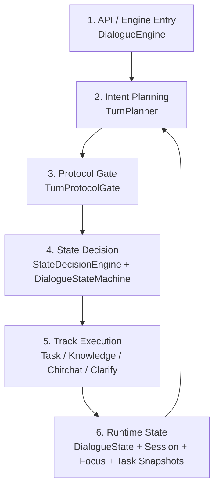
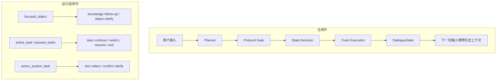

# 02-P0状态机收敛简图与收敛建议

- 最后修改时间: 2026-06-02 16:30
- 文档定位: 第三阶段 P0 面向讲解与继续收敛的简图
- 上级入口: `D:\Desktop\SGG_Project\Ecommerce_Customer_Service\Docs\第三阶段架构图\00-图集索引.md`
- 下级入口: 暂无

## 这册看什么

上一册是“代码解剖图”，适合查函数。

这一册只做两件事:

1. 把当前第三阶段 P0 收敛版压缩成一张真正能讲清主线的架构简图
2. 借这张简图判断哪些东西是必要复杂度，哪些只是实现层暴露过度，后面应该继续往回收

如果说 `01` 是“对代码”，这一册就是“对架构”。

## 图 1: 第三阶段 P0 收敛简图

## 图 2: 当前真正需要理解的双闭环

## 当前最小可讲架构

把实现细节收起来之后，当前系统其实只剩 6 个必须讲的块。

| 核心块 | 当前对应模块 | 为什么必须保留 |
| --- | --- | --- |
| `Engine Entry` | `engine/dialogue_engine.py` | 顶层编排总得有一个入口，不然 session、turn 缓冲、文本/对象分发都没地方收口 |
| `Intent Planning` | `plan/planner.py` | 还是需要一个把用户输入、历史、运行态喂给模型并拿回结构化计划的地方 |
| `Protocol Gate` | `plan/protocol_gate.py` + `plan/turn_plan_normalizer.py` + `plan/turn_validator.py` | 这是“模型输出”和“系统能执行的协议”之间的闸门，不能直接删 |
| `State Decision` | `engine/state_decision/engine.py` + `engine/state_decision/state_machine.py` | 这是这轮重构最核心的成果，负责显式路由和状态迁移 |
| `Track Execution` | `task / knowledge / chitchat / clarify` 处理器 | 三轨总得有人执行，不然架构只有判断没有动作 |
| `Runtime State` | `domain/state.py` | 多轮、对象、任务、退出、恢复都依赖这份聚合根 |

## 哪些是必要复杂度

这些复杂度不是“写多了”，而是项目本身决定的。

| 复杂度来源 | 为什么躲不掉 |
| --- | --- |
| 文本消息和对象消息双入口 | 前端就是 text + object 两类输入，后端必须分开承接 |
| 三轨并存 | `task / knowledge / chitchat` 是这个项目的基本业务形态 |
| 对象上下文 | 工单和服务项目被选中后，后续追问必须承接 |
| 任务上下文 | 业务任务会跨多轮推进，还会取消、恢复、切换 |
| 会话状态 | 没有显式状态，就会重新掉回“到处偷偷改字段”的老路 |

所以你看到复杂，不全是代码的问题，有一部分确实是业务体积。

## 哪些是暴露过度的实现复杂度

这些东西不是没价值，而是现在暴露得太表面了。

| 模块 / 概念 | 当前作用 | 我对它的判断 |
| --- | --- | --- |
| `StateDecisionEngine` 内部的 task outcome / reason 组装 | 组装 `reason` 和 task outcome | 有用，但应该内聚在状态决策入口内部，而不是独立平级模块 |
| `ContextDecision` | 显式路由协议对象 | 这个概念应该保留，但应该作为“状态决策层的内部协议”理解，不是独立大模块 |
| `TextTurnContext` / `ObjectTurnContext` | 执行链中间上下文 | 这是实现细节，适合保留为数据结构，不适合提升为架构主角 |
| `TurnSemanticClassifier` | 区分只读查询、业务任务、runtime 控制 | 有必要，但属于决策层内部子步骤 |
| `StateDecisionEngine` 内部的 runtime control 分支 | 当前主要处理 `exit_runtime` | 值得保留，但不应该让它看起来像一个和三轨并列的大系统 |
| `ClarifyResponder` 里大量 `_build_xxx_message()` | 澄清话术组装 | 必须存在，但属于“澄清轨内部策略”，不应该外溢成总架构复杂度 |

## 现在最该继续收的，不是功能，而是层级

当前主要问题不是“部件太多”，而是“部件的层级还不够稳”。

更直白一点说:

1. 有些概念本来只是某一层的内部 helper
2. 但因为这一轮为了把状态机落地，我们把它们先显式拎出来了
3. 拎出来是对的，不然根本收不住
4. 可如果长期就这样摊着，它们又会反过来让架构图变得吓人

所以后面该做的不是“删功能”，而是“把该回内聚的东西送回模块内部”。

## 模块判断表: 必须保留 / 应内聚 / 后续可合并

### A. 必须保留为一级概念

| 一级概念 | 保留理由 |
| --- | --- |
| `DialogueEngine` | 顶层 turn 生命周期和消息分发必须有统一入口 |
| `Planner` | LLM 意图理解入口必须独立，不然 prompt 输入边界会散 |
| `Normalizer + Validator` | 没有协议闸门，模型输出会直接污染执行层 |
| `StateMachine` | 这是第三阶段的主成果，不能再退回隐式改字段 |
| `Track Execution` | 三轨执行总得被明确看见 |
| `DialogueState` | 所有多轮能力最终都得落在聚合根上 |

### B. 应该继续内聚回上层模块

| 当前模块 / 结构 | 更适合归属到哪里 |
| --- | --- |
| `StateDecisionEngine` 内部的 reason / outcome helper | 继续内聚在 `state_decision` 包内，不再拆成显眼平级模块 |
| `TurnSemanticClassifier` | 作为 `state_decision` 内部子组件保留 |
| `ContextDecision` 相关中间结构 | 继续作为状态决策层内部协议，不必在总架构里外露 |
| `TextTurnBuildResult` / `TextTurnContext` / `ObjectTurnContext` | 作为 handler 内部数据结构理解，不往更高层扩散 |
| `StateDecisionEngine` 内部的 runtime control 分支 | 作为 state decision 之下的内部分支，而不是独立“第四轨” |

### C. 后续可以进一步合并或抽象

| 位置 | 后续方向 |
| --- | --- |
| `clarify/responder.py` 内多套 `_build_xxx_message()` | 可以继续抽成更清晰的 reason family，而不是铺很多平级函数 |
| 文本链与对象链的部分“构建上下文 -> 执行上下文”样板 | 可以抽统一入口协议，但前提是别把阅读成本抽高 |
| `knowledge` 与 `task(read-only)` 的承接边界 | 后面应继续统一成更清楚的只读查询协议 |

## 我现在的真实判断

如果只从“后端架构是否能讲清楚”来看，当前系统已经不是失控状态了。

它的问题不是“没有架构”，而是:

- 状态机主骨架已经出现
- 但还有一些为了落地状态机而临时显化出来的中间层
- 这些中间层下一步需要继续折回去

也就是说，**现在该做的是第二轮抽象回收，而不是继续扩功能或追 badcase 命中率。**

## 下一步收敛建议

后面如果继续顺着这个简图推进，我建议优先级就是:

1. 继续让总图只剩 6 个一级概念
2. 把 `State Decision` 下面的中间协议继续内聚
3. 把 `Track Execution` 下面的话术/辅助判断继续收回各轨内部
4. 等层级稳定后，再看 `processor / executor / knowledge handler` 这些执行层是否需要第二轮重整

## 一句话结论

你刚才看到“大图太复杂”的感觉是对的，但这不代表系统必须这么复杂。

更准确地说:

**当前系统里，业务复杂度大概只需要 6 个一级模块；你觉得难受的那一大坨，很多其实是“为了把状态机落地而暂时露在外面的实现层”。**

这就是下一轮结构收敛最该处理的东西。
