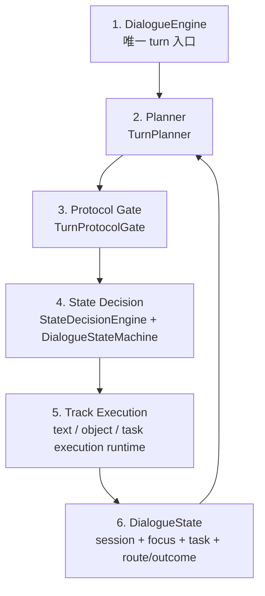
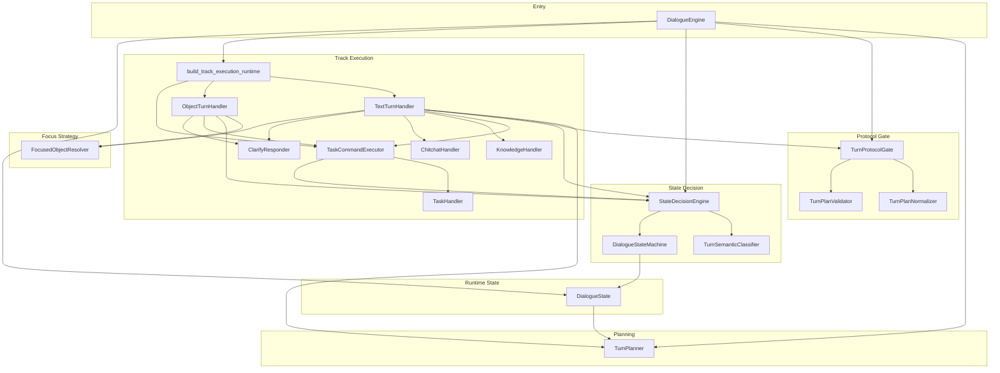

# 03-P0最终收口架构图与讲解

- 最后修改时间：2026-06-03 00:30
- 文档定位：第三阶段 P0 架构收尾版总图与讲解口径
- 上级入口：[00-图集索引.md](/D:/Desktop/SGG_Project/Ecommerce_Customer_Service/Docs/第三阶段架构图/00-图集索引.md)
- 下级入口：暂无

## 这份图回答什么

这份图只回答一件事：到第三阶段 P0 收尾时，后端对话主链已经收口成什么样。

## 最终总图

## 分层图

## 现在可以怎么讲

### `DialogueEngine`

只做三件事：
- session 生命周期
- begin/commit turn
- 文本/对象消息分流

### `Planner`

只负责把当前输入、历史和运行态送进模型，拿回 `TurnPlan`。

### `Protocol Gate`

这是模型输出和系统执行协议之间的闸门，统一承接 `normalize + validate`。

### `State Decision`

这是这轮重构最核心的成果，负责：
- 语义分层
- route decision
- state transition
- task outcome transition

### `Track Execution`

这一层现在更像真正的执行层：
- 文本 turn 执行
- 对象 turn 执行
- task command 执行

而且它的 wiring 已经从顶层入口中回收到了 `track_execution/`。

### `DialogueState`

运行态有了统一落点。最值得讲和最值得排查的字段主要是：
- `focused_object`
- `active_task`
- `paused_tasks`
- `active_system_task`
- `conversation_state`
- `last_route`
- `last_transition`
- `last_task_outcome`

## 这轮收口最重要的变化

1. 旧的 `engine/runtime` 和 `engine/turns` 已退出正式结构
2. `Planner -> Protocol Gate -> State Decision -> Track Execution` 主链固定
3. `last_route / last_transition / last_task_outcome` 成为稳定观测面
4. `DialogueEngine` 不再承担过多执行层 wiring
5. `focus/` 对高层只保留 `FocusedObjectResolver` 这一个入口概念

## 还没做成什么

这轮没有做成，也不准备在这轮做成的东西：
- 多意图并行协议
- 全面解决所有模糊追问误差
- `processor.py / executor.py` 深度重构
- 前端与中台接口协议重做

## 一句话结论

第三阶段 P0 收口后的真实成果，不是“所有 case 都完美”，而是后端终于有了一条能讲清楚的显式主链：

`TurnPlan -> Protocol Gate -> State Decision -> Track Execution -> DialogueState`
