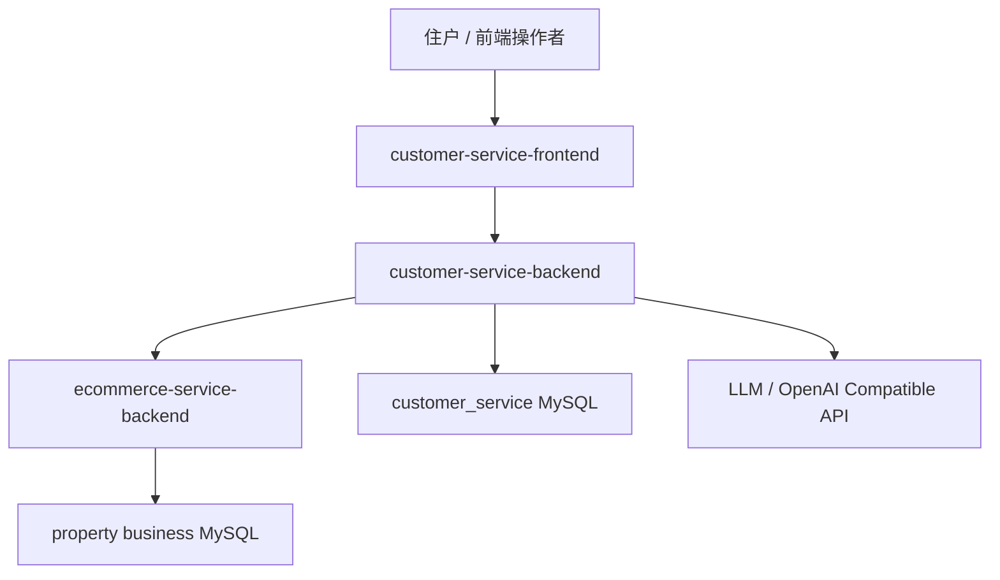
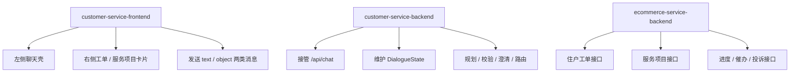
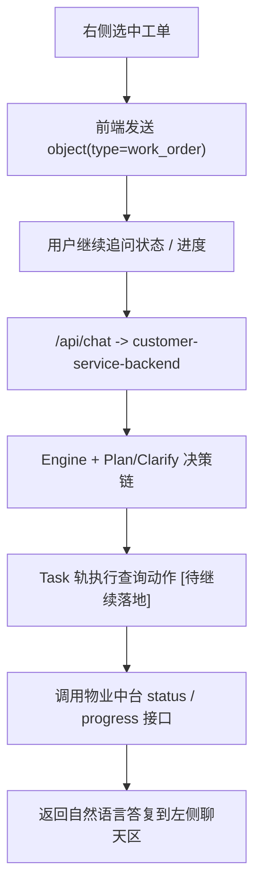

# 01-系统全景与三仓关系

## 这册看什么

这一册只回答三个问题：

1. 当前项目为什么是三仓结构
2. 三个仓分别负责什么
3. 当前第二阶段的真实主链从哪里进、到哪里出

不在这一册展开类、字段和方法细节。

## 图 1：系统全景

## 图 2：三仓职责关系

## 图 3：当前第二阶段主链

## 三仓职责对照表

| 仓库 | 当前角色 | 主要输入 | 主要输出 | 当前状态 |
| --- | --- | --- | --- | --- |
| `customer-service-frontend` | 交互壳层 | 用户文本、对象点击 | `/api/chat`、右侧对象消息 | `[已实现]` |
| `customer-service-backend` | 智能管家主体 | `ChatRequest` | `ChatResponse`、状态持久化 | `[已实现]` 主骨架 |
| `ecommerce-service-backend` | 物业业务中台 | HTTP 业务查询 / 提交 | 工单、服务项目、进度、催办、投诉结果 | `[已实现]` |

## 当前第二阶段的边界

| 项目层 | 当前是否重做 | 说明 |
| --- | --- | --- |
| 前端主壳 | 否 | 保留老师单页壳，重点复用对象消息入口 |
| 物业中台 | 否 | 作为被智能管家调用的业务底座 |
| 智能管家后端 | 是 | 当前第二阶段的主战场 |

## 一句话结论

当前项目的第二阶段，不是在重做三仓，而是在已有前端和物业中台都稳定的前提下，把 `customer-service-backend` 真正做成能接管左侧对话的智能管家主体。
