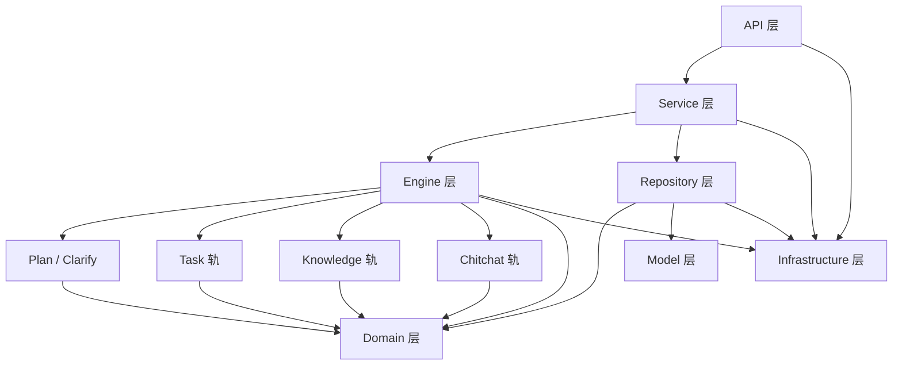
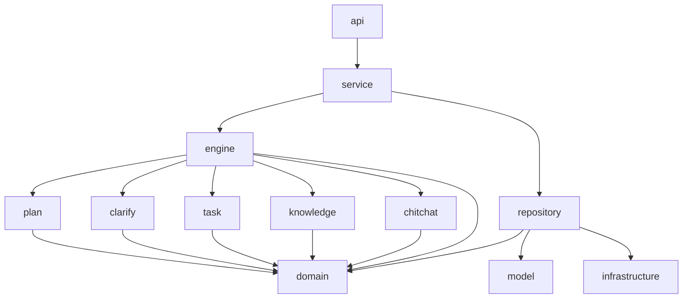

# 02-customer-service-backend分层总览

## 这册看什么

这一册回答：

1. `customer-service-backend` 内部有哪些层
2. 各层之间如何依赖
3. 哪些层已经落地，哪些层还处于骨架态

## 图 1：后端分层总览

## 图 2：包级依赖关系

## 层职责表

| 层 | 主要职责 | 当前代表模块 | 当前状态 |
| --- | --- | --- | --- |
| API | 接收 HTTP 请求，翻译输入输出模型 | `api/router/chat_router.py` | `[已实现]` |
| Service | 编排一次完整对话事务 | `service/dialogue_service.py` | `[已实现]` |
| Engine | 处理消息、分流到三轨 | `engine/dialogue_engine.py` | `[已实现]` 主骨架 |
| Plan | LLM 规划与白名单校验 | `plan/planner.py`, `plan/turn_validator.py` | `[已实现]` |
| Clarify | 校验失败时澄清 | `clarify/responder.py` | `[已实现]` |
| Task | 任务轨入口、流程编排 | `task/handler.py`, `task/flow/*` | `handler=[占位]`, `flow=[已实现]` |
| Knowledge | 知识轨入口与意图词典 | `knowledge/handler.py`, `knowledge/intents.py` | `handler=[占位]`, `intents=[已实现]` |
| Chitchat | 闲聊轨入口 | `chitchat/handler.py` | `[占位]` |
| Domain | 消息、上下文、状态聚合根 | `domain/*` | `[已实现]` |
| Repository | `DialogueState` 落库/回读 | `repository/dialogue_state_repository.py` | `[已实现]` |
| Model | ORM 映射 | `model/dialogue_state_record.py` | `[已实现]` |
| Infrastructure | DB、LLM、HTTP 客户端等资源 | `infrastructure/*` | `[已实现]` 基础资源 |

## 当前实现边界表

| 子系统 | 已完成部分 | 未完成部分 |
| --- | --- | --- |
| Engine 主链 | 文本/对象消息分流、TurnPlan 校验、澄清入口 | 真正的 task/knowledge/chitchat 执行 |
| Task 轨 | flow 模型、loader、command 模型 | `CommandProcessor`[预留]、`FlowExecutor`[预留]、`ActionRunner`[预留] |
| Knowledge 轨 | 物业版 intent 词典 | provider / registry / responder [预留] |
| Chitchat 轨 | 轨道入口位置 | responder [预留] |

## 一句话结论

`customer-service-backend` 当前已经把“层次结构”搭完整了，但真正要把主链跑起来的关键缺口，主要集中在 task/knowledge/chitchat 三个执行轨内部。
