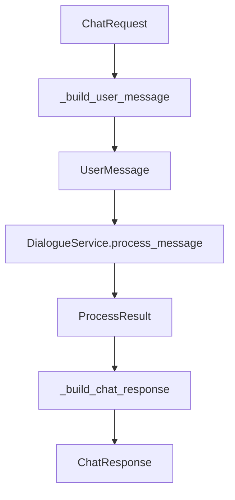
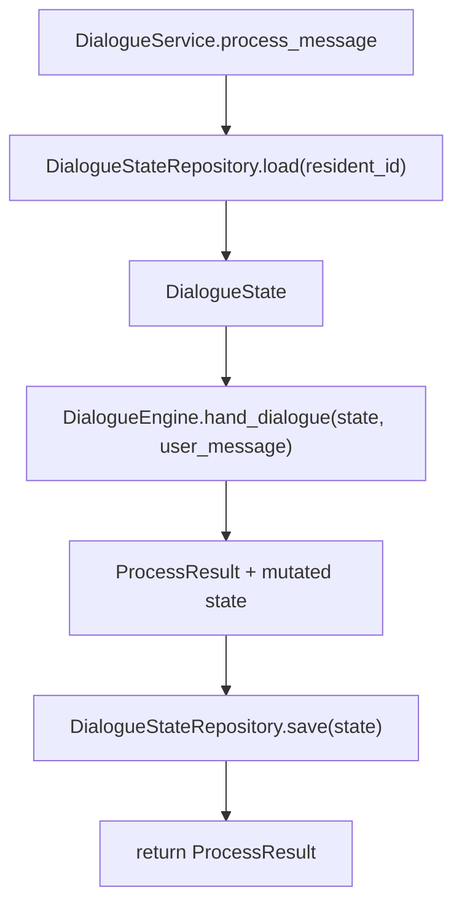

# 03-API与Service层设计

## 这册看什么

这一册只看：

1. `/api/chat` 如何把 HTTP 请求翻译成领域消息
2. `DialogueService` 如何定义事务边界
3. API / Service 和 domain / engine 的职责如何拆开

## 图 1：请求到响应的翻译链

## 图 2：Service 事务边界

## API 层结构表

| 组件 | 类型 | 关键字段 / 方法 | 作用 |
| --- | --- | --- | --- |
| `ChatObject` | Pydantic Model | `type: str`, `id: str`, `title: str | None`, `attributes: dict` | 承载对象消息 |
| `ChatRequest` | Pydantic Model | `resident_id: str`, `message_id: str | None`, `text: str | None`, `object: ChatObject | None` | `/api/chat` 入参 |
| `ChatBotMessage` | Pydantic Model | `text: str | None`, `object: ChatObject | None` | 单条输出消息 |
| `ChatResponse` | Pydantic Model | `resident_id: str`, `message_id: str`, `messages: list[ChatBotMessage]` | `/api/chat` 返回 |
| `chat()` | FastAPI Router | `chat(chat_request: ChatRequest, service: DialogueService)` | 路由入口 |
| `_build_user_message()` | 函数 | `ChatRequest -> UserMessage` | 输入装配 |
| `_build_chat_response()` | 函数 | `ProcessResult -> ChatResponse` | 输出装配 |

## Service 层结构表

| 组件 | 方法签名 | 输入 | 输出 | 当前状态 |
| --- | --- | --- | --- | --- |
| `DialogueService` | `process_message(user_message: UserMessage) -> ProcessResult` | 领域消息 | 领域处理结果 | `[已实现]` |
| `DialogueStateRepository` | `load(resident_id: str) -> DialogueState` | 住户 ID | 内存状态 | `[已实现]` |
| `DialogueStateRepository` | `save(state: DialogueState)` | 状态聚合根 | 持久化副作用 | `[已实现]` |
| `DialogueEngine` | `hand_dialogue(dialogue_state, user_message) -> ProcessResult` | 状态 + 消息 | 处理结果 | `[已实现]` 主骨架 |

## API 与 domain 的装配边界

| 边界问题 | 放在哪层 | 原因 |
| --- | --- | --- |
| `resident_id`、`text`、`object` 的 HTTP 入参校验 | API | 属于接口协议 |
| `ChatRequest -> UserMessage` 翻译 | API | 属于接口壳和领域对象之间的装配 |
| `load -> engine -> save` 编排 | Service | 属于应用服务事务边界 |
| 对话状态如何演化 | Engine / Domain | 属于核心业务逻辑 |

## 一句话结论

API 层负责“翻译”，Service 层负责“事务编排”，真正的对话逻辑不在这两层里展开。
