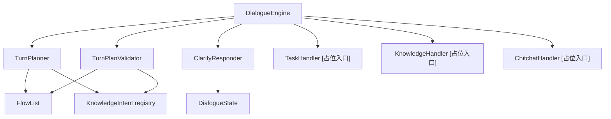
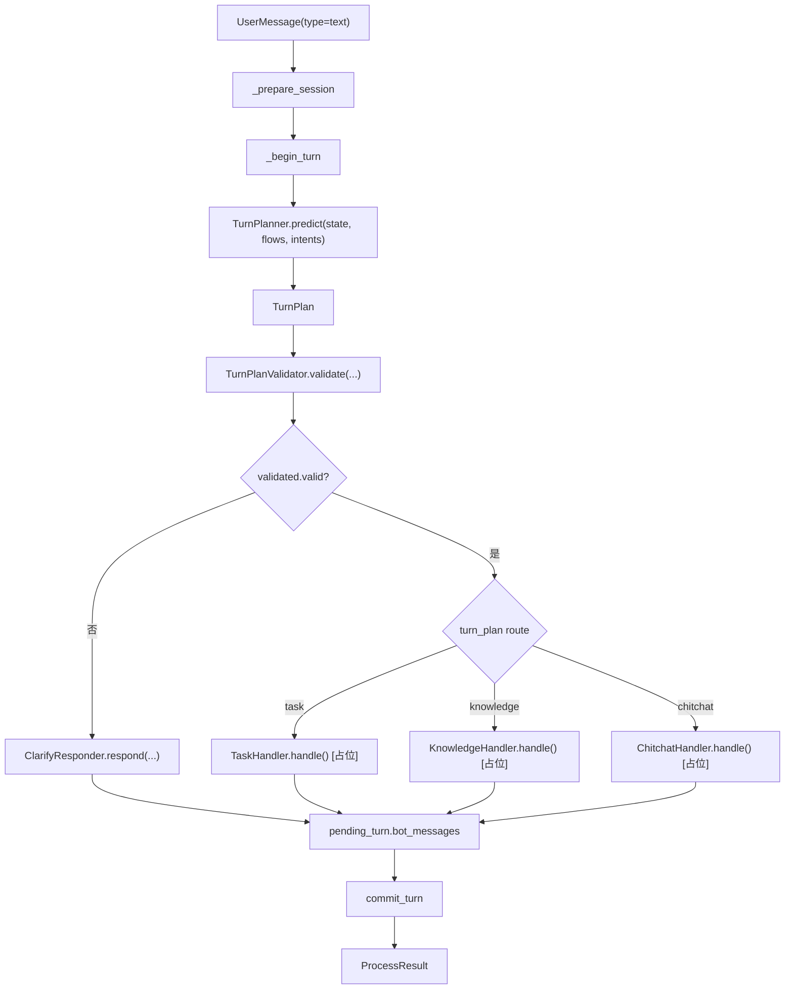
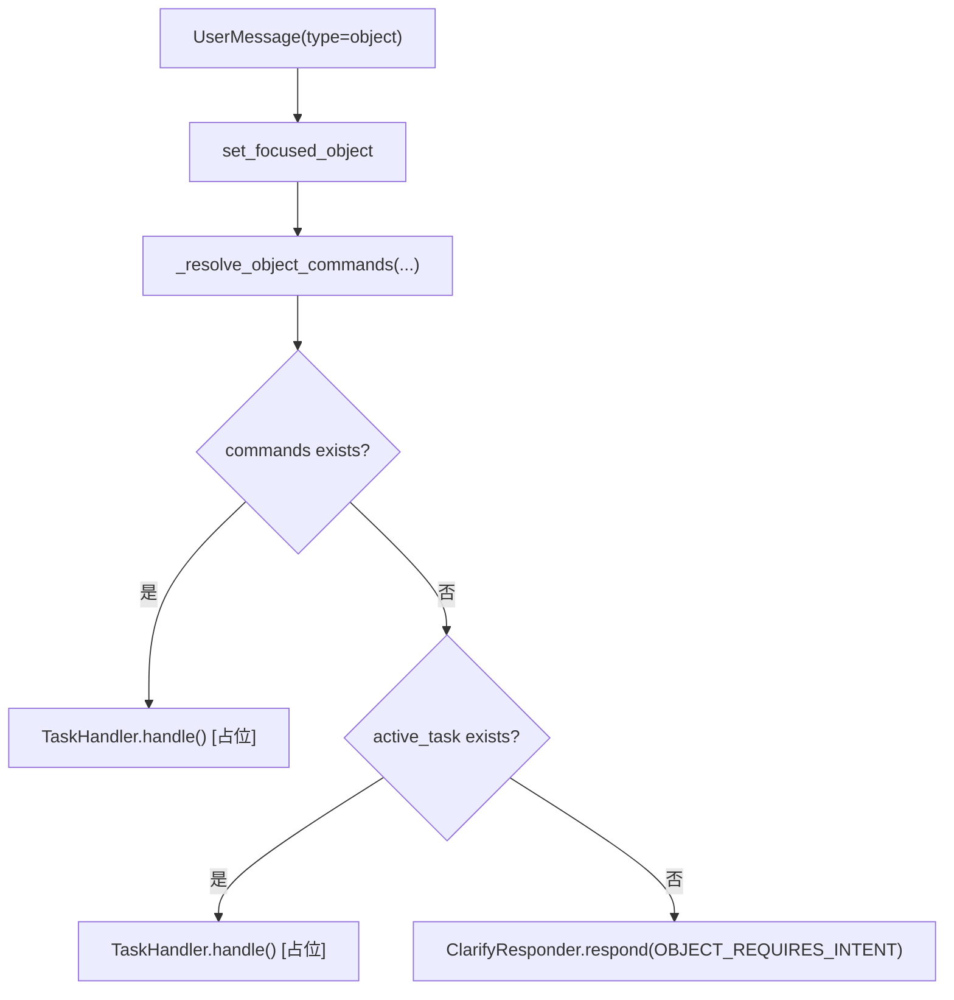
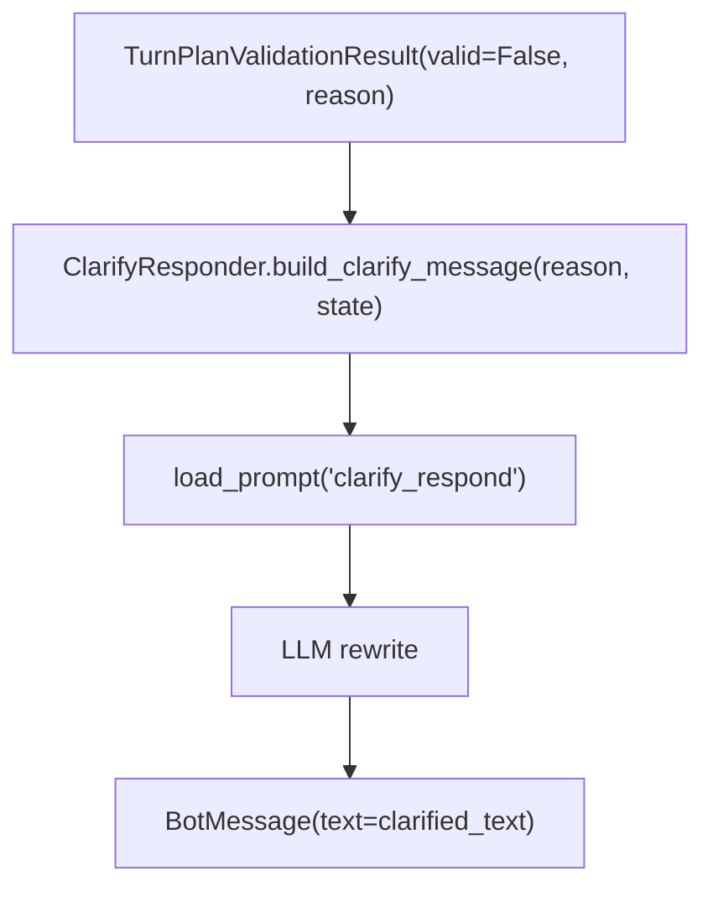

# 04-Engine与Infer决策链设计

## 这册看什么

这里把你说的 infer 层统一解释为：

- `DialogueEngine`
- `TurnPlanner`
- `TurnPlanValidator`
- `ClarifyResponder`

也就是 **Engine + Plan/Clarify 决策链**。

这一册回答：

1. 文本消息和对象消息如何进入决策链
2. TurnPlan 是怎么构造、校验、分发的
3. 当前哪些组件已落地，哪些仍处于骨架态

## 图 1：Engine 组件关系

## 图 2：文本消息主流程

## 图 3：对象消息主流程

## 图 4：澄清分支

## 决策链组件表

| 组件 | 方法 / 字段 | 类型信息 | 当前状态 |
| --- | --- | --- | --- |
| `DialogueEngine` | `hand_dialogue(dialogue_state: DialogueState, user_message: UserMessage) -> ProcessResult` | 顶层入口 | `[已实现]` |
| `DialogueEngine` | `_handle_text_message(dialogue_state, turn_planner, flows, intents) -> list[BotMessage]` | 文本消息分流 | `[已实现]` |
| `DialogueEngine` | `_handle_obj_message(dialogue_state, user_message, flows) -> list[BotMessage]` | 对象消息分流 | `[已实现]` |
| `TurnPlanner` | `predict(dialogue_state: DialogueState, flows: FlowList, intents: dict[str, KnowledgeIntent]) -> TurnPlan` | 调 LLM 输出结构化计划 | `[已实现]` |
| `TurnPlanValidator` | `validate(state: DialogueState, *, turn_plan: TurnPlan, flows: FlowList, intents: dict[str, KnowledgeIntent]) -> TurnPlanValidationResult` | 白名单校验 | `[已实现]` |
| `ClarifyResponder` | `respond(state: DialogueState, reason: ClarifyReason) -> list[BotMessage]` | 澄清兜底 | `[已实现]` |

## `TurnPlanner` 输入材料表

| 输入名 | 来源 | 作用 |
| --- | --- | --- |
| `user_message` | `pending_turn.user_message` | 当前这轮的用户表达 |
| `current_conversation` | `current_session().turns[-10:]` | 最近对话历史 |
| `active_task_json` | `state.active_task` | 让模型知道当前任务推进到哪 |
| `interrupted_tasks_json` | `state.paused_tasks` | 让模型知道有哪些可恢复任务 |
| `focused_object_json` | `state.focused_object` | 让模型知道当前焦点对象 |
| `available_flows_json` | `FlowList.flows` 去掉 `steps` 后序列化 | 让模型知道有哪些业务可办 |
| `knowledge_intents_json` | `KnowledgeIntent` 列表 | 让模型知道有哪些知识类咨询可答 |

## `TurnPlan` 与校验结果表

| 模型 | 字段 | 类型 | 作用 |
| --- | --- | --- | --- |
| `TaskTurnPlan` | `commands` | `list[Command]` | task 轨动作计划 |
| `KnowledgeTurnPlan` | `intents` | `list[str]` | knowledge 轨意图 |
| `ChitchatTurnPlan` | 无 | 空壳 | chitchat 轨标记 |
| `TurnPlan` | `task / knowledge / chitchat` | 三选一路由外壳 | 本轮规划结果 |
| `TurnPlanValidationResult` | `valid` | `bool` | 校验是否通过 |
| `TurnPlanValidationResult` | `reason` | `ClarifyReason | None` | 校验失败原因 |

## 当前实现状态表

| 位置 | 当前状态 | 说明 |
| --- | --- | --- |
| planner 输入打包 | `[已实现]` | 已切到物业版输入材料 |
| validator 分轨校验 | `[已实现]` | task/knowledge/chitchat 已有最小校验分流 |
| clarify 文案与提示词 | `[已实现]` | 已切成物业语义 |
| task/knowledge/chitchat 真执行 | `[占位]` | 当前仍停在 handler 入口 |
| 对象消息命令真正落地 | `[占位]` | 目前仅解析，不真正执行 command |

## 一句话结论

当前 infer 主链已经能完成“理解 -> 校验 -> 澄清/分轨”这件事，但还没有把分轨后的执行能力真正做实。
