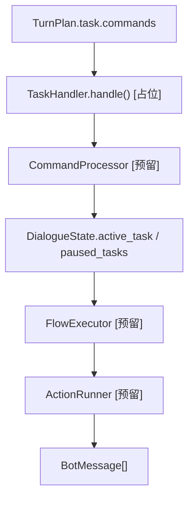
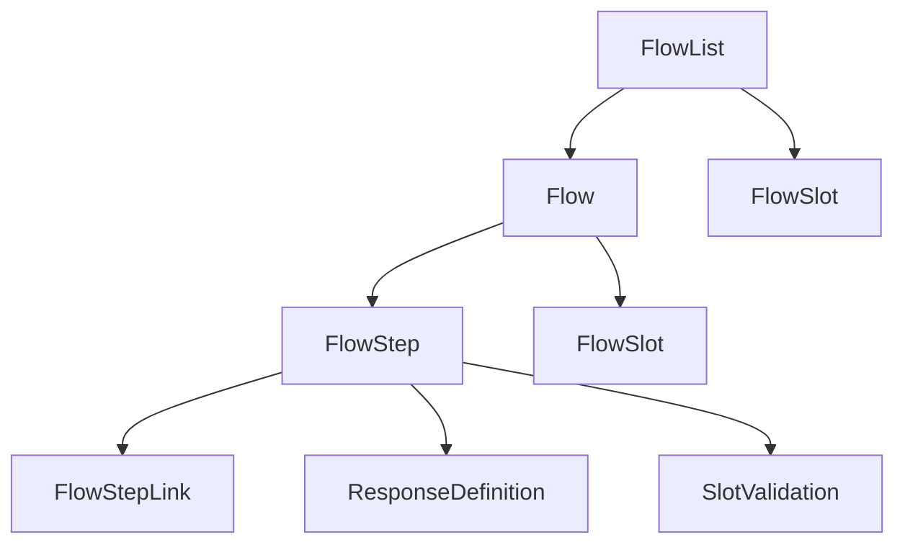
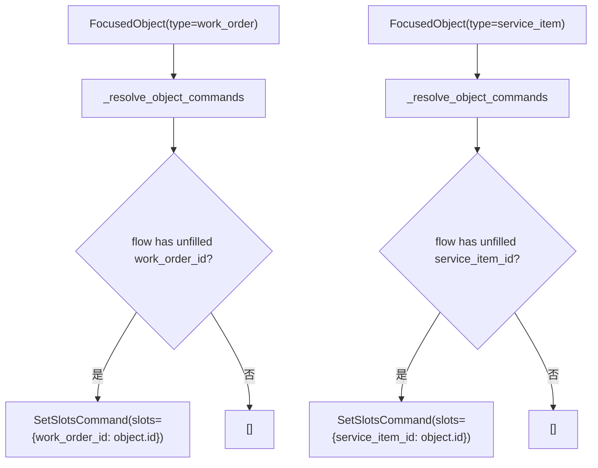

# 05-Task轨道与Flow编排设计

## 这册看什么

这一册只看 task 轨：

1. 命令模型长什么样
2. flow / step / link / slot 长什么样
3. 当前对象消息如何被解释成补槽命令

## 图 1：Task 轨总图

## 图 2：Flow 数据模型关系

## 图 3：对象消息转命令

## Command 模型表

| 命令 | 字段 | 类型 | 当前状态 |
| --- | --- | --- | --- |
| `Command` | `command` | `str` | `[已实现]` |
| `StartFlowCommand` | `flow` | `str` | `[已实现]` |
| `SetSlotsCommand` | `slots` | `dict[str, Any]` | `[已实现]` |
| `CancelFlowCommand` | 无新增字段 | - | `[已实现]` |
| `ResumeFlowCommand` | `flow` | `str | None` | `[已实现]` |

## Flow / Step / Link 模型表

| 模型 | 关键字段 | 类型 | 说明 |
| --- | --- | --- | --- |
| `FlowSlot` | `name`, `type`, `label`, `description` | `str` 系列 | 槽位定义 |
| `Flow` | `id`, `name`, `description`, `steps`, `slots` | `FlowStep[]`, `FlowSlot[]` | 单个流程 |
| `FlowList` | `flows`, `slots` | `list[Flow]`, `dict[str, FlowSlot]` | 所有流程总容器 |
| `FlowStep` | `id`, `type`, `next`, `description` | `FlowStepType`, `list[FlowStepLink]` | 基础步骤 |
| `StartedFlowStep` | 继承 `FlowStep` | - | start 节点 |
| `ActionFlowStep` | `action`, `args` | `str`, `dict[str, Any] | str` | action 节点 |
| `CollectedFlowStep` | `slot_name`, `response`, `validate` | `str`, `ResponseDefinition`, `SlotValidation | None` | collect 节点 |
| `EndFlowStep` | 继承 `FlowStep` | - | end 节点 |
| `StaticLink` | `target` | `str` | 静态跳转 |
| `ConditionalLink` | `target`, `condition` | `str`, `str` | 条件跳转 |
| `FallbackLink` | `target` | `str` | else 跳转 |

## 当前实现 / 预留边界表

| 组件 | 当前状态 | 说明 |
| --- | --- | --- |
| `TaskHandler` | `[占位]` | 当前只有入口壳 |
| `FlowLoader` | `[已实现]` | 已能把 YAML 加载为内存对象 |
| `Flow / Step / Link / Slot` | `[已实现]` | 数据模型已齐 |
| `CommandProcessor` | `[预留]` | 老师架构中的下一步 |
| `FlowExecutor` | `[预留]` | 老师架构中的流程推进器 |
| `ActionRunner` | `[预留]` | 老师架构中的动作执行器 |

## 对应配置文件表

| 配置文件 | 作用 | 当前口径 |
| --- | --- | --- |
| `flow_config/user_flows.yml` | 业务流程定义 | 已改成物业语义 |
| `flow_config/system_flows.yml` | 系统流程定义 | 作为 task 轨辅助流程 |

## 一句话结论

task 轨现在最值钱的部分是“流程模型和命令模型都已经齐了”，但真正把命令作用到状态、再按流程推进的执行器还没写进去。
