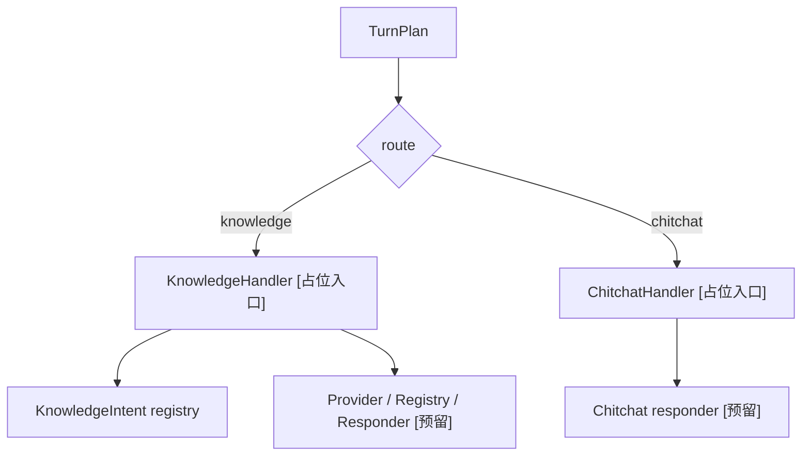
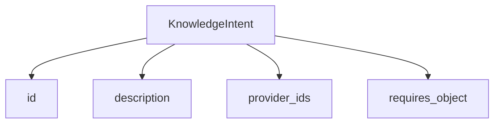

# 06-Knowledge与Chitchat轨道设计

## 这册看什么

这一册只回答：

1. knowledge 和 chitchat 在总架构里扮演什么角色
2. knowledge intent 当前怎么定义
3. 这两条轨道哪些已经落了，哪些还只是骨架

## 图 1：knowledge / chitchat 分轨

## 图 2：KnowledgeIntent 简图

## 当前物业版 intent 列表

| intent id | description | provider_ids | requires_object |
| --- | --- | --- | --- |
| `service_item_info` | 服务项目信息咨询 | `api.service_item` | `service_item` |
| `work_order_info` | 工单信息咨询 | `api.work_order` | `work_order` |
| `property_fee_rule` | 物业费规则咨询 | `faq.default`, `rag.default` | 无 |
| `renovation_filing_rule` | 装修报备规则咨询 | `faq.default`, `rag.default` | 无 |
| `parking_rule` | 停车规则咨询 | `faq.default`, `rag.default` | 无 |
| `pet_rule` | 宠物管理规则咨询 | `faq.default`, `rag.default` | 无 |
| `community_rule` | 公区与社区规范咨询 | `faq.default`, `rag.default` | 无 |
| `general_property_info` | 物业通用信息咨询 | `faq.default`, `rag.default` | 无 |

## 组件状态表

| 组件 | 当前状态 | 说明 |
| --- | --- | --- |
| `KnowledgeHandler` | `[占位]` | 已注入 `knowledge_intents`，但 `handle()` 仍未实现 |
| `ChitchatHandler` | `[占位]` | 仅有入口方法 |
| `KnowledgeIntent` | `[已实现]` | 已完成物业语义迁移 |
| knowledge provider registry | `[预留]` | 老师架构里存在，当前项目未正式落地 |
| knowledge responder | `[预留]` | 老师架构里存在，当前项目未正式落地 |
| chitchat responder | `[预留]` | 当前项目未正式落地 |

## 当前边界说明

| 轨道 | 当前已经能做什么 | 还不能做什么 |
| --- | --- | --- |
| knowledge | 进入轨道、持有物业版 intent 词典、参与 planner 输入与 validator 校验 | 真正去查知识源并生成回复 |
| chitchat | 进入轨道 | 真正生成闲聊回复 |

## 一句话结论

knowledge/chitchat 两条轨道当前已经在总架构中占好了位置，但真正的内容生产层还没有落下来。
