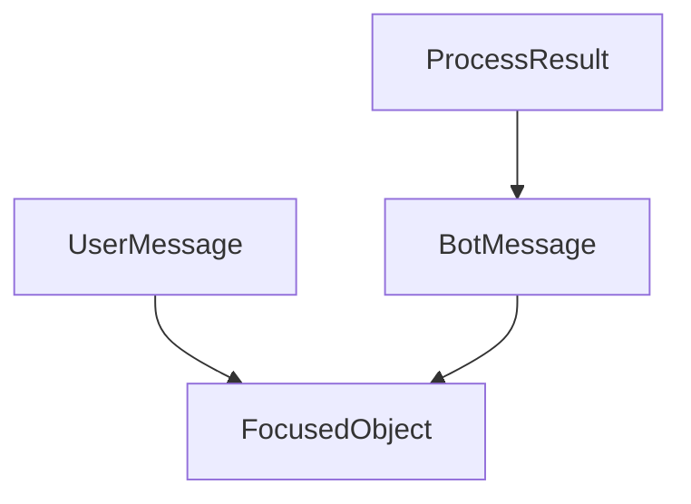
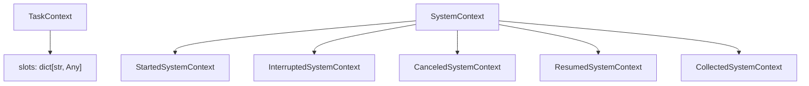
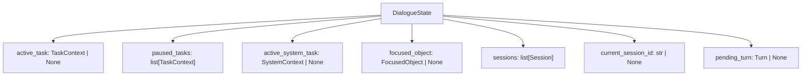
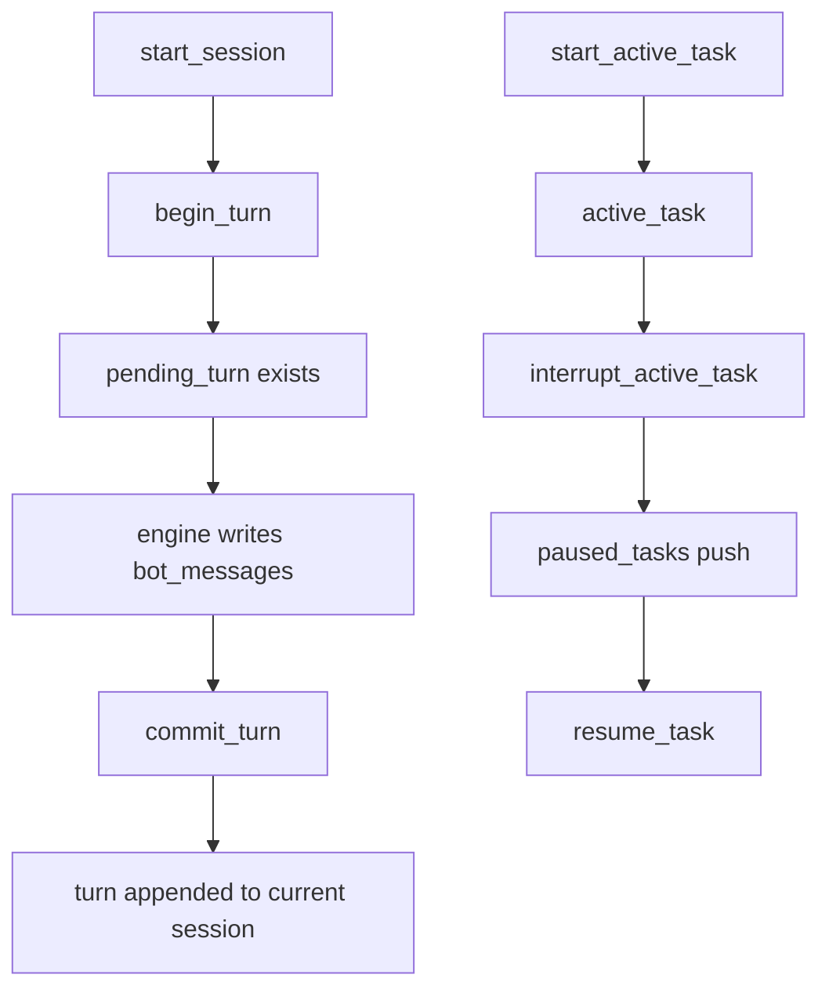

# 07-Domain模型与状态管理设计

## 这册看什么

这一册是整个项目的状态底盘，回答：

1. 消息对象长什么样
2. 上下文对象长什么样
3. `DialogueState` 作为聚合根怎么组织会话、任务和焦点对象

## 图 1：messages 关系图

## 图 2：contexts 关系图

## 图 3：DialogueState 聚合根

## 图 4：状态流转简图

## messages 结构表

| 模型 | 字段 | 类型 |
| --- | --- | --- |
| `FocusedObject` | `id`, `type`, `title`, `attributes` | `str`, `str`, `str`, `dict[str, Any]` |
| `UserMessage` | `resident_id`, `message_id`, `type`, `text`, `object` | `str`, `str`, `MessageType`, `str | None`, `FocusedObject | None` |
| `BotMessage` | `text`, `object` | `str | None`, `FocusedObject | None` |
| `ProcessResult` | `resident_id`, `message_id`, `messages` | `str`, `str`, `list[BotMessage]` |

## contexts 结构表

| 模型 | 字段 | 类型 | 说明 |
| --- | --- | --- | --- |
| `TaskContext` | `flow_id`, `step_id`, `slots` | `str`, `str | None`, `dict[str, Any]` | 当前业务任务快照 |
| `SystemContext` | `flow_id`, `step_id` | `str`, `str | None` | 当前系统流程快照 |
| `StartedSystemContext` | `started_flow_id`, `started_flow_name` | `str`, `str` | 开始任务提示 |
| `InterruptedSystemContext` | `interrupted_flow_id`, `interrupted_flow_name`, `started_flow_id`, `started_flow_name` | `str` 系列 | 打断提示 |
| `CanceledSystemContext` | `canceled_flow_id`, `canceled_flow_name` | `str`, `str` | 取消提示 |
| `ResumedSystemContext` | `resumed_flow_id`, `resumed_flow_name` | `str`, `str` | 恢复提示 |
| `CollectedSystemContext` | `slot_name`, `response` | `str`, `dict[str, Any]` | 收集槽位提示 |

## `DialogueState` 结构表

| 字段 | 类型 | 作用 |
| --- | --- | --- |
| `resident_id` | `str` | 当前住户身份 |
| `active_task` | `TaskContext | None` | 当前活跃业务任务 |
| `paused_tasks` | `list[TaskContext]` | 被打断的任务栈 |
| `active_system_task` | `SystemContext | None` | 当前系统流程 |
| `focused_object` | `FocusedObject | None` | 当前焦点对象 |
| `sessions` | `list[Session]` | 所有会话历史 |
| `current_session_id` | `str | None` | 当前会话标识 |
| `pending_turn` | `Turn | None` | 本轮暂存区 |

## `DialogueState` 核心方法表

| 方法 | 作用 |
| --- | --- |
| `start_active_task()` | 启动业务任务 |
| `end_active_task()` | 结束业务任务 |
| `cancel_active_task()` | 取消当前活跃任务 |
| `interrupt_active_task()` | 打断当前任务并压入暂停栈 |
| `resume_task()` | 恢复暂停任务 |
| `set_slots()` | 写入任务槽位 |
| `remove_slot()` | 删除槽位 |
| `start_session()` | 创建新会话 |
| `current_session()` | 获取当前会话 |
| `close_session()` | 关闭当前会话 |
| `reset_running_state_for_new_session()` | 超时后重置运行态 |
| `begin_turn()` | 开启本轮消息处理 |
| `commit_turn()` | 提交本轮到历史 |
| `set_focused_object()` | 设置当前焦点对象 |

## 一句话结论

`DialogueState` 是整个项目的聚合根，engine 不直接做数据库 I/O，而是围绕这份内存状态对象进行计算和修改。
