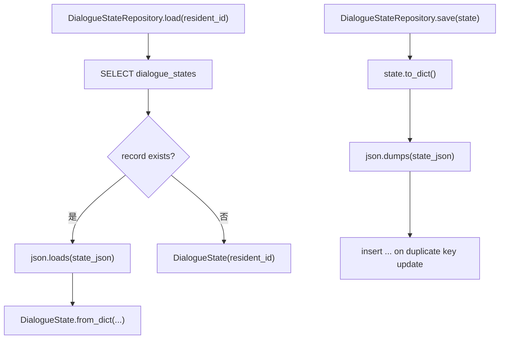
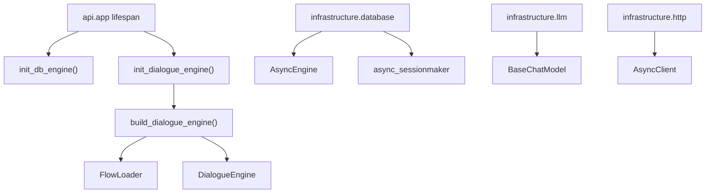

# 08-Repository与Infrastructure设计

## 这册看什么

这一册回答：

1. `DialogueState` 怎么读写数据库
2. ORM 模型与状态 JSON 怎么对应
3. DB / LLM / HTTP 这些基础资源由谁初始化

## 图 1：Repository 读写链

## 图 2：基础设施资源图

## Repository 方法表

| 组件 | 方法签名 | 说明 |
| --- | --- | --- |
| `DialogueStateRepository` | `load(resident_id: str) -> DialogueState` | 按住户读取状态 |
| `DialogueStateRepository` | `save(state: DialogueState)` | 整包覆盖式保存状态 |

## ORM / 资源结构表

| 组件 | 关键字段 / 资源 | 类型 / 说明 | 当前状态 |
| --- | --- | --- | --- |
| `DialogueStateRecord` | `resident_id` | 主键 | `[已实现]` |
| `DialogueStateRecord` | `state_json` | `TEXT`，存整份状态 JSON | `[已实现]` |
| `database.engine` | `AsyncEngine | None` | 异步 DB 引擎单例 | `[已实现]` |
| `database.async_session` | `async_sessionmaker[AsyncSession]` | 异步会话工厂 | `[已实现]` |
| `llm.llm` | `BaseChatModel` | OpenAI 兼容模型实例 | `[已实现]` |
| `http.http_client` | `AsyncClient | None` | 物业中台 HTTP 客户端单例 | `[已实现]` 基础草图 |

## 基础设施初始化职责表

| 位置 | 负责什么 |
| --- | --- |
| `api/app.py` | `lifespan` 中初始化 DB 与 DialogueEngine |
| `api/dependencies.py` | 提供 `get_session()`、`get_dialogue_service()` 等依赖 |
| `engine/builder.py` | 装配 `DialogueEngine`、`TaskHandler`、`KnowledgeHandler` 等组件 |
| `infrastructure/database.py` | 初始化异步 DB 引擎和 session 工厂 |
| `infrastructure/llm.py` | 初始化全局 LLM |
| `infrastructure/http.py` | 初始化全局 HTTP 客户端 |

## 一句话结论

Repository 负责把 `DialogueState` 序列化成一行 JSON 落库，而基础设施层负责为上层提供异步数据库、LLM 和 HTTP 资源。
