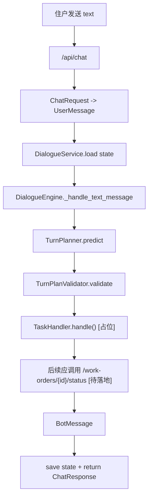
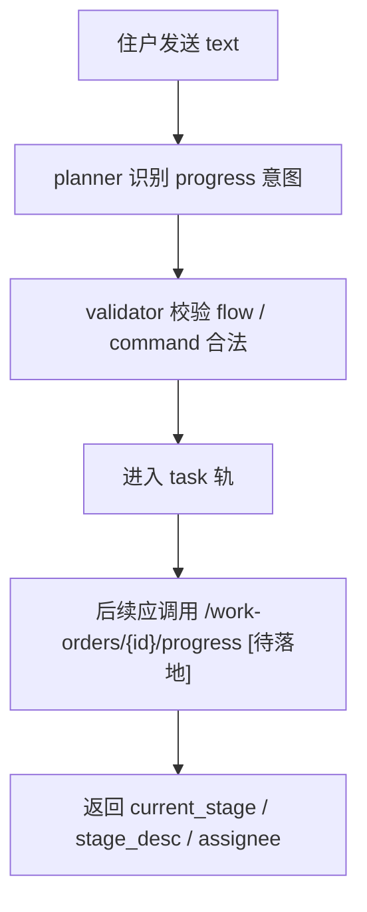
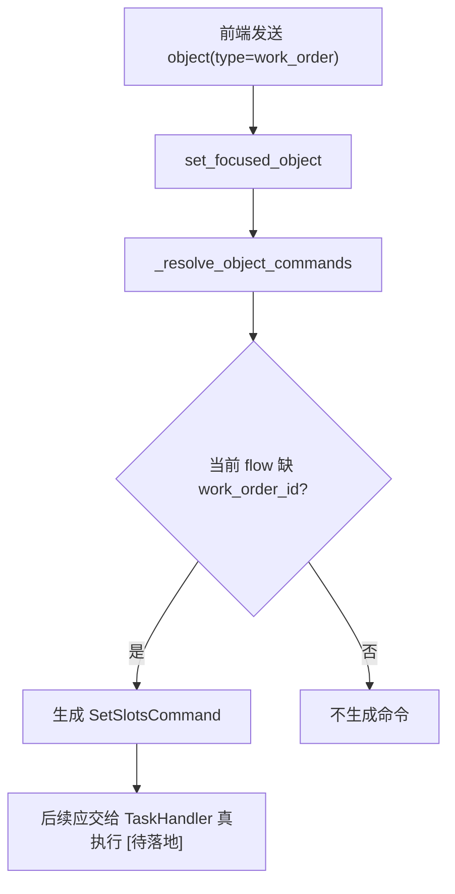
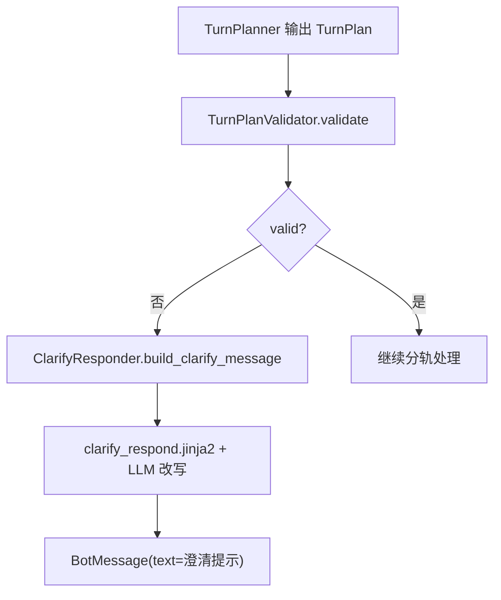

# 09-关键时序图集

## 这册看什么

这一册不再展开类结构，只看几条关键主链：

1. 文本工单状态查询
2. 文本工单进度查询
3. 对象消息补槽
4. 校验失败进入澄清

为了 Typora 兼容，本册统一使用 `graph TD` 表达时序。

## 图 1：工单状态查询主链

## 图 2：工单进度查询主链

## 图 3：对象消息补槽主链

## 图 4：校验失败澄清主链

## 关键状态变化短表

| 场景 | 输入 | 核心状态变化 | 当前是否完全落地 |
| --- | --- | --- | --- |
| 文本状态查询 | `text` | `pending_turn` 生成并提交 | 否 |
| 文本进度查询 | `text` | `TurnPlan -> task route` | 否 |
| 对象补槽 | `object(work_order/service_item)` | `focused_object` 更新，尝试生成 `SetSlotsCommand` | 部分 |
| 澄清分支 | 非法或不完整 `TurnPlan` | 生成澄清 `BotMessage` | 是 |

## 一句话结论

当前最完整跑通的是“planner -> validator -> clarify”这条异常处理链，真正的业务执行主链还差 task 执行层补完。
