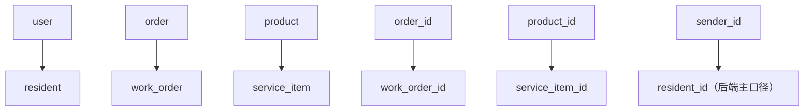
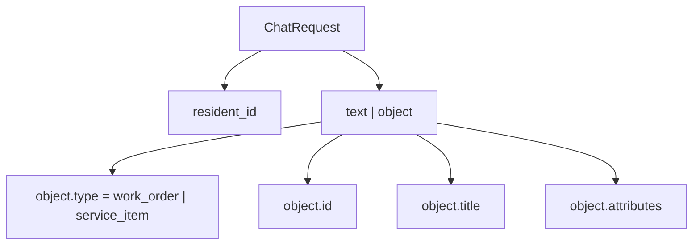
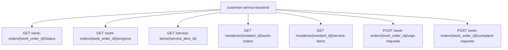

# 10-物业语义映射与接口承接图

## 这册看什么

这一册专门回答：

1. 老师电商语义在当前项目里怎么映射
2. 前端对象消息长什么样
3. 智能管家后端后续要承接哪些物业中台接口

## 图 1：对象语义映射

## 图 2：前端对象 payload

## 图 3：物业中台接口承接

## 电商语义 -> 物业语义 对照表

| 老师电商语义 | 当前物业语义 | 当前项目中的主要落点 |
| --- | --- | --- |
| `user` | `resident` | `resident_id` |
| `order` | `work_order` | 工单对象、工单接口 |
| `product` | `service_item` | 服务项目对象、服务项目接口 |
| `order_id` | `work_order_id` | flow slot、对象 id、HTTP path |
| `product_id` | `service_item_id` | flow slot、对象 id、HTTP path |
| `refund_request` | `complaint_request` | 投诉/异议接口 |
| `shipping_reminder` | `work_order_urge_request` | 催办接口 |

## 前端与中台承接表

| 输入 / 接口 | 当前字段口径 | 说明 |
| --- | --- | --- |
| 前端聊天请求 | `resident_id`, `text`, `object` | 当前后端主入口 |
| 工单对象消息 | `type=work_order`, `id=work_order_id` | 可用于补槽和主链查询 |
| 服务项目对象消息 | `type=service_item`, `id=service_item_id` | 可用于补槽和知识/详情查询 |
| 工单状态接口 | `/work-orders/{id}/status` | P0 主链接口 |
| 工单进度接口 | `/work-orders/{id}/progress` | P0 主链接口 |
| 服务项目详情接口 | `/service-items/{id}` | P1 主链接口 |

## 一句话结论

当前项目的第二阶段，本质上就是把老师的电商智能客服骨架，沿着 `resident / work_order / service_item` 这套物业语义重新接回真实前端和物业中台。
