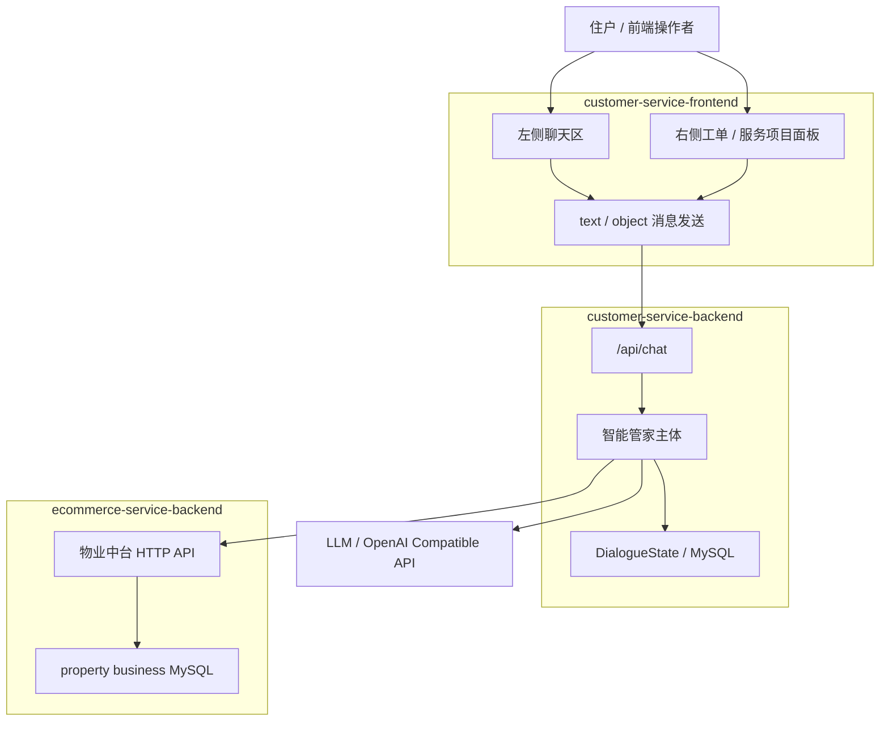
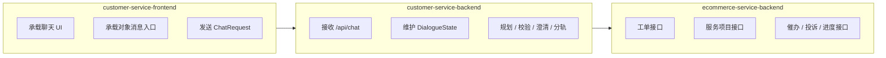
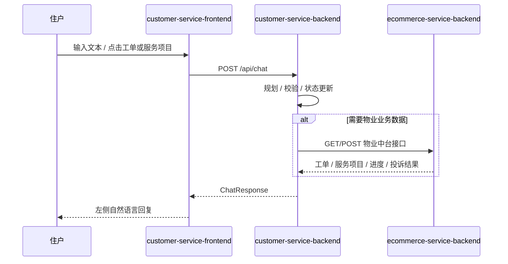

# 01-系统全景与三仓关系

## 这册看什么

这一册只回答三件事：

1. 为什么当前项目是三仓协作
2. 三个仓各自负责什么
3. 当前第二阶段的真实主链是什么

它不展开类、字段和方法。

## 图 1：系统全景

## 图 2：三仓职责矩阵图

## 图 3：前端 `/api` 与 `/commerce` 分流图

## 职责对照表

| 仓库 | 当前角色 | 主要输入 | 主要输出 | 当前状态 |
| --- | --- | --- | --- | --- |
| `customer-service-frontend` | 交互壳层 | 用户文本、对象点击 | `ChatRequest` | `[已实现]` |
| `customer-service-backend` | 智能管家主体 | `ChatRequest` | `ChatResponse`、状态持久化 | `[已实现]` 主骨架 |
| `ecommerce-service-backend` | 物业业务中台 | HTTP 查询 / 提交 | 工单、服务项目、进度、催办、投诉结果 | `[已实现]` |

## 一句话结论

当前阶段不是重做三仓，而是在已有前端壳和物业中台的前提下，把 `customer-service-backend` 做成真正的智能管家主体。
