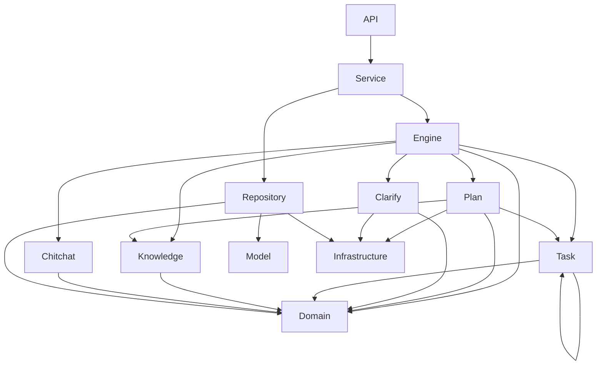
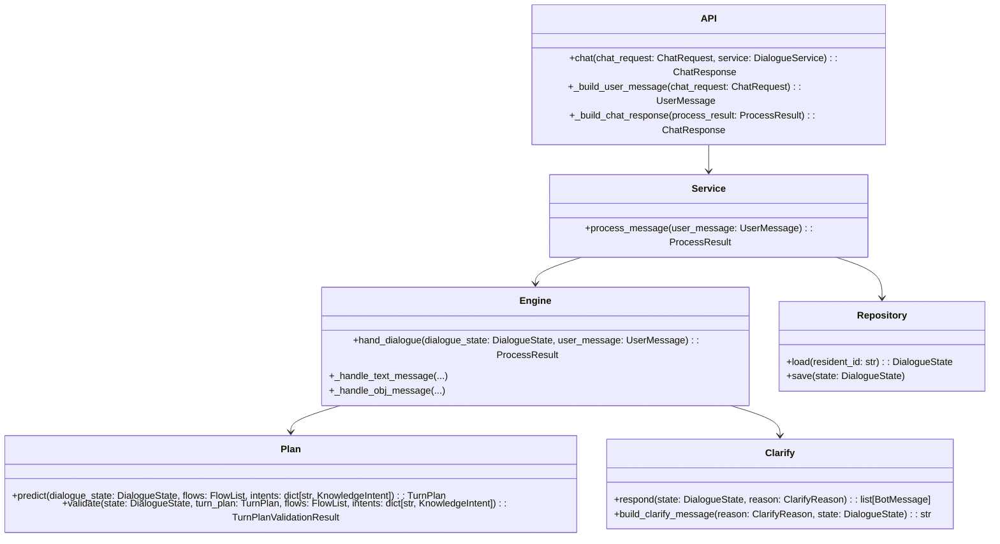

# 02-customer-service-backend分层总览

## 这册看什么

这一册只看 `customer-service-backend` 内部怎么分层、怎么依赖。

它不下沉到字段级细节。

## 图 1：分层依赖图

## 图 2：包级责任图

## 分层职责表

| 层 | 作用 | 代表位置 | 当前状态 |
| --- | --- | --- | --- |
| API | 接收 HTTP 请求，翻译输入输出模型 | `api/router/chat_router.py` | `[已实现]` |
| Service | 编排一次完整对话事务 | `service/dialogue_service.py` | `[已实现]` |
| Engine | 处理消息、分流三轨 | `engine/dialogue_engine.py` | `[已实现]` 主骨架 |
| Plan | LLM 规划与白名单校验 | `plan/planner.py`, `plan/turn_validator.py` | `[已实现]` |
| Clarify | 校验失败时澄清 | `clarify/responder.py` | `[已实现]` |
| Task | 任务轨入口、flow 模型、loader | `task/handler.py`, `task/flow/*` | `handler=[占位]`, `flow=[已实现]` |
| Knowledge | 知识轨入口与意图词典 | `knowledge/handler.py`, `knowledge/intents.py` | `handler=[占位]`, `intents=[已实现]` |
| Chitchat | 闲聊轨入口 | `chitchat/handler.py` | `[占位]` |
| Domain | 消息、上下文、状态聚合根 | `domain/*` | `[已实现]` |
| Repository | `DialogueState` 落库 / 回读 | `repository/dialogue_state_repository.py` | `[已实现]` |
| Model | ORM 映射 | `model/dialogue_state_record.py` | `[已实现]` |
| Infrastructure | DB、LLM、HTTP 客户端等资源 | `infrastructure/*` | `[已实现]` 基础资源 |

## 一句话结论

`customer-service-backend` 的当前骨架已经把“接口层、事务层、决策层、状态层、资源层”的边界立住了，真正还没填实的主要是 task / knowledge / chitchat 三轨执行层。
