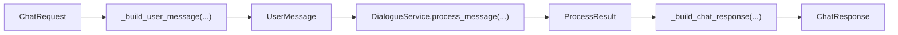
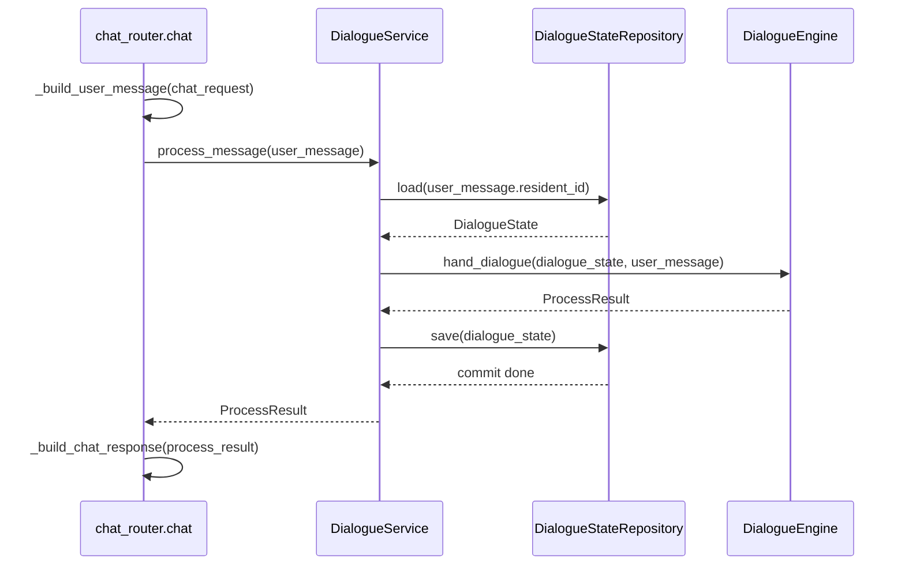
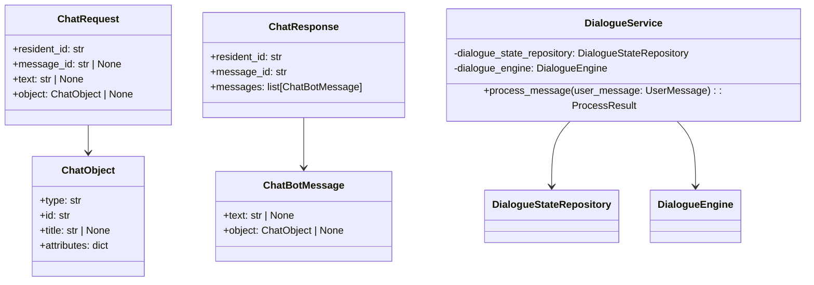

# 03-API与Service事务边界

## 这册看什么

这一册回答：

1. `/api/chat` 是怎么翻译输入输出的
2. `DialogueService` 怎么定义事务边界
3. API 与 Service 的类关系是什么

它不讲 planner 和 task 轨内部细节。

## 图 1：请求与响应模型转换图

## 图 2：`DialogueService` 事务边界图

## 图 3：API / Service 类图

## 边界说明表

| 问题 | 放在哪层 | 原因 |
| --- | --- | --- |
| `resident_id`、`text`、`object` 的 HTTP 协议校验 | API | 这是接口契约 |
| `ChatRequest -> UserMessage` 的翻译 | API | 这是接口壳到领域对象的装配 |
| `load -> engine -> save` 的编排 | Service | 这是一次完整事务的边界 |
| 对话状态如何变化 | Engine / Domain | 这是核心业务逻辑 |

## 一句话结论

API 负责翻译，Service 负责事务编排，真正的对话决策不在这两层里展开。
