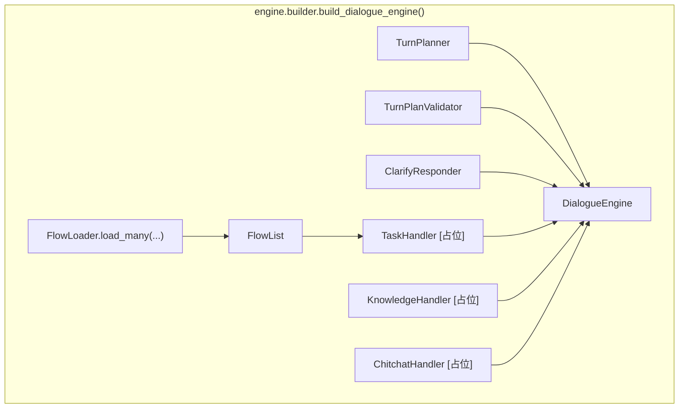
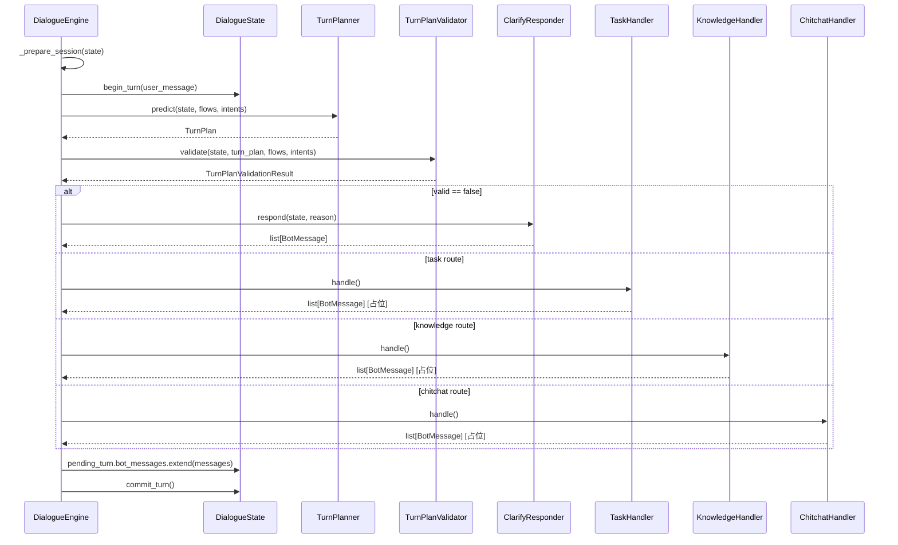
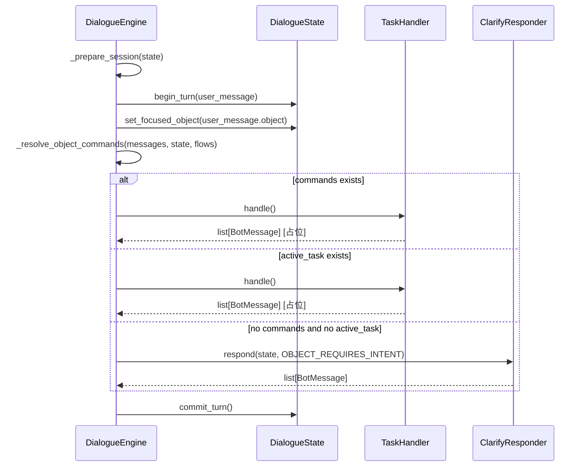
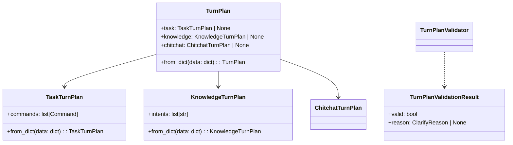

# 04-Engine与Infer决策链

## 这册看什么

这一册是核心册。

这里把你说的 infer 层统一表述为：**Engine + Plan/Clarify 决策链**。

它回答：

1. `DialogueEngine` 装了哪些组件
2. 文本消息和对象消息分别怎么走
3. `TurnPlanner / TurnPlanValidator / ClarifyResponder` 是怎么串起来的
4. 三轨 `TurnPlan` 长什么样

## 图 1：`DialogueEngine` 组件装配图

## 图 2：文本消息处理时序图

## 图 3：对象消息处理时序图

## 图 4：Plan / Validator / Clarify 类图

```mermaid
classDiagram
    class TurnPlanner {
      +predict(dialogue_state: DialogueState, flows: FlowList, intents: dict[str, KnowledgeIntent]): TurnPlan
      +_build_input_prompt(dialogue_state: DialogueState, flows_list: FlowList, intents: dict[str, KnowledgeIntent]): dict[str, Any]
      +_predict_from_inputs_prompt(prompt): TurnPlan
    }

    class TurnPlanValidator {
      +validate(state: DialogueState, turn_plan: TurnPlan, flows: FlowList, intents: dict[str, KnowledgeIntent]): TurnPlanValidationResult
      +_get_active_tracks(turn_plan: TurnPlan): list[str]
      +_validate_task(turn_plan: TurnPlan, flows: FlowList): TurnPlanValidationResult
      +_validate_knowledge(turn_plan: TurnPlan, state: DialogueState, intents: dict[str, KnowledgeIntent]): TurnPlanValidationResult
    }

    class ClarifyResponder {
      +respond(state: DialogueState, reason: ClarifyReason): list[BotMessage]
      +build_clarify_message(reason: ClarifyReason, state: DialogueState): str
    }
```

## 图 5：`TurnPlan` 三轨结构图

## `_build_input_prompt(...)` 七类输入材料

| 输入项 | 来源 | 作用 |
| --- | --- | --- |
| `user_message` | `pending_turn.user_message` | 当前轮用户表达 |
| `current_conversation` | `current_session().turns[-10:]` | 最近对话历史 |
| `active_task_json` | `state.active_task` | 当前活跃任务 |
| `interrupted_tasks_json` | `state.paused_tasks` | 被打断任务列表 |
| `focused_object_json` | `state.focused_object` | 当前焦点对象 |
| `available_flows_json` | `FlowList.flows` 去掉 `steps` 后序列化 | 当前可选业务流程 |
| `knowledge_intents_json` | `KnowledgeIntent` 列表 | 当前知识类意图词典 |

## 当前状态结论

| 组件 | 当前状态 | 说明 |
| --- | --- | --- |
| `DialogueEngine` 主骨架 | `[已实现]` | 已能处理文本 / 对象分支 |
| `TurnPlanner` | `[已实现]` | 已能打包物业版输入材料并调 LLM |
| `TurnPlanValidator` | `[已实现]` | 已有 task / knowledge / chitchat 最小校验 |
| `ClarifyResponder` | `[已实现]` | 已切成物业语义澄清 |
| `TaskHandler.handle()` | `[占位]` | 入口在，但执行逻辑未落地 |
| `KnowledgeHandler.handle()` | `[占位]` | 入口在，但执行逻辑未落地 |
| `ChitchatHandler.handle()` | `[占位]` | 入口在，但执行逻辑未落地 |

## 一句话结论

当前最完整的一段是“理解 -> 规划 -> 校验 -> 澄清 / 分轨”这条决策链，真正的执行层还停在三个 handler 入口上。
