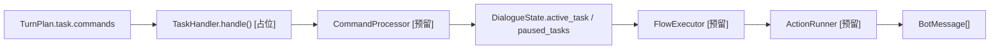
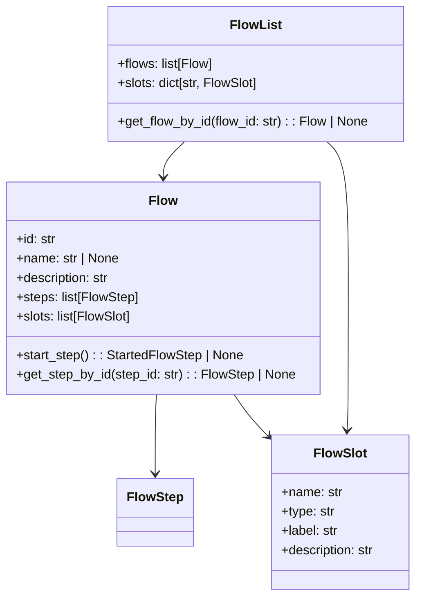
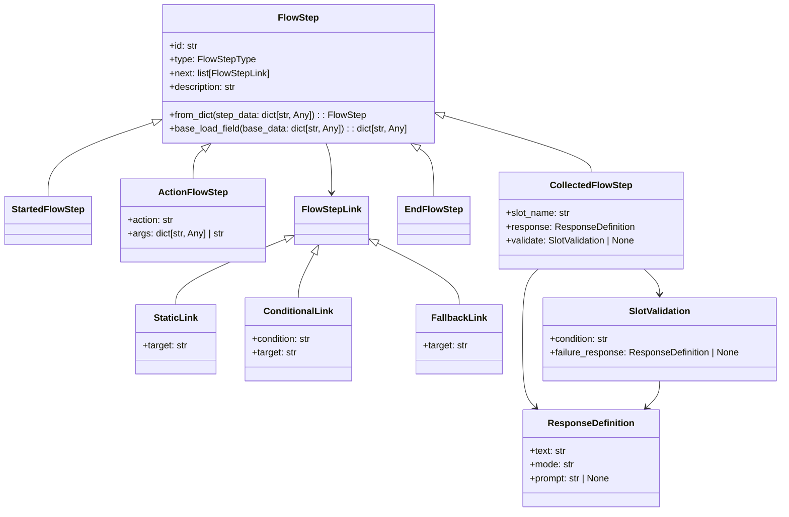
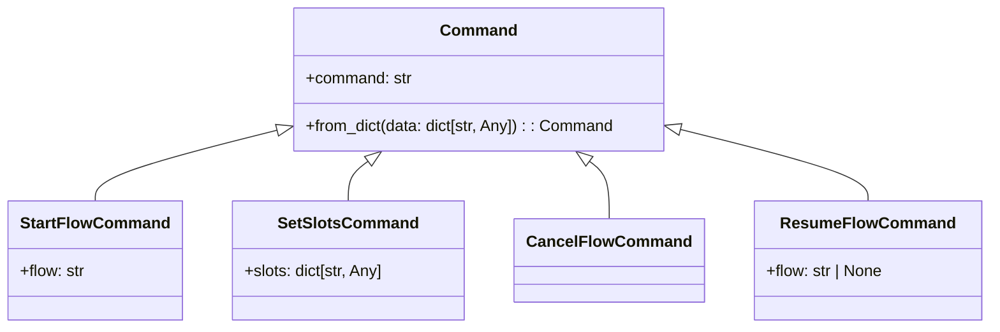
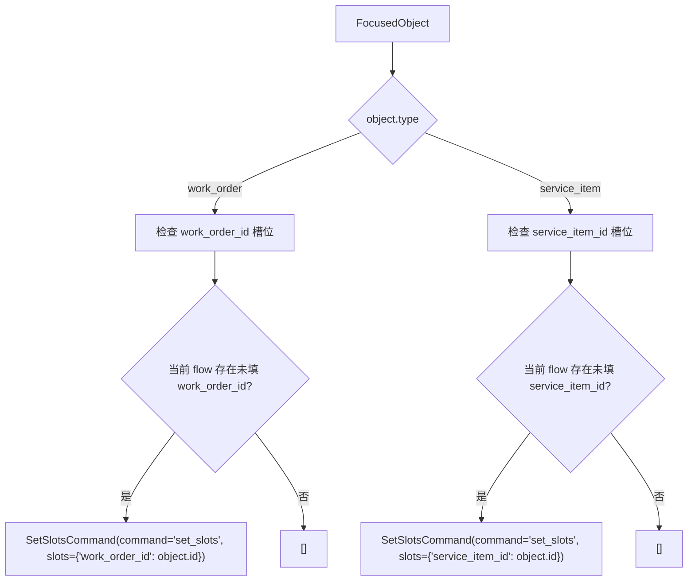

# 05-Task轨道与Flow编排

## 这册看什么

这一册只看 task 轨：

1. task 轨从命令到流程推进的理想结构
2. 当前本地已经落地了哪些 flow 模型
3. 对象消息怎么转成 `SetSlotsCommand`

## 图 1：Task 轨总流程图

## 图 2：Flow 数据模型类图

## 图 3：Step / Link 关系图

## 图 4：`Command` 体系类图

## 图 5：对象消息生成 `SetSlotsCommand` 的流程图

## 配置与边界表

| 位置 | 当前状态 | 说明 |
| --- | --- | --- |
| `task/handler.py` | `[占位]` | 当前只有入口壳 |
| `task/flow/loader.py` | `[已实现]` | 已能从 YAML 加载 flow |
| `task/flow/flows.py` | `[已实现]` | Flow / FlowList / FlowSlot 已齐 |
| `task/flow/steps.py` | `[已实现]` | Step / Link / Response / Validation 已齐 |
| `flow_config/user_flows.yml` | `[已实现]` | 已切成物业语义 |
| `flow_config/system_flows.yml` | `[已实现]` | 系统流程定义存在 |
| `CommandProcessor` | `[预留]` | 老师架构下一步 |
| `FlowExecutor` | `[预留]` | 老师架构流程推进器 |
| `ActionRunner` | `[预留]` | 老师架构动作执行器 |

## 一句话结论

task 轨最完整的是“数据模型层”，最缺的是“命令执行层”和“流程推进层”。
