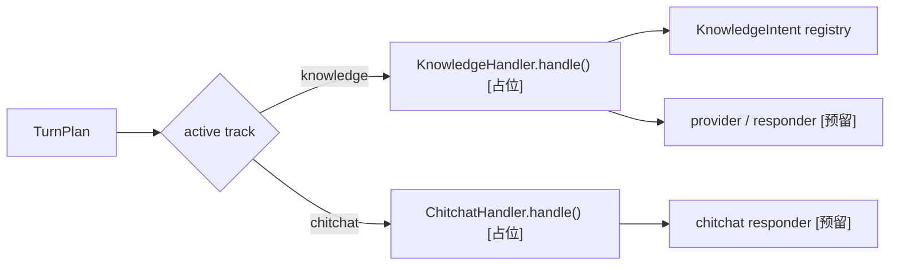
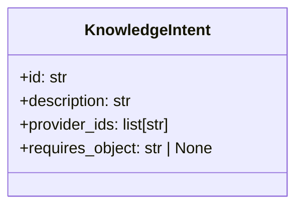
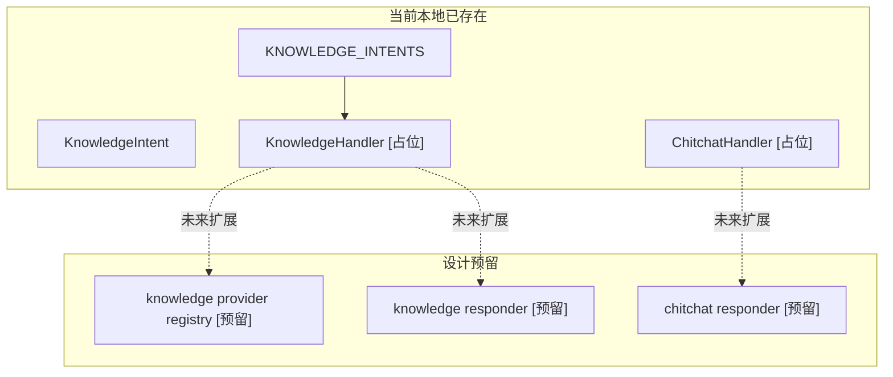

# 06-Knowledge与Chitchat轨道

## 这册看什么

这一册只回答：

1. knowledge 和 chitchat 是怎么从 engine 分出去的
2. 当前物业版 `KnowledgeIntent` 长什么样
3. 哪些能力只是预留，并没有在本地真正落地

## 图 1：knowledge / chitchat 分轨图

## 图 2：`KnowledgeIntent` 类图

## 图 3：当前实现 vs 预留能力图

## 当前物业版 KnowledgeIntent 列表

| intent id | description | provider_ids | requires_object |
| --- | --- | --- | --- |
| `service_item_info` | 服务项目信息咨询 | `api.service_item` | `service_item` |
| `work_order_info` | 工单信息咨询 | `api.work_order` | `work_order` |
| `property_fee_rule` | 物业费规则咨询 | `faq.default`, `rag.default` | `None` |
| `renovation_filing_rule` | 装修报备规则咨询 | `faq.default`, `rag.default` | `None` |
| `parking_rule` | 停车规则咨询 | `faq.default`, `rag.default` | `None` |
| `pet_rule` | 宠物管理规则咨询 | `faq.default`, `rag.default` | `None` |
| `community_rule` | 公区与社区规范咨询 | `faq.default`, `rag.default` | `None` |
| `general_property_info` | 物业通用信息咨询 | `faq.default`, `rag.default` | `None` |

## 状态结论表

| 组件 | 当前状态 | 说明 |
| --- | --- | --- |
| `KnowledgeIntent` | `[已实现]` | 已完成物业语义迁移 |
| `KNOWLEDGE_INTENTS` | `[已实现]` | 已形成最小知识意图词典 |
| `KnowledgeHandler.handle()` | `[占位]` | 仅有入口，未做真实回答 |
| `ChitchatHandler.handle()` | `[占位]` | 仅有入口 |
| provider / responder 细化层 | `[预留]` | 当前项目未正式落地 |

## 一句话结论

knowledge 和 chitchat 现在都只是“被识别得出来”，还没有“被完整执行出来”。
