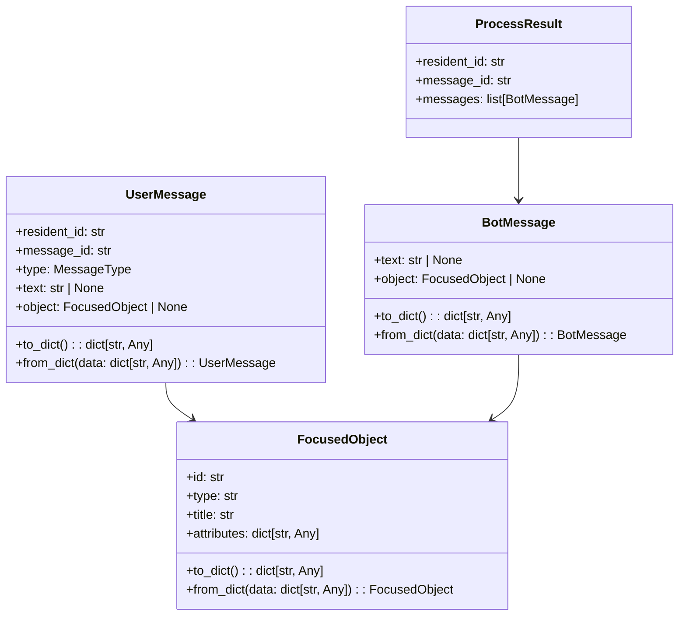
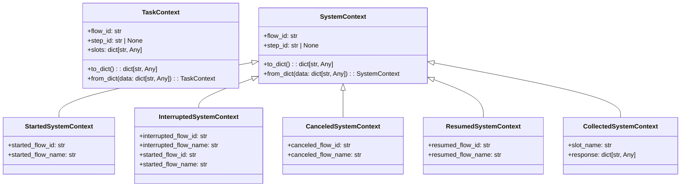
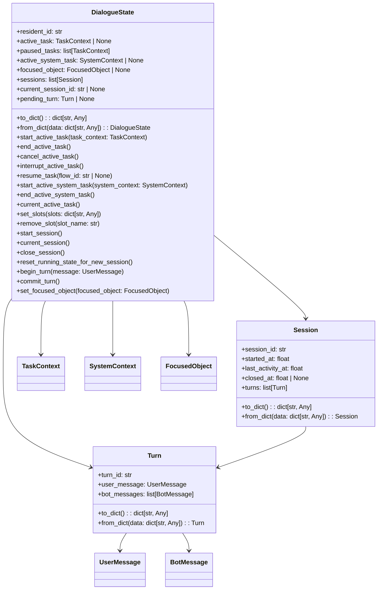
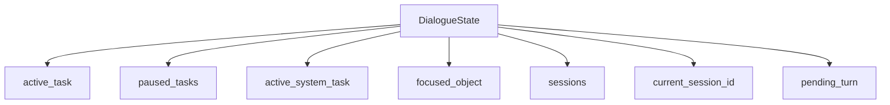
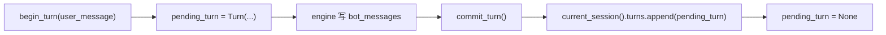

# 07-Domain模型与状态管理

## 这册看什么

这一册是状态底盘：

1. `messages.py` 定义了哪些消息对象
2. `contexts.py` 定义了哪些任务 / 系统上下文
3. `DialogueState` 聚合根如何组织会话、任务、焦点对象和 pending turn

## 图 1：`messages.py` 类图



## 图 2：`contexts.py` 类图



## 图 3：`state.py` 聚合根类图



## 图 4：`DialogueState` 状态关系图



## 图 5：会话 / 轮次 / 任务栈状态图

```mermaid
stateDiagram-v2
    [*] --> NoSession
    NoSession --> SessionActive: start_session()
    SessionActive --> TurnPending: begin_turn()
    TurnPending --> SessionActive: commit_turn()
    SessionActive --> SessionClosed: close_session()
    SessionClosed --> SessionActive: start_session()

    --

    [*] --> NoTask
    NoTask --> ActiveTask: start_active_task()
    ActiveTask --> Interrupted: interrupt_active_task()
    Interrupted --> ActiveTask: resume_task()
    ActiveTask --> NoTask: end_active_task() / cancel_active_task()
```

## 图 6：pending turn 提交流程图



## 一句话结论

`DialogueState` 是整个后端的运行时聚合根，engine 的所有决策最终都体现在这份内存状态对象的演化上。
