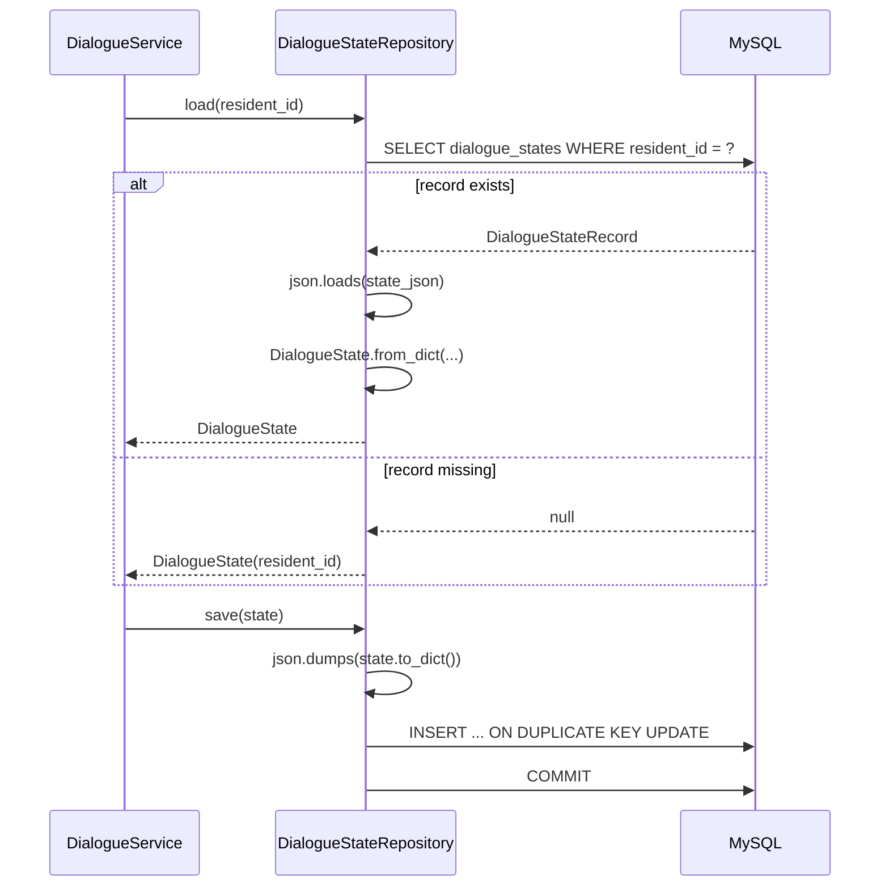
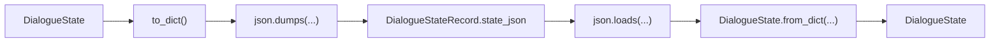
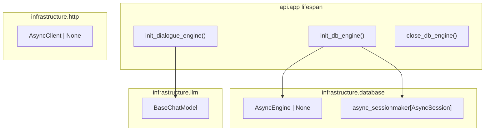
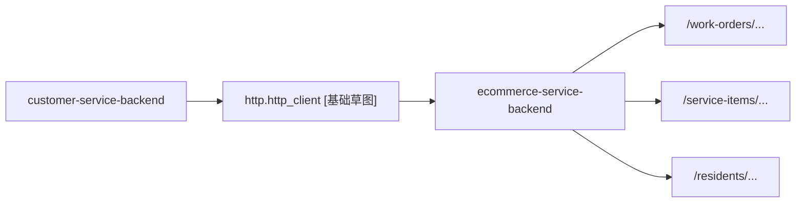

# 08-Repository与Infrastructure

## 这册看什么

这一册回答：

1. `DialogueStateRepository` 怎么读写数据库
2. `DialogueStateRecord` 和状态 JSON 怎么映射
3. DB / LLM / HTTP 这些基础资源怎么装起来

## 图 1：`DialogueStateRepository` 读写图

## 图 2：`DialogueStateRecord` 与状态 JSON 映射图

## 图 3：`database / llm / http` 基础设施图

## 图 4：customer-service-backend 与物业中台 HTTP 调用图

## 结构说明表

| 组件 | 关键结构 | 当前状态 | 说明 |
| --- | --- | --- | --- |
| `DialogueStateRepository` | `load(resident_id)`, `save(state)` | `[已实现]` | 单表读写对话状态 |
| `DialogueStateRecord` | `resident_id`, `state_json` | `[已实现]` | 每个住户一行 |
| `database.py` | `engine`, `async_session` | `[已实现]` | 异步 DB 资源 |
| `llm.py` | `llm: BaseChatModel` | `[已实现]` | OpenAI 兼容模型实例 |
| `http.py` | `http_client` | `[已实现]` 基础草图 | 目前只是 HTTP 客户端基础设施，不是完整调用层 |

## 一句话结论

Repository 负责把 `DialogueState` 整包落成一行 JSON，Infrastructure 负责把数据库、模型和 HTTP 客户端这些资源提前准备好。
