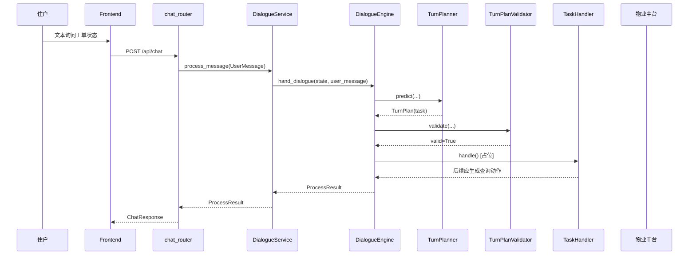
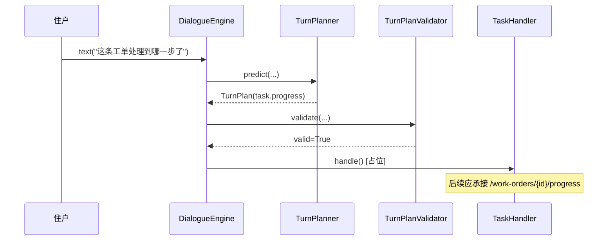
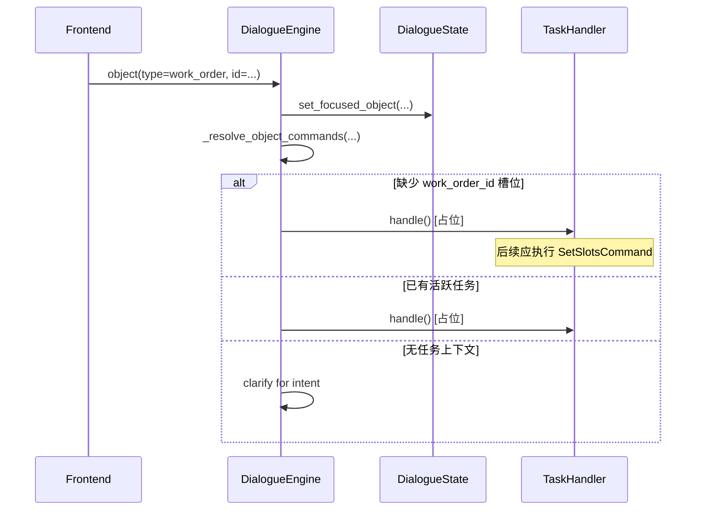
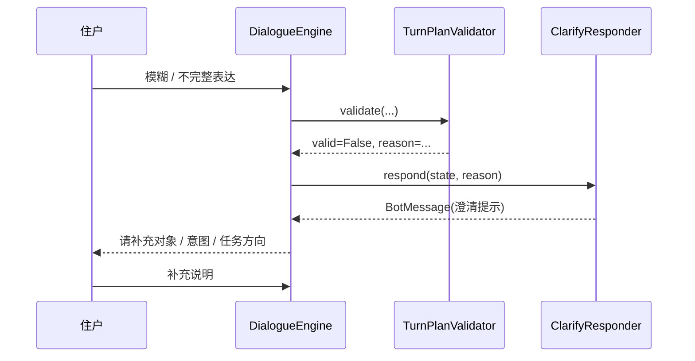

# 09-关键时序图集

## 这册看什么

这一册只画关键时序，不再解释类结构。

## 图 1：文本消息 - 工单状态查询

## 图 2：文本消息 - 工单进度查询

## 图 3：对象消息 - 选中工单后继续追问

## 图 4：澄清分支 - 校验失败到用户补充

## 一句话结论

当前已经比较清楚的是“决策链时序”，真正待补的是 task 轨把业务执行串到物业中台的那一截。
