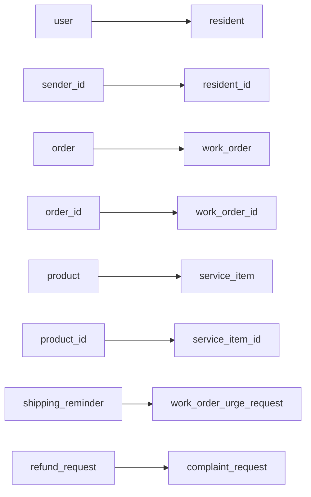
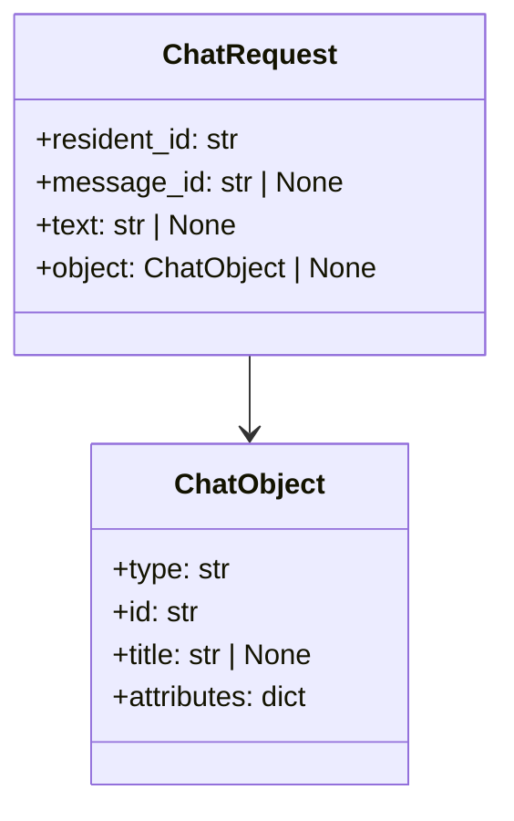
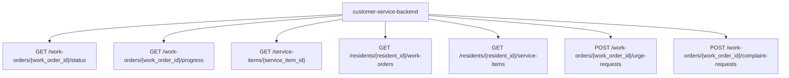

# 10-物业语义对象与接口映射图

## 这册看什么

这一册专门做对照：

1. 老师电商语义怎么映射到当前物业语义
2. 前端对象 payload 长什么样
3. 后端要承接哪些物业中台接口

## 图 1：电商语义 -> 物业语义对象映射图

## 图 2：前端对象 payload 图

## 图 3：智能管家到物业中台接口映射图

## 对照表

| 老师电商语义 | 当前物业语义 | 当前项目落点 |
| --- | --- | --- |
| `user` | `resident` | `resident_id` |
| `sender_id` | `resident_id` | 会话身份口径 |
| `order` | `work_order` | 工单对象 / 工单接口 |
| `product` | `service_item` | 服务项目对象 / 服务项目接口 |
| `order_id` | `work_order_id` | flow slot / object.id / HTTP path |
| `product_id` | `service_item_id` | flow slot / object.id / HTTP path |
| `shipping_reminder` | `work_order_urge_request` | 催办接口 |
| `refund_request` | `complaint_request` | 投诉 / 异议接口 |

## 一句话结论

当前物业版不是推翻老师骨架，而是把老师那套电商语义沿着 `resident / work_order / service_item` 重新落到真实前端和物业中台上。
